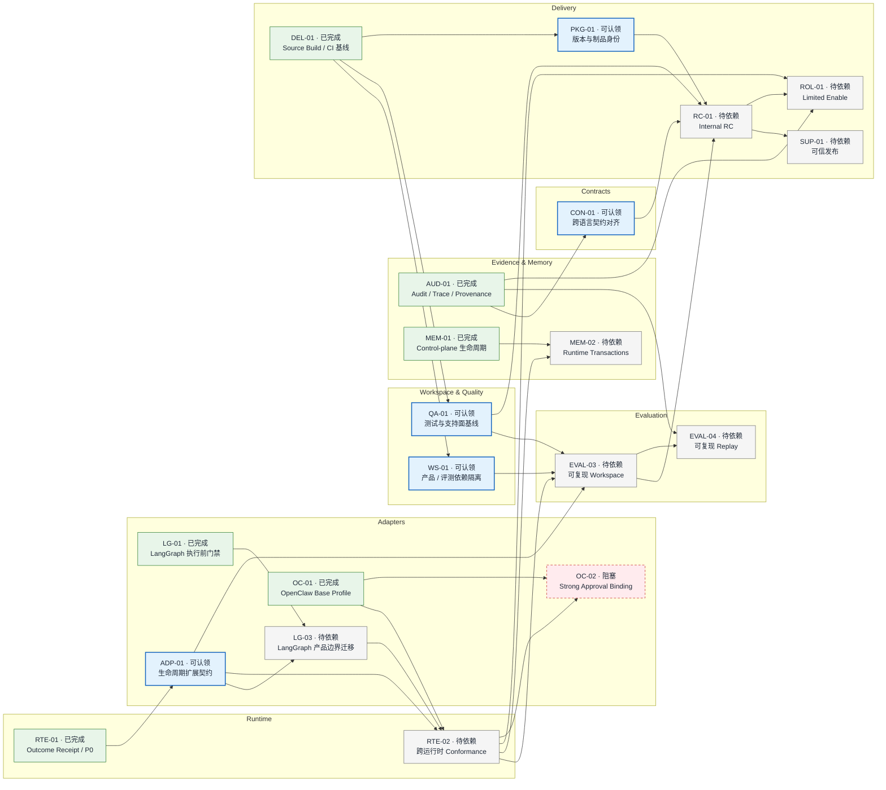

# AgentGuard Roadmap

> 最后更新：2026-08-28
>
> 当前能力阶段：**Product Interfaces & Reproducible Evaluation（准备）**
>
> 当前执行状态：`进行中 = 0`、`验证中 = 0`、`可认领 = 5`

本文面向开发者，以“能力阶段 → 模块 → 能力节点 → 完成依赖”记录 AgentGuard 已走过、当前可推进和后续候选的产品路线。它不是发布日期承诺、安全契约、人员排期或 PR 准入系统。

- 细粒度工作与轻量认领见 [`docs/TODO.md`](docs/TODO.md)。
- 已发布或待发布的使用者变化见 [`CHANGELOG.md`](CHANGELOG.md)。
- 已验证的 Alpha 能力与限制见 [Productization Alpha Status](docs/06_delivery/productization_alpha_status.md)。
- 稳定边界见[产品化架构与目录职责](docs/01_overview/productization_architecture.md)。

仓库整理、分支/worktree 处置和文档治理已于 2026-08-28 收口，记录见[仓库治理收口记录](docs/06_delivery/repository_governance_closeout.md)。此类维护活动不进入能力阶段或能力 DAG。

## 能力阶段

阶段只表达能力演进，不参与依赖计算；模块只用于分组，只有能力节点进入 DAG。

```mermaid
flowchart LR
    S1["Beta 1"] --> S2["Core V2.1 / Runtime P0"]
    S2 --> S3["Context / Provenance / Supervision"]
    S3 --> S4["LangGraph V2 Evaluation"]
    S4 --> S5["Productization Alpha"]
    S5 --> S6["Product Interfaces &<br/>Reproducible Evaluation"]
    S6 --> S7["Internal RC"]
    S7 --> S8["Trusted Delivery &<br/>Advanced Runtime"]

    classDef stage0 fill:#e8f5e9,stroke:#2e7d32,color:#1f2937
    classDef stage1 fill:#e3f2fd,stroke:#1565c0,stroke-width:2px,color:#1f2937
    classDef stage2 fill:#f5f5f5,stroke:#757575,color:#1f2937
    class S1,S2,S3,S4,S5 stage0
    class S6 stage1
    class S7,S8 stage2
```



## 状态与轻量认领

| 状态     | 含义                                             |
| -------- | ------------------------------------------------ |
| `已完成` | 结果已进入 `dev`，节点验收和稳定验证入口成立     |
| `可认领` | 依赖已满足且方向明确，可以认领；由维护者人工判定 |
| `进行中` | 能力已认领并正在实现                             |
| `验证中` | 实现完成，正在执行约定验证或等待托管 CI          |
| `待依赖` | 仍有仓库内依赖未完成                             |
| `阻塞`   | 仍有仓库外条件或无法由当前代码库单独解除的阻塞   |

认领流程保持轻量：认领整个 `可认领` 能力时，在同一变更中把节点改为 `进行中`，并在 `docs/TODO.md` 新建或更新同 ID 小节，列出可执行 checklist 与可选 Issue/PR；实现完成后改为 `验证中`，在 PR 中记录实际验证；结果进入 `dev` 且节点验收成立后改为 `已完成`，清理已完成 TODO、更新历史里程碑，并复核直接后继节点，将条件成立者开放为 `可认领`。TODO 不保存认领人、负责人或日期字段，也没有 YAML、生成器、claim 命令或自动状态机。

全仓 `进行中 + 验证中` 的能力通常不超过 3 个，绝对上限为 5 个；需要超过上限时先收口、释放或重新排序现有能力。

## 当前焦点

当前没有 `进行中` 或 `验证中` 节点。以下五项已经 `可认领`，可以独立认领并并行准备：

| 节点     | 当前结果                                | 后续汇合           |
| -------- | --------------------------------------- | ------------------ |
| `CON-01` | 跨语言契约与 canonicalization 边界对齐  | `RC-01`            |
| `ADP-01` | 统一安全执行模板和公开 Adapter 扩展契约 | `LG-03` → `RTE-02` |
| `WS-01`  | 隔离产品与评测依赖面                    | `EVAL-03`          |
| `QA-01`  | 固定测试分类、支持面和 coverage 基线    | `EVAL-03`、`RC-01` |
| `PKG-01` | 统一版本、源码 SHA 和制品 digest 映射   | `RC-01`            |

当前主链为 **`ADP-01 → LG-03 → RTE-02 → EVAL-03 → RC-01`**；`CON-01`、`WS-01`、`QA-01`、`PKG-01` 是在后续汇合点前完成的并行前置。`OC-02` 不阻塞普通 Internal RC。

## 能力依赖图

为保持可读性，图中只保留 14 个未完成节点和它们需要的 6 个历史锚点；完整的历史依赖以节点台账为准。



## 已完成能力节点

| ID        | 能力                                        | 已完成结果与边界                                                                                    | 依赖                                    |
| --------- | ------------------------------------------- | --------------------------------------------------------------------------------------------------- | --------------------------------------- |
| `CORE-01` | Core · 确定性安全判定                       | 规则、风险及 `allow/ask/deny`                                                                       | —                                       |
| `CTRL-01` | Control Plane · Guard API                   | 身份、策略及控制面基线                                                                              | `CORE-01`                               |
| `APR-01`  | Control Plane · 审批与 Execution Lease      | 审批终态、过期与 lease                                                                              | `CTRL-01`                               |
| `AUD-01`  | Evidence · Audit / Trace / Provenance       | audit integrity/hash chain/checkpoint/trace/evidence graph                                          | `CORE-01`、`CTRL-01`                    |
| `LG-01`   | Adapter · LangGraph 执行前门禁              | pre-action gate；后续同功能修复并入本节点                                                           | `CORE-01`、`CTRL-01`、`APR-01`          |
| `OC-01`   | Adapter · OpenClaw Base Profile             | limited base integration/current source；不代表 Strong Binding 或已发布版本一致                     | `CORE-01`、`CTRL-01`                    |
| `OPS-01`  | Supervision · Dashboard / CLI               | operator/audit/approval/system-status surface                                                       | `CTRL-01`、`APR-01`、`AUD-01`           |
| `EVAL-01` | Evaluation · AttackBench 基线               | runner/dataset/scoring/sandbox baseline                                                             | `CORE-01`、`LG-01`                      |
| `CORE-02` | Core · V2.1 可信判定管线                    | ActionIR/TaskFact/security state/fusion/revalidation                                                | `CORE-01`、`AUD-01`                     |
| `RTE-01`  | Runtime · Outcome Receipt 与 P0 Conformance | bounded P0 receipt/conformance baseline                                                             | `APR-01`、`LG-01`、`OC-01`              |
| `LG-02`   | Adapter · LangGraph Strong Approval Binding | exact binding in verified profile；CF-17 `NOT_SUPPORTED`                                            | `APR-01`、`LG-01`、`RTE-01`             |
| `CTX-01`  | Context · 隔离、Taint 与 Manifest           | verified facts/context builder/manifest/taint/source provenance                                     | `CORE-02`、`AUD-01`                     |
| `MEM-01`  | Memory · Control-plane 生命周期             | proposed/quarantined/committed/rejected/rolled_back；仅控制面，不代表真实 runtime store transaction | `CTRL-01`、`CTX-01`                     |
| `SEM-01`  | Core · Semantic Shadow 证据                 | completed/default off/evidence only；不改变 official decision                                       | `CORE-02`、`AUD-01`                     |
| `EVAL-02` | Evaluation · LangGraph V2 Profile           | runner/A0–A4/Dashboard 已实现；正式外部 Provider 350-run 未完成且不作为未来承诺                     | `EVAL-01`、`CORE-02`、`LG-02`、`CTX-01` |
| `DEL-01`  | Delivery · Source Build 与 CI 基线          | layered CI/source builds/temp SHA manifest；不是 Internal RC 或 trusted release                     | `RTE-01`、`OPS-01`、`EVAL-02`           |

## 未完成能力节点

| ID        | 状态     | 能力                               | 目标结果                                                                                    | 完成依赖                                   |
| --------- | -------- | ---------------------------------- | ------------------------------------------------------------------------------------------- | ------------------------------------------ |
| `CON-01`  | `可认领` | Contracts · 跨语言契约对齐         | Pydantic/OpenAPI/JSON Schema/TS DTO/golden vectors 与 canonicalization 边界                 | `CORE-02`、`CTRL-01`、`AUD-01`             |
| `ADP-01`  | `可认领` | Adapter · 生命周期扩展契约         | 唯一安全执行模板及公开 lifecycle/compatibility/side-effect/scoring 扩展点                   | `APR-01`、`RTE-01`                         |
| `WS-01`   | `可认领` | Workspace · 产品/评测依赖隔离      | uv workspace/groups、产品 CI 依赖面及 Guard API lock 决策                                   | `DEL-01`                                   |
| `QA-01`   | `可认领` | Quality · 测试与支持面基线         | 显式 markers、支持的 benchmark 最小集、coverage baseline、legacy/live 边界                  | `DEL-01`                                   |
| `PKG-01`  | `可认领` | Delivery · 统一版本与制品身份      | Python/Node/Dashboard/OpenClaw/Docker 版本及 SHA/digest 映射                                | `DEL-01`                                   |
| `LG-03`   | `待依赖` | Adapter · LangGraph 产品边界迁移   | 迁出 benchmark-specific SDK 逻辑和旧导入，并提供兼容/退役路径                               | `ADP-01`、`LG-01`                          |
| `RTE-02`  | `待依赖` | Runtime · 跨运行时 Conformance     | 受支持产品 gate/receipt/失败矩阵；不包含 Strong OpenClaw Binding                            | `ADP-01`、`LG-03`、`OC-01`                 |
| `EVAL-03` | `待依赖` | Evaluation · 可复现 Workspace      | 独立依赖、dataset identity/provenance/digest、公开 runtime/scoring 扩展，不依赖产品内部实现 | `ADP-01`、`RTE-02`、`WS-01`、`QA-01`       |
| `RC-01`   | `待依赖` | Delivery · Internal RC             | 从同一固定 SHA 构建并保留 wheels/npm/Dashboard/Docker/SBOM，完成两套干净环境验证            | `EVAL-03`、`PKG-01`、`QA-01`、`CON-01`     |
| `MEM-02`  | `待依赖` | Memory · Runtime Transactions      | 真实 store wrapper、commit/rollback、跨会话恢复及 rollback gate                             | `MEM-01`、`RTE-02`、`CTX-01`               |
| `EVAL-04` | `待依赖` | Evaluation · 可复现 Replay         | 提供 replay；两轨消费者仍为可选候选，不构成承诺                                             | `EVAL-03`、`AUD-01`、`SEM-01`              |
| `SUP-01`  | `待依赖` | Supply Chain · 可信发布            | 可保留 SBOM、签名、attestation、provenance 与 Trusted Publishing                            | `RC-01`                                    |
| `ROL-01`  | `待依赖` | Rollout · Limited Enable           | 分阶段 enable、observe、rollback 与发布决策                                                 | `RC-01`、`RTE-02`、`AUD-01`                |
| `OC-02`   | `阻塞`   | OpenClaw · Strong Approval Binding | atomic replace-and-seal 与 authoritative invocation-start；宿主能力及复验完成前默认关闭     | `OC-01`、`APR-01`、`RTE-02`，另需外部 Host |

## OpenClaw 阻塞边界

`OC-02` 已有 `OC-01` Base Profile，但当前 OpenClaw Host 仍缺少可验证的 atomic replace-and-seal 与 authoritative invocation-start hook。解除阻塞必须同时满足：宿主提供这两项能力、`RTE-02` 完成，并通过跨 runtime binding、receipt、TOCTOU/replay/expiry 和失败路径复验。在此之前 Strong Approval Binding 保持默认关闭，且不作为普通 `RC-01` 的前置。详见 [Runtime Enforcement 设计索引](docs/AgentGuard_Runtime_Enforcement_Contract_v1_Final/00_README_设计包索引.md)。

## 已走过的路径

| 时间           | 里程碑                             | 完成节点                                                                        | 结果                                                                                       |
| -------------- | ---------------------------------- | ------------------------------------------------------------------------------- | ------------------------------------------------------------------------------------------ |
| 2026-08-05     | Beta 1                             | `CORE-01`、`CTRL-01`、`APR-01`、`AUD-01`、`LG-01`、`OC-01`、`OPS-01`、`EVAL-01` | 首次形成 Core、Guard API、CLI、Dashboard、Adapters 与 AttackBench 闭环                     |
| 2026-08-14～16 | Core V2.1 / Runtime P0             | `CORE-02`、`RTE-01`                                                             | 建立可信判定管线与 P0 receipt/conformance                                                  |
| 2026-08-16～17 | Context / Provenance / Supervision | `CTX-01`、`MEM-01`                                                              | 建立 Context/Taint/Manifest 与控制面 Memory 生命周期；不扩大为真实 runtime transaction     |
| 2026-08-17～20 | LangGraph V2 Evaluation            | `LG-02`、`SEM-01`、`EVAL-02`                                                    | verified binding、V2 profile 与 semantic shadow 进入基线；正式外部 Provider 350-run 未完成 |
| 2026-08-24～25 | Productization Alpha               | `DEL-01`                                                                        | 分层 CI、source build 与临时 SHA manifest 形成基线；不等于 Internal RC 或生产就绪          |

## 调整记录

| 日期       | 调整                                                               | 原因                                                       |
| ---------- | ------------------------------------------------------------------ | ---------------------------------------------------------- |
| 2026-08-27 | 退役基线 `20f565e6603f6401d9d1f0b9713637f8fc102a8a` 的 331 节点机器路线图，以根目录单文件保留开发路径 | 旧 lifecycle、claim 和生成体系维护成本过高并与代码状态漂移 |
| 2026-08-28 | 用能力阶段、模块、30 个唯一能力节点和紧凑 DAG 替换 A～J 治理工作包 | 同时展示历史、当前和未来，并让依赖落在具体产品能力上       |
| 2026-08-28 | 启用 TODO 轻量认领及人工 `可认领 → 进行中 → 验证中 → 已完成` 流程  | 支持协作，但不恢复 YAML、自动状态判断或 evidence 状态机    |

## 维护、拆分与合并规则

- 节点 ID 一经使用即保持稳定，能力改名不更换 ID；拆分时原 ID 保留主要范围、新范围使用新 ID；合并时保留主节点 ID，并在调整记录中注明被并入的节点。
- 一个节点只表达一个可独立验收的模块功能或安全属性；同模块、同功能的 bugfix、测试补齐、性能优化和内部重构并入原节点及其 TODO，不创建 `-fix`、`-hardening` 或 PR 节点。
- 只有公共行为、安全属性、数据生命周期、完成依赖或验收边界可以独立成立时才拆分节点；若两个节点结果、依赖和验收无法独立区分，则合并并在调整记录说明。
- 状态由维护者根据仓库事实人工更新；依赖全部 `已完成` 不会自动产生 `可认领`，技术完成也不会自动产生 `已完成`。
- 状态变化时在同一变更中同步顶部计数、当前焦点、依赖图和节点台账，避免多个阅读视图彼此漂移。
- 完成节点保留在台账和历史中；DAG 只保留未完成节点及理解它们所需的最少历史锚点。图接近不可读时优先压缩历史锚点或把细节下沉到 TODO，不增加机器源。
- `docs/TODO.md` 只保存可执行工作项和轻量认领；契约、ADR、状态页、测试和 PR 负责各自事实，Roadmap 不复制完整 evidence。
- 普通 bug 留在原节点的同 ID TODO/Issue；只有缺陷证明原完成结论不成立时，已完成节点才可退回 `进行中` 或 `阻塞`，并在调整记录写明纠正原因。
- `暂停`、`退役`、`并入` 只作为调整记录中的处置结论，不是节点生命周期状态；方向新增、取消、恢复、拆分、合并、依赖或优先级变化均记录原因。
- 本文保持约 250 行以内，不保存负责人表、独占修改面、自动验收节点或生成副本。

## 旧路线图追溯

旧机器路线图最后基线为提交 `20f565e6603f6401d9d1f0b9713637f8fc102a8a`。当前树不保存 archive、兼容入口或额外 tag；需要审阅时通过固定 SHA 读取：

```bash
git show 20f565e6603f6401d9d1f0b9713637f8fc102a8a:docs/06_delivery/roadmap/generated/roadmap.md
git ls-tree -r --name-only 20f565e6603f6401d9d1f0b9713637f8fc102a8a docs/06_delivery/roadmap/
```
