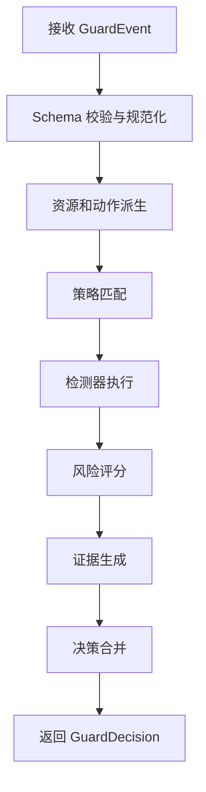

# `agentguard-core` 设计

## 1. 文档定位

Core 是 AgentGuard 的无状态安全判定内核。本文定义 Core 的职责、输入输出、内部模块、检测器、决策流程和验收边界。Core 的目标是成为可嵌入、可测试、低延迟、框架无关的 Python 判定库。

关联入口：

- [接口契约与事件模型](interface_contract.md)
- [威胁模型](threat_model.md)
- [实施路线与验收标准](../06_delivery/implementation_plan.md)

## 2. 职责边界

Core 负责：

- 标准安全事件的 schema 校验和规范化；
- 从事件中派生资源、动作、数据方向和信任边界；
- 执行 prompt injection、tool hijacking、敏感资源访问、数据外发、代码执行、记忆投毒等检测器；
- 执行策略匹配和策略结果合并；
- 计算风险分数、严重等级和风险类别；
- 生成可解释证据、命中规则和安全原因；
- 输出 `GuardDecision`，当前稳定动作只包括 `allow`、`deny`、`ask`；
- 支持离线评测和单元测试直接调用。

Core 不负责：

- 暴露 HTTP API；
- 读取或写入 PostgreSQL、Redis、文件系统等基础设施；
- 执行 Alembic migration；
- 创建、查询或更新审计日志；
- 创建、查询或更新审批记录；
- 聚合指标、生成报表或维护评测任务状态；
- 管理 browser session、CSRF token、launch code、API Key；
- 调用或执行 Agent 工具；
- 读取 Agent runtime 私有状态；
- 渲染 Dashboard 页面或推送 WebSocket；
- 管理 Redteam 样本 ground truth。

这些状态和副作用能力逻辑上属于 Guard API / Control Plane。MVP 阶段它们实现为 `guard-api` 内部 service layer，而不是 Core 的一部分。

## 3. 输入与输出

Core 目标接口：

```python
def evaluate(event: GuardEvent, policies: PolicyBundle | None = None) -> GuardDecision:
    ...
```

| 输入 | 来源 | 说明 |
| ---- | ---- | ---- |
| `GuardEvent` | Adapter 或离线评测 runner | 统一安全事件封装，内部可承载 `ToolCallEvent`、`ContextBuildEvent`、`ModelCallEvent`、`ToolResultEvent`、`MemoryEvent` 等具体事件 |
| `PolicyBundle` / `PolicySnapshot` | Guard API / Control Plane 或离线评测配置 | 已加载、已解析的策略快照；Core 不在判定链路中实时查询数据库 |

| 输出            | 消费方                      | 说明                                                             |
| --------------- | --------------------------- | ---------------------------------------------------------------- |
| `GuardDecision` | Guard API 或离线评测 runner | 安全判定结果，包含动作、风险分数、严重等级、命中规则、原因和证据 |

`AuditEvent` 可以由 Core 提供领域 schema 或 builder，但审计入库、查询、指标聚合和 Dashboard 展示由 Guard API / Control Plane 负责。

P0/P1 `PolicyBundle` 已经参与判定，但必须作为已加载快照传入 Core。它支持关闭内置规则、覆盖已触发规则的 `decision/risk_score/severity`，以及配置敏感资源标记、敏感文本标记、prompt injection / jailbreak / model leak / dangerous command / memory poisoning 标记、工具画像、允许外发域名、允许 API host/path、collection endpoint 标记和工具动作别名。规则放行使用 `disabled_rules`；`RuleOverride` 只允许把已触发规则调整为 `ask` 或 `deny`，不承担放行语义。
Guard API 当前提供单个持久化 `PolicyBundle` 当前快照，并记录每次替换的 revision/history 审计；若未保存快照，则使用启动时注入的 `policy_bundle` 或默认策略。Core 不知道快照来源、revision、审计记录，也不负责发布审批、回滚或多租户隔离。

## 4. 内部结构

当前 Core 包结构：

```text
packages/agentguard-core/
└── agentguard_core/
    ├── events/
    │   ├── contracts.py        # GuardEvent、event_type/payload 绑定、raw payload contract
    │   ├── payloads.py         # P0/P1 payload models
    │   └── resources.py        # derive_resources()
    ├── decisions/
    │   ├── models.py           # GuardDecision、AuditEvent、RuleHit
    │   ├── results.py          # DetectionResult
    │   └── policy.py           # decision merge
    ├── policies/
    │   └── models.py           # PolicyBundle、RuleOverride、ToolProfile
    ├── detectors/
    │   ├── sensitive.py
    │   ├── tool.py
    │   ├── outbound.py
    │   ├── prompt.py
    │   ├── model.py
    │   ├── code.py
    │   ├── memory.py
    │   └── environment.py
    ├── engine.py
    ├── matchers.py
    ├── models.py              # legacy facade
    ├── policy.py              # legacy facade
    ├── resources.py           # legacy facade
    ├── results.py             # legacy facade
    └── __init__.py
```

不属于目标态 Core 的目录或能力：

- `storage/`；
- `migrations/`；
- FastAPI route；
- Dashboard session / CSRF；
- 审批状态机；
- 指标查询服务。

如果为了兼容历史实现短期保留这些文件，应在文档和代码命名中标记为迁移遗留，不作为目标态架构边界。

## 5. 决策流程



Core 判定流程必须保持无状态、无外部 I/O。策略、白名单、阈值和租户配置应以 `PolicyBundle` 的形式作为输入传入。

## 6. `ask` 决策语义

`ask` 是 Core 输出的安全动作，含义是“该行为风险中等或上下文不足，需要人工确认后才能执行”。

Core 只负责返回审批意图和必要证据，例如：

```json
{
  "decision": "ask",
  "risk_score": 68,
  "severity": "medium",
  "reason": "外发邮件包含潜在敏感内容，需要人工确认",
  "approval_intent": {
    "options": ["allow_once", "deny"],
    "resource": "email:external"
  }
}
```

Core 不创建 approval row，不处理浏览器鉴权，不等待审批结果。Guard API / Control Plane 根据 `ask` 决策创建审批记录、发布 Dashboard 待办，并向 Adapter 提供 wait 接口。
审批记录使用 `subject_id` 绑定受控动作；resolve 由 browser session 与 CSRF 保护，并通过审批行的原子状态转换保证只能完成一次。P0 工具事件的 `subject_id` 是 tool call id，P1 非工具事件的 `subject_id` 是 `GuardEvent.event_id`。
`ApprovalRequest.tool_call_id` 仍保留为兼容别名，当前等于 `subject_id`；后续删除该字段应作为单独破坏性迁移处理。

## 7. 检测器

| 检测器 | 阶段 | 作用 |
| ------ | ---- | ---- |
| SensitiveFileDetector | P0 | 检测 `.env`、token、secret、key、private 路径 |
| ToolHijackDetector | P0 | 检测工具名、工具类型和用户任务不匹配 |
| TaskMismatchDetector | P0 | 判断工具动作与 `user_task` 是否偏离 |
| OutboundDLPDetector | P0-P1 | 检测邮件、消息、API 外发中的敏感数据 |
| PromptInjectionDetector | P1 | 检测不可信内容中的注入语句 |
| JailbreakDetector | P1 | 检测模型越狱输入或输出 |
| CodeExecDetector | P1 | 检测危险命令、系统探测、删除和外连 |
| MemoryPoisoningDetector | P1-P2 | 检测恶意长期记忆写入 |
| EnvironmentPoisoningDetector | P1-P2 | 检测 README、日志、API 返回污染 |
| NetworkSSRFDetector | P2 | 检测内网、metadata 和异常外连访问 |

检测器不得直接访问数据库、HTTP 服务、Dashboard 状态或 Agent runtime 私有对象。检测器只读取 `GuardEvent`、派生资源和策略快照。
关键词类检测器使用轻量文本标准化后匹配策略 marker，包括大小写归一、空白压缩以及常见 shell 分隔符处理；自定义 marker 仍来自 `PolicyBundle`，不引入外部分类器或 LLM。

当前 P1 Core 采用确定性规则，不引入外部模型或服务：

| 规则 ID | 默认动作 | 触发条件 |
| ------- | -------- | -------- |
| `P101_prompt_injection` | `ask` | 未净化的不可信 instruction-like 内容即将进入上下文 |
| `P102_jailbreak` | `deny` | 模型输入包含越狱指令，或模型输出文本疑似泄露 system prompt / token / secret |
| `P103_code_execution_abuse` | `deny` | `code_exec` 命令包含下载执行、删除、探测环境、外连等高危 shell 行为 |
| `P104_memory_poisoning` | `ask` | 不可信或需审批的长期记忆写入将持久化 |
| `P105_environment_poisoning` | `ask` | 工具结果含 instruction-like 文本且会进入上下文或持久化 |

## 8. 策略决策

P0 决策：

| 决策    | 含义               | Adapter 行为                                  |
| ------- | ------------------ | --------------------------------------------- |
| `allow` | 低风险             | 执行工具                                      |
| `deny`  | 高风险             | 阻断工具并记录审计                            |
| `ask`   | 中风险或上下文不足 | 暂停动作并等待 Guard API / Control Plane 审批 |

P2 目标态扩展（当前不支持）：

| 决策          | 含义               |
| ------------- | ------------------ |
| `modify`      | 改写参数后放行     |
| `audit_only`  | 仅记录，不影响执行 |
| `shadow_deny` | 影子模式模拟阻断   |

## 9. P0/P1/P2 开发边界

| 阶段 | Core 交付 |
| ---- | --------- |
| P0 | `GuardEvent` / `ToolCallEvent`、`GuardDecision`、敏感文件检测、工具劫持检测、任务偏离检测、基础风险评分、可解释规则命中 |
| P1 | 上下文和模型调用审计事件 schema、消息外发检测、记忆写入检测、策略快照输入、FPR/FNR 所需证据字段 |
| P2 | Memory Guard、Action Critic、Provenance Graph、Tamper-Evident Audit 所需领域模型和检测扩展 |

审批服务、审计入库、指标聚合、Trace 查询、PostgreSQL migration、Redis/WebSocket 推送不属于 Core 交付，它们属于 Guard API / Control Plane。

## 10. 验收证据

1. 对 `read_file('/private/token.txt')` 返回 `deny`，且不需要数据库连接。
2. 对非白名单邮件外发返回 `ask` 或 `deny`，审批记录不由 Core 创建。
3. 对正常文档读取返回 `allow`。
4. 每次决策生成 `rule_hits`、`risk_score`、`reason` 和可解释证据。
5. 离线评测可以直接调用 `agentguard-core.evaluate(event, policies)`。
6. Guard API 可以在同一决策结果上补充审计入库、审批状态和指标聚合，而不改变 Core 判定逻辑。
