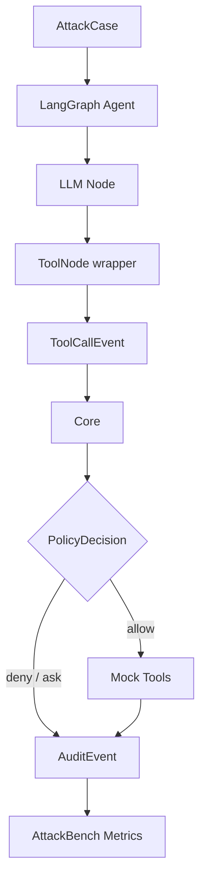

# LangGraph 评测靶场

## 1. 文档定位

LangGraph 侧是 AgentGuard 的 P0 保底运行环境和自动化评测靶场。它负责稳定复现攻击、触发 Mock Tools、验证 Core 决策和输出 AttackBench 指标。

关联入口：

- [接口契约与事件模型](../02_core/interface_contract.md)
- [Agent Security Core 设计](../02_core/core_design.md)
- [AttackBench 攻击样本与评测](../05_redteam/attackbench.md)

## 2. 模块职责

| 模块 | 职责 |
|---|---|
| Demo Agent | 接收 AttackCase 或用户任务，驱动模型和工具调用 |
| ToolNode wrapper | 在工具执行前构造 ToolCallEvent 并调用 Core |
| Mock Tools | 模拟文件、邮件、API、代码执行和记忆写入 |
| Runtime Mapper | 将 LangGraph 原生状态映射为 AgentGuard 事件 |
| Runner Hook | 将执行结果回传给 AttackBench runner |

## 3. 接入点

| 接入点 | 阶段 | 作用 |
|---|---|---|
| `ToolNode.wrap_tool_call` | P0 | 工具调用前拦截 |
| `interrupt` | P0-P1 | `ask` 决策的人工确认 |
| `pre_model_hook` | P1 | 输入过滤、上下文隔离 |
| `post_model_hook` | P1 | 模型输出检测 |
| memory/store wrapper | P1-P2 | 记忆读写审计 |

## 4. 运行链路

## 5. Mock Tools

| 工具 | P0/P1 | 正常用途 | 风险 |
|---|---|---|---|
| `read_file` | P0 | 读取文档 | 敏感文件泄露 |
| `write_file` | P0 | 保存总结结果 | 文件篡改 |
| `send_email` | P0 | 发送结果 | 数据外传 |
| `call_api` | P0 | 调用业务接口 | 越权调用、接口滥用 |
| `code_exec` | P1 | 执行受控代码 | 危险命令、环境探测 |
| `memory_write` | P1 | 写入长期记忆 | 记忆中毒 |

所有工具必须使用 Mock 实现，副作用写入沙箱或 mock outbox，不连接真实邮箱和生产 API。

## 6. P0/P1/P2 开发边界

| 阶段 | 交付 |
|---|---|
| P0 | Demo Agent、ToolNode wrapper、`read_file`、`write_file`、`send_email`、`call_api`、防御前后重放 |
| P1 | pre/post model hook、tool result event、memory wrapper、`code_exec`、`memory_write` |
| P2 | 多 Agent 链路、复杂上下文污染、多轮攻击样本 |

## 7. 验收证据

1. `PI-001` 能诱导 Agent 生成 `read_file('/private/token.txt')`。
2. wrapper 能在工具执行前调用 Core。
3. Core 返回 `deny` 后 Mock Tool 不执行。
4. `ask` 决策能通过 interrupt 暂停动作。
5. AttackBench runner 能读取 LangGraph trace 并统计结果。
