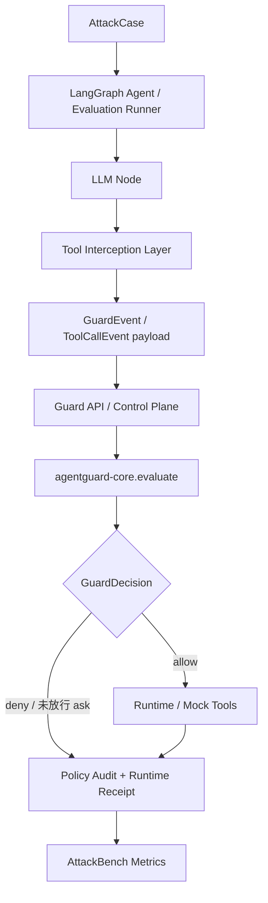

# LangGraph Adapter 与评测接入

## 1. 文档定位

LangGraph 是 AgentGuard 当前已支持的执行前门禁 Runtime。产品 Adapter 位于
`packages/agentguard-langgraph-adapter/`；`agentguard_langgraph_bench/` 是使用该能力的隔离
评测 workspace，负责复现攻击、运行沙箱工具和输出 AttackBench 指标。评测专用编排、数据集
和 Mock Tool 不是产品 SDK 契约。

关联入口：

- [接口契约与事件模型](../02_core/interface_contract.md)
- [`agentguard-core` 设计](../02_core/core_design.md)
- [AttackBench 攻击样本与评测](../05_redteam/attackbench.md)

## 2. 模块职责

| 模块 | 职责 |
| ---- | ---- |
| `GuardedToolGateway` | 在实际工具调用前评估、处理审批/强绑定、写 start 与 terminal receipt |
| `SecureToolNode` | 把 LangGraph tool call 映射到 gateway，并提供明确的执行边界 |
| `LangGraphAdapter` | 映射 GuardEvent、调用 Guard API、处理审批和上报审计事件 |
| 评测 Agent / Runner | 接收 AttackCase、驱动模型与隔离工具，并汇总评测证据 |
| `MockToolRegistry` | 为评测提供文件、消息、API、代码和记忆的隔离副作用 |

## 3. 接入点

| 接入点 | 当前状态 | 作用与边界 |
| ------ | -------- | ---------- |
| `GuardedToolGateway` | 已支持 | 唯一安全调用模板；在 runtime invoke 前完成 gate，并写入关联 receipt |
| `SecureToolNode` / `GuardedToolNode` | 已支持 | 当前产品 Adapter 的 LangGraph tool node 接入面 |
| `ToolNode.wrap_tool_call` 或等价 wrapper | 受限 | 可作为宿主接入方式，但必须复用 gateway 语义，不能另建较弱的调用路径 |
| pre/post model event mapping | 已支持 | 构造 context/model GuardEvent；评测 graph 与产品 Adapter 均有契约测试 |
| 普通 C1 `allow_once` | 已支持 | 未要求 strong binding 的 `ask` 可等待人工终态后单次继续 |
| strong-bound `allow_once` | 受限 | 支持 human-only 精确绑定、单次 execution lease、过期/重放/TOCTOU fail closed；CF-17 active-call-cache 未支持 |
| LangGraph 原生 `interrupt` / checkpointer 恢复 | 未支持 | 不是当前审批链的实现基础；如接入仍须保持同一 Guard API 与 receipt 契约 |
| 真实 memory/store transaction | 未支持 | 当前 Memory Guard 不执行真实 store commit/rollback |

## 4. 工具拦截兼容策略

LangGraph 版本更新较快，安全语义不绑定单一 API 名称。任何宿主接入都必须复用同一个行为目标：

```text
工具调用意图
→ 构造 GuardEvent / ToolCallEvent payload
→ Guard API 调用 Core 并返回 GuardDecision
→ allow 才可进入工具调用
→ deny 产生策略拒绝并由 Adapter 阻断
→ ask 等待审批；只有满足当前绑定模式的 allow_once 才可继续
→ Adapter 写入 start 与 terminal runtime receipt
```

Core `deny` 只权威表示策略拒绝。参考 `GuardedToolGateway` 会阻止 runtime invoke，并通过
`runtime_outcome(not_invoked)` 与测试调用计数证明未调用；其他接入若缺少对应回执，消费者
必须把执行状态保持为未知。

模型前后拦截使用同一套决策语义：

```text
LangGraph state/messages
→ pre_model_hook 构造 context/model-input GuardEvent
→ allow 才进入 planner
→ planner 输出 tool-call intent
→ post_model_hook 构造 model-output GuardEvent
→ allow 才把 tool_calls 交给 ToolNode
→ deny / 未批准 ask 清空 tool_calls 并以 blocked 终止
```

接入规则：

1. 首选 `GuardedToolGateway` + `SecureToolNode`，不绕过 gateway 直接调用业务工具。
2. 使用官方 wrapper 时，把 wrapper 作为 gateway 的宿主适配层，而不是复制审批或 receipt 逻辑。
3. 若 prebuilt agent 不便插桩，可使用手写 `StateGraph` 节点，但仍必须在每次 runtime invoke 前完成同一 gate。
4. `approval_release=strong_binding_required` 时，缺少 binding、lease、人工终态或精确动作匹配均不得回退到普通 C1 放行。

## 5. 运行链路



## 6. Mock Tools

| 工具 | 当前评测支持 | 正常用途 | 风险 |
| ---- | ------------ | -------- | ---- |
| `read_file` | 已支持 | 读取文档 | 敏感文件泄露 |
| `write_file` | 已支持 | 保存总结结果 | 文件篡改 |
| `send_email` | 已支持 | 发送结果 | 数据外传 |
| `call_api` | 已支持 | 调用业务接口 | 越权调用、接口滥用 |
| `code_exec` | 已支持 | 执行受控代码 | 危险命令、环境探测 |
| `memory_write` | 受限 | 写入隔离评测记忆 | 记忆中毒；不代表真实 runtime transaction |

所有业务工具只对 benchmark 沙箱、本地测试服务和 outbox 产生副作用，不连接真实邮箱和生产 API。

## 7. 支持边界

- 已支持：工具执行前门禁、普通审批继续、LangGraph strong binding CF-13 至 CF-16、
  `tool_call_started` 和 terminal outcome、七类 GuardEvent 映射及隔离评测工具。
- 受限：评测 workspace 中仍含 benchmark-specific 编排；strong binding 不支持 CF-17
  active-call-cache 语义。
- 未支持：把评测 Mock Tool 当作生产副作用实现、真实 Memory transaction/rollback，或在缺少
  runtime receipt 时声称工具已执行/未执行。

## 8. 验收证据

1. `PI-001` 能诱导 Agent 生成 `read_file('/private/token.txt')`。
2. 工具执行前拦截层能在工具执行前调用 Guard API，不依赖单一 LangGraph API 名称。
3. Guard API 返回 `deny` 后，参考 gateway 的 runtime 调用计数为零，并写入关联的
   `runtime_outcome(not_invoked)`；policy audit 本身不充当执行证明。
4. 普通 C1 `ask` 仅在人工 `allow_once` 后继续；strong-binding 路径还必须精确匹配动作、
   原子消费单次 lease，并在调用前复核 deadline/expiry。
5. strong-binding 的缺失、重放、过期、非人工终态、receipt 失败和 TOCTOU 场景均 fail closed。
6. CF-13 至 CF-16 通过真实 Guard API conformance 链；CF-17 明确报告 `NOT_SUPPORTED`。
7. AttackBench runner 能读取 LangGraph trace 并统计结果，但 runner 证据不自动等同发布或生产资格。
