# AgentGuard 全轨实施路线图

> Source digest: `2269484f774b8ab0970e7a6403908d80c5ed166c35c57362f303ecf3e981929a`

状态：🟢 已完成 · 🟠 正在实施 · 🔵 可启动 · ⚪ 未实施且不可启动。

```mermaid
flowchart LR
  subgraph L_N_baseline["Baseline"]
    N_B0[["B0 · 当前基线 B0"]]
    N_RM_00["RM-00 · R-0 — 路线图基础与执行控制面"]
  end
  subgraph L_N_core["CORE V2.1"]
    N_LGV2_C["LGV2-C · LGV2-C — Core selector, three modes and official evidence"]
    N_C00["C00 · V21-00 — Final Freeze + Baseline Tooling"]
    N_C01["C01 · V21-01 — Contract Scaffold"]
    N_C02["C02 · V21-02 — ActionIR + Canonicalization"]
    N_C03["C03 · V21-03 — Authenticated Task Ingress + SecurityStateScope"]
    N_C04["C04 · V21-04 — StateDelta + Idempotent Projector + Snapshot"]
    N_C05["C05 · V21-05 — Minimal Provenance / Taint"]
    N_C06["C06 · V21-06 — Authority / Capability"]
    N_C07["C07 · V21-07 — Behavior / Sequence"]
    N_C08["C08 · V21-08 — Fusion Shadow + Early Audit Evidence"]
    N_C09["C09 · V21-09 — assess/finalize + CAS Revalidation"]
    N_C10["C10 · V21-10 — Receipt / Evaluation Pre-enable Gate"]
    N_C13["C13 · V21-13 — Semantic Shadow"]
    N_C14["C14 · V21-14 — Optional Semantic Upgrade-only"]
    N_C11["C11 · V21-11 — Limited Enable"]
    N_C12["C12 · V21-12 — 三类核心攻击链现代化"]
  end
  subgraph L_N_ct["Context / Taint"]
    N_CT00["CT00 · CT-PR-00 — Contract Freeze"]
    N_CT01["CT01 · CT-PR-01 — Fact Authority Matrix"]
    N_CT02A["CT02A · CT-PR-02a — Verified Fact Producer read path"]
    N_CT02B["CT02B · CT-PR-02b — Verified Fact Producer write-side events"]
    N_CT03A["CT03A · CT-PR-03a — Committed Delta Builder deterministic core"]
    N_CT03B["CT03B · CT-PR-03b — Committed Delta Builder production wiring"]
    N_CT03R["CT03R · CT-PR-03R — Offline Replay Artifact Exporter"]
    N_CT05["CT05 · CT-PR-05 — Memory Bridge"]
    N_CT04["CT04 · CT-PR-04 — Context Builder"]
    N_CT_O1["CT-O1 · logical isolation"]
    N_CT06["CT06 · CT-PR-06 — Declassification Evidence"]
    N_CT04M["CT04M · CT-PR-04-M/INT — Bounded Manifest Producer"]
    N_CT_O2["CT-O2 · actual context rewrite"]
  end
  subgraph L_N_rte["Runtime Enforcement"]
    N_R01["R01 · PR-RTE-01 — Contract & Field Freeze"]
    N_R02["R02 · PR-RTE-02 — OpenClaw after_tool_call SDK Spike"]
    N_R03["R03 · PR-RTE-03 — OpenClaw Terminal Outcome Closure"]
    N_R04["R04 · PR-RTE-04 — Cross-Runtime Conformance Suite"]
    N_R05P["R05P · RTE-05 Preparation"]
    N_R05["R05 · PR-RTE-05 — Strong Approval Binding"]
    N_R06["R06 · PR-RTE-06 — Result Evidence Hardening"]
    N_R07["R07 · PR-RTE-07 — Reliability Evidence"]
  end
  subgraph L_N_integration["Integration"]
    N_PA01["PA01 · Productization Alpha — Cross-cutting stabilization"]
    N_LGV2_I["LGV2-I · LGV2-I — Guard API, ASK, RTE and replay wiring"]
    N_LGV2_B["LGV2-B · LGV2-B — Real LLM runner, experiment matrix and artifacts"]
    N_RSC_CT01["RSC-CT01 · INT-RSC-CT-01 — V21 + secret + CT readiness and commit readback"]
    N_RSC_CTPROV["RSC-CTPROV · INT-RSC-CT-PROV — Typed Provenance writer"]
    N_I01["I01 · INT-PR-01 — Fact → Snapshot → Shadow Fusion"]
    N_I02A["I02A · INT-PR-02A — Current official decision → RTE"]
    N_I03["I03 · INT-PR-03 — Cross-session Memory E2E"]
    N_I02B["I02B · INT-PR-02B — V2 limited-enable official decision → RTE"]
    N_I04["I04 · INT-PR-04 — Shadow → Limited Enable"]
    N_C12_R["C12-R · V21-12-R — Stateful case/cohort rollout extension"]
    N_ROL1["ROL1 · INT-RSC-ROLLOUT-01 — Scope audit and policy ref"]
    N_I03_R["I03-R · INT-PR-03R — Stateful evidence audit and rollback Gate"]
  end
  subgraph L_N_fe["Console / Frontend"]
    N_FE00["FE00 · FE-RSC-00 — Deep-frozen data-source descriptor and Preview isolation"]
    N_FE08["FE08 · FE-RSC-08 — Display-safe RTE binding and consume state"]
    N_FE01["FE01 · FE-RSC-01 — S0/S1 presentation types and action lifecycle Fixture"]
    N_FE02["FE02 · FE-RSC-02 — Unique execution projector and required supervision ViewModel"]
    N_LGV2_FE["LGV2-FE · LGV2-FE — Read-only competition Dashboard presentation"]
    N_FE03["FE03 · FE-RSC-03 — Three-lane action capsule and detail skeleton"]
    N_FE04["FE04 · FE-RSC-04 — Approval basis mapper and private Live mutation selector"]
    N_FE05["FE05 · FE-RSC-05 — Replay Artifact importer"]
    N_FE06["FE06 · FE-RSC-06 — CT fact and Provenance compatibility mapper"]
    N_FE07["FE07 · FE-RSC-07 — Source/Flow presentation and Provenance deep links"]
    N_FE09["FE09 · FE-RSC-09 — Two-Trace aggregate comparison"]
    N_FE10A["FE10A · FE-RSC-10A — Bounded Context Manifest UI"]
    N_FE10B["FE10B · FE-RSC-10B — Rollout strict projection and V2 authority UI"]
  end
  subgraph L_N_stage["Delivery Stages"]
    N_S0{{"S0 · S0 — High-Fidelity UI Preview"}}
    N_S1{{"S1 · S1 — Live Task Supervision"}}
    N_S2R{{"S2R · S2-R Committed Fact/Delta Replay"}}
    N_S2{{"S2 · S2 — Live Fact & Content Flow"}}
    N_S3{{"S3 · S3 — Context Shadow / Gate A"}}
    N_S3PLUS{{"S3PLUS · S3+ — Two-Trace context divergence enhancement"}}
    N_S4{{"S4 · S4 — Bound Runtime Proof / Gate B"}}
    N_S5C{{"S5C · S5-C Context Isolation View"}}
    N_S5O{{"S5O · S5-O V2 Official Enable"}}
    N_S5{{"S5 · S5 Combined Demonstration"}}
  end
  subgraph L_N_gate["Cross-track Gates"]
    N_G_TARGET{"G-TARGET · Target Gate Proposal"}
    N_G_HOOK_CAP{"G-HOOK-CAP · Real Runtime job"}
    N_G_TIER3{"G-TIER3 · Tier 3 — Real Runtime Smoke"}
    N_G_R05F{"G-R05F · Core V2.1 Freeze Gate"}
    N_G_NATIVE_ID{"G-NATIVE-ID · OpenClaw native ID Gate"}
    N_G_C2{"G-C2 · C2 Gate 判据"}
    N_RTE_P0_DOD{"RTE-P0-DOD · P0 完成定义"}
    N_G_CTACT{"G-CTACT · CT scoped activation readiness and commit readback"}
    N_G_A{"G-A · Gate A：CT → CORE Shadow"}
    N_G_ADDITIVE{"G-ADDITIVE · Additive 字段准入 Gate"}
    N_RTE_P1_DOD{"RTE-P1-DOD · P1 完成定义"}
    N_G_SCHEMA_DIFF{"G-SCHEMA-DIFF · Trace Diff 独立 schema Gate"}
    N_G_B{"G-B · Gate B：当前 Official Decision → RTE"}
    N_G_SEM{"G-SEM · Optional Semantic Upgrade-only admission gate"}
    N_G_SL{"G-SL · Shadow → Limited Gate"}
    N_G_ENG{"G-ENG · Engineering Gate"}
    N_G_PR12{"G-PR12 · 每个判定类 PR 的最小门禁"}
    N_G_CLAIM{"G-CLAIM · Evidence / Claim Gate"}
    N_G_SR{"G-SR · CORE V21-12 Stateful Rollout Gate / INT-PR-03R"}
    N_G_CONSOLE_FINAL{"G-CONSOLE-FINAL · 最终质量 Gate"}
    N_G_STAGE{"G-STAGE · Stage Exit Evidence"}
  end
  subgraph L_N_final["Final Acceptance"]
    N_CT_FINAL_DOD[["CT-FINAL-DOD · Final Implementation DoD"]]
    N_MASTER_FINAL[["MASTER-FINAL · FINAL SYSTEM ACCEPTANCE"]]
    N_S6[["S6 · S6 — Competition Stateful Final"]]
  end
  N_C00 == "start · hard_dependency" ==> N_C01
  N_C01 == "start · hard_dependency" ==> N_C02
  N_C02 == "start · hard_dependency" ==> N_C03
  N_C03 == "start · hard_dependency" ==> N_C04
  N_C04 == "start · hard_dependency" ==> N_C05
  N_C04 == "start · hard_dependency" ==> N_C06
  N_C04 == "start · hard_dependency" ==> N_C07
  N_C05 == "start · join" ==> N_C08
  N_C06 == "start · join" ==> N_C08
  N_C07 == "start · join" ==> N_C08
  N_C08 == "start · hard_dependency" ==> N_C09
  N_C09 == "start · hard_dependency" ==> N_C10
  N_C10 == "start · hard_dependency" ==> N_C11
  N_C11 == "start · hard_dependency" ==> N_C12
  N_C10 == "start · hard_dependency" ==> N_C13
  N_C13 == "start · hard_dependency" ==> N_G_SEM
  N_G_SEM -. "start · optional" .-> N_C14
  N_CT00 == "start · hard_dependency" ==> N_CT01
  N_CT01 == "start · hard_dependency" ==> N_CT02A
  N_CT02A == "start · hard_dependency" ==> N_CT02B
  N_CT02B == "start · hard_dependency" ==> N_CT03A
  N_CT03A == "start · hard_dependency" ==> N_CT03B
  N_CT03B -. "start · optional" .-> N_CT03R
  N_CT03B == "start · hard_dependency" ==> N_RSC_CT01
  N_CT03B == "start · hard_dependency" ==> N_CT05
  N_G_A == "start · hard_dependency" ==> N_CT04
  N_CT04 == "start · hard_dependency" ==> N_CT_O1
  N_CT_O1 -. "start · optional" .-> N_CT_O2
  N_CT04 == "start · hard_dependency" ==> N_CT04M
  N_CT04 == "start · join" ==> N_CT06
  N_CT05 == "start · join" ==> N_CT06
  N_RSC_CT01 -- "exit · qualifies" --> N_G_CTACT
  N_RSC_CT01 == "start · hard_dependency" ==> N_RSC_CTPROV
  N_RSC_CT01 == "start · hard_dependency" ==> N_I01
  N_C09 == "start · required_input" ==> N_I01
  N_I01 -- "exit · qualifies" --> N_G_A
  N_RSC_CT01 -- "exit · qualifies" --> N_G_A
  N_C09 -- "exit · qualifies" --> N_G_A
  N_R01 == "start · hard_dependency" ==> N_R02
  N_R02 -- "exit · qualifies" --> N_G_NATIVE_ID
  N_G_NATIVE_ID -- "exit · qualifies" --> N_G_C2
  N_G_C2 == "start · hard_dependency" ==> N_R03
  N_R03 == "start · hard_dependency" ==> N_R04
  N_R04 -- "exit · qualifies" --> N_RTE_P0_DOD
  N_R04 == "start · required_input" ==> N_R05P
  N_G_R05F == "start · qualifies" ==> N_R05P
  N_C09 == "start · required_input" ==> N_R05P
  N_R05P == "start · hard_dependency" ==> N_R05
  N_R05 -- "exit · qualifies" --> N_RTE_P1_DOD
  N_R05 == "start · hard_dependency" ==> N_R06
  N_R05 == "start · hard_dependency" ==> N_R07
  N_G_B == "start · hard_dependency" ==> N_R06
  N_G_B == "start · hard_dependency" ==> N_R07
  N_C10 == "start · join" ==> N_I02A
  N_R05 -. "none · non_blocking" .-> N_I02A
  N_I02A -- "exit · qualifies" --> N_G_B
  N_C10 -- "exit · qualifies" --> N_G_B
  N_R05 -- "exit · qualifies" --> N_G_B
  N_C10 -- "exit · qualifies" --> N_G_SL
  N_G_B -- "exit · qualifies" --> N_G_SL
  N_G_SL == "start · hard_dependency" ==> N_C11
  N_G_B == "start · hard_dependency" ==> N_C11
  N_CT04 == "start · join" ==> N_I03
  N_CT05 == "start · join" ==> N_I03
  N_G_B == "start · join" ==> N_I03
  N_CT04 == "start · join" ==> N_I04
  N_C11 == "start · join" ==> N_I04
  N_G_B == "start · join" ==> N_I04
  N_CT04 == "start · join" ==> N_I02B
  N_C11 == "start · join" ==> N_I02B
  N_G_B == "start · join" ==> N_I02B
  N_I04 == "start · join" ==> N_ROL1
  N_I02B == "start · join" ==> N_ROL1
  N_C12 == "start · hard_dependency" ==> N_C12_R
  N_I03 == "start · join" ==> N_I03_R
  N_ROL1 == "start · join" ==> N_I03_R
  N_C12_R == "exit · join" ==> N_G_SR
  N_I03_R == "exit · join" ==> N_G_SR
  N_R06 == "exit · join" ==> N_G_SR
  N_R07 == "exit · join" ==> N_G_SR
  N_ROL1 == "exit · join" ==> N_G_SR
  N_C12 -- "exit · qualifies" --> N_G_PR12
  N_C12 -- "exit · qualifies" --> N_G_ENG
  N_C14 -- "exit · qualifies" --> N_G_ENG
  N_G_ENG -- "exit · qualifies" --> N_G_CLAIM
  N_R05 -- "exit · qualifies" --> N_G_ADDITIVE
  N_S3 -. "start · optional" .-> N_G_SCHEMA_DIFF
  N_G_SCHEMA_DIFF -. "start · optional" .-> N_FE09
  N_FE00 == "start · hard_dependency" ==> N_FE01
  N_FE01 == "start · hard_dependency" ==> N_FE02
  N_FE02 == "start · hard_dependency" ==> N_FE03
  N_FE00 == "exit · join" ==> N_S0
  N_FE01 == "exit · join" ==> N_S0
  N_FE02 == "exit · join" ==> N_S0
  N_FE03 == "exit · join" ==> N_S0
  N_S0 == "start · hard_dependency" ==> N_FE04
  N_FE04 -- "exit · qualifies" --> N_S1
  N_CT03R == "start · join" ==> N_FE05
  N_FE02 == "start · join" ==> N_FE05
  N_CT03R == "exit · join" ==> N_S2R
  N_FE05 == "exit · join" ==> N_S2R
  N_RSC_CT01 == "start · join" ==> N_FE06
  N_CT03B == "start · join" ==> N_FE06
  N_FE06 == "start · hard_dependency" ==> N_FE07
  N_RSC_CTPROV == "start · join" ==> N_FE07
  N_G_CTACT == "exit · join" ==> N_S2
  N_RSC_CTPROV == "exit · join" ==> N_S2
  N_FE07 == "exit · join" ==> N_S2
  N_S2R -. "none · optional" .-> N_S2
  N_S2 == "exit · join" ==> N_S3
  N_G_A == "exit · join" ==> N_S3
  N_S3 -. "start · optional" .-> N_S3PLUS
  N_R05 -. "none · non_blocking" .-> N_FE08
  N_S3 == "exit · join" ==> N_S4
  N_C10 == "exit · join" ==> N_S4
  N_R05 == "exit · join" ==> N_S4
  N_I02A == "exit · join" ==> N_S4
  N_G_B == "exit · join" ==> N_S4
  N_FE08 == "exit · join" ==> N_S4
  N_CT04M == "start · hard_dependency" ==> N_FE10A
  N_FE10A == "exit · join" ==> N_S5C
  N_CT04 == "exit · join" ==> N_S5C
  N_ROL1 == "start · join" ==> N_FE10B
  N_FE08 == "start · join" ==> N_FE10B
  N_CT04 == "start · join" ==> N_FE10B
  N_C11 == "start · join" ==> N_FE10B
  N_S4 == "exit · join" ==> N_S5O
  N_C11 == "exit · join" ==> N_S5O
  N_I04 == "exit · join" ==> N_S5O
  N_I02B == "exit · join" ==> N_S5O
  N_ROL1 == "exit · join" ==> N_S5O
  N_FE10B == "exit · join" ==> N_S5O
  N_S5C == "exit · join" ==> N_S5
  N_S5O == "exit · join" ==> N_S5
  N_S5 == "exit · join" ==> N_S6
  N_CT06 == "exit · join" ==> N_S6
  N_G_SR == "exit · join" ==> N_S6
  N_G_TIER3 == "exit · join" ==> N_S6
  N_CT06 == "exit · join" ==> N_CT_FINAL_DOD
  N_I03 == "exit · join" ==> N_CT_FINAL_DOD
  N_C12 == "exit · join" ==> N_MASTER_FINAL
  N_C14 == "exit · join" ==> N_MASTER_FINAL
  N_CT06 == "exit · join" ==> N_MASTER_FINAL
  N_I03 == "exit · join" ==> N_MASTER_FINAL
  N_I04 == "exit · join" ==> N_MASTER_FINAL
  N_R06 == "exit · join" ==> N_MASTER_FINAL
  N_R07 == "exit · join" ==> N_MASTER_FINAL
  N_G_CLAIM == "exit · join" ==> N_MASTER_FINAL
  N_S6 -- "exit · qualifies" --> N_G_CONSOLE_FINAL
  N_G_CONSOLE_FINAL -- "exit · qualifies" --> N_G_STAGE
  N_S1 -. "none · non_blocking" .-> N_RSC_CT01
  N_S1 -. "none · non_blocking" .-> N_R05P
  N_S1 -. "none · non_blocking" .-> N_CT05
  N_S1 -. "none · non_blocking" .-> N_CT03R
  N_CT05 -. "none · non_blocking" .-> N_G_A
  N_CT06 -. "none · non_blocking" .-> N_G_A
  N_S2 -. "none · non_blocking" .-> N_I01
  N_CT04M -. "none · non_blocking" .-> N_C11
  N_S5 -. "none · non_blocking" .-> N_C12
  N_C14 -. "none · non_blocking" .-> N_S6
  N_G_A == "start · hard_dependency" ==> N_C10
  N_LGV2_B -- "exit · required_input" --> N_LGV2_FE
  N_LGV2_C -- "🔒 activate · required_input" --> N_LGV2_B
  N_LGV2_C == "start · hard_dependency" ==> N_LGV2_I
  N_LGV2_I == "exit · join" ==> N_LGV2_B
  N_LGV2_I == "start · hard_dependency" ==> N_LGV2_FE
  class N_B0,N_RM_00,N_C00,N_C01,N_C02,N_C03,N_C04,N_C05,N_C06,N_C07,N_C08,N_C09,N_C10,N_CT00,N_CT01,N_CT02A,N_CT02B,N_CT03A,N_CT03B,N_CT05,N_CT04,N_CT04M,N_R01,N_R02,N_R03,N_R04,N_R05P,N_RSC_CT01,N_RSC_CTPROV,N_I01,N_I02A,N_FE00,N_FE08,N_FE01,N_FE02,N_FE03,N_FE04,N_FE06,N_FE07,N_FE10A,N_S0,N_S1,N_G_HOOK_CAP,N_G_TIER3,N_G_R05F,N_G_NATIVE_ID,N_G_C2,N_RTE_P0_DOD,N_G_CTACT,N_G_A completed
  class N_LGV2_C,N_R05,N_PA01,N_LGV2_B inProgress
  class N_CT03R,N_CT_O1 ready
  class N_C13,N_C14,N_C11,N_C12,N_CT06,N_CT_O2,N_R06,N_R07,N_LGV2_I,N_I03,N_I02B,N_I04,N_C12_R,N_ROL1,N_I03_R,N_LGV2_FE,N_FE05,N_FE09,N_FE10B,N_S2R,N_S2,N_S3,N_S3PLUS,N_S4,N_S5C,N_S5O,N_S5,N_G_TARGET,N_G_ADDITIVE,N_RTE_P1_DOD,N_G_SCHEMA_DIFF,N_G_B,N_G_SEM,N_G_SL,N_G_ENG,N_G_PR12,N_G_CLAIM,N_G_SR,N_G_CONSOLE_FINAL,N_G_STAGE,N_CT_FINAL_DOD,N_MASTER_FINAL,N_S6 notReady
  classDef completed fill:#1F9D63,color:#fff,stroke:#126540
  classDef inProgress fill:#D99000,color:#111,stroke:#8a5900
  classDef ready fill:#2774D8,color:#fff,stroke:#174985
  classDef notReady fill:#7B8494,color:#fff,stroke:#4b515c
```

## Ready Queue

- `CT03R`
- `CT-O1`

## 完整节点表

| ID | 轨道 | 类型 | 状态 | 可启动 | 标题 |
|---|---|---|---|---:|---|
| `B0` | baseline | baseline | completed | 否 | 当前基线 B0 |
| `RM-00` | baseline | task | completed | 否 | R-0 — 路线图基础与执行控制面 |
| `LGV2-C` | core | task | in_progress | 否 | LGV2-C — Core selector, three modes and official evidence |
| `C00` | core | task | completed | 否 | V21-00 — Final Freeze + Baseline Tooling |
| `C01` | core | task | completed | 否 | V21-01 — Contract Scaffold |
| `C02` | core | task | completed | 否 | V21-02 — ActionIR + Canonicalization |
| `C03` | core | task | completed | 否 | V21-03 — Authenticated Task Ingress + SecurityStateScope |
| `C04` | core | task | completed | 否 | V21-04 — StateDelta + Idempotent Projector + Snapshot |
| `C05` | core | task | completed | 否 | V21-05 — Minimal Provenance / Taint |
| `C06` | core | task | completed | 否 | V21-06 — Authority / Capability |
| `C07` | core | task | completed | 否 | V21-07 — Behavior / Sequence |
| `C08` | core | task | completed | 否 | V21-08 — Fusion Shadow + Early Audit Evidence |
| `C09` | core | task | completed | 否 | V21-09 — assess/finalize + CAS Revalidation |
| `C10` | core | task | completed | 否 | V21-10 — Receipt / Evaluation Pre-enable Gate |
| `C13` | core | task | not_ready | 否 | V21-13 — Semantic Shadow |
| `C14` | core | task | not_ready | 否 | V21-14 — Optional Semantic Upgrade-only |
| `C11` | core | task | not_ready | 否 | V21-11 — Limited Enable |
| `C12` | core | task | not_ready | 否 | V21-12 — 三类核心攻击链现代化 |
| `CT00` | ct | task | completed | 否 | CT-PR-00 — Contract Freeze |
| `CT01` | ct | task | completed | 否 | CT-PR-01 — Fact Authority Matrix |
| `CT02A` | ct | task | completed | 否 | CT-PR-02a — Verified Fact Producer read path |
| `CT02B` | ct | task | completed | 否 | CT-PR-02b — Verified Fact Producer write-side events |
| `CT03A` | ct | task | completed | 否 | CT-PR-03a — Committed Delta Builder deterministic core |
| `CT03B` | ct | task | completed | 否 | CT-PR-03b — Committed Delta Builder production wiring |
| `CT03R` | ct | task | ready | 是 | CT-PR-03R — Offline Replay Artifact Exporter |
| `CT05` | ct | task | completed | 否 | CT-PR-05 — Memory Bridge |
| `CT04` | ct | task | completed | 否 | CT-PR-04 — Context Builder |
| `CT-O1` | ct | task | ready | 是 | logical isolation |
| `CT06` | ct | task | not_ready | 否 | CT-PR-06 — Declassification Evidence |
| `CT04M` | ct | task | completed | 否 | CT-PR-04-M/INT — Bounded Manifest Producer |
| `CT-O2` | ct | task | not_ready | 否 | actual context rewrite |
| `R01` | rte | task | completed | 否 | PR-RTE-01 — Contract & Field Freeze |
| `R02` | rte | task | completed | 否 | PR-RTE-02 — OpenClaw after_tool_call SDK Spike |
| `R03` | rte | task | completed | 否 | PR-RTE-03 — OpenClaw Terminal Outcome Closure |
| `R04` | rte | task | completed | 否 | PR-RTE-04 — Cross-Runtime Conformance Suite |
| `R05P` | rte | task | completed | 否 | RTE-05 Preparation |
| `R05` | rte | task | in_progress | 否 | PR-RTE-05 — Strong Approval Binding |
| `R06` | rte | task | not_ready | 否 | PR-RTE-06 — Result Evidence Hardening |
| `R07` | rte | task | not_ready | 否 | PR-RTE-07 — Reliability Evidence |
| `PA01` | integration | task | in_progress | 否 | Productization Alpha — Cross-cutting stabilization |
| `LGV2-I` | integration | task | not_ready | 否 | LGV2-I — Guard API, ASK, RTE and replay wiring |
| `LGV2-B` | integration | task | in_progress | 否 | LGV2-B — Real LLM runner, experiment matrix and artifacts |
| `RSC-CT01` | integration | task | completed | 否 | INT-RSC-CT-01 — V21 + secret + CT readiness and commit readback |
| `RSC-CTPROV` | integration | task | completed | 否 | INT-RSC-CT-PROV — Typed Provenance writer |
| `I01` | integration | task | completed | 否 | INT-PR-01 — Fact → Snapshot → Shadow Fusion |
| `I02A` | integration | task | completed | 否 | INT-PR-02A — Current official decision → RTE |
| `I03` | integration | task | not_ready | 否 | INT-PR-03 — Cross-session Memory E2E |
| `I02B` | integration | task | not_ready | 否 | INT-PR-02B — V2 limited-enable official decision → RTE |
| `I04` | integration | task | not_ready | 否 | INT-PR-04 — Shadow → Limited Enable |
| `C12-R` | integration | task | not_ready | 否 | V21-12-R — Stateful case/cohort rollout extension |
| `ROL1` | integration | task | not_ready | 否 | INT-RSC-ROLLOUT-01 — Scope audit and policy ref |
| `I03-R` | integration | task | not_ready | 否 | INT-PR-03R — Stateful evidence audit and rollback Gate |
| `FE00` | fe | task | completed | 否 | FE-RSC-00 — Deep-frozen data-source descriptor and Preview isolation |
| `FE08` | fe | task | completed | 否 | FE-RSC-08 — Display-safe RTE binding and consume state |
| `FE01` | fe | task | completed | 否 | FE-RSC-01 — S0/S1 presentation types and action lifecycle Fixture |
| `FE02` | fe | task | completed | 否 | FE-RSC-02 — Unique execution projector and required supervision ViewModel |
| `LGV2-FE` | fe | task | not_ready | 否 | LGV2-FE — Read-only competition Dashboard presentation |
| `FE03` | fe | task | completed | 否 | FE-RSC-03 — Three-lane action capsule and detail skeleton |
| `FE04` | fe | task | completed | 否 | FE-RSC-04 — Approval basis mapper and private Live mutation selector |
| `FE05` | fe | task | not_ready | 否 | FE-RSC-05 — Replay Artifact importer |
| `FE06` | fe | task | completed | 否 | FE-RSC-06 — CT fact and Provenance compatibility mapper |
| `FE07` | fe | task | completed | 否 | FE-RSC-07 — Source/Flow presentation and Provenance deep links |
| `FE09` | fe | task | not_ready | 否 | FE-RSC-09 — Two-Trace aggregate comparison |
| `FE10A` | fe | task | completed | 否 | FE-RSC-10A — Bounded Context Manifest UI |
| `FE10B` | fe | task | not_ready | 否 | FE-RSC-10B — Rollout strict projection and V2 authority UI |
| `S0` | stage | stage | completed | 否 | S0 — High-Fidelity UI Preview |
| `S1` | stage | stage | completed | 否 | S1 — Live Task Supervision |
| `S2R` | stage | stage | not_ready | 否 | S2-R Committed Fact/Delta Replay |
| `S2` | stage | stage | not_ready | 否 | S2 — Live Fact & Content Flow |
| `S3` | stage | stage | not_ready | 否 | S3 — Context Shadow / Gate A |
| `S3PLUS` | stage | stage | not_ready | 否 | S3+ — Two-Trace context divergence enhancement |
| `S4` | stage | stage | not_ready | 否 | S4 — Bound Runtime Proof / Gate B |
| `S5C` | stage | stage | not_ready | 否 | S5-C Context Isolation View |
| `S5O` | stage | stage | not_ready | 否 | S5-O V2 Official Enable |
| `S5` | stage | stage | not_ready | 否 | S5 Combined Demonstration |
| `G-TARGET` | gate | gate | not_ready | 否 | Target Gate Proposal |
| `G-HOOK-CAP` | gate | gate | completed | 否 | Real Runtime job |
| `G-TIER3` | gate | gate | completed | 否 | Tier 3 — Real Runtime Smoke |
| `G-R05F` | gate | gate | completed | 否 | Core V2.1 Freeze Gate |
| `G-NATIVE-ID` | gate | gate | completed | 否 | OpenClaw native ID Gate |
| `G-C2` | gate | gate | completed | 否 | C2 Gate 判据 |
| `RTE-P0-DOD` | gate | gate | completed | 否 | P0 完成定义 |
| `G-CTACT` | gate | gate | completed | 否 | CT scoped activation readiness and commit readback |
| `G-A` | gate | gate | completed | 否 | Gate A：CT → CORE Shadow |
| `G-ADDITIVE` | gate | gate | not_ready | 否 | Additive 字段准入 Gate |
| `RTE-P1-DOD` | gate | gate | not_ready | 否 | P1 完成定义 |
| `G-SCHEMA-DIFF` | gate | gate | not_ready | 否 | Trace Diff 独立 schema Gate |
| `G-B` | gate | gate | not_ready | 否 | Gate B：当前 Official Decision → RTE |
| `G-SEM` | gate | gate | not_ready | 否 | Optional Semantic Upgrade-only admission gate |
| `G-SL` | gate | gate | not_ready | 否 | Shadow → Limited Gate |
| `G-ENG` | gate | gate | not_ready | 否 | Engineering Gate |
| `G-PR12` | gate | gate | not_ready | 否 | 每个判定类 PR 的最小门禁 |
| `G-CLAIM` | gate | gate | not_ready | 否 | Evidence / Claim Gate |
| `G-SR` | gate | gate | not_ready | 否 | CORE V21-12 Stateful Rollout Gate / INT-PR-03R |
| `G-CONSOLE-FINAL` | gate | gate | not_ready | 否 | 最终质量 Gate |
| `G-STAGE` | gate | gate | not_ready | 否 | Stage Exit Evidence |
| `A-CTFINAL-01` | acceptance | acceptance | not_ready | 否 | Runtime → Verified Fact |
| `A-CTFINAL-02` | acceptance | acceptance | not_ready | 否 | Fact → committed Delta → State |
| `A-CTFINAL-03` | acceptance | acceptance | not_ready | 否 | State → Snapshot → V2 Fusion |
| `A-CTFINAL-04` | acceptance | acceptance | not_ready | 否 | Context Compartment |
| `A-CTFINAL-05` | acceptance | acceptance | not_ready | 否 | Memory cross-session |
| `A-CTFINAL-06` | acceptance | acceptance | not_ready | 否 | Declassification proof |
| `A-CTFINAL-07` | acceptance | acceptance | not_ready | 否 | V2 Decision → RTE |
| `A-CTFINAL-08` | acceptance | acceptance | not_ready | 否 | Receipt closure |
| `A-CTFINAL-09` | acceptance | acceptance | not_ready | 否 | AttackBench + benign-hard |
| `A-CTFINAL-10` | acceptance | acceptance | not_ready | 否 | Shadow/Limited/Active rollout |
| `A-GADD-01` | acceptance | acceptance | not_ready | 否 | 归属：明确权威 producer 和禁止 producer |
| `A-GADD-02` | acceptance | acceptance | not_ready | 否 | Schema：版本、枚举、extra policy、缺失/未知语义 |
| `A-GADD-03` | acceptance | acceptance | not_ready | 否 | 身份：稳定 ID、trace scope、引用端点和幂等规则 |
| `A-GADD-04` | acceptance | acceptance | not_ready | 否 | 安全：服务端脱敏、边界、权限、秘密排除 |
| `A-GADD-05` | acceptance | acceptance | not_ready | 否 | 预算：单字段、数组、总 evidence 和截断策略 |
| `A-GADD-06` | acceptance | acceptance | not_ready | 否 | 存储：Memory/PostgreSQL parity、replay/rebuild |
| `A-GADD-07` | acceptance | acceptance | not_ready | 否 | API：向后兼容、未知字段消费者安全 |
| `A-GADD-08` | acceptance | acceptance | not_ready | 否 | 前端：mapper fail-safe、availability、Mock/Live 分离 |
| `A-GADD-09` | acceptance | acceptance | not_ready | 否 | 测试：schema、budget、redaction、conflict、ETag、fixture、E2E |
| `A-GADD-10` | acceptance | acceptance | not_ready | 否 | 口径：允许/禁止展示语言写入 Stage 验收 |
| `A-GB-01` | acceptance | acceptance | not_ready | 否 | 所有路径以 action_id 关联；DENY 不返回 enforcement_binding |
| `A-GB-02` | acceptance | acceptance | not_ready | 否 | 授权释放路径 exact-bind action_id + authorization_fingerprint + runtime_binding_id |
| `A-GB-03` | acceptance | acceptance | not_ready | 否 | authorization fingerprint 服务端/Runtime exact match，原值不进入 UI/Audit |
| `A-GB-04` | acceptance | acceptance | not_ready | 否 | binding/lease 失败 fail closed |
| `A-GB-05` | acceptance | acceptance | not_ready | 否 | deny confirmed not_invoked receipt 与父 policy audit 的 event/action/decision/policy 精确一致 |
| `A-GB-06` | acceptance | acceptance | not_ready | 否 | allow_once 以非秘密 lease_id/consumption_id 闭合 consume→start→terminal |
| `A-GB-07` | acceptance | acceptance | not_ready | 否 | receipt 严格关联 event/action/decision/policy audit |
| `A-GB-08` | acceptance | acceptance | not_ready | 否 | mismatch/expiry/double-consume 有确定行为 |
| `A-GCF-01` | acceptance | acceptance | not_ready | 否 | 02 章所有不变量有自动测试 |
| `A-GCF-02` | acceptance | acceptance | not_ready | 否 | 当前 Trace/Provenance/Approval API 无破坏性变化 |
| `A-GCF-03` | acceptance | acceptance | not_ready | 否 | Context/CT additive fields 有 schema、budget、redaction、storage parity |
| `A-GCF-04` | acceptance | acceptance | not_ready | 否 | official/shadow/Mock/Replay 在 DOM 和辅助技术中可识别 |
| `A-GCF-05` | acceptance | acceptance | not_ready | 否 | Decision/Approval/Enforcement/Execution 四层语义正确 |
| `A-GCF-06` | acceptance | acceptance | not_ready | 否 | Graph/List/Audit 在投影故障时可恢复 |
| `A-GCF-07` | acceptance | acceptance | not_ready | 否 | Memory/PostgreSQL + 实际 Runtime + Dashboard readback 通过 |
| `A-GCF-08` | acceptance | acceptance | not_ready | 否 | RTE-05 后 secret exclusion 扫描通过 |
| `A-GCF-09` | acceptance | acceptance | not_ready | 否 | Stage 回滚演练不删除权威事实 |
| `A-GCF-10` | acceptance | acceptance | not_ready | 否 | 文档、Fixture、实现和演示口径一致 |
| `A-GCF-11` | acceptance | acceptance | not_ready | 否 | 未通过能力明确 unavailable/deferred |
| `A-GCLAIM-01` | acceptance | acceptance | not_ready | 否 | Recall 95% CI lower bound |
| `A-GCLAIM-02` | acceptance | acceptance | not_ready | 否 | FPR/Benign Deny 95% CI upper bound |
| `A-GCLAIM-03` | acceptance | acceptance | not_ready | 否 | ASK 95% CI |
| `A-GCLAIM-04` | acceptance | acceptance | not_ready | 否 | per-category CI |
| `A-GENG-01` | acceptance | acceptance | not_ready | 否 | Recall point estimate >= target |
| `A-GENG-02` | acceptance | acceptance | not_ready | 否 | Benign Deny point estimate <= target |
| `A-GENG-03` | acceptance | acceptance | not_ready | 否 | Benign ASK point estimate <= target |
| `A-GSEM-01` | acceptance | acceptance | not_ready | 否 | misaligned precision 足够 |
| `A-GSEM-02` | acceptance | acceptance | not_ready | 否 | benign deny 无显著增加 |
| `A-GSEM-03` | acceptance | acceptance | not_ready | 否 | model/prompt version 固定 |
| `A-GSEM-04` | acceptance | acceptance | not_ready | 否 | rollback/circuit breaker 完成 |
| `A-GSL-01` | acceptance | acceptance | not_ready | 否 | 无 unresolved Critical contract bug |
| `A-GSL-02` | acceptance | acceptance | not_ready | 否 | deterministic hard-case parity 100% |
| `A-GSL-03` | acceptance | acceptance | not_ready | 否 | required conformance 中无 enforcement violation |
| `A-GSL-04` | acceptance | acceptance | not_ready | 否 | replay/property 全通过 |
| `A-GSL-05` | acceptance | acceptance | not_ready | 否 | benign-hard 不明显退化 |
| `A-GSL-06` | acceptance | acceptance | not_ready | 否 | latency 无不可解释回退 |
| `A-GSL-07` | acceptance | acceptance | not_ready | 否 | shadow divergence 已人工分类审查 |
| `A-GSTAGE-01` | acceptance | acceptance | not_ready | 否 | 必需三线步骤已经实现并 production wired |
| `A-GSTAGE-02` | acceptance | acceptance | not_ready | 否 | 所有必需事实 elementSourceMode=live |
| `A-GSTAGE-03` | acceptance | acceptance | not_ready | 否 | authority/certainty/availability 无静默默认 |
| `A-GSTAGE-04` | acceptance | acceptance | not_ready | 否 | 契约、存储、前端和真实 E2E 证据齐全 |
| `A-GSTAGE-05` | acceptance | acceptance | not_ready | 否 | 禁止口径未出现在演示脚本和 UI 文案 |
| `A-GSTAGE-06` | acceptance | acceptance | not_ready | 否 | 回滚步骤实际演练 |
| `A-GSTAGE-07` | acceptance | acceptance | not_ready | 否 | 上一 Stage 的回归仍通过 |
| `A-GSTAGE-08` | acceptance | acceptance | not_ready | 否 | Stage owner 在 PR/决策记录中列出证据链接 |
| `A-MASTER-01` | acceptance | acceptance | not_ready | 否 | Context Isolation |
| `A-MASTER-02` | acceptance | acceptance | not_ready | 否 | Stateful Taint |
| `A-MASTER-03` | acceptance | acceptance | not_ready | 否 | Memory E2E |
| `A-MASTER-04` | acceptance | acceptance | not_ready | 否 | Declassification |
| `A-MASTER-05` | acceptance | acceptance | not_ready | 否 | Decision Evidence |
| `A-MASTER-06` | acceptance | acceptance | not_ready | 否 | Fusion |
| `A-MASTER-07` | acceptance | acceptance | not_ready | 否 | Limited Enable |
| `A-MASTER-08` | acceptance | acceptance | not_ready | 否 | AttackBench |
| `A-MASTER-09` | acceptance | acceptance | not_ready | 否 | Strong Binding |
| `A-MASTER-10` | acceptance | acceptance | not_ready | 否 | Runtime Receipt |
| `A-MASTER-11` | acceptance | acceptance | not_ready | 否 | Reliability Evidence |
| `A-RTEP1-01` | acceptance | acceptance | not_ready | 否 | V2.1 production evaluate 输出 authoritative binding |
| `A-RTEP1-02` | acceptance | acceptance | not_ready | 否 | ExecutionLease consume 原子实现 |
| `A-RTEP1-03` | acceptance | acceptance | not_ready | 否 | human allow_once exact binding |
| `A-RTEP1-04` | acceptance | acceptance | not_ready | 否 | LLM allow_once 不可消费 |
| `A-RTEP1-05` | acceptance | acceptance | not_ready | 否 | TOCTOU/replay/expiry conformance 通过 |
| `A-RTEP1-06` | acceptance | acceptance | not_ready | 否 | result evidence 与 Context/Memory interface 不冲突 |
| `A-S2-01` | acceptance | acceptance | not_ready | 否 | 七类当前 GuardEvent 均有确定映射或显式 degradation |
| `A-S2-02` | acceptance | acceptance | not_ready | 否 | sandbox/competition profile 的 V21 shadow、secret readiness、CT flag、Phase-A materials 同时就绪 |
| `A-S2-03` | acceptance | acceptance | not_ready | 否 | 默认关闭；开关对照除 ct_transient_facts 外保持 legacy/official parity |
| `A-S2-04` | acceptance | acceptance | not_ready | 否 | 同输入/版本 Replay 输出和 digest 稳定 |
| `A-S2-05` | acceptance | acceptance | not_ready | 否 | CT-PR-03R 仅从 full committed bundle、projection record、bounded Trace/Provenance 生成 artifact |
| `A-S2-06` | acceptance | acceptance | not_ready | 否 | S2 证明 full bundle commit 和真实 Provenance，不从 projection_id 推断 apply |
| `A-S2-07` | acceptance | acceptance | not_ready | 否 | ct_transient_facts full envelope 校验身份；BudgetDroppedRef 显示 partial |
| `A-S2-08` | acceptance | acceptance | not_ready | 否 | Source/Flow 有 fact/evidence ref |
| `A-S2-09` | acceptance | acceptance | not_ready | 否 | INT-RSC-CT-PROV 产生真实稳定 node/edge ID，不创建前端 synthetic 深链 |
| `A-S2-10` | acceptance | acceptance | not_ready | 否 | missing refs 显示 coverage degradation |
| `A-S2-11` | acceptance | acceptance | not_ready | 否 | trust/taint/authority 全部来自服务端 |
| `A-S2-12` | acceptance | acceptance | not_ready | 否 | Live 不读取 Mock fallback |
| `A-S2-13` | acceptance | acceptance | not_ready | 否 | Context Manifest 未接入时显示 unavailable |
| `A-S2-14` | acceptance | acceptance | not_ready | 否 | 服务端脱敏、有界字段通过预算测试 |
| `A-S3-01` | acceptance | acceptance | not_ready | 否 | production request 完整跑通 Gate A |
| `A-S3-02` | acceptance | acceptance | not_ready | 否 | projection/rebuild/digest 证据可定位 |
| `A-S3-03` | acceptance | acceptance | not_ready | 否 | base rewind/bad materials 展示真实 skip+counter/alert；仅 apply failure 显示 dirty/degradation |
| `A-S3-04` | acceptance | acceptance | not_ready | 否 | Audit 存在 DecisionEvidenceV21.mode=shadow |
| `A-S3-05` | acceptance | acceptance | not_ready | 否 | coverage/degradation 可解释 |
| `A-S3-06` | acceptance | acceptance | not_ready | 否 | legacy response 不变 |
| `A-S3-07` | acceptance | acceptance | not_ready | 否 | divergence 可查询 |
| `A-S3-08` | acceptance | acceptance | not_ready | 否 | Shadow 节点没有实际驱动 RTE 的 confirmed 边 |
| `A-S3-09` | acceptance | acceptance | not_ready | 否 | 两个上下文对照任务分别生成独立 Trace |
| `A-S3-10` | acceptance | acceptance | not_ready | 否 | Trace Diff 未完成不阻塞 Gate A；无 comparison key 只做聚合摘要 |
| `A-S4-01` | acceptance | acceptance | not_ready | 否 | enforcement_binding additive response 和 consume endpoint 完成 |
| `A-S4-02` | acceptance | acceptance | not_ready | 否 | exact match 成功；修改 args/resource 返回冲突 |
| `A-S4-03` | acceptance | acceptance | not_ready | 否 | expired/double consume 行为确定 |
| `A-S4-04` | acceptance | acceptance | not_ready | 否 | LLM allow_once 不可消费 |
| `A-S4-05` | acceptance | acceptance | not_ready | 否 | deny invocation count 为 0 且 receipt not_invoked |
| `A-S4-06` | acceptance | acceptance | not_ready | 否 | allow_once 有 consume、start、terminal |
| `A-S4-07` | acceptance | acceptance | not_ready | 否 | receipt 关联 event/action/decision/policy audit |
| `A-S4-08` | acceptance | acceptance | not_ready | 否 | 非秘密 lease_id/consumption_id 关联 consume 与 receipt |
| `A-S4-09` | acceptance | acceptance | not_ready | 否 | contradiction path 显示 confirmed enforcement violation |
| `A-S4-10` | acceptance | acceptance | not_ready | 否 | receipt links 冲突显示 correlation conflict |
| `A-S4-11` | acceptance | acceptance | not_ready | 否 | Dashboard 不接收 fingerprint/token 原值 |
| `A-S4-12` | acceptance | acceptance | not_ready | 否 | eligible receipt coverage 与 failure injection 达到 V21-10 门槛 |
| `A-S5-01` | acceptance | acceptance | not_ready | 否 | V2 limited-enable official 与真实 Context Manifest 同屏分栏 |
| `A-S5-02` | acceptance | acceptance | not_ready | 否 | included/excluded/quarantined/transform 可追溯 |
| `A-S5-03` | acceptance | acceptance | not_ready | 否 | official V2 decision 通过 RTE 形成 receipt |
| `A-S5-04` | acceptance | acceptance | not_ready | 否 | Header 显示 limited scope、feature flag、policy/snapshot version 和回滚状态 |
| `A-S5C-01` | acceptance | acceptance | not_ready | 否 | CT-PR-04 Context Builder/compartment/quarantine 已 production wired |
| `A-S5C-02` | acceptance | acceptance | not_ready | 否 | CT-PR-04-M schema、Audit writer、专用脱敏/预算、ETag 已完成 |
| `A-S5C-03` | acceptance | acceptance | not_ready | 否 | Memory/PostgreSQL parity 与 replay 可重建同一 Manifest |
| `A-S5C-04` | acceptance | acceptance | not_ready | 否 | returned=chunks.length、include/exclude/quarantine 和截断不变量通过 |
| `A-S5C-05` | acceptance | acceptance | not_ready | 否 | summary/redact 不清 taint |
| `A-S5C-06` | acceptance | acceptance | not_ready | 否 | UI 显示这条 Trace 的实际 V2 authority，允许仍为 shadow |
| `A-S5O-01` | acceptance | acceptance | not_ready | 否 | CT-PR-04 功能依赖和 INT-PR-04/02B 接线完成 |
| `A-S5O-02` | acceptance | acceptance | not_ready | 否 | feature flag、limited cohort 和单步 rollback 可用 |
| `A-S5O-03` | acceptance | acceptance | not_ready | 否 | strict rollout/attestation records 由 server-internal writer 产生且 storage readback strict |
| `A-S5O-04` | acceptance | acceptance | not_ready | 否 | append-only config revision 与 per-rollout head 在 Memory/PostgreSQL 原子 CAS |
| `A-S5O-05` | acceptance | acceptance | not_ready | 否 | catalog genesis 与首次 initialize epoch/digest 语义固定且跨重启一致 |
| `A-S5O-06` | acceptance | acceptance | not_ready | 否 | routing catalog evaluation shared / mutation exclusive 锁线性化 |
| `A-S5O-07` | acceptance | acceptance | not_ready | 否 | official route 对 case/runtime/profile/policy 唯一；overlap 在 mutation 拒绝 |
| `A-S5O-08` | acceptance | acceptance | not_ready | 否 | Memory/PostgreSQL 使用唯一全局锁序且并发测试无死锁 |
| `A-S5O-09` | acceptance | acceptance | not_ready | 否 | rollout mutation ID/command digest 幂等；异 payload 冲突 |
| `A-S5O-10` | acceptance | acceptance | not_ready | 否 | 每条 V2 official policy Audit 同事务携带精确一致 v21_rollout_ref |
| `A-S5O-11` | acceptance | acceptance | not_ready | 否 | evaluation commit 前复核 rollout head/effective_at |
| `A-S5O-12` | acceptance | acceptance | not_ready | 否 | rollout evidence 使用专用 sanitizer/budget，超限不提交 V2 official |
| `A-S5O-13` | acceptance | acceptance | not_ready | 否 | policy evaluation critical fields 预留并 round-trip |
| `A-S5O-14` | acceptance | acceptance | not_ready | 否 | enabled path 仅四类冻结 allowlist，rule-by-rule ownership 唯一 |
| `A-S5O-15` | acceptance | acceptance | not_ready | 否 | runtime/profile 由认证 registry strict attestation 注入 |
| `A-S5O-16` | acceptance | acceptance | not_ready | 否 | cohort 使用不可变 id/revision/digest 与 strict membership EvidenceRef |
| `A-S5O-17` | acceptance | acceptance | not_ready | 否 | tightening-only 决策格成立 |
| `A-S5O-18` | acceptance | acceptance | not_ready | 否 | set-like arrays、EvidenceRef、时间与数字都 canonical |
| `A-S5O-19` | acceptance | acceptance | not_ready | 否 | rollout ref 校验/预算/持久化失败时 fail closed |
| `A-S5O-20` | acceptance | acceptance | not_ready | 否 | authoritative selection 在副作用前完成并统一所有输出 |
| `A-S5O-21` | acceptance | acceptance | not_ready | 否 | deterministic hard-case、fixed regression、benign-hard、replay/property 通过 |
| `A-S5O-22` | acceptance | acceptance | not_ready | 否 | limited enable 后 divergence diagnostics 仍可查询 |
| `A-S5O-23` | acceptance | acceptance | not_ready | 否 | official mode、scope 和 rollback 有审计记录 |
| `A-S5O-24` | acceptance | acceptance | not_ready | 否 | official decision→RTE→receipt 闭合 |
| `A-S5O-25` | acceptance | acceptance | not_ready | 否 | 首次 Live、replay 与 RTE/receipt decision exact parity |
| `A-S5O-26` | acceptance | acceptance | not_ready | 否 | 回滚不删除历史 facts/evidence/receipt |
| `A-S5O-27` | acceptance | acceptance | not_ready | 否 | Context Manifest UI unavailable 不阻塞 S5-O |
| `A-S6-01` | acceptance | acceptance | not_ready | 否 | ALLOW != TRUST 在 UI 和测试中成立 |
| `A-S6-02` | acceptance | acceptance | not_ready | 否 | taint 跨重启保持 |
| `A-S6-03` | acceptance | acceptance | not_ready | 否 | Memory propose/quarantine/commit/rollback 可见 |
| `A-S6-04` | acceptance | acceptance | not_ready | 否 | declassification 只接受 relevant authoritative proof |
| `A-S6-05` | acceptance | acceptance | not_ready | 否 | result persistence/context ingress 有 receipt/flow 证据 |
| `A-S6-06` | acceptance | acceptance | not_ready | 否 | stateful rollout/enable、回滚和审计模式记录可查询 |
| `A-S6-07` | acceptance | acceptance | not_ready | 否 | stateful official policy Audit scope ref 与 case/cohort/runtime/profile/policy/snapshot 精确一致 |
| `A-S6-08` | acceptance | acceptance | not_ready | 否 | 选定 stateful hard case/cohort 与 runtime/profile 已冻结 |
| `A-S6-09` | acceptance | acceptance | not_ready | 否 | shadow divergence 已分类且 fixed/benign-hard 无未处置回归 |
| `A-S6-10` | acceptance | acceptance | not_ready | 否 | replay/property、跨重启和 conformance 通过且无 confirmed violation |
| `A-S6-11` | acceptance | acceptance | not_ready | 否 | official decision 与同一 action/policy/RTE receipt 精确闭合 |
| `A-S6-12` | acceptance | acceptance | not_ready | 否 | rollout rollback 已演练并保留历史 mode/evidence/receipt |
| `A-S6-13` | acceptance | acceptance | not_ready | 否 | CH-01/02/03/04 reliability scenarios 通过 |
| `A-S6-14` | acceptance | acceptance | not_ready | 否 | 跨 Trace 用稳定引用定位，不自动合并两个 Session |
| `A-S6-15` | acceptance | acceptance | not_ready | 否 | Competition Final 的 CORE/CT/RTE 门槛均有可查询证据 |
| `A-GA-01` | acceptance | acceptance | completed | 否 | SourceFact/FlowFact 真实生成 |
| `A-GA-02` | acceptance | acceptance | completed | 否 | committed record 先于 projection |
| `A-GA-03` | acceptance | acceptance | completed | 否 | delta identity/digest 确定 |
| `A-GA-04` | acceptance | acceptance | completed | 否 | projection failure 进入 dirty/degraded |
| `A-GA-05` | acceptance | acceptance | completed | 否 | replay/rebuild 后 state digest 一致 |
| `A-GA-06` | acceptance | acceptance | completed | 否 | relevant Context Taint / FlowFact 已进入 SecuritySnapshot，且 coverage/degradation 可解释 |
| `A-GA-07` | acceptance | acceptance | completed | 否 | DecisionEvidenceV21.mode=shadow 可查询 |
| `A-GA-08` | acceptance | acceptance | completed | 否 | legacy/current official response 不变 |
| `A-GC2-01` | acceptance | acceptance | completed | 否 | stable cross-hook action id = yes |
| `A-GC2-02` | acceptance | acceptance | completed | 否 | pre hook completes before invocation = yes |
| `A-GC2-03` | acceptance | acceptance | completed | 否 | success/error semantics = deterministic enough |
| `A-GC2-04` | acceptance | acceptance | completed | 否 | blocked-call behavior = understood and testable |
| `A-GC2-05` | acceptance | acceptance | completed | 否 | multi-plugin rewrites do not break security-critical identity = yes |
| `A-GCTACT-01` | acceptance | acceptance | completed | 否 | AGENTGUARD_V21_SHADOW_ENABLED=true for the designated profile |
| `A-GCTACT-02` | acceptance | acceptance | completed | 否 | V21 server secret readiness recorded without the secret value |
| `A-GCTACT-03` | acceptance | acceptance | completed | 否 | AGENTGUARD_CT_FACT_PROJECTION_ENABLED=true |
| `A-GCTACT-04` | acceptance | acceptance | completed | 否 | Phase-A materials are ready |
| `A-GCTACT-05` | acceptance | acceptance | completed | 否 | full ct_transient_facts Trace readback and rollback evidence exist |
| `A-GR05F-01` | acceptance | acceptance | completed | 否 | ActionIR action_id frozen |
| `A-GR05F-02` | acceptance | acceptance | completed | 否 | authorization_fingerprint algorithm/version frozen |
| `A-GR05F-03` | acceptance | acceptance | completed | 否 | runtime_binding_id authority frozen |
| `A-GR05F-04` | acceptance | acceptance | completed | 否 | human approval CapabilityGrant projection frozen |
| `A-GR05F-05` | acceptance | acceptance | completed | 否 | GrantConsumption CAS frozen |
| `A-GR05F-06` | acceptance | acceptance | completed | 否 | ExecutionLease consume endpoint contract frozen |
| `A-GR05F-07` | acceptance | acceptance | completed | 否 | LLM allow_once non-consumable rule frozen |
| `A-GR05F-08` | acceptance | acceptance | completed | 否 | evaluation response enforcement_binding additive freeze confirmed |
| `A-RTEP0-01` | acceptance | acceptance | completed | 否 | RTE-001~042 无冲突 |
| `A-RTEP0-02` | acceptance | acceptance | completed | 否 | Core V2.1 ExecutionLease 端点完全一致 |
| `A-RTEP0-03` | acceptance | acceptance | completed | 否 | fields/schema examples 可验证 |
| `A-RTEP0-04` | acceptance | acceptance | completed | 否 | LangGraph Reference boundary 明确 |
| `A-RTEP0-05` | acceptance | acceptance | completed | 否 | deny→0 invocation |
| `A-RTEP0-06` | acceptance | acceptance | completed | 否 | ask→真实 pause/release |
| `A-RTEP0-07` | acceptance | acceptance | completed | 否 | terminal outcome tests 通过 |
| `A-RTEP0-08` | acceptance | acceptance | completed | 否 | Spike 有确定结论 |
| `A-RTEP0-09` | acceptance | acceptance | completed | 否 | C2 Gate PASS 时完成 terminal closure；FAIL 时准确降级 |
| `A-RTEP0-10` | acceptance | acceptance | completed | 否 | denied/timeout 仍真实阻断 |
| `A-RTEP0-11` | acceptance | acceptance | completed | 否 | active state 不静默丢失 |
| `A-RTEP0-12` | acceptance | acceptance | completed | 否 | durable receipt retry 保持 |
| `A-RTEP0-13` | acceptance | acceptance | completed | 否 | P0 fixed-decision cases 自动化 |
| `A-RTEP0-14` | acceptance | acceptance | completed | 否 | 能力矩阵由测试结果生成/维护 |
| `A-RTEP0-15` | acceptance | acceptance | completed | 否 | real runtime smoke 独立可跑 |
| `A-S0-01` | acceptance | acceptance | completed | 否 | factory-owned source descriptor、authority、页级 Preview 水印先于任何 Preview 内容落地 |
| `A-S0-02` | acceptance | acceptance | completed | 否 | 非 live_api + following 整页和审批深链只读；store mutation boundary 同样拒绝 |
| `A-S0-03` | acceptance | acceptance | completed | 否 | production bundle 不含 Fixture/Replay importer/Hybrid provider；URL/payload 不能升级 capability |
| `A-S0-04` | acceptance | acceptance | completed | 否 | 现有图上的 action capsule、四层槽位和详情抽屉骨架可操作 |
| `A-S0-05` | acceptance | acceptance | completed | 否 | Pure Mock 使用固定页级水印；Hybrid 才逐元素标来源 |
| `A-S0-06` | acceptance | acceptance | completed | 否 | official/shadow、decision/approval/outcome 分层 |
| `A-S0-07` | acceptance | acceptance | completed | 否 | CT 内容入口 Preview 只出现在 MOCK PREVIEW 数据源，Live 缺字段显示 unavailable |
| `A-S0-08` | acceptance | acceptance | completed | 否 | 继续复用现有三泳道和审计顺序边，不增加内容/因果 overlay |
| `A-S0-09` | acceptance | acceptance | completed | 否 | Tab + Enter/Space、窄屏和 reduced-motion 回归通过 |
| `A-S1-01` | acceptance | acceptance | completed | 否 | 同一 AuditEvent 重复返回不新增节点 |
| `A-S1-02` | acceptance | acceptance | completed | 否 | action 内所有记录保持原始关联 ID |
| `A-S1-03` | acceptance | acceptance | completed | 否 | 只有 start observation 显示正在执行 |
| `A-S1-04` | acceptance | acceptance | completed | 否 | 未收到 outcome 保持等待回执/unknown |
| `A-S1-05` | acceptance | acceptance | completed | 否 | deny 不直接推断未执行 |
| `A-S1-06` | acceptance | acceptance | completed | 否 | Deny 真链有稳定 not_invoked receipt |
| `A-S1-07` | acceptance | acceptance | completed | 否 | 轮询更新不重排既有节点或抢焦点 |
| `A-S1-08` | acceptance | acceptance | completed | 否 | 明确终态后 final Trace/Provenance reconciliation |
| `A-S1-09` | acceptance | acceptance | completed | 否 | Memory/PostgreSQL 的代表性 Trace 语义一致 |
| `A-S1-10` | acceptance | acceptance | completed | 否 | 图投影失败时审计视图仍可用 |
| `A-S1-11` | acceptance | acceptance | completed | 否 | Graph/List/Inspector 使用同一 ExecutionTraceViewModel，无第二套 decision 关联 |
| `A-S1-12` | acceptance | acceptance | completed | 否 | Task summary 留在 Header；live + derivedForDisplay 无 authority/mutation/receipt/执行步骤语义 |
| `CT-FINAL-DOD` | final | final | not_ready | 否 | Final Implementation DoD |
| `MASTER-FINAL` | final | final | not_ready | 否 | FINAL SYSTEM ACCEPTANCE |
| `S6` | final | final | not_ready | 否 | S6 — Competition Stateful Final |

## History Overlay

- 当前没有只由 Git 历史观察到的顺序边。
