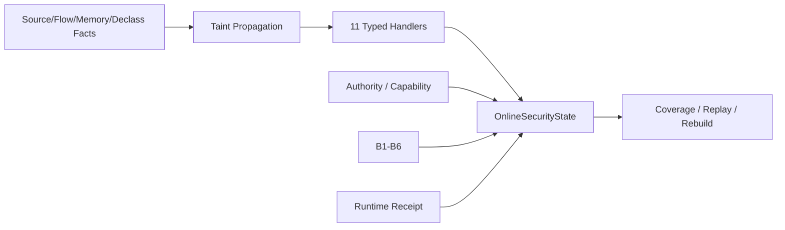
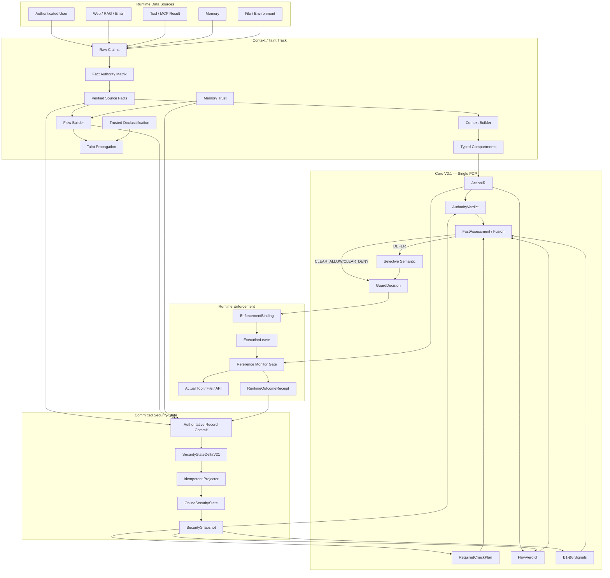

# 00 — Context Isolation / Taint Tracking 总体架构与边界冻结

> **状态**：TARGET-FROZEN Candidate  
> **基线**：`dev@f3f650a54921408d4cee3ed2a4a6b3932a040c5f`  
> **目标**：使 AgentGuard 从“单事件检测 + Runtime Gate”升级为“Authority-aware Stateful Information Flow Reference Monitor”，同时保持 Core V2.1 为唯一 PDP、RTE 为唯一执行证据边界。

# 1. 设计目标

Context/Taint Track 必须同时满足：

1. **可解释来源**：每个关键上下文/数据对象能回答“来自哪里”。
2. **跨事件传播**：Web/RAG/Tool Result/Memory 等数据进入后续模型或动作时保留 taint/provenance。
3. **跨 Session 持久性**：Memory Poisoning 不能因 session/进程重启而洗白。
4. **低误报**：`UNTRUSTED` 不等于 malicious，不自动 deny。
5. **实时性**：判定热路径只使用 bounded state / bounded lookup / deterministic rules。
6. **与 Authority 解耦**：数据可以影响模型，但不能凭内容创建 Capability/Approval。
7. **执行闭环**：最终安全效果由 RTE/Receipt 验证，而不是由 Decision 推断。
8. **兼容 V2.1**：复用已冻结 Fact、Delta、State、Snapshot、Fusion contract。
9. **可渐进上线**：Shadow → Limited Enable → Active。
10. **可科学评测**：Detection / Decision / Approval / Runtime / Utility 分开统计。

# 2. 非目标

本方案不是：

- 形式化证明的全功能 IFC；
- token-by-token taint engine；
- LLM hidden-state/attention 级因果分析；
- 靠 Prompt tag 防住所有 injection；
- 替代 Core V2.1；
- 替代 RTE；
- 新建一套与 `SecurityStateDeltaV21` 冲突的状态系统。

# 3. 当前能力与关键缺口

## 3.1 CURRENT 已具备



核心类型：

```text
SourceFact
FlowFact
MemoryFact
DeclassificationFact
StickyTaintSummary
CapabilityGrant
GrantConsumption
ExecutionLease
RecentActionFact
RuntimeOutcomeFact
BehaviorAggregate
```

## 3.2 CURRENT 生产断点

```mermaid
flowchart LR
    RT[Runtime / GuardEvent]
    FP[Verified Fact Producer]
    DELTA[SecurityStateDeltaV21]
    STATE[OnlineSecurityState]
    SNAP[SecuritySnapshot]
    FUSION[V2 Fusion]
    DEC[GuardDecision]
    RTE[RTE]

    RT -. missing .-> FP
    FP -. missing .-> DELTA
    DELTA --> STATE
    STATE --> SNAP
    SNAP -. not production wired .-> FUSION
    FUSION -. not production wired .-> DEC
    DEC --> RTE
```



准确口径：

> **V2.1 Provenance/Taint/Authority/Behavior state 已实现并可投影，但尚未进入 production GuardDecision 主链。**

同时不能说“当前攻击防护为零”，因为 legacy detectors、OpenClaw input gate 和 RTE 已提供实际保护。

# 4. 威胁模型

## 4.1 攻击者可控制

- Web 页面、搜索结果、RAG 文档；
- Email；
- MCP/tool result；
- 外部文件内容；
- 非 owner/user 输入；
- 被污染的历史 Memory；
- tool result/description 中的 instruction-like content。

攻击目标：

```text
Untrusted Data
→ 被模型解释为 Instruction / Authority
→ 形成高风险 Tool Intent
→ 产生真实 Side Effect
```

## 4.2 Authority Root

以下内容**不能因内容本身**产生 side-effect Authority：

```text
Web / Email / RAG
Tool Result / MCP Result
Memory Content
LLM Output
Semantic Judge Output
Adapter 自报 metadata
```

可产生 Authority 的根必须来自：

```text
Server-side policy
Authenticated Task Ingress
Authenticated Human Approval
Explicit trusted-runtime identity grant
```

注意：

> `FactAuthority.authoritative` 描述“事实记录可信度”，不等于该数据拥有 side-effect authorization。

# 5. Authority–Taint Dual Plane

## Data / Influence Plane

回答：

```text
数据从哪里来？
经过什么 artifact？
进入哪个 model context？
是否持久化？
是否流向 external sink？
```

## Authority Plane

回答：

```text
谁授权？
哪个 principal/agent/task/scope？
什么 action/resource/destination/argument？
是否过期/撤销/消费？
fingerprint 是否精确匹配？
```

冻结：

> **Data / Flow never creates Authority.**

# 6. 三层纵深防御

## L1 — Source-aware Logical Isolation

解决：

> “这段数据是谁？”

标记 source/trust/taint/evidence。

## L2 — Context Compartmentalization

解决：

> “这段数据在模型上下文中应扮演什么角色？”

是 soft defense。

## L3 — Authority / Capability Firewall

解决：

> “这个模型计划真的有权执行吗？”

这是 hard backstop，而不是“Context Isolation Level 3”的同义词。

# 7. 目标系统架构



# 8. Current Event 与 Historical State

禁止：

```text
收到当前 GuardEvent
→ 先写 OnlineSecurityState
→ 再判定
→ 最后 Audit
```

冻结：

```text
Current GuardEvent
→ Verified Transient Facts
→ Current Decision
→ authoritative commit
→ Projector
→ OnlineSecurityState
→ next event Snapshot
```

当前事实可参与当前判定，但 pre-commit 不能伪装成历史事实。

# 9. Integration Gate

## Gate A — Context/Taint → Core

必须证明：

```text
Real Runtime Event
→ Verified SourceFact/FlowFact
→ SecurityStateDeltaV21
→ Projector
→ Snapshot
→ FlowVerdict / Behavior
→ V2 Shadow Fusion
```

## Gate B — Core → RTE

必须证明：

```text
GuardDecision
→ EnforcementBinding
→ ExecutionLease（如需要）
→ Runtime Gate
→ RuntimeOutcomeReceipt
```

强验收：

```text
decision=deny
receipt.status=not_invoked
actual mock invocation count=0
```

# 10. 三轨职责

| Track | 核心问题 | 不负责 |
|---|---|---|
| Context/Taint | 系统知道什么、从哪来、流到哪 | final decision |
| Core V2.1 | 应该 ALLOW/ASK/DENY 什么 | 真实执行 |
| RTE | Runtime 实际发生什么 | 重做风险判断 |

# 11. 安全不变量

1. Data / Flow Never Creates Authority.
2. LLM Is Not Sanitizer.
3. ALLOW ≠ TRUST.
4. Decision ≠ Execution.
5. Missing Required Fact ≠ Safe.
6. Taint Monotonicity.
7. Claim Cannot Elevate Trust.
8. Commit Before Historical State.
9. Current Facts Are Transient.
10. B1-B6 Signal-only.
11. Context Compartment Is Soft Boundary.
12. One PDP.

# 12. 完成定义

只有全部成立才可对外称“已具备 Context Isolation / Stateful Taint Tracking 防护闭环”：

- Runtime 真实事件生成 Verified Fact；
- Fact 进入 committed state；
- Snapshot 真进入 V2 Fusion；
- Taint/Flow 真影响 FastAssessment；
- Context compartment 至少一个 Reference Runtime 生效；
- Memory taint 跨 Session/重启恢复；
- Declassification 有 proof；
- DENY 有 Receipt/side-effect evidence；
- E2E attack set 跑通；
- benign high-impact utility 已测；
- latency/coverage/truncation/receipt closure 已量化。
