# 03 — Context Isolation 与 Context Builder

> **定位**：Context Isolation 是降低模型被污染概率的纵深防御；硬安全边界仍是 Authority/Capability + RTE。

# 1. 当前成熟度

CURRENT：

- payload 已有 `ContextSource`；
- source type/trust/instruction-like/sensitive flags 已存在；
- OpenClaw `before_agent_run` 会把 tool/function messages 作为 `tool_result + untrusted` 单独评估；
- `before_prompt_build` 当前主要 observation，不应宣称已做完整 prompt rewrite。

因此：

```text
Context Detection / Input Gate           已有
Structured Context Compartmentalization  缺失
Runtime-neutral Context Builder           缺失
```

# 2. 正确边界

错误：

```text
<UNTRUSTED>...</UNTRUSTED>
→ injection solved
```

正确：

```text
Source classification
→ typed compartment
→ transformation policy
→ model reasoning
→ independent Authority enforcement
```

即使 LLM 完全被注入，Capability/RTE 仍应阻断未授权副作用。

# 3. Compartment 冻结

## `authority`

只允许：

- server-owned safety/system policy context；
- authenticated policy-derived context；
- Runtime contract 明确的 system block。

外部数据不得因写“我是 system”进入该 compartment。

## `authenticated_task`

必须从：

```text
Authoritative TaskFact
```

派生，而不是直接复制 `event.security_context.user_task`。

## `trusted_runtime_fact`

例如：

- verified runtime identity；
- structured execution metadata；
- trusted tool schema metadata。

但：

```text
trusted tool execution != trusted tool output content
```

## `untrusted_evidence`

默认：

```text
web / rag / email / tool_result / mcp / external file / external user
```

可影响推理，不能授权副作用。

## `memory_context`

携带：

```text
MemoryFact.trust_state
taints
source_refs
```

## `model_derived`

模型 summary/plan/output。

冻结：

- model-derived ≠ trusted；
- 不自动去 taint；
- 不创建 Authority。

# 4. Context Builder Pipeline

```mermaid
flowchart LR
    RAW[Raw Runtime Context]
    SRC[Source Normalize]
    VERIFY[Fact Authority Verify]
    CHUNK[ContextChunk]
    POLICY[Context Policy]
    TRANS[Transformation]
    PLAN[ContextAssemblyPlan]
    MAP[Runtime Mapper]
    MODEL[Model Input]

    RAW --> SRC --> VERIFY --> CHUNK
    CHUNK --> POLICY --> TRANS --> PLAN --> MAP --> MODEL
```



# 5. Context Policy 输出

```text
PRESERVE
ANNOTATE
REDACT
QUARANTINE
SUMMARIZE
EXCLUDE
```

Policy 输入：

```text
source_type / trust / taints / compartment
task requirement / runtime capability / model phase
```

# 6. 规则

## Web/RAG/Email

默认：

```text
compartment=untrusted_evidence
taints += UNTRUSTED
```

instruction-like：

```text
taints += EXTERNAL_INSTRUCTION
```

但不自动 DENY。

## Credential

如果无需暴露给模型：

```text
REDACT / EXCLUDE
```

如果任务需要：

```text
CREDENTIAL + SENSITIVE
```

继续追踪。

## Tool Result

默认：

```text
untrusted_evidence
```

可信的 Tool 程序不代表其返回数据可信。

## Memory

```text
clean       → memory_context
tainted     → memory_context + taints
quarantined → EXCLUDE normal context
unknown     → conservative handling
```

# 7. Transformation 与 Declassification 分离

```text
SUMMARIZE / REDACT
```

默认：

```text
taints unchanged
```

只有：

```text
trusted_declassifier + DeclassificationFact
```

才允许 removal。

# 8. Prompt Representation

## Runtime 支持 structured message/content block

优先利用原生结构。

## Runtime 只支持文本

可以：

```text
[AUTHENTICATED TASK]
...

[UNTRUSTED EVIDENCE — DATA ONLY]
...
```

并做 escaping。

但必须明确：

> **这是 soft defense，不是 security boundary。**

# 9. OpenClaw Profile

## CURRENT

`before_prompt_build`：

```text
observation only
```

`before_agent_run`：

```text
current input + untrusted tool messages
→ Guard evaluate
→ enforcing block
```

## Phase O1 — Logical Isolation

不依赖 rewrite：

```text
before_prompt_build
→ observe source/context refs
→ ContextChunk/Plan
→ facts/provenance
```

继续使用 before_agent_run 作为真实 gate。

## Phase O2 — Rewrite（Capability-gated）

只有 SDK spike 证明：

- hook 可稳定修改；
- model 实际看到修改；
- ordering 可验证；
- 不破坏 tool/result lifecycle；

才启用：

```text
ContextAssemblyPlan → runtime rewrite
```

否则：

```text
context_compartment_transform=NOT_SUPPORTED
```

# 10. LangGraph Reference Profile

LangGraph 适合作为比赛/reference profile：

- state/node 可控；
- tool boundary 清晰；
- memory read/write 可显式标记；
- context assembly 可控；
- deterministic E2E 更容易。

建议：

```text
LangGraph = Reference Context/Taint Runtime
OpenClaw = Third-party Runtime Profile
```

# 11. ContextChunk 不进长期热状态

长期状态只保存：

```text
SourceFact
bounded FlowFact
MemoryFact
StickyTaintSummary
Evidence/Audit
```

ContextChunk 是 ephemeral，避免 OnlineState 被 prompt chunks 淹没。

# 12. Failure

若无法证明哪些 source 实际进入模型：

```text
source/dataflow coverage → partial/unknown
```

高影响动作若该域 required：

```text
CLEAR_ALLOW forbidden
```

# 13. E2E

## CI-01 Benign Web

```text
summarize benign page
```

不应因 UNTRUSTED 阻断。

## CI-02 Injection Web

恶意网页影响模型，后续 side effect 仍走 Core Authority/Fusion/RTE。

## CI-03 Benign Instruction-like Quote

网页讨论：

```text
"prompt injection often says ignore previous instructions"
```

作为 benign-hard，防 `EXTERNAL_INSTRUCTION → hard deny` 误报。

# 14. DoD

- [ ] 每个 source 有 stable ref；
- [ ] 至少一个 Reference Runtime 真分 compartment；
- [ ] untrusted 不进入 authority compartment；
- [ ] task 从 TaskFact 派生；
- [ ] tool result 默认 untrusted；
- [ ] model summary 保留 taint；
- [ ] quarantine 不进入 model input；
- [ ] unsupported rewrite 准确降级；
- [ ] Builder failure 能降 Coverage；
- [ ] Builder 不产生 CapabilityGrant。
