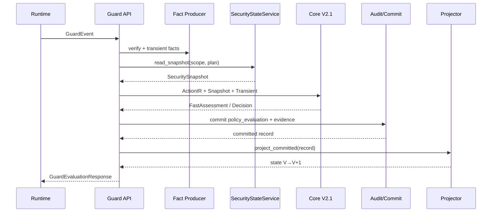

# 05 — Context/Taint 与 Core V2.1 Fusion 接线

> **边界**：Context/Taint 不拥有最终决策。  
> **唯一 PDP**：Core V2.1 Fusion。  
> **机器真值优先**：现有 `fusion_matrix.yaml` 与冻结 Fusion 契约。

# 1. 当前生产现状

CURRENT production：

```python
decision = core_evaluate(event, bundle)
```

`SecurityStateService` 尚未进入 evaluation/main/router。

因此：

> Context/Taint 的生产价值只有在 V21-08/V2 Fusion 真正消费 Snapshot 后才成立。

# 2. Fusion 输入

复用冻结输入：

```text
ActionIR
RequiredCheckPlan
PolicyViolation[]
SecuritySignal[]
EvaluationDegradation[]
AuthorityVerdict
FlowVerdict
CoverageMap
Behavior findings
SemanticJudgment?
```

Context/Taint 提供：

```text
Source/Flow/Memory facts
FlowVerdict basis
Behavior evidence
Coverage/degradation
EvidenceRefs
```

# 3. Current Event Overlay

当前事件不能先写历史 state，所以逻辑输入为：

```text
Historical SecuritySnapshot
+
TransientSecurityFacts
+
Current ActionIR
```

推荐接口：

```python
assess_v21(
    *,
    event,
    action_ir,
    snapshot,
    transient_facts,
    policy_snapshot,
) -> FastAssessment
```

不需要修改 `SecuritySnapshot` schema。

# 4. RequiredCheckPlan

继续服从 Core 冻结基线。

## External send/API

```text
task
capability
source
dataflow
```

## Credential/sensitive external

```text
task
capability
source
dataflow
behavior
```

## Memory persistence

```text
task
capability
source
memory
```

## Memory retrieval influencing action

```text
task
source
memory
behavior
```

Context Track 不自行改 required domains。

# 5. Authority 语义：不要把“无 Grant”一律 hard deny

错误：

```text
no grant
→ unauthorized
→ DENY
```

与现有 V2.1 契约冲突。

## `unauthorized`

只有事实完整且明确不允许，例如：

- exact grant scope mismatch；
- revoked/expired grant；
- human allow_once fingerprint mismatch；
- explicit forbidden destination。

## `unknown`

例如：

- no grant 但可通过 human approval 获权；
- resource unresolved；
- capability coverage partial/stale/unknown。

通常：

```text
DEFER
```

而不是自动 malicious/hard deny。

# 6. FlowVerdict

已有模型：

```python
class FlowVerdict:
    status: safe | violation | uncertain | not_applicable
    strongest_strength: exact | strong | possible | None
    taints: list[TaintLabel]
    external_sink: bool
    path_refs: list[str]
    evidence_refs: list[EvidenceRef]
```

建议实现纯函数：

```text
packages/.../security_context/flow_verdict.py
```

# 7. FlowVerdict Algorithm

输入：

```text
snapshot flows
transient flows
sticky taint
memory facts
action destinations/data_refs
bounded relevant lookup
```

步骤：

1. 找当前 action/data/destination refs；
2. 以当前 action/sink 为 target 做 bounded relevant lookup；
3. 截断则 dataflow coverage partial/unknown；
4. 找 source-to-sink paths；
5. 每条路径 union taints；
6. 计算 PathStrength=weakest edge；
7. 判 external sink；
8. 生成 FlowVerdict；
9. 保留 path/evidence refs。

# 8. Source-to-Sink Frozen Rules

必须服从 `fusion_matrix.yaml`。

## Credential

```text
CREDENTIAL + exact + unauthorized + external → CLEAR_DENY
CREDENTIAL + strong + unauthorized + external → CLEAR_DENY
CREDENTIAL + possible + external → DEFER
CREDENTIAL + exact/strong + authorized → continue policy/task checks
```

不能“有 credential taint 就永远 deny”。

## Sensitive

```text
SENSITIVE + exact + unauthorized + external → CLEAR_DENY
SENSITIVE + strong + unauthorized + external → DEFER
SENSITIVE + possible + external → DEFER
```

除非 hard policy 更严格。

# 9. Untrusted Influence

```text
exact/strong + hostile evidence + explicit mismatch + high/critical
→ CLEAR_DENY
```

```text
exact/strong + authority unknown + high/critical
→ DEFER
```

```text
possible + high/critical
→ DEFER
```

authorized 时继续 policy/dataflow，不因 untrusted 自动 deny。

# 10. Memory Fusion

```text
PERSISTENT_UNTRUSTED
+ exact/strong retrieval
+ unauthorized
+ high/critical
→ CLEAR_DENY
```

authority unknown：

```text
DEFER
```

possible memory influence：

```text
DEFER
```

# 11. B1-B6

CURRENT matcher 明确：

```text
signal-only-no-standalone-deny
```

因此 `B2 hit` 不能直接 DENY。

B1-B5 只有：

```text
confidence=high
+ authority=unauthorized
+ impact=high/critical
+ corroborating flow
```

才可 `CLEAR_DENY`。

其他：

```text
DEFER
```

B6 默认 anomaly/defer。

# 12. Coverage

任何 Required domain：

```text
partial / stale / unknown
```

导致：

```text
CLEAR_ALLOW forbidden
```

一般 DEFER，除非更早 invariant/hard policy 已 CLEAR_DENY。

# 13. CLEAR_ALLOW Proof

必须全部成立：

```text
no system invariant violation
no hard deny / hard ask
all required domains complete/not_applicable
authority authorized/not_required
flow safe/not_applicable
no required degradation
no policy-required human review
no unresolved high-confidence behavior chain
no required semantic ambiguity
all security digests valid
```

否则不能 CLEAR_ALLOW。

# 14. Semantic Router

只允许：

```text
FastAssessment=DEFER
hard_deny=false
semantic_resolvable=true
required_facts_available=true
```

进入 Security Judge。

Semantic 可处理：

- task/action alignment；
- instruction-vs-data ambiguity；
- benign high-impact vs abuse。

不能处理：

- missing facts；
- dirty state；
- unresolved resource；
- exact credential egress；
- hard policy；
- digest conflict。

# 15. Semantic 权限边界

Stage 1：

```text
Shadow
```

Stage 2：

允许高质量：

```text
DEFER + misaligned → DENY
```

禁止：

```text
DEFER → ALLOW
ASK → ALLOW
DENY → ALLOW
```

LLM 不产生 consumable allow_once grant。

# 16. Production Wiring



冻结：

- authoritative commit 早于历史 state mutation；
- projection failure 必须 dirty/degrade；
- 后续 required domain 不得 silent allow。

# 17. Shadow → Limited → Active

## Stage 0 — Offline

V2 deterministic only。

## Stage 1 — Shadow

同请求：

```text
legacy decision
V2 shadow assessment
```

返回 legacy，记录 divergence。

## Stage 2 — Limited Enable

只启用最确定组合：

- system invariant；
- hard policy；
- exact credential egress；
- explicit scope/fingerprint mismatch。

## Stage 3 — Active

V2 authoritative，legacy 仅 regression/diagnostic。

# 18. Divergence Categories

建议：

```text
legacy_allow_v2_deny
legacy_allow_v2_defer
legacy_ask_v2_allow
legacy_deny_v2_allow
coverage_only
authority_only
flow_only
behavior_only
semantic_only
normalization_difference
```

# 19. DoD

- [ ] SecurityStateService 接 production evaluation；
- [ ] V2 assessment 必须有真实 Snapshot；
- [ ] transient current facts 真参与 current assessment；
- [ ] FlowVerdict pure function；
- [ ] Fusion 与 machine matrix parity；
- [ ] no grant 不错误强制 unauthorized；
- [ ] B1-B6 signal-only；
- [ ] coverage 缺失不得 CLEAR_ALLOW；
- [ ] Semantic 不修 missing facts；
- [ ] DecisionEvidenceV21 入 audit；
- [ ] Shadow divergence 可统计；
- [ ] Limited Enable 可 rollback；
- [ ] 不存在第二 Context/Taint decision engine。
