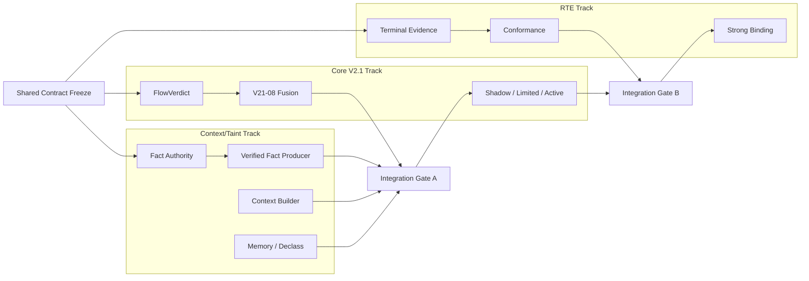

# 08 — 实施拆 PR 与三轨并行计划

> **目标**：Context/Taint、Core V2.1、RTE 并行，不相互等待；共享契约先冻结，通过两个 Integration Gate 汇合。

# 1. 三轨并行



# 2. Ownership

## Context/Taint Track

负责：

```text
Fact Authority Matrix
Verified Source/Fact generation
event→fact mapping
ContextChunk / ContextBuilder
taint/provenance integration
MemoryGuard↔MemoryFact bridge
declassification evidence
```

不负责：

```text
final GuardDecision
```

## Core V2.1 Track

负责：

```text
RequiredCheckPlan
FlowVerdict
AuthorityVerdict consumption
B1-B6 consumption
FastAssessment
Fusion
Semantic Router
DecisionEvidenceV21
GuardDecision
```

## RTE Track

负责：

```text
GateState
Runtime correlation
ExecutionLease consumption
actual invocation
terminal outcome
RuntimeOutcomeReceipt
conformance
```

# 3. CT-PR-00 — Contract Freeze

### Scope

只改：

- 本设计包；
- machine freeze YAML；
- contract tests。

不改变 production behavior。

### Freeze

- 12 条 invariant；
- Fact Authority Matrix；
- artifact refs；
- ContextChunk；
- TransientSecurityFacts；
- path-strength；
- declass policy；
- ownership；
- rollout mode。

### DoD

- 与 Core V2.1 frozen contract 无冲突；
- 与 RTE v1 无冲突；
- CURRENT/TARGET 标注清楚；
- machine contract 可 CI 校验。

# 4. CT-PR-01 — Fact Authority Matrix

### 新增建议

```text
apps/guard-api/guard_api/security_state/fact_authority.py
```

### 功能

- authenticate producer；
- normalize source type；
- default trust；
- risk-increasing claim；
- no trust laundering；
- deterministic initial taints。

### Tests

```text
web trusted claim rejected
tool result sanitized no effect
authenticated owner identity verified
model never authority issuer
memory inherits MemoryFact
```

### DoD

无 state mutation、无 final decision。

# 5. CT-PR-02 — Verified Current Fact Producer

### 新增

```text
fact_builder.py
transient.py
```

### Event Coverage

```text
context_assembled
model_input_prepared
model_output_produced
tool_result_produced
memory_write_proposed
message_send_proposed
tool_call_proposed
```

### 输出

```text
TransientSecurityFacts
```

### DoD

- deterministic；
- current facts 可进 V2 shadow；
- no DB state mutation；
- LLM possible；
- exact credential test；
- missing refs 可降 coverage。

# 6. CT-PR-03 — Committed Delta Builder / State Wiring

### 目标

```text
authoritative committed record
→ deterministic SecurityStateDeltaV21
→ SecurityStateService.project_committed()
```

### 修改建议

```text
guard_api/security_state/delta_builder.py
guard_api/services/evaluation.py
ApiContext/main wiring
```

### 要求

- Adapter never submits delta；
- commit-before-project；
- projection failure dirty；
- replay/rebuild；
- five-tuple identity；
- task 不走 delta。

### DoD

真实 production evaluate 后：

```text
state.source_index
state.relevant_flows
state.memory_index（相关事件）
```

可由真实 Runtime 记录产生，而不是仅测试夹具。

# 7. CT-PR-04 — Context Builder

### 新增

```text
context_builder.py
context policy
ContextChunk models
```

### Stage

先：

```text
logical isolation
```

再根据 Runtime capability：

```text
actual context rewrite
```

### Runtime

- LangGraph Reference；
- OpenClaw observe-first。

### DoD

- compartments；
- quarantine；
- no taint removal by summary；
- untrusted cannot enter authority compartment。

# 8. CT-PR-05 — Memory Bridge

### 连接

```text
MemoryGuardChange
↔ MemoryFact
```

### Lifecycle

对：

```text
propose / quarantine / commit / rollback
```

生成 deterministic memory_transition projection。

### DoD

- ALLOW ≠ TRUST；
- PERSISTENT_UNTRUSTED；
- restart；
- loaded_from_memory；
- rollback semantics。

# 9. CT-PR-06 — Declassification Evidence

### 新增

```text
declassification registry/service
relevant bounded lookup
snapshot injection
```

### 不做

```text
OnlineSecurityState 新增 declassification 域
```

### DoD

`SecuritySnapshot.declassifications` 对相关场景不再永久为空，并仅包含 relevant authoritative proof。

# 10. Core V21-08 — Flow/Fusion

这是 **Core Track**，不是 Context Track 自建 Fusion。

Context 提供：

```text
facts / flow paths / coverage / signals
```

Core 提供：

```text
FlowVerdict / FastAssessment / Fusion
```

必须和：

```text
docs/.../fusion_matrix.yaml
```

机器真值一致。

# 11. INT-PR-01 — Fact → Snapshot → Shadow Fusion

不要等所有 Context 能力完成。

最小 case：

```text
untrusted tool result
→ SourceFact
→ FlowFact
→ B2
→ Snapshot
→ V2 Shadow FastAssessment
```

DoD：

- production request 跑通；
- legacy response 不变；
- Audit 有 DecisionEvidenceV21 shadow；
- divergence 可查询。

# 12. RTE Track 并行

继续现有路线：

```text
SDK capability evidence
terminal outcome closure
cross-runtime conformance
strong approval binding
```

Context/Taint 不阻塞 Base RTE。

Strong Binding 等待：

```text
ActionIR production
authorization_fingerprint
ExecutionLease endpoint
```

# 13. INT-PR-02 — Decision → RTE

Case：

```text
exact credential egress
→ V2 CLEAR_DENY
→ GuardDecision=deny
→ RTE
→ not_invoked
```

DoD：

```text
mock invocation count=0
receipt linked action_id/decision_id/policy_audit_id
```

# 14. INT-PR-03 — Cross-session Memory E2E

```text
Session A
→ poison memory
→ commit

restart

Session B
→ load tainted memory
→ high-impact action
→ V2 decision
→ RTE receipt
```

这是三轨联合验收。

# 15. INT-PR-04 — Shadow → Limited Enable

必须具备：

- feature flag；
- rollback；
- divergence diagnostics；
- fixed regression；
- runtime receipt closure。

只开启 frozen deterministic hard cases。

# 16. 文件所有权建议

```text
packages/agentguard-core/
  security_context/
    facts.py                    # existing, avoid churn
    context_models.py           # only if shared model necessary
    flow_verdict.py             # Core owner
  decisions/
    fusion.py                   # Core owner

apps/guard-api/
  security_state/
    fact_authority.py           # Context
    fact_builder.py             # Context
    transient.py                # Context
    delta_builder.py            # Context/State integration
    context_builder.py          # Context
    declassification_service.py # Context
  services/
    evaluation.py               # Integration

packages/agentguard-openclaw-plugin/
  # runtime observation/transform/enforcement

packages/agentguard-langgraph-adapter/
  # Reference Runtime
```

# 17. Shared Frozen Files

以下文件原则上由 integration owner 管理，Context 分支尽量不改：

```text
signals/models.py
security_context/facts.py
security_context/delta.py
security_context/state.py
security_context/snapshot.py
decisions/evidence.py
```

# 18. Version Bump

需要 bump projector version 的情况：

- taint propagation semantic change；
- flow construction semantic change；
- capability projection；
- behavior aggregation；
- state projection/digest semantic change。

仅 ContextChunk presentation 变化：

```text
bump context builder version
```

不应无故 bump projector。

# 19. 每个 PR 模板

每 PR 必须写：

```text
Scope
Non-goals
Contract impact
Migration
Tests
Replay impact
Performance impact
Rollback
DoD
```

避免“实现 Context/Taint”式大 PR。

# 20. 推荐迭代顺序

不绑定具体日历时间，以 Gate 为准。

### Iteration A

```text
CT-PR-00
Core V21-08 preparation
RTE capability evidence
```

### B

```text
CT-PR-01
FlowVerdict
RTE conformance
```

### C

```text
CT-PR-02
Fusion implementation
RTE terminal closure
```

### D

```text
CT-PR-03
INT-PR-01
```

### E

```text
CT-PR-04
CT-PR-05
RTE strong binding
```

### F

```text
CT-PR-06
INT-PR-02
INT-PR-03
```

### G

```text
AttackBench
Limited Enable
Competition Demo
```

# 21. 回滚

必须可快速退回：

```text
v2_mode=shadow
```

回滚不能：

- 删除 authoritative facts；
- 清除 dirty state；
- 伪造 receipt。

Projector version 已提升时服从 V2.1 reprojection/rollback 纪律。

# 22. Final Implementation DoD

```text
Runtime → Verified Fact                     ✅
Fact → committed Delta → State              ✅
State → Snapshot → V2 Fusion                ✅
Context Compartment                         ✅ reference runtime
Memory cross-session                        ✅
Declassification proof                      ✅
V2 Decision → RTE                           ✅
Receipt closure                             ✅
AttackBench + benign-hard                   ✅
Shadow/Limited/Active rollout                ✅
```
