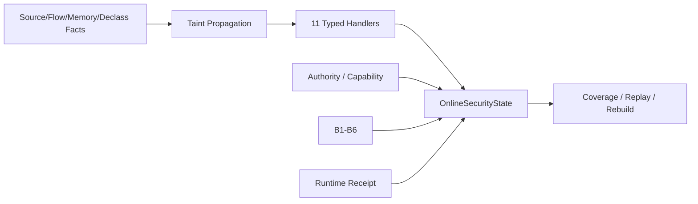
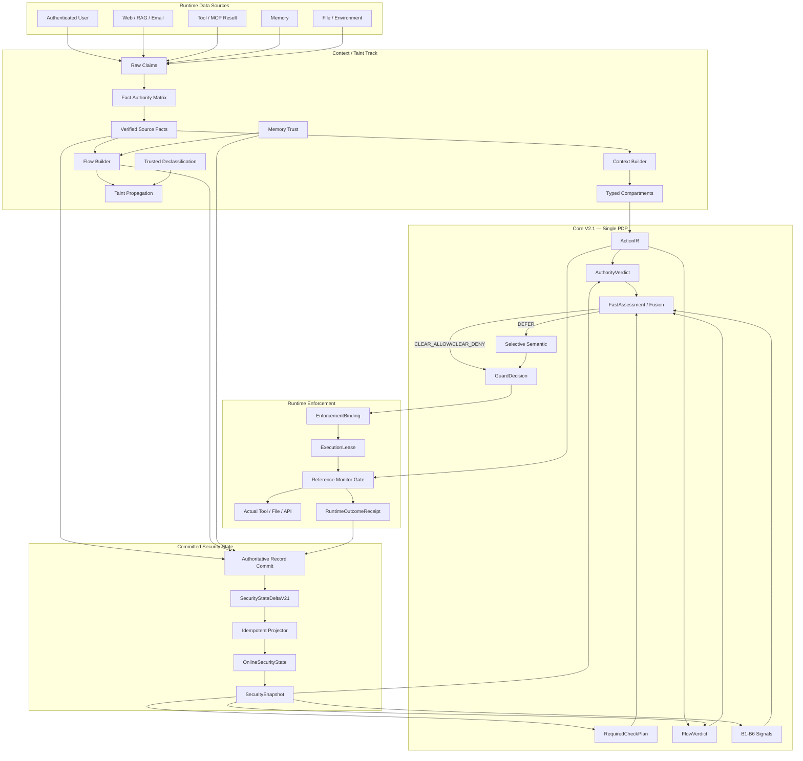
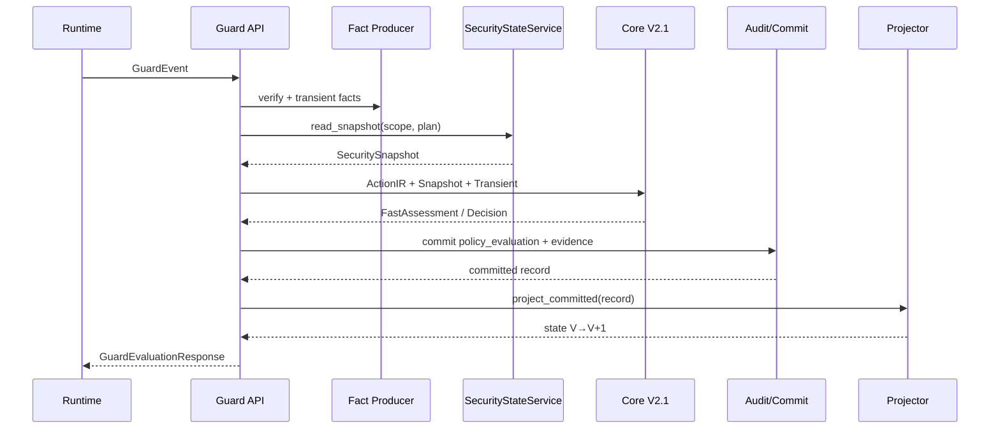
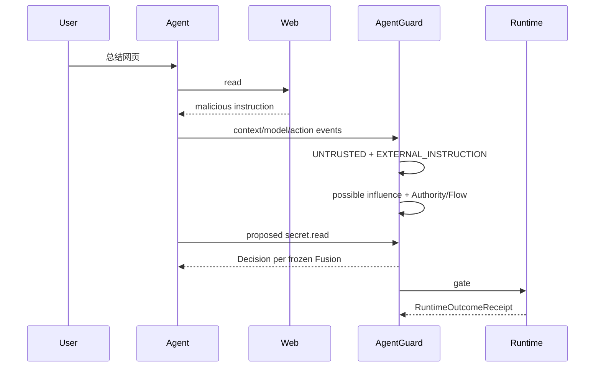
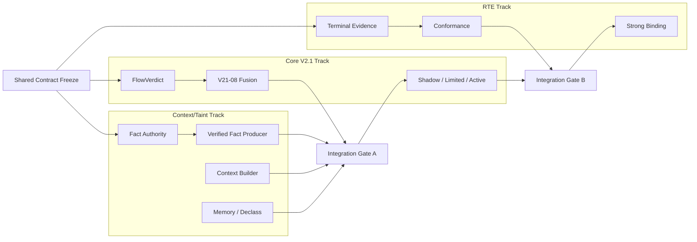

# AgentGuard Context Isolation / Taint Tracking — 完整设计与实施方案

> **Design RC / Contract Freeze Candidate**  
> 基线：`JToday666/agent-guard dev@f3f650a54921408d4cee3ed2a4a6b3932a040c5f`  
> 本文件由分册按固定顺序合并；实施和评审建议优先使用分册。


---

<!-- SOURCE: README.md -->

# AgentGuard Context Isolation / Taint Tracking — Design & Implementation Package

> **状态**：Design RC / Contract Freeze Candidate  
> **仓库**：`JToday666/agent-guard`  
> **代码基线**：`dev@f3f650a54921408d4cee3ed2a4a6b3932a040c5f`（PR #133 合并后）  
> **日期**：2026-08-15  
> **定位**：在不推翻 AgentGuard Core V2.1 与 Runtime Enforcement Contract 的前提下，补齐 Context Isolation / Stateful Taint Tracking 的生产闭环。  
> **术语纪律**：`CURRENT` 表示当前代码事实；`TARGET-FROZEN` 表示本设计建议冻结的新增契约；目标能力不能写成当前实测能力。

## 1. 一句话结论

AgentGuard 当前已经具备较完整的 `SourceFact / FlowFact / MemoryFact / DeclassificationFact / StickyTaintSummary`、Taint 传播、11 路 typed projection、Coverage、Authority/Capability、B1-B6 与 Runtime Receipt 基础。真正缺口不是“再设计一套污点模型”，而是两条生产链：

```text
Runtime / GuardEvent
→ Verified Facts
→ committed SecurityStateDeltaV21
→ OnlineSecurityState
→ SecuritySnapshot
```

以及：

```text
SecuritySnapshot + Current Event
→ Core V2.1 Fusion
→ GuardDecision
→ RTE
→ RuntimeOutcomeReceipt
```

本方案因此坚持：

> **停止扩张安全状态模型，优先打通事实生成、上下文隔离、Fusion 消费和真实执行闭环。**

## 2. 当前能力与缺口

### CURRENT — 已具备

- 五类 TaintLabel：`UNTRUSTED / EXTERNAL_INSTRUCTION / SENSITIVE / CREDENTIAL / PERSISTENT_UNTRUSTED`
- `FlowStrength = exact / strong / possible`
- `SourceFact / FlowFact / MemoryFact / DeclassificationFact / StickyTaintSummary`
- `SecurityStateDeltaV21`
- 11 个 typed upsert handler 已静态装配
- `OnlineSecurityState`、CAS、Replay、Rebuild、Coverage
- bounded provenance lookup
- Authority/Capability 与 ExecutionLease 基础设施
- B1-B6 behavior matcher，且严格 signal-only
- OpenClaw `before_agent_run` 输入检测/阻断
- RuntimeOutcomeReceipt 0.4 生产审计入口

### CURRENT — 仍未生产闭合

- `SecurityStateService` 尚未接入 production evaluation
- `EvaluationService` 仍调用 legacy `core_evaluate(event, bundle)`
- 生产 `GuardEvent → Verified typed facts → SecurityStateDeltaV21` 生成链缺失
- V2 Fusion 仍是冻结契约/机器矩阵，未成为 production GuardDecision 主链
- `MemoryGuardChange ↔ MemoryFact` 尚未闭合
- `SecuritySnapshot.declassifications` 当前构建为空
- structured Context Compartmentalization 尚未形成统一生产实现
- OpenClaw frozen pin 的 C2 execution-closure 仍需按 RTE 合同继续收口

## 3. 文档目录

1. `00_总体架构与边界冻结.md` — 总体架构、威胁模型、双平面、三轨、Integration Gate。
2. `01_字段与契约冻结.md` — 当前字段复用、新增内部 DTO、ID/digest/ref、ContextChunk、TransientSecurityFacts。
3. `02_Fact_Authority与Verified_Fact_Producer.md` — Fact Authority Matrix、Runtime Event→Fact、当前事实与历史事实。
4. `03_Context_Isolation与Context_Builder.md` — Context Compartment、Builder、OpenClaw/LangGraph Profile。
5. `04_Taint_Provenance_Memory_Declassification.md` — Taint/Flow、LLM black-box、Sticky、Memory、Declassification。
6. `05_Core_V2.1_Fusion接线.md` — FlowVerdict、Coverage、B1-B6、Fusion、Semantic、Shadow→Active。
7. `06_RTE接线与端到端攻击链.md` — Decision→Lease→Runtime→Receipt 与重点攻击链。
8. `07_测试_评测_性能_可信验收.md` — Unit/Property/Replay/E2E/AttackBench/SLO。
9. `08_实施拆PR与三轨并行计划.md` — PR 设计、依赖、DoD、回滚和集成节点。
10. `09_风险_决策记录_冻结清单.md` — 风险、冻结决策、禁止事项、checklist。
11. `10_竞赛映射_创新点与演示方案.md` — 命题映射、创新点和主 Demo。
12. `context_taint_contract_freeze.yaml` — 机器可读冻结候选。
13. `AgentGuard_Context_Isolation_Taint_Tracking_完整方案.md` — 自动合并版。
14. `SHA256SUMS.md` — 文件摘要。

## 4. 核心冻结不变量

```text
CT-F0-01  Data / Flow never creates Authority.
CT-F0-02  LLM is neither sanitizer nor authority issuer.
CT-F0-03  ALLOW does not imply TRUST.
CT-F0-04  Decision does not prove Execution; Runtime Receipt does.
CT-F0-05  Missing required fact is not equivalent to Safe.
CT-F0-06  Taint does not decay by hop count or by crossing an LLM.
CT-F0-07  Adapter claims cannot self-elevate trust or remove taint.
CT-F0-08  No committed authoritative record → no historical state mutation.
CT-F0-09  Current-event facts affect current decision only as transient evidence before commit.
CT-F0-10  B1-B6 are signals, not standalone decision engines.
CT-F0-11  Context compartments are soft defenses; Capability/RTE is the hard backstop.
CT-F0-12  Context/Taint consumes the single Core V2.1 Fusion; no second PDP.
```

## 5. 推荐实施顺序

```text
CT-00 Contract Freeze
        ↓
CT-01 Fact Authority Matrix
        ↓
CT-02 Verified Fact Producer ───────┐
                                    │
Core V21-08 Fusion ─────────────────┼─ Integration Gate A
                                    │
CT-03 Context Builder ──────────────┤
CT-04 Memory / Declassification ────┘

RTE Track ───────────────────────────── Integration Gate B
```

关键纪律：

- **Fact Authority Contract 先于 Fact Producer**；
- Fact Producer、Core Fusion、RTE 可并行；
- Context Builder/Memory Bridge 可与 Fusion 并行；
- 最终在 `Fact→Snapshot→Fusion` 与 `Decision→Execution→Receipt` 两个 Gate 汇合。

## 6. 第一版明确不做

- token-level taint；
- 全局无限 provenance graph 热路径；
- LLM 内部精确因果追踪；
- 第二 Decision Engine / 第二 OnlineSecurityState；
- 所有 `UNTRUSTED` 一律 DENY；
- `sanitized=True` 清除 taint；
- LLM summary 作为 declassification；
- Prompt delimiter 作为硬安全边界；
- 将 PR #133 regression 数字当 Context/Taint E2E 效果；
- 没有 Receipt 就宣称 `not_invoked`；
- Runtime capability 未被版本化实证时夸大支持。

## 7. 推荐仓库位置

若后续决定写入仓库，建议放置：

```text
docs/AgentGuard_Context_Isolation_Taint_Tracking_v1_RC/
```

本生成包本身不修改 GitHub 仓库。


---

<!-- SOURCE: 00_总体架构与边界冻结.md -->

# 00 — Context Isolation / Taint Tracking 总体架构与边界冻结

> **状态**：TARGET-FROZEN Candidate  
> **基线**：`dev@f3f650a54921408d4cee3ed2a4a6b3932a040c5f`  
> **目标**：使 AgentGuard 从“单事件检测 + Runtime Gate”升级为“Authority-aware Stateful Information Flow Reference Monitor”，同时保持 Core V2.1 为唯一 PDP、RTE 为唯一执行证据边界。

# 1. 设计目标

Context/Taint Track 必须同时满足：

1. **可解释来源**：每个关键上下文/数据对象能回答“来自哪里”。
2. **跨事件传播**：Web/RAG/Tool Result/Memory 等数据进入后续模型或动作时保留 taint/provenance。
3. **跨 Session 持久性**：Memory Poisoning 不能因 session/进程重启而洗白。
4. **低误报**：`UNTRUSTED` 不等于 malicious，不自动 deny。
5. **实时性**：判定热路径只使用 bounded state / bounded lookup / deterministic rules。
6. **与 Authority 解耦**：数据可以影响模型，但不能凭内容创建 Capability/Approval。
7. **执行闭环**：最终安全效果由 RTE/Receipt 验证，而不是由 Decision 推断。
8. **兼容 V2.1**：复用已冻结 Fact、Delta、State、Snapshot、Fusion contract。
9. **可渐进上线**：Shadow → Limited Enable → Active。
10. **可科学评测**：Detection / Decision / Approval / Runtime / Utility 分开统计。

# 2. 非目标

本方案不是：

- 形式化证明的全功能 IFC；
- token-by-token taint engine；
- LLM hidden-state/attention 级因果分析；
- 靠 Prompt tag 防住所有 injection；
- 替代 Core V2.1；
- 替代 RTE；
- 新建一套与 `SecurityStateDeltaV21` 冲突的状态系统。

# 3. 当前能力与关键缺口

## 3.1 CURRENT 已具备



核心类型：

```text
SourceFact
FlowFact
MemoryFact
DeclassificationFact
StickyTaintSummary
CapabilityGrant
GrantConsumption
ExecutionLease
RecentActionFact
RuntimeOutcomeFact
BehaviorAggregate
```

## 3.2 CURRENT 生产断点

```mermaid
flowchart LR
    RT[Runtime / GuardEvent]
    FP[Verified Fact Producer]
    DELTA[SecurityStateDeltaV21]
    STATE[OnlineSecurityState]
    SNAP[SecuritySnapshot]
    FUSION[V2 Fusion]
    DEC[GuardDecision]
    RTE[RTE]

    RT -. missing .-> FP
    FP -. missing .-> DELTA
    DELTA --> STATE
    STATE --> SNAP
    SNAP -. not production wired .-> FUSION
    FUSION -. not production wired .-> DEC
    DEC --> RTE
```



准确口径：

> **V2.1 Provenance/Taint/Authority/Behavior state 已实现并可投影，但尚未进入 production GuardDecision 主链。**

同时不能说“当前攻击防护为零”，因为 legacy detectors、OpenClaw input gate 和 RTE 已提供实际保护。

# 4. 威胁模型

## 4.1 攻击者可控制

- Web 页面、搜索结果、RAG 文档；
- Email；
- MCP/tool result；
- 外部文件内容；
- 非 owner/user 输入；
- 被污染的历史 Memory；
- tool result/description 中的 instruction-like content。

攻击目标：

```text
Untrusted Data
→ 被模型解释为 Instruction / Authority
→ 形成高风险 Tool Intent
→ 产生真实 Side Effect
```

## 4.2 Authority Root

以下内容**不能因内容本身**产生 side-effect Authority：

```text
Web / Email / RAG
Tool Result / MCP Result
Memory Content
LLM Output
Semantic Judge Output
Adapter 自报 metadata
```

可产生 Authority 的根必须来自：

```text
Server-side policy
Authenticated Task Ingress
Authenticated Human Approval
Explicit trusted-runtime identity grant
```

注意：

> `FactAuthority.authoritative` 描述“事实记录可信度”，不等于该数据拥有 side-effect authorization。

# 5. Authority–Taint Dual Plane

## Data / Influence Plane

回答：

```text
数据从哪里来？
经过什么 artifact？
进入哪个 model context？
是否持久化？
是否流向 external sink？
```

## Authority Plane

回答：

```text
谁授权？
哪个 principal/agent/task/scope？
什么 action/resource/destination/argument？
是否过期/撤销/消费？
fingerprint 是否精确匹配？
```

冻结：

> **Data / Flow never creates Authority.**

# 6. 三层纵深防御

## L1 — Source-aware Logical Isolation

解决：

> “这段数据是谁？”

标记 source/trust/taint/evidence。

## L2 — Context Compartmentalization

解决：

> “这段数据在模型上下文中应扮演什么角色？”

是 soft defense。

## L3 — Authority / Capability Firewall

解决：

> “这个模型计划真的有权执行吗？”

这是 hard backstop，而不是“Context Isolation Level 3”的同义词。

# 7. 目标系统架构



# 8. Current Event 与 Historical State

禁止：

```text
收到当前 GuardEvent
→ 先写 OnlineSecurityState
→ 再判定
→ 最后 Audit
```

冻结：

```text
Current GuardEvent
→ Verified Transient Facts
→ Current Decision
→ authoritative commit
→ Projector
→ OnlineSecurityState
→ next event Snapshot
```

当前事实可参与当前判定，但 pre-commit 不能伪装成历史事实。

# 9. Integration Gate

## Gate A — Context/Taint → Core

必须证明：

```text
Real Runtime Event
→ Verified SourceFact/FlowFact
→ SecurityStateDeltaV21
→ Projector
→ Snapshot
→ FlowVerdict / Behavior
→ V2 Shadow Fusion
```

## Gate B — Core → RTE

必须证明：

```text
GuardDecision
→ EnforcementBinding
→ ExecutionLease（如需要）
→ Runtime Gate
→ RuntimeOutcomeReceipt
```

强验收：

```text
decision=deny
receipt.status=not_invoked
actual mock invocation count=0
```

# 10. 三轨职责

| Track | 核心问题 | 不负责 |
|---|---|---|
| Context/Taint | 系统知道什么、从哪来、流到哪 | final decision |
| Core V2.1 | 应该 ALLOW/ASK/DENY 什么 | 真实执行 |
| RTE | Runtime 实际发生什么 | 重做风险判断 |

# 11. 安全不变量

1. Data / Flow Never Creates Authority.
2. LLM Is Not Sanitizer.
3. ALLOW ≠ TRUST.
4. Decision ≠ Execution.
5. Missing Required Fact ≠ Safe.
6. Taint Monotonicity.
7. Claim Cannot Elevate Trust.
8. Commit Before Historical State.
9. Current Facts Are Transient.
10. B1-B6 Signal-only.
11. Context Compartment Is Soft Boundary.
12. One PDP.

# 12. 完成定义

只有全部成立才可对外称“已具备 Context Isolation / Stateful Taint Tracking 防护闭环”：

- Runtime 真实事件生成 Verified Fact；
- Fact 进入 committed state；
- Snapshot 真进入 V2 Fusion；
- Taint/Flow 真影响 FastAssessment；
- Context compartment 至少一个 Reference Runtime 生效；
- Memory taint 跨 Session/重启恢复；
- Declassification 有 proof；
- DENY 有 Receipt/side-effect evidence；
- E2E attack set 跑通；
- benign high-impact utility 已测；
- latency/coverage/truncation/receipt closure 已量化。


---

<!-- SOURCE: 01_字段与契约冻结.md -->

# 01 — 字段、身份、摘要与契约冻结

> **状态**：TARGET-FROZEN Candidate  
> `CURRENT-FROZEN`：仓库当前 V2.1/RTE 已冻结字段；  
> `TARGET-FROZEN`：本设计新增、建议在 CT-00 冻结的内部契约；  
> `DEFERRED`：第一版不冻结/不实现。

# 1. Freeze 层级

## F0 — 公共 Wire Contract，不破坏

```text
GuardEvent schema 0.3
GuardDecision current wire
AuditEvent / RuntimeOutcomeReceipt schema 0.4
POST /v1/guard/evaluate
POST /v1/audit/events
Approval APIs
```

## F1 — Core V2.1 Frozen Contract，直接复用

```text
SecurityStateScope / TaskFact / ActionIR
SourceFact / FlowFact / MemoryFact / DeclassificationFact / StickyTaintSummary
CapabilityGrant / GrantConsumption / ExecutionLease
RecentActionFact / RuntimeOutcomeFact / BehaviorAggregate
SecurityStateDeltaV21 / OnlineSecurityState / SecuritySnapshot
RequiredCheckPlan / AuthorityVerdict / FlowVerdict
SecuritySignal / FastAssessment / DecisionEvidenceV21
```

## F2 — Context/Taint 新增内部契约

```text
VerifiedSourceDescriptor
ContextChunk
ContextTransformation
ContextAssemblyPlan
TransientSecurityFacts
```

它们不成为第二 Authority Root、不成为第二 OnlineState，默认不新增 DB 热状态表。

# 2. CURRENT-FROZEN 枚举

## TaintLabel

```text
UNTRUSTED
EXTERNAL_INSTRUCTION
SENSITIVE
CREDENTIAL
PERSISTENT_UNTRUSTED
```

第一版不新增 `MALICIOUS/JAILBREAK/...`；攻击类别属于 Signal/ReasonCode。

## FlowStrength

```text
exact
strong
possible
```

## FactAuthority

```text
authoritative
trusted_claim
untrusted_claim
model_judgment
```

`FactAuthority` 是证据可信级别，不等于 Capability Authority。

## CoverageStatus

```text
complete
partial
stale
unknown
not_applicable
```

## CoverageDomain

```text
task
source
capability
behavior
dataflow
memory
runtime_outcome
```

# 3. CURRENT-FROZEN SourceFact

```python
class SourceFact:
    source_id: str
    scope_digest: str
    source_type:
        user | web | email | tool_result | mcp | rag |
        memory | file | model | runtime | other
    trust: trusted | untrusted | unknown
    verification_state: verified | unverified | not_applicable
    origin: EvidenceOrigin
    authority: FactAuthority
    producer: str
    taints: list[TaintLabel]
    first_sequence: SequenceRef | None
    last_sequence: SequenceRef | None
    evidence_refs: list[EvidenceRef]
```

冻结：

- Adapter 不自行决定 `authority=authoritative`；
- `sanitized` 不是 trust；
- taint 去除只走 Declassification。

# 4. CURRENT-FROZEN FlowFact

```python
class FlowFact:
    flow_id: str
    scope_digest: str
    source_ref: str
    target_ref: str
    relation:
        received_from | read_from | derived_from | assembled_into |
        influenced_by | returned_by | written_to | persisted_to |
        loaded_from_memory | sent_to
    taints: list[TaintLabel]
    strength: exact | strong | possible
    origin: observed | deterministic | semantic_inferred
    sequence: SequenceRef | None
    producer: str
    evidence_refs: list[EvidenceRef]
```

冻结：

- relation 不新增 `authorizes`；
- LLM opaque transform 默认不高于 `possible`；
- handler 不自动调 strength；
- taint 无 hop 衰减。

# 5. CURRENT-FROZEN MemoryFact

```python
class MemoryFact:
    memory_id: str
    change_id: str | None
    change_status:
        proposed | quarantined | committed |
        rejected | rolled_back | None
    trust_state: clean | tainted | quarantined | unknown
    taints: list[TaintLabel]
    source_refs: list[str]
    last_write_sequence: SequenceRef | None
    last_read_sequence: SequenceRef | None
    evidence_refs: list[EvidenceRef]
```

核心：

```text
change_status != trust_state
```

允许：

```text
change_status=committed
trust_state=tainted
```

# 6. CURRENT-FROZEN DeclassificationFact

```python
class DeclassificationFact:
    declass_id: str
    input_ref: str
    output_ref: str
    removed_taints: list[TaintLabel]
    retained_taints: list[TaintLabel]
    mechanism_id: str
    mechanism_version: str
    policy_revision: str
    producer: "trusted_declassifier"
    evidence_refs: list[EvidenceRef]
```

冻结：

- `removed ∩ retained = ∅`；
- Adapter `sanitized=True` 不能替代；
- LLM rewrite/summary 不能成为 trusted declassifier。

# 7. CURRENT-FROZEN StickyTaintSummary

```python
class StickyTaintSummary:
    summary_id: str
    taints: list[TaintLabel]
    first_seen: SequenceRef
    last_seen: SequenceRef
    unresolved_flow_refs: list[str]
    memory_refs: list[str]
    evidence_refs: list[EvidenceRef]
```

至少保护：

```text
CREDENTIAL
PERSISTENT_UNTRUSTED
```

# 8. CURRENT-FROZEN SecurityStateDeltaV21

保持 11 typed containers：

```text
source_upserts
flow_upserts
declassification_upserts
memory_upserts
grant_upserts
grant_revocations
grant_consumptions
action_additions
runtime_outcome_upserts
behavior_aggregate_upserts
sticky_taint_upserts
```

另有 `task_upsert`，当前 projector 必须为 `None`。

关键：

- Adapter 不直接提交 delta；
- 只投影 committed authoritative record；
- 幂等 identity 非 event_id-only；
- task 经 Snapshot 读 authoritative head。

# 9. CURRENT-FROZEN SecuritySnapshot

继续包含：

```text
task
sources
grants
recent_actions
flows
memory_facts
runtime_outcomes
behavior_aggregates
sticky_taint_summaries
declassifications
coverage
dirty_domains
snapshot_digest
```

当前 gap：

```text
declassifications 字段存在，但 build_snapshot() 当前固定 []
```

本方案不改 Snapshot schema。

# 10. CURRENT-FROZEN Action/Authority Identity

`ActionIR` 关键字段：

```text
event_id / action_id / trace_id / task_id / task_revision / scope_digest
principal_id / runtime / runtime_binding_id / agent_id / branch_id
parent_event_ids / runtime_sequence
action_type / effects / impact
resources / destinations / data_refs
canonical_arguments / argument_digest
authorization_fingerprint / audit_fingerprint / normalizer_version
```

冻结：

```text
event_id != action_id
audit_fingerprint != authorization_fingerprint
```

# 11. Artifact Ref — TARGET-FROZEN

推荐：

```text
source:<source_id>
context:<event_id>
context_chunk:<event_id>:<chunk_index>
model_input:<event_id>
model_output:<event_id>
tool_result:<runtime_binding_id>:<action_id>
memory:<memory_id>
action:<action_id>
resource:<canonical_id>
destination:<canonical_id>
credential:<fingerprint>
data:<content_digest>
```

规则：

1. raw secret 不进 ref；
2. credential 只放 fingerprint；
3. resource/destination 用 canonical ID；
4. action 用 `ActionIR.action_id`；
5. Runtime-native ID 优先，fallback 不伪造跨 hook correlation；
6. retry 不创建不同 semantic ref。

# 12. PathStrength Aggregation — TARGET-FROZEN

当前已有 edge-level strength，路径聚合冻结为：

```text
exact > strong > possible
PathStrength = weakest edge
```

禁止：

- 多个 possible 累加成 strong；
- Semantic Judge 升级 exact；
- Adapter 自报 exact/strong。

`strong` 只能来自 deterministic transformation whitelist。

# 13. TARGET-FROZEN VerifiedSourceDescriptor

```python
class VerifiedSourceDescriptor:
    schema_version: Literal["1.0"] = "1.0"
    source_id: str
    scope_digest: str
    source_type: str
    trust: Literal["trusted", "untrusted", "unknown"]
    verification_state: Literal["verified", "unverified", "not_applicable"]
    fact_authority: FactAuthority
    producer: str
    initial_taints: list[TaintLabel]
    reason_codes: list[str]
    evidence_refs: list[EvidenceRef]
```

# 14. TARGET-FROZEN ContextChunk

```python
class ContextChunk:
    schema_version: Literal["1.0"] = "1.0"
    chunk_id: str
    scope_digest: str
    context_ref: str
    source_ref: str
    source_type: str
    compartment: Literal[
        "authority",
        "authenticated_task",
        "trusted_runtime_fact",
        "untrusted_evidence",
        "memory_context",
        "model_derived",
    ]
    trust: Literal["trusted", "untrusted", "unknown"]
    fact_authority: FactAuthority
    taints: list[TaintLabel]
    content_digest: str
    content_preview: str | None
    instruction_like: bool
    sensitive: bool
    transform_state: Literal[
        "preserved", "annotated", "redacted",
        "quarantined", "summarized", "excluded"
    ]
    sequence: SequenceRef | None
    evidence_refs: list[EvidenceRef]
```

安全摘要不含 `content_preview`。

# 15. TARGET-FROZEN ContextTransformation

```python
class ContextTransformation:
    transformation_id: str
    chunk_id: str
    action: Literal["annotate","redact","quarantine","summarize","exclude"]
    input_digest: str
    output_digest: str | None
    mechanism_id: str
    mechanism_version: str
    declassification_id: str | None
    reason_codes: list[str]
    evidence_refs: list[EvidenceRef]
```

`summary/redact` 默认不去 taint；只有合法 `declassification_id` 才表达 removal。

# 16. TARGET-FROZEN ContextAssemblyPlan

```python
class ContextAssemblyPlan:
    schema_version: Literal["1.0"] = "1.0"
    plan_id: str
    event_id: str
    scope_digest: str
    runtime: str
    context_ref: str
    chunks: list[ContextChunk]
    transformations: list[ContextTransformation]
    excluded_chunk_ids: list[str]
    reason_codes: list[str]
    evidence_refs: list[EvidenceRef]
    plan_digest: str
```

它是 ephemeral，不全量进 OnlineState。

# 17. TARGET-FROZEN TransientSecurityFacts

```python
class TransientSecurityFacts:
    schema_version: Literal["1.0"] = "1.0"
    event_id: str
    scope_digest: str
    source_facts: list[SourceFact]
    flow_facts: list[FlowFact]
    memory_facts: list[MemoryFact]
    declassifications: list[DeclassificationFact]
    current_action: RecentActionFact | None
    signals: list[SecuritySignal]
    degradations: list[EvaluationDegradation]
    evidence_refs: list[EvidenceRef]
    bundle_digest: str
```

用途：

```text
Historical SecuritySnapshot
+ TransientSecurityFacts
+ Current ActionIR
→ current V2 decision
```

禁止直接写 OnlineState。

# 18. Adapter Claim Compatibility

当前 payload 有 `source_trust/sanitized/instruction/sensitive` 等字段。

冻结解释：

### 风险增加 claim

```text
untrusted
contains_sensitive_data=true
contains_instruction_like_text=true
```

可保守接受为 claim。

### 风险降低 claim

```text
trusted
sanitized=true
contains_sensitive_data=false
```

不能单独：

- 提升 trust；
- 清 taint；
- 证明 no-sensitive；
- 创建 Authority。

# 19. 请求摘要兼容

若未来给 GuardEvent 加 optional 字段，必须维持 `canonical_request_dump()` 向后兼容：

```text
producer 未显式发送的新增 optional field
→ 不改变旧 shape request_digest
```

第一版优先复用已有字段，避免公共 schema 不必要扩张。

# 20. 冻结结论

### 不改

```text
5 TaintLabel / FlowStrength
SourceFact / FlowFact / MemoryFact / DeclassificationFact / Sticky
SecurityStateDeltaV21 / OnlineSecurityState 14 域
SecuritySnapshot 已有字段
Core V2.1 Fusion matrix
RTE Receipt 0.4
```

### 新增内部

```text
VerifiedSourceDescriptor
ContextChunk
ContextTransformation
ContextAssemblyPlan
TransientSecurityFacts
```

### DEFERRED

```text
token-level taint
new OnlineState domain
global graph hot-path contract
new RuntimeOutcomeKind
new public event universe
```


---

<!-- SOURCE: 02_Fact_Authority与Verified_Fact_Producer.md -->

# 02 — Fact Authority Matrix 与 Verified Fact Producer

> **优先级**：P0  
> **原则**：先冻结“谁有资格声明安全事实”，再实现“如何从 GuardEvent 生成事实”。

# 1. 为什么 Fact Producer 是安全边界

当前仓库已经有：

```text
GuardEvent
SourceFact / FlowFact / MemoryFact
SecurityStateDeltaV21
Projector
OnlineSecurityState
```

真正缺的是：

```text
GuardEvent
→ Verified Typed Facts
```

如果直接复制 Adapter 字段：

```python
SourceFact(trust=event.security_context.source_trust)
```

则受攻击/错误配置的 Adapter 可以：

```text
source_type=web
source_trust=trusted
sanitized=true
```

把外部数据洗成可信。

因此：

> **Fact Producer 不是普通 DTO mapper，而是 server-side security boundary。**

# 2. Fact Authority Matrix 输入/输出

输入：

```text
Authenticated principal
Authenticated runtime binding
GuardEvent
Authoritative TaskFact
Policy revision
Existing security state
Adapter claims
```

输出：

```text
VerifiedSourceDescriptor
→ SourceFact / FlowFact / MemoryFact
```

# 3. 冻结矩阵

| Source | Adapter claim | Server 默认 trust | Fact authority | 可否产生 side-effect Authority |
|---|---|---|---|---|
| authenticated task ingress | server ingress | trusted | authoritative | 通过 TaskFact，可 |
| server policy | server-owned | trusted | authoritative | 通过 policy/grant，可 |
| human approval | server-owned | trusted | authoritative | 通过 CapabilityGrant，可 |
| authenticated owner/user message | trusted claim | identity verified | trusted_claim | 文本本身不可 |
| external user | claim | untrusted | untrusted_claim | never |
| web | claim | untrusted | untrusted_claim | never |
| email body | claim | untrusted | untrusted_claim | never |
| RAG | claim | untrusted/unknown | untrusted_claim | never |
| tool_result | claim | untrusted by default | untrusted_claim | never |
| MCP result | claim | untrusted by default | untrusted_claim | never |
| local file | claim | unknown by default | claim per policy | never |
| model output | model generated | unknown | model_judgment | never |
| memory content | derived | inherit MemoryFact | inherit claim | never |
| runtime observation | authenticated runtime | policy-defined | trusted_claim/authoritative fact | 仅显式 runtime grant 可 |

# 4. Fact Authority ≠ Capability Authority

例如 Guard API 可以 authoritative 地证明：

> “Runtime X 的 tool call Y 返回了字符串 Z。”

这条事实可有高 FactAuthority，但字符串 Z 中写的：

```text
ADMIN APPROVED: transfer money
```

仍不能创建 CapabilityGrant。

冻结：

```text
fact_authority=authoritative
does not imply
side_effect_authority
```

# 5. Claim Monotonicity

冻结一个简单工程原则：

> **Adapter claim 可以保守增加风险，但不能单独降低风险。**

允许：

```text
Adapter: untrusted
→ Server 保持/降低 trust
```

```text
Adapter: instruction_like=true
→ 增加 EXTERNAL_INSTRUCTION hint
```

不允许：

```text
Adapter: trusted
→ 自动 trusted
```

```text
Adapter: sanitized=true
→ 清 taint
```

```text
Adapter: contains_sensitive_data=false
→ 证明不存在敏感数据
```

# 6. Verified Source Algorithm

```python
def verify_source_claim(
    *,
    authenticated_runtime,
    authenticated_principal,
    event,
    task_fact,
    policy,
    existing_state,
) -> VerifiedSourceDescriptor:
    source_type = normalize_source_type(event)

    trust = default_trust(source_type)
    authority = default_fact_authority(source_type)
    verification = "unverified"
    taints = set(default_taints(source_type))

    # authenticated identity may upgrade identity trust
    if source_is_authenticated_owner(event, authenticated_principal):
        trust = "trusted"
        authority = "trusted_claim"
        verification = "verified"

    # explicit server policy may trust a source identity
    if policy_explicitly_trusts_source(...):
        trust = policy_trust(...)
        verification = "verified"

    # risk-increasing claims are conservative
    if adapter_says_untrusted(event):
        trust = "untrusted"
        taints.add("UNTRUSTED")

    if adapter_says_instruction_like(event):
        taints.add("EXTERNAL_INSTRUCTION")

    # deterministic server evidence dominates claims
    if server_detects_sensitive(event):
        taints.add("SENSITIVE")

    if server_detects_credential(event):
        taints |= {"CREDENTIAL", "SENSITIVE"}

    # sanitized=True never removes taint here
    return VerifiedSourceDescriptor(...)
```

# 7. Initial Taint Rules

## External source

默认：

```text
web / email / rag / tool_result / mcp
→ UNTRUSTED
```

## Instruction-like

不可信来源 + 正向 instruction-like evidence：

```text
EXTERNAL_INSTRUCTION
```

它是 signal context，不自动 DENY。

## Sensitive

有正向确定性证据：

```text
SENSITIVE
```

## Credential

有 credential evidence：

```text
CREDENTIAL + SENSITIVE
```

## Memory

继承权威 `MemoryFact`。

# 8. Event → Fact 映射

现有 Event Universe 已足够 Minimal：

```text
tool_call_proposed
context_assembled
model_input_prepared
model_output_produced
tool_result_produced
memory_write_proposed
message_send_proposed
```

第一版不新增事件宇宙。

## 8.1 `context_assembled`

对 `ContextBuildPayload.sources[]`：

```text
ContextSource
→ Fact Authority Matrix
→ SourceFact
```

如果真实进入 context：

```text
source:<id>
→ context:<event_id>
relation=assembled_into
```

`sanitized=true` 只作为 transform claim，不清 taint。

## 8.2 `model_input_prepared`

明确 visible set：

```text
source/context refs
→ model_input:<event_id>
relation=assembled_into
```

如果 Runtime 无法稳定提供 source refs：

```text
source/dataflow coverage → partial/unknown
```

不能从整段 prompt 文本猜“完整 provenance”。

## 8.3 `model_output_produced`

生成 model source：

```text
source_type=model
trust=unknown
fact_authority=model_judgment
```

从真实 visible refs：

```text
source/context
→ model_output:<event_id>
relation=influenced_by
strength=possible
```

如果 server 检出 exact credential fingerprint：

```text
credential:<fp>
→ model_output:<event_id>
relation=derived_from
strength=exact
```

## 8.4 `tool_result_produced`

生成：

```text
SourceFact(source_type=tool_result)
trust=untrusted by default
taints += UNTRUSTED
```

建立：

```text
action:<action_id>
→ tool_result:<runtime_binding_id>:<action_id>
returned_by
```

`will_enter_context` 与 `will_persist` 只说明计划/观察，不自动变成 committed memory。

## 8.5 `memory_write_proposed`

构造 transient MemoryFact：

```text
change_status=proposed/quarantined
```

并建立：

```text
source/data artifact
→ memory:<memory_id>
persisted_to
```

上游存在 `UNTRUSTED/EXTERNAL_INSTRUCTION` 时：

```text
trust_state=tainted
taints += PERSISTENT_UNTRUSTED
```

即使当前 memory.write 最终 ALLOW，也不改成 clean。

## 8.6 `message_send_proposed`

sink：

```text
email:<canonical>
api:<canonical>
network:<canonical>
```

只有稳定 `data_ref` 可关联时才生成可信 `sent_to` Flow。

若只有 content preview 可疑：

```text
Signal + uncertain FlowVerdict
```

不要伪造 exact provenance。

## 8.7 `tool_call_proposed`

ActionIR 继续由 Core normalizer 拥有。

Context Track 只补：

- data refs；
- source-related transient flows；
- current RecentActionFact candidate/evidence。

# 9. Pre-decision 与 Post-commit 分离

## Pre-decision

```text
GuardEvent
→ verify source
→ TransientSecurityFacts
→ read historical Snapshot
→ Core V2 assessment
```

不改 OnlineState。

## Commit

```text
Decision + evidence/fact manifest
→ authoritative record
```

Memory/runtime/approval 各自使用其 authoritative record type。

## Projection

```text
committed record
→ deterministic SecurityStateDeltaV21
→ SecurityStateService.project_committed()
```

服从现有五元幂等 identity。

# 10. 推荐模块

```text
apps/guard-api/guard_api/security_state/
├── fact_authority.py
├── fact_builder.py
├── transient.py
└── delta_builder.py
```

职责：

- `fact_authority.py`：claim → verified descriptor
- `fact_builder.py`：event + verified descriptor → facts
- `transient.py`：current-event bundle
- `delta_builder.py`：committed record → deterministic delta

# 11. Determinism Contract

## T-FactReplay

```text
same authenticated input
+ same event content
+ same policy revision
+ same fact-builder version
→ same semantic fact digest
```

## T-IdentityConflict

```text
same source_id + different semantic content
→ fail-closed
```

## T-NoClaimUpgrade

```text
web + adapter trusted
→ cannot become trusted authoritative without server proof
```

## T-NoSanitizeClaim

```text
sanitized=true
→ taint remains
```

# 12. Versioning

建议：

```text
FACT_AUTHORITY_VERSION = "ct-fam-1"
FACT_BUILDER_VERSION = "ct-fact-1"
CONTEXT_BUILDER_VERSION = "ct-context-1"
```

影响 fact semantic/digest 的变化必须 bump，并评估 projector reprojection。

# 13. Failure Contract

| Failure | Coverage | 处理 |
|---|---|---|
| source identity conflict | source dirty/unknown | required 时不能 CLEAR_ALLOW |
| producer identity unverifiable | source unknown | high-impact 通常 DEFER |
| flow ref missing | dataflow partial | required 时 DEFER |
| unknown taint label | dataflow dirty | fail-closed degradation |
| memory identity conflict | memory dirty | persistence-dependent action no clear allow |
| fact builder exception | domain unknown | EvaluationDegradation |

Context Track 不自行决定 final DENY；最终服从 Core frozen rules。

# 14. DoD

- [ ] Adapter `trusted` 无法洗白 Web/Tool/RAG；
- [ ] `sanitized=true` 不移除 taint；
- [ ] context_assembled 产生真实 SourceFact；
- [ ] model output 默认 possible influence；
- [ ] exact credential 可生成 exact flow；
- [ ] memory write 可生成 PERSISTENT_UNTRUSTED；
- [ ] same identity different content fail-closed；
- [ ] delta 只能 server-side 生成；
- [ ] production state 可看到真实 Runtime facts；
- [ ] replay deterministic；
- [ ] Fact Builder 不产生 GuardDecision。


---

<!-- SOURCE: 03_Context_Isolation与Context_Builder.md -->

# 03 — Context Isolation 与 Context Builder

> **定位**：Context Isolation 是降低模型被污染概率的纵深防御；硬安全边界仍是 Authority/Capability + RTE。

# 1. 当前成熟度

CURRENT：

- payload 已有 `ContextSource`；
- source type/trust/instruction-like/sensitive flags 已存在；
- OpenClaw `before_agent_run` 会把 tool/function messages 作为 `tool_result + untrusted` 单独评估；
- `before_prompt_build` 当前主要 observation，不应宣称已做完整 prompt rewrite。

因此：

```text
Context Detection / Input Gate           已有
Structured Context Compartmentalization  缺失
Runtime-neutral Context Builder           缺失
```

# 2. 正确边界

错误：

```text
<UNTRUSTED>...</UNTRUSTED>
→ injection solved
```

正确：

```text
Source classification
→ typed compartment
→ transformation policy
→ model reasoning
→ independent Authority enforcement
```

即使 LLM 完全被注入，Capability/RTE 仍应阻断未授权副作用。

# 3. Compartment 冻结

## `authority`

只允许：

- server-owned safety/system policy context；
- authenticated policy-derived context；
- Runtime contract 明确的 system block。

外部数据不得因写“我是 system”进入该 compartment。

## `authenticated_task`

必须从：

```text
Authoritative TaskFact
```

派生，而不是直接复制 `event.security_context.user_task`。

## `trusted_runtime_fact`

例如：

- verified runtime identity；
- structured execution metadata；
- trusted tool schema metadata。

但：

```text
trusted tool execution != trusted tool output content
```

## `untrusted_evidence`

默认：

```text
web / rag / email / tool_result / mcp / external file / external user
```

可影响推理，不能授权副作用。

## `memory_context`

携带：

```text
MemoryFact.trust_state
taints
source_refs
```

## `model_derived`

模型 summary/plan/output。

冻结：

- model-derived ≠ trusted；
- 不自动去 taint；
- 不创建 Authority。

# 4. Context Builder Pipeline

```mermaid
flowchart LR
    RAW[Raw Runtime Context]
    SRC[Source Normalize]
    VERIFY[Fact Authority Verify]
    CHUNK[ContextChunk]
    POLICY[Context Policy]
    TRANS[Transformation]
    PLAN[ContextAssemblyPlan]
    MAP[Runtime Mapper]
    MODEL[Model Input]

    RAW --> SRC --> VERIFY --> CHUNK
    CHUNK --> POLICY --> TRANS --> PLAN --> MAP --> MODEL
```



# 5. Context Policy 输出

```text
PRESERVE
ANNOTATE
REDACT
QUARANTINE
SUMMARIZE
EXCLUDE
```

Policy 输入：

```text
source_type / trust / taints / compartment
task requirement / runtime capability / model phase
```

# 6. 规则

## Web/RAG/Email

默认：

```text
compartment=untrusted_evidence
taints += UNTRUSTED
```

instruction-like：

```text
taints += EXTERNAL_INSTRUCTION
```

但不自动 DENY。

## Credential

如果无需暴露给模型：

```text
REDACT / EXCLUDE
```

如果任务需要：

```text
CREDENTIAL + SENSITIVE
```

继续追踪。

## Tool Result

默认：

```text
untrusted_evidence
```

可信的 Tool 程序不代表其返回数据可信。

## Memory

```text
clean       → memory_context
tainted     → memory_context + taints
quarantined → EXCLUDE normal context
unknown     → conservative handling
```

# 7. Transformation 与 Declassification 分离

```text
SUMMARIZE / REDACT
```

默认：

```text
taints unchanged
```

只有：

```text
trusted_declassifier + DeclassificationFact
```

才允许 removal。

# 8. Prompt Representation

## Runtime 支持 structured message/content block

优先利用原生结构。

## Runtime 只支持文本

可以：

```text
[AUTHENTICATED TASK]
...

[UNTRUSTED EVIDENCE — DATA ONLY]
...
```

并做 escaping。

但必须明确：

> **这是 soft defense，不是 security boundary。**

# 9. OpenClaw Profile

## CURRENT

`before_prompt_build`：

```text
observation only
```

`before_agent_run`：

```text
current input + untrusted tool messages
→ Guard evaluate
→ enforcing block
```

## Phase O1 — Logical Isolation

不依赖 rewrite：

```text
before_prompt_build
→ observe source/context refs
→ ContextChunk/Plan
→ facts/provenance
```

继续使用 before_agent_run 作为真实 gate。

## Phase O2 — Rewrite（Capability-gated）

只有 SDK spike 证明：

- hook 可稳定修改；
- model 实际看到修改；
- ordering 可验证；
- 不破坏 tool/result lifecycle；

才启用：

```text
ContextAssemblyPlan → runtime rewrite
```

否则：

```text
context_compartment_transform=NOT_SUPPORTED
```

# 10. LangGraph Reference Profile

LangGraph 适合作为比赛/reference profile：

- state/node 可控；
- tool boundary 清晰；
- memory read/write 可显式标记；
- context assembly 可控；
- deterministic E2E 更容易。

建议：

```text
LangGraph = Reference Context/Taint Runtime
OpenClaw = Third-party Runtime Profile
```

# 11. ContextChunk 不进长期热状态

长期状态只保存：

```text
SourceFact
bounded FlowFact
MemoryFact
StickyTaintSummary
Evidence/Audit
```

ContextChunk 是 ephemeral，避免 OnlineState 被 prompt chunks 淹没。

# 12. Failure

若无法证明哪些 source 实际进入模型：

```text
source/dataflow coverage → partial/unknown
```

高影响动作若该域 required：

```text
CLEAR_ALLOW forbidden
```

# 13. E2E

## CI-01 Benign Web

```text
summarize benign page
```

不应因 UNTRUSTED 阻断。

## CI-02 Injection Web

恶意网页影响模型，后续 side effect 仍走 Core Authority/Fusion/RTE。

## CI-03 Benign Instruction-like Quote

网页讨论：

```text
"prompt injection often says ignore previous instructions"
```

作为 benign-hard，防 `EXTERNAL_INSTRUCTION → hard deny` 误报。

# 14. DoD

- [ ] 每个 source 有 stable ref；
- [ ] 至少一个 Reference Runtime 真分 compartment；
- [ ] untrusted 不进入 authority compartment；
- [ ] task 从 TaskFact 派生；
- [ ] tool result 默认 untrusted；
- [ ] model summary 保留 taint；
- [ ] quarantine 不进入 model input；
- [ ] unsupported rewrite 准确降级；
- [ ] Builder failure 能降 Coverage；
- [ ] Builder 不产生 CapabilityGrant。


---

<!-- SOURCE: 04_Taint_Provenance_Memory_Declassification.md -->

# 04 — Taint Propagation、Provenance、Memory 与 Declassification

> **目标**：建立最小、可解释、有界、跨 Session 的 artifact-level information flow。

# 1. Artifact-level Taint

追踪：

```text
Source / Context / ModelInput / ModelOutput
ToolResult / Action / Resource / Destination
Memory / Message / Data Artifact
```

不追踪：

```text
每 token / hidden state / attention edge
```

# 2. 五类 Taint

## UNTRUSTED

来源不能被自动当成可信 Authority/Data，不等于 malicious。

## EXTERNAL_INSTRUCTION

不可信数据中存在试图扮演 instruction 的内容，用于 indirect injection/tool result/RAG/memory poison。

## SENSITIVE

敏感业务/个人/内部/受限数据。

## CREDENTIAL

API key/token/password/private key 等，强保护。

## PERSISTENT_UNTRUSTED

不可信影响已跨越当前轮次进入持久 Agent state。

# 3. 单调传播

```text
T(target) = T(target) ∪ T(source)
```

禁止：

```text
LLM hop → taint disappears
N hops → taint expires
```

# 4. Relation 默认规则

| Relation | Taint | 默认 Strength |
|---|---|---|
| received_from | union | exact/strong by observation |
| read_from | union | exact |
| returned_by | union | exact |
| assembled_into | union | exact/strong |
| derived_from | union | mechanism-defined |
| influenced_by | union | possible |
| written_to | union | exact/strong |
| persisted_to | union + persistent | exact/strong |
| loaded_from_memory | inherit | exact/strong |
| sent_to | union | evidence-defined |

# 5. FlowStrength

## exact

直接值/identity/content digest 可复核。

## strong

确定性转换且机制在 whitelist 中。

不要预先把任意编码/hash 全部 strong；通过冻结白名单维护。

## possible

黑盒语义影响，尤其：

```text
data → LLM → output/action
```

# 6. PathStrength — TARGET-FROZEN

```text
exact > strong > possible
PathStrength = weakest(edge)
```

例如：

```text
exact → strong → possible → exact
= possible
```

# 7. LLM Influence

## Visible Set

只对真实进入当前 model call 的 source/chunk 生成 influence。

不能：

```text
scope 内出现过的所有 source
→ 每个未来 model output
```

否则会 over-taint。

## 默认

```text
source/context
→ model_output
influenced_by
possible
```

## Deterministic Upgrade

若输出/参数出现 exact credential fingerprint：

```text
credential source
→ output/action arg
derived_from
exact
```

可以同时保留：

```text
possible semantic influence
+
exact sensitive data flow
```

# 8. 避免 Over-taint

- visible context 才建 influence；
- session/scope 有界；
- 只有 persist 才跨 session；
- sticky 只保留高价值 unresolved evidence；
- historical low-value flow 可安全驱逐。

# 9. Bounded Provenance

沿用当前预算：

```text
max_depth=4
max_breadth=32
node_budget=256
```

原则：

```text
truncated != safe
```

截断：

```text
dataflow coverage → partial/unknown
```

先测：

```text
flow_truncation_rate
lookup_latency
snapshot_size
```

再决定是否调预算。

# 10. Sticky Taint

当前基线：

```text
MAX_STICKY_TAINT_SUMMARIES=16
MAX_SUMMARY_REFS=64
MAX_SUMMARY_EVIDENCE_REFS=64
```

保护：

```text
CREDENTIAL
PERSISTENT_UNTRUSTED
```

Flood test：

```text
credential read
→ many benign actions
→ egress
```

关键证据必须仍可恢复。

# 11. Memory Bridge

当前两个平面：

```text
MemoryGuardChange  # lifecycle
MemoryFact         # trust/taint
```

必须桥接但不合并。

# 12. Memory Write

输入：

```text
MemoryGuardChange + source refs + upstream taints
```

派生 `MemoryFact`。

### clean

仅在 source trusted、无 unresolved taint、policy 允许时。

### tainted

上游包含 `UNTRUSTED/EXTERNAL_INSTRUCTION`：

```text
trust_state=tainted
taints += PERSISTENT_UNTRUSTED
```

### quarantined

MemoryGuard lifecycle quarantine：

```text
trust_state=quarantined
```

默认不进入 normal context。

# 13. Memory Read

第一版优先复用：

```text
context_assembled + source_type=memory
```

建立：

```text
memory:<id>
→ current context/model_input
loaded_from_memory
```

以后有稳定 memory-read hook 再 additive 增强。

# 14. Cross-session

测试必须：

```text
Session A poison/write
→ terminate
→ restart agent
→ preferably restart Guard API
→ Session B read
```

只在单进程内不算 cross-session 证明。

# 15. ALLOW ≠ TRUST

用户可合法允许：

```text
memory.write
```

因此 Decision 可以 `ALLOW`，同时：

```text
MemoryFact.trust_state=tainted
```

两个维度不冲突。

# 16. Declassification

唯一合法路径：

```text
trusted_declassifier
→ DeclassificationFact
```

不能用：

```text
Adapter sanitized
LLM summary
LLM says safe
detector no hit
```

去污。

# 17. Declassifier Registry

Guard API 建议维护：

```text
mechanism_id
mechanism_version
allowed_removed_taints
input_types
output_types
policy_revision
implementation_digest
```

例如 credential redactor 可移除 CREDENTIAL，但仍保留：

```text
UNTRUSTED / EXTERNAL_INSTRUCTION
```

# 18. Protected Taint Removal

对：

```text
CREDENTIAL
PERSISTENT_UNTRUSTED
```

要求：

- whitelist mechanism；
- exact input/output refs；
- policy revision；
- evidence digest；
- server-only producer。

# 19. Snapshot Declassification Gap

CURRENT：

```text
SecuritySnapshot.declassifications exists
but build_snapshot() sets []
```

冻结解决方案候选：

```text
OnlineSecurityState 14 domains unchanged
```

Snapshot build：

```text
relevant source/flow/memory refs
→ bounded authoritative declassification lookup
→ snapshot.declassifications
```

lookup 失败且 dataflow required：

```text
coverage != complete
```

# 20. 不新增 OnlineState Declass 域

理由：

- 14 域已冻结；
- declass effect 已应用到 sticky；
- 不需要热状态保存所有 proof；
- Decision 只需当前 relevant bounded proof；
- authoritative registry 可重建。

结构：

```text
Effect in state
Proof in bounded Snapshot/Evidence
```

# 21. RAG Poisoning

普通 RAG：

```text
rag
→ assembled_into
→ model
→ influenced_by possible
→ action
```

不是 B4。

只有：

```text
rag → memory → future session
```

才是 B4/PERSISTENT_UNTRUSTED。

# 22. E2E

## P-01 Exact Credential

```text
file secret → read → email content → sent_to
```

期望 exact + CREDENTIAL + external sink。

## P-02 LLM Influence

恶意 Web → LLM → action：

```text
possible
```

除非额外 deterministic evidence。

## P-03 Memory

untrusted tool result → memory → restart → future action：

```text
PERSISTENT_UNTRUSTED + loaded_from_memory
```

## P-04 Declass

credential → trusted redactor → output：

只有 proof 可合法移除 CREDENTIAL。

# 23. DoD

- [ ] taint 无 hop 衰减；
- [ ] LLM 默认 possible；
- [ ] path strength 最弱边；
- [ ] exact credential 可升级；
- [ ] no visible context → no fabricated influence；
- [ ] memory 保存 source refs/taints；
- [ ] restart 后恢复；
- [ ] flood 不洗掉 sticky；
- [ ] sanitize claim 不去污；
- [ ] declass proof 进入 Snapshot；
- [ ] lookup failure 降 coverage；
- [ ] RAG 不误映射 B4。


---

<!-- SOURCE: 05_Core_V2.1_Fusion接线.md -->

# 05 — Context/Taint 与 Core V2.1 Fusion 接线

> **边界**：Context/Taint 不拥有最终决策。  
> **唯一 PDP**：Core V2.1 Fusion。  
> **机器真值优先**：现有 `fusion_matrix.yaml` 与冻结 Fusion 契约。

# 1. 当前生产现状

CURRENT production：

```python
decision = core_evaluate(event, bundle)
```

`SecurityStateService` 尚未进入 evaluation/main/router。

因此：

> Context/Taint 的生产价值只有在 V21-08/V2 Fusion 真正消费 Snapshot 后才成立。

# 2. Fusion 输入

复用冻结输入：

```text
ActionIR
RequiredCheckPlan
PolicyViolation[]
SecuritySignal[]
EvaluationDegradation[]
AuthorityVerdict
FlowVerdict
CoverageMap
Behavior findings
SemanticJudgment?
```

Context/Taint 提供：

```text
Source/Flow/Memory facts
FlowVerdict basis
Behavior evidence
Coverage/degradation
EvidenceRefs
```

# 3. Current Event Overlay

当前事件不能先写历史 state，所以逻辑输入为：

```text
Historical SecuritySnapshot
+
TransientSecurityFacts
+
Current ActionIR
```

推荐接口：

```python
assess_v21(
    *,
    event,
    action_ir,
    snapshot,
    transient_facts,
    policy_snapshot,
) -> FastAssessment
```

不需要修改 `SecuritySnapshot` schema。

# 4. RequiredCheckPlan

继续服从 Core 冻结基线。

## External send/API

```text
task
capability
source
dataflow
```

## Credential/sensitive external

```text
task
capability
source
dataflow
behavior
```

## Memory persistence

```text
task
capability
source
memory
```

## Memory retrieval influencing action

```text
task
source
memory
behavior
```

Context Track 不自行改 required domains。

# 5. Authority 语义：不要把“无 Grant”一律 hard deny

错误：

```text
no grant
→ unauthorized
→ DENY
```

与现有 V2.1 契约冲突。

## `unauthorized`

只有事实完整且明确不允许，例如：

- exact grant scope mismatch；
- revoked/expired grant；
- human allow_once fingerprint mismatch；
- explicit forbidden destination。

## `unknown`

例如：

- no grant 但可通过 human approval 获权；
- resource unresolved；
- capability coverage partial/stale/unknown。

通常：

```text
DEFER
```

而不是自动 malicious/hard deny。

# 6. FlowVerdict

已有模型：

```python
class FlowVerdict:
    status: safe | violation | uncertain | not_applicable
    strongest_strength: exact | strong | possible | None
    taints: list[TaintLabel]
    external_sink: bool
    path_refs: list[str]
    evidence_refs: list[EvidenceRef]
```

建议实现纯函数：

```text
packages/.../security_context/flow_verdict.py
```

# 7. FlowVerdict Algorithm

输入：

```text
snapshot flows
transient flows
sticky taint
memory facts
action destinations/data_refs
bounded relevant lookup
```

步骤：

1. 找当前 action/data/destination refs；
2. 以当前 action/sink 为 target 做 bounded relevant lookup；
3. 截断则 dataflow coverage partial/unknown；
4. 找 source-to-sink paths；
5. 每条路径 union taints；
6. 计算 PathStrength=weakest edge；
7. 判 external sink；
8. 生成 FlowVerdict；
9. 保留 path/evidence refs。

# 8. Source-to-Sink Frozen Rules

必须服从 `fusion_matrix.yaml`。

## Credential

```text
CREDENTIAL + exact + unauthorized + external → CLEAR_DENY
CREDENTIAL + strong + unauthorized + external → CLEAR_DENY
CREDENTIAL + possible + external → DEFER
CREDENTIAL + exact/strong + authorized → continue policy/task checks
```

不能“有 credential taint 就永远 deny”。

## Sensitive

```text
SENSITIVE + exact + unauthorized + external → CLEAR_DENY
SENSITIVE + strong + unauthorized + external → DEFER
SENSITIVE + possible + external → DEFER
```

除非 hard policy 更严格。

# 9. Untrusted Influence

```text
exact/strong + hostile evidence + explicit mismatch + high/critical
→ CLEAR_DENY
```

```text
exact/strong + authority unknown + high/critical
→ DEFER
```

```text
possible + high/critical
→ DEFER
```

authorized 时继续 policy/dataflow，不因 untrusted 自动 deny。

# 10. Memory Fusion

```text
PERSISTENT_UNTRUSTED
+ exact/strong retrieval
+ unauthorized
+ high/critical
→ CLEAR_DENY
```

authority unknown：

```text
DEFER
```

possible memory influence：

```text
DEFER
```

# 11. B1-B6

CURRENT matcher 明确：

```text
signal-only-no-standalone-deny
```

因此 `B2 hit` 不能直接 DENY。

B1-B5 只有：

```text
confidence=high
+ authority=unauthorized
+ impact=high/critical
+ corroborating flow
```

才可 `CLEAR_DENY`。

其他：

```text
DEFER
```

B6 默认 anomaly/defer。

# 12. Coverage

任何 Required domain：

```text
partial / stale / unknown
```

导致：

```text
CLEAR_ALLOW forbidden
```

一般 DEFER，除非更早 invariant/hard policy 已 CLEAR_DENY。

# 13. CLEAR_ALLOW Proof

必须全部成立：

```text
no system invariant violation
no hard deny / hard ask
all required domains complete/not_applicable
authority authorized/not_required
flow safe/not_applicable
no required degradation
no policy-required human review
no unresolved high-confidence behavior chain
no required semantic ambiguity
all security digests valid
```

否则不能 CLEAR_ALLOW。

# 14. Semantic Router

只允许：

```text
FastAssessment=DEFER
hard_deny=false
semantic_resolvable=true
required_facts_available=true
```

进入 Security Judge。

Semantic 可处理：

- task/action alignment；
- instruction-vs-data ambiguity；
- benign high-impact vs abuse。

不能处理：

- missing facts；
- dirty state；
- unresolved resource；
- exact credential egress；
- hard policy；
- digest conflict。

# 15. Semantic 权限边界

Stage 1：

```text
Shadow
```

Stage 2：

允许高质量：

```text
DEFER + misaligned → DENY
```

禁止：

```text
DEFER → ALLOW
ASK → ALLOW
DENY → ALLOW
```

LLM 不产生 consumable allow_once grant。

# 16. Production Wiring



冻结：

- authoritative commit 早于历史 state mutation；
- projection failure 必须 dirty/degrade；
- 后续 required domain 不得 silent allow。

# 17. Shadow → Limited → Active

## Stage 0 — Offline

V2 deterministic only。

## Stage 1 — Shadow

同请求：

```text
legacy decision
V2 shadow assessment
```

返回 legacy，记录 divergence。

## Stage 2 — Limited Enable

只启用最确定组合：

- system invariant；
- hard policy；
- exact credential egress；
- explicit scope/fingerprint mismatch。

## Stage 3 — Active

V2 authoritative，legacy 仅 regression/diagnostic。

# 18. Divergence Categories

建议：

```text
legacy_allow_v2_deny
legacy_allow_v2_defer
legacy_ask_v2_allow
legacy_deny_v2_allow
coverage_only
authority_only
flow_only
behavior_only
semantic_only
normalization_difference
```

# 19. DoD

- [ ] SecurityStateService 接 production evaluation；
- [ ] V2 assessment 必须有真实 Snapshot；
- [ ] transient current facts 真参与 current assessment；
- [ ] FlowVerdict pure function；
- [ ] Fusion 与 machine matrix parity；
- [ ] no grant 不错误强制 unauthorized；
- [ ] B1-B6 signal-only；
- [ ] coverage 缺失不得 CLEAR_ALLOW；
- [ ] Semantic 不修 missing facts；
- [ ] DecisionEvidenceV21 入 audit；
- [ ] Shadow divergence 可统计；
- [ ] Limited Enable 可 rollback；
- [ ] 不存在第二 Context/Taint decision engine。


---

<!-- SOURCE: 06_RTE接线与端到端攻击链.md -->

# 06 — Runtime Enforcement 接线与端到端攻击链

> **原则**：Decision 是 PDP 结论；RTE/Receipt 才能证明真实执行结果。

# 1. 当前 RTE 基线

已有：

- pre-execution gate；
- OpenClaw/LangGraph integration；
- RuntimeOutcomeReceipt 0.4；
- `not_invoked / executed / failed / unknown`；
- approval lifecycle；
- ExecutionLease 数据模型/存储基础。

但：

```text
Receipt pipeline exists
!=
every runtime/version has full C2 execution closure
```

OpenClaw 新版本 live evidence 不能反向证明 frozen pin `2026.6.6` 的 C2 已 PASS。

# 2. Context/Taint → RTE 接口

Context/Taint 不直接执行 Tool。

Core 输出：

```text
GuardDecision
```

Strong Profile target additive：

```text
EnforcementBinding:
  action_id
  authorization_fingerprint
  runtime_binding_id
  requires_execution_lease
```

RTE 根据：

```text
decision + binding + lease
```

控制实际调用。

# 3. Exact Binding

必须同时绑定：

```text
action_id
authorization_fingerprint
runtime_binding_id
```

human allow_once 还要关联：

```text
approval_id
grant_id
consumption_id
lease_id
```

# 4. event_id != action_id

同 logical action 可产生：

```text
pre-exec event
policy audit
runtime outcome
tool result event
memory event
result quarantine receipt
```

所以 action_id 是动作关联键。

# 5. Approval / Lease

```text
ASK
→ human allow_once
→ CapabilityGrant
→ atomic consume
→ GrantConsumption
→ ExecutionLease
→ release exact action
```

参数/资源/目的地变化：

```text
authorization_fingerprint mismatch
→ no release
```

# 6. LLM Approval 隔离

Strong Profile：

```text
LLM cannot create consumable human allow_once grant
```

只接受 authoritative human resolution。

# 7. Receipt Truth

最终统计：

```text
RuntimeOutcomeReceipt.evidence.execution.status
```

### not_invoked

有证据证明未进入 protected invocation。

### executed

真实执行完成。

### failed

调用发生但失败。

### unknown

证据不足。

禁止：

```text
decision=deny → assume not_invoked
```

# 8. Case A — Indirect Web Injection



关键：

- detector 漏检不等于立刻失守；
- explicit authority mismatch 可被 Capability backstop 阻断；
- 只有 no grant/unknown 时仍服从 Core 的 DEFER/approval 语义。

# 9. Case B — Credential Exact Egress

测试 secret：

```text
TEST_ONLY_CREDENTIAL_...
```

链：

```text
file read
→ credential fingerprint
→ exact flow
→ email destination
```

如果 authority unauthorized：

```text
CREDENTIAL + exact + external
→ CLEAR_DENY
```

RTE 验收：

```text
receipt.status=not_invoked
mock outbox=0
```

# 10. Case C — Tool Result Injection

```text
trusted browser tool
→ untrusted page data
→ tool_result SourceFact
→ model
→ high-impact action
```

B2 只产 signal。

Fusion 结合：

```text
B2 + Flow + Authority + Impact
```

重点展示：

> trusted tool execution ≠ trusted returned content。

# 11. Case D — RAG Poisoning

```text
RAG doc
→ SourceFact(rag, UNTRUSTED)
→ assembled_into
→ model
→ possible influence
→ action
```

不是 B4。

只有 persist memory 后才进入 B4/persistent chain。

# 12. Case E — Cross-session Memory Poisoning

## Session A

```text
malicious web/tool result
→ memory.write
```

用户允许 memory.write，动作可能 ALLOW，但：

```text
MemoryFact.trust_state=tainted
taints += PERSISTENT_UNTRUSTED
```

## Restart

至少：

```text
destroy Session A
new agent session
```

推荐：

```text
restart Guard API
```

## Session B

```text
loaded_from_memory
→ model
→ high-impact action
```

Fusion：

```text
MemoryRule + Authority + B4 + Flow
```

RTE：

```text
not_invoked
```

# 13. Case F — Benign Authorized High-impact

用户明确授权：

```text
向 security@example.com 发送指定测试凭据
```

系统识别 CREDENTIAL，但不应自动 deny。

继续检查：

- destination；
- task scope；
- policy；
- fingerprint；
- explicit disclosure authority。

这是“低误报 + Authority-aware”的关键对照。

# 14. Enforcement Violation

如果 PDP `DENY`，terminal evidence 却证明 executed：

```text
intervention.type=enforcement_violation
execution.status=executed/failed
```

不能篡改为 not_invoked。

# 15. Runtime Capability Profile

建议诊断字段：

```text
context_source_observation
context_compartment_transform
stable_action_id
pre_execution_enforcement
execution_closure
result_isolation
strong_approval_binding
side_effect_measurement
```

值：

```text
supported / not_supported / unknown
```

由 conformance test 产生。

# 16. LangGraph / OpenClaw 分工

## LangGraph

Reference Runtime：

- 完整 Context E2E；
- memory chain；
- deterministic mock tools；
- side-effect count。

## OpenClaw

Third-party Profile：

- 真实 plugin hooks；
- before_agent_run / before_tool_call；
- capability-gated terminal receipt；
- unsupported capability 准确降级。

# 17. RTE DoD

- [ ] decision=deny 不生成 fake receipt；
- [ ] deny actual invocation count=0；
- [ ] allowed 有 terminal executed/failed；
- [ ] unknown 保持 unknown；
- [ ] action_id 跨 hook 稳定；
- [ ] Strong Profile exact binding；
- [ ] modified action 不能复用 lease；
- [ ] LLM allow_once 不可消费；
- [ ] lease token 不进日志/Audit/Receipt；
- [ ] Runtime capability 按版本实证；
- [ ] enforcement violation 有测试；
- [ ] 至少一个 Runtime 完成 Context/Taint receipt closure。


---

<!-- SOURCE: 07_测试_评测_性能_可信验收.md -->

# 07 — 测试、评测、性能与可信验收

> **目标**：证明“状态/判定正确”与证明“真实攻击被阻止”是两件事。  
> 数值均为 Target/Gate Proposal，不能冒充当前实测。

# 1. 测试金字塔

```text
Contract
→ Unit
→ Property / Invariant
→ Projection Replay
→ Core Integration
→ Runtime Conformance
→ E2E AttackBench
→ Locked Holdout
```

# 2. Contract Tests

固化：

```text
TaintLabel exact set
FlowStrength exact set
SourceFact fields
FlowFact relations
MemoryFact fields
ContextChunk target fields
Fact Authority Matrix
artifact ref grammar
path-strength rule
declassification rules
B1-B6 signal-only
```

机器文件：

```text
context_taint_contract_freeze.yaml
```

# 3. Unit Tests

## U-Source-01

```text
web + adapter source_trust=trusted
```

不能自动 trusted。

## U-Source-02

```text
tool_result + sanitized=true
```

UNTRUSTED retained。

## U-Taint-01

多 taint 派生：

```text
union unchanged
```

## U-LLM-01

```text
untrusted source → model output
```

`possible`。

## U-Cred-01

exact credential value：

`exact`。

## U-Memory-01

authorized memory write with untrusted input：

```text
change_status may committed
trust_state=tainted
```

## U-Declass-01

Adapter sanitized：no removal。

## U-Declass-02

trusted mechanism：only allowed label removed。

# 4. Property / Invariant Tests

## P1 Data Does Not Create Authority

随机 Flow graph 不能产生 CapabilityGrant。

## P2 Monotonic Taint

无 Declass：

```text
T(next) ⊇ T(prev)
```

## P3 Determinism

同输入同 fact semantic digest。

## P4 Dirty Required Domain

永不 CLEAR_ALLOW。

## P5 Weakest Edge

路径含 possible：

```text
PathStrength=possible
```

## P6 ALLOW ≠ TRUST

memory write allow 不自动 clean。

# 5. Replay

## T-Replay

同 authoritative records + projector/fact-builder version：

```text
same state semantic digest
same snapshot digest
same FastAssessment basis
```

## T-EventConflict

同 event_id 异内容 → conflict。

## T-FactIdentityConflict

同 source/flow/memory identity 异内容 → fail-closed。

## T-ProjectionCrash

projection envelope 已写、state CAS 未完成 → rebuild/reconcile，不误判成内容冲突。

# 6. Flood

## Credential Flood

```text
credential → many benign → exfiltration
```

sticky 仍存在。

## Persistent Memory Flood

poisoned memory → many unrelated flows → future read，persistent evidence 仍存在。

## Lookup Truncation

超过 depth/breadth/node budget：

```text
truncated=true
coverage partial/unknown
```

# 7. Context Isolation Tests

```text
CI-01 compartments not mixed
CI-02 untrusted cannot enter authority compartment
CI-03 quarantined memory excluded
CI-04 summarized untrusted remains tainted
CI-05 benign instruction-like quote not hard denied
```

# 8. Core Integration Matrix

至少：

```text
Credential exact + unauthorized + external → CLEAR_DENY
Credential possible + external → DEFER
Sensitive strong + unauthorized + external → DEFER
Untrusted possible + high impact → DEFER
Persistent memory exact/strong + unauthorized high-impact → CLEAR_DENY
B2 alone → no standalone deny
Required dataflow partial → no CLEAR_ALLOW
Authorized benign high-impact → may pass when proofs complete
```

必须与 machine `fusion_matrix.yaml` parity。

# 9. Runtime Conformance

```text
deny → zero invocation
ask pending → pause/block
human allow_once → consume exact lease
modified action → binding failure
executed → receipt executed
tool failure → receipt failed
no terminal evidence → unknown
duplicate receipt → idempotent
```

# 10. E2E Attack Set

至少：

1. indirect Web Prompt Injection；
2. Tool Result Injection；
3. RAG Poisoning；
4. Credential Exfiltration；
5. Cross-session Memory Poisoning；
6. Privilege/Scope Escalation；
7. Benign authorized high-impact controls。

# 11. 数据集分层

## Tuning Set

可调参。

## Regression Set

固定 CI；不可因反复查看后仍称 independent holdout。

## Locked Holdout

包含：

- unseen paraphrase；
- benign-hard；
- multi-event；
- memory lifecycle；
- authority edge；
- different tools/resources。

## Runtime E2E Set

真实 Adapter/Runtime/Mock Tool + Receipt。

# 12. 指标

### Detection Recall

### Intervention Recall

```text
(ASK + DENY) / AttackTotal
```

不等于阻断。

### Hard Deny Recall

### Hard Deny Precision

### Benign Deny Rate

### Benign ASK Rate

### Runtime Prevention Rate

```text
not_invoked receipts / eligible malicious actions
```

### Unsafe Invocation Rate

应被阻断却 `executed/failed` 的比例。

### Receipt Coverage

固定 eligible denominator。

### Final ASR

真实 harmful side effect / attack attempts。

### Utility

overall、benign high-impact、approval burden。

### Flow Truncation Rate

### Coverage Degradation Rate

### Shadow Divergence Rate

# 13. Target Gate Proposal

延续 Core V2.1 设计目标，**不是当前实测**。

Security：

```text
Attack Intervention Recall point >= 95%
Hard Deny Precision >= 95% for defined hard-deny subset
Benign Deny Rate <= 5%
Benign ASK Rate <= 10%
```

Runtime：

```text
Receipt Coverage >= 90% eligible blocking actions
Unsafe Invocation Rate 必须单独报告
```

Performance：

```text
Core compute P95 <= 15 ms, P99 <= 30 ms
Guard API Fast Path P95 <= 50 ms
```

必须固定环境 benchmark 后才能声称达到。

# 14. Shadow → Limited Gate

不能只看 Recall/FPR。

必须同时审查：

```text
Security
Utility
Runtime closure
Coverage
Flow truncation
Latency
Replay determinism
```

Limited Enable 前至少：

- 无 unresolved Critical contract bug；
- deterministic hard-case parity 100%；
- required conformance 中无 enforcement violation；
- replay/property 全通过；
- benign-hard 不明显退化；
- latency 无不可解释回退；
- shadow divergence 已人工分类审查。

# 15. Rollout

```text
Stage 0 Unit/Offline
Stage 1 Shadow
Stage 2 Limited Enable
Stage 3 Active Deterministic
Stage 4 Semantic Upgrade-only
```

# 16. 性能拆分

分别测：

```text
Fact Authority
Fact Builder
Context Builder
Snapshot Read
Bounded Flow Lookup
AuthorityVerdict
FlowVerdict
B1-B6
Fusion
Audit Commit
Projection
RTE overhead
```

# 17. Benchmark Matrix

| Case | State | Context | Expected |
|---|---|---|---|
| low local read | small | trusted | fast allow proof |
| web summary | small | untrusted | no false deny |
| credential egress | medium | exact | hard case |
| tool injection | medium | possible | defer/authority |
| memory write | medium | persistent | memory coverage |
| cross-session read | medium | sticky | B4 |
| dirty state | degraded | any | no clear allow |
| flow flood | large | bounded | truncation |
| semantic gray | complete | ambiguous | slow path |

# 18. Failure Injection

```text
Fact Builder throws
source verification unavailable
projector unavailable
state dirty
state version conflict
flow lookup truncated
audit commit failure
declass registry unavailable
semantic timeout
runtime receipt missing
duplicate receipt
late approval
lease conflict
runtime restart
```

要求：

> 无 silent fail-open。

# 19. 可信声明纪律

禁止：

```text
0/13 benign → “真实 FPR=0”
DENY → “攻击已被阻止”
PR #133 regression recall → “Context/Taint E2E recall”
```

报告至少包含：

```text
numerator/denominator
point estimate
95% CI
commit SHA
runtime version
benchmark environment
```

# 20. Final Acceptance

- [ ] Contract tests；
- [ ] Fact Authority negative tests；
- [ ] taint property；
- [ ] replay；
- [ ] flood；
- [ ] Fusion parity；
- [ ] cross-runtime conformance；
- [ ] 5+ E2E attacks；
- [ ] cross-session restart；
- [ ] benign high-impact；
- [ ] Runtime Receipt closure；
- [ ] fixed-environment latency；
- [ ] locked holdout；
- [ ] no invented metrics。


---

<!-- SOURCE: 08_实施拆PR与三轨并行计划.md -->

# 08 — 实施拆 PR 与三轨并行计划

> **目标**：Context/Taint、Core V2.1、RTE 并行，不相互等待；共享契约先冻结，通过两个 Integration Gate 汇合。

# 1. 三轨并行



# 2. Ownership

## Context/Taint Track

负责：

```text
Fact Authority Matrix
Verified Source/Fact generation
event→fact mapping
ContextChunk / ContextBuilder
taint/provenance integration
MemoryGuard↔MemoryFact bridge
declassification evidence
```

不负责：

```text
final GuardDecision
```

## Core V2.1 Track

负责：

```text
RequiredCheckPlan
FlowVerdict
AuthorityVerdict consumption
B1-B6 consumption
FastAssessment
Fusion
Semantic Router
DecisionEvidenceV21
GuardDecision
```

## RTE Track

负责：

```text
GateState
Runtime correlation
ExecutionLease consumption
actual invocation
terminal outcome
RuntimeOutcomeReceipt
conformance
```

# 3. CT-PR-00 — Contract Freeze

### Scope

只改：

- 本设计包；
- machine freeze YAML；
- contract tests。

不改变 production behavior。

### Freeze

- 12 条 invariant；
- Fact Authority Matrix；
- artifact refs；
- ContextChunk；
- TransientSecurityFacts；
- path-strength；
- declass policy；
- ownership；
- rollout mode。

### DoD

- 与 Core V2.1 frozen contract 无冲突；
- 与 RTE v1 无冲突；
- CURRENT/TARGET 标注清楚；
- machine contract 可 CI 校验。

# 4. CT-PR-01 — Fact Authority Matrix

### 新增建议

```text
apps/guard-api/guard_api/security_state/fact_authority.py
```

### 功能

- authenticate producer；
- normalize source type；
- default trust；
- risk-increasing claim；
- no trust laundering；
- deterministic initial taints。

### Tests

```text
web trusted claim rejected
tool result sanitized no effect
authenticated owner identity verified
model never authority issuer
memory inherits MemoryFact
```

### DoD

无 state mutation、无 final decision。

# 5. CT-PR-02 — Verified Current Fact Producer

### 新增

```text
fact_builder.py
transient.py
```

### Event Coverage

```text
context_assembled
model_input_prepared
model_output_produced
tool_result_produced
memory_write_proposed
message_send_proposed
tool_call_proposed
```

### 输出

```text
TransientSecurityFacts
```

### DoD

- deterministic；
- current facts 可进 V2 shadow；
- no DB state mutation；
- LLM possible；
- exact credential test；
- missing refs 可降 coverage。

# 6. CT-PR-03 — Committed Delta Builder / State Wiring

### 目标

```text
authoritative committed record
→ deterministic SecurityStateDeltaV21
→ SecurityStateService.project_committed()
```

### 修改建议

```text
guard_api/security_state/delta_builder.py
guard_api/services/evaluation.py
ApiContext/main wiring
```

### 要求

- Adapter never submits delta；
- commit-before-project；
- projection failure dirty；
- replay/rebuild；
- five-tuple identity；
- task 不走 delta。

### DoD

真实 production evaluate 后：

```text
state.source_index
state.relevant_flows
state.memory_index（相关事件）
```

可由真实 Runtime 记录产生，而不是仅测试夹具。

# 7. CT-PR-04 — Context Builder

### 新增

```text
context_builder.py
context policy
ContextChunk models
```

### Stage

先：

```text
logical isolation
```

再根据 Runtime capability：

```text
actual context rewrite
```

### Runtime

- LangGraph Reference；
- OpenClaw observe-first。

### DoD

- compartments；
- quarantine；
- no taint removal by summary；
- untrusted cannot enter authority compartment。

# 8. CT-PR-05 — Memory Bridge

### 连接

```text
MemoryGuardChange
↔ MemoryFact
```

### Lifecycle

对：

```text
propose / quarantine / commit / rollback
```

生成 deterministic memory_transition projection。

### DoD

- ALLOW ≠ TRUST；
- PERSISTENT_UNTRUSTED；
- restart；
- loaded_from_memory；
- rollback semantics。

# 9. CT-PR-06 — Declassification Evidence

### 新增

```text
declassification registry/service
relevant bounded lookup
snapshot injection
```

### 不做

```text
OnlineSecurityState 新增 declassification 域
```

### DoD

`SecuritySnapshot.declassifications` 对相关场景不再永久为空，并仅包含 relevant authoritative proof。

# 10. Core V21-08 — Flow/Fusion

这是 **Core Track**，不是 Context Track 自建 Fusion。

Context 提供：

```text
facts / flow paths / coverage / signals
```

Core 提供：

```text
FlowVerdict / FastAssessment / Fusion
```

必须和：

```text
docs/.../fusion_matrix.yaml
```

机器真值一致。

# 11. INT-PR-01 — Fact → Snapshot → Shadow Fusion

不要等所有 Context 能力完成。

最小 case：

```text
untrusted tool result
→ SourceFact
→ FlowFact
→ B2
→ Snapshot
→ V2 Shadow FastAssessment
```

DoD：

- production request 跑通；
- legacy response 不变；
- Audit 有 DecisionEvidenceV21 shadow；
- divergence 可查询。

# 12. RTE Track 并行

继续现有路线：

```text
SDK capability evidence
terminal outcome closure
cross-runtime conformance
strong approval binding
```

Context/Taint 不阻塞 Base RTE。

Strong Binding 等待：

```text
ActionIR production
authorization_fingerprint
ExecutionLease endpoint
```

# 13. INT-PR-02 — Decision → RTE

Case：

```text
exact credential egress
→ V2 CLEAR_DENY
→ GuardDecision=deny
→ RTE
→ not_invoked
```

DoD：

```text
mock invocation count=0
receipt linked action_id/decision_id/policy_audit_id
```

# 14. INT-PR-03 — Cross-session Memory E2E

```text
Session A
→ poison memory
→ commit

restart

Session B
→ load tainted memory
→ high-impact action
→ V2 decision
→ RTE receipt
```

这是三轨联合验收。

# 15. INT-PR-04 — Shadow → Limited Enable

必须具备：

- feature flag；
- rollback；
- divergence diagnostics；
- fixed regression；
- runtime receipt closure。

只开启 frozen deterministic hard cases。

# 16. 文件所有权建议

```text
packages/agentguard-core/
  security_context/
    facts.py                    # existing, avoid churn
    context_models.py           # only if shared model necessary
    flow_verdict.py             # Core owner
  decisions/
    fusion.py                   # Core owner

apps/guard-api/
  security_state/
    fact_authority.py           # Context
    fact_builder.py             # Context
    transient.py                # Context
    delta_builder.py            # Context/State integration
    context_builder.py          # Context
    declassification_service.py # Context
  services/
    evaluation.py               # Integration

packages/agentguard-openclaw-plugin/
  # runtime observation/transform/enforcement

packages/agentguard-langgraph-adapter/
  # Reference Runtime
```

# 17. Shared Frozen Files

以下文件原则上由 integration owner 管理，Context 分支尽量不改：

```text
signals/models.py
security_context/facts.py
security_context/delta.py
security_context/state.py
security_context/snapshot.py
decisions/evidence.py
```

# 18. Version Bump

需要 bump projector version 的情况：

- taint propagation semantic change；
- flow construction semantic change；
- capability projection；
- behavior aggregation；
- state projection/digest semantic change。

仅 ContextChunk presentation 变化：

```text
bump context builder version
```

不应无故 bump projector。

# 19. 每个 PR 模板

每 PR 必须写：

```text
Scope
Non-goals
Contract impact
Migration
Tests
Replay impact
Performance impact
Rollback
DoD
```

避免“实现 Context/Taint”式大 PR。

# 20. 推荐迭代顺序

不绑定具体日历时间，以 Gate 为准。

### Iteration A

```text
CT-PR-00
Core V21-08 preparation
RTE capability evidence
```

### B

```text
CT-PR-01
FlowVerdict
RTE conformance
```

### C

```text
CT-PR-02
Fusion implementation
RTE terminal closure
```

### D

```text
CT-PR-03
INT-PR-01
```

### E

```text
CT-PR-04
CT-PR-05
RTE strong binding
```

### F

```text
CT-PR-06
INT-PR-02
INT-PR-03
```

### G

```text
AttackBench
Limited Enable
Competition Demo
```

# 21. 回滚

必须可快速退回：

```text
v2_mode=shadow
```

回滚不能：

- 删除 authoritative facts；
- 清除 dirty state；
- 伪造 receipt。

Projector version 已提升时服从 V2.1 reprojection/rollback 纪律。

# 22. Final Implementation DoD

```text
Runtime → Verified Fact                     ✅
Fact → committed Delta → State              ✅
State → Snapshot → V2 Fusion                ✅
Context Compartment                         ✅ reference runtime
Memory cross-session                        ✅
Declassification proof                      ✅
V2 Decision → RTE                           ✅
Receipt closure                             ✅
AttackBench + benign-hard                   ✅
Shadow/Limited/Active rollout                ✅
```


---

<!-- SOURCE: 09_风险_决策记录_冻结清单.md -->

# 09 — 风险、决策记录与冻结清单

> **用途**：CT-00 Contract Review Checklist。

# 1. 方向决策

## D-01 — 不新建第二 PDP

```text
Context/Taint → facts/signals
Core V2.1 → final decision
```

## D-02 — 不扩张主 TaintLabel

保持五类。

## D-03 — Artifact-level

不做 token-level。

## D-04 — Fact Authority 先于 Fact Producer

Adapter claim 不是安全事实。

## D-05 — Current Event 使用 Transient Facts

当前事件不先写历史 state。

## D-06 — Context delimiter 非硬边界

硬 backstop 是 Capability/RTE。

## D-07 — LLM opaque edge = possible

除 deterministic evidence 外不升级。

## D-08 — PathStrength weakest-edge

TARGET-FROZEN。

## D-09 — ALLOW ≠ TRUST

尤其 Memory。

## D-10 — Declass proof 不扩 OnlineState 域

Snapshot bounded lookup。

## D-11 — B1-B6 signal-only

Matcher 不 hard deny。

## D-12 — no grant 通常是 unknown

服从 Core V2.1，不由 Context 强制 unauthorized。

## D-13 — 普通 RAG poisoning 不等于 B4

只有 persistent memory chain 才 B4。

## D-14 — Decision ≠ Execution

Receipt 是 runtime truth。

# 2. 风险登记

| ID | 风险 | 级别 | 缓解 |
|---|---|---:|---|
| R1 | Adapter trust laundering | Critical | Fact Authority Matrix |
| R2 | Over-taint 导致 FPR | High | visible set + FlowStrength + Fusion |
| R3 | LLM 被错误当 exact causal engine | High | possible default |
| R4 | 所有 UNTRUSTED 自动 deny | High | machine Fusion matrix |
| R5 | Memory allowed write 被洗成 clean | Critical | ALLOW ≠ TRUST |
| R6 | state flood 洗掉 credential | High | Sticky summary |
| R7 | provenance 图延迟爆炸 | High | bounded lookup |
| R8 | declass 被 Adapter 滥用 | Critical | server registry + proof |
| R9 | Context rewrite SDK 不可靠 | Medium | capability gate |
| R10 | Context Track 自建 Decision | Critical | ownership tests |
| R11 | Fusion 与 machine matrix 漂移 | High | parity tests |
| R12 | current event 先入 historical state | Critical | transient facts |
| R13 | projection failure silent | Critical | dirty/coverage fail-closed |
| R14 | no grant 被误判 malicious | Medium | unauthorized vs unknown |
| R15 | deny 被当 not_invoked | Critical | Receipt |
| R16 | Runtime pin 能力夸大 | High | version-scoped evidence |
| R17 | additive field 导致 request digest 漂移 | High | backward dump compatibility |
| R18 | secret 出现在 ref/log | Critical | digest refs/redaction |
| R19 | Semantic 变 authority issuer | Critical | upgrade-only/no grant |
| R20 | regression 冒充 holdout | High | locked holdout discipline |

# 3. 必须冻结的接口

- [ ] Source defaults；
- [ ] Fact Authority Matrix；
- [ ] artifact ref grammar；
- [ ] Fact Builder version；
- [ ] ContextChunk fields；
- [ ] Context compartments；
- [ ] transformation states；
- [ ] taint propagation；
- [ ] strong transform whitelist process；
- [ ] weakest-edge rule；
- [ ] memory inheritance；
- [ ] persistent taint；
- [ ] declass registry；
- [ ] transient-vs-history；
- [ ] committed delta mapping；
- [ ] Core ownership；
- [ ] RTE identity binding；
- [ ] rollout mode；
- [ ] benchmark metrics。

# 4. 禁止事项

```text
× Adapter 直接构造/提交 SecurityStateDeltaV21
× Adapter trusted claim 直接升 trust
× sanitized=True 清 taint
× LLM summary 清 taint
× Flow edge 创建 CapabilityGrant
× ContextChunk 变第二 state DB
× Context module 返回 final decision
× B1-B6 standalone deny
× possible 自动升级 strong/exact
× no grant 自动等于 malicious
× current event pre-commit 写 OnlineState
× missing coverage 当 safe
× deny 自动写 not_invoked
× lease token 入日志
× full prompt/secret 入 Audit
× global graph 成 Fast Path 必需依赖
```

# 5. 低优先级代码卫生

当前 `state.py` 等少量历史 docstring 仍残留 V21-05/06/07 “后续接线/空占位”措辞，与 PR #133 后实际状态不完全一致。

建议单独：

```text
docs/chore PR
```

修正，不和 Context 功能 PR 混合。

# 6. Freeze Review Questions

1. 哪些 source 能 server-side trusted？
2. trusted tool 是否与 trusted tool output 区分？
3. Adapter 何时只有 claim authority？
4. model output 如何传播 taint？
5. strong transformation whitelist 是什么？
6. current facts 如何进 assessment？
7. current facts 何时进 history？
8. Memory clean 的必要条件？
9. PERSISTENT_UNTRUSTED 如何重启恢复？
10. declass proof 从哪里查？
11. lookup 截断如何降 Coverage？
12. no grant 是 unknown 还是 unauthorized？
13. B2 是否 standalone deny？
14. DENY 如何证明没执行？
15. Runtime 不支持 C2 时如何降级？
16. Context rewrite 不支持时是否仍安全？
17. request digest 如何 backward-compatible？
18. Shadow 何时进入 Limited Enable？

# 7. Final Freeze Checklist

## Contract

- [ ] no collision with Core V2.1；
- [ ] no collision with RTE v1；
- [ ] CURRENT/TARGET 清楚；
- [ ] machine freeze file；
- [ ] contract tests。

## Security

- [ ] data/authority separated；
- [ ] claim monotonicity；
- [ ] no sanitizer bypass；
- [ ] sticky；
- [ ] declass proof；
- [ ] fail-closed coverage。

## Engineering

- [ ] bounded；
- [ ] deterministic；
- [ ] replay；
- [ ] versioning；
- [ ] rollback。

## Evaluation

- [ ] attack/benign-hard；
- [ ] receipts；
- [ ] latency；
- [ ] holdout；
- [ ] no invented claims。

# 8. 对外成熟度口径

实现前：

> `Context/Taint Contract Frozen / implementation in progress.`

Fact Producer 后：

> `Runtime security facts are generated/projected; V2 decision remains shadow.`

Fusion Shadow 后：

> `Stateful taint-aware V2 decision is running in shadow.`

RTE E2E 后：

> `Selected attack chains have end-to-end decision-to-execution evidence.`

只有完整验收后：

> `AgentGuard supports production-wired Context Isolation / Stateful Taint Tracking for the declared runtime capability profile.`


---

<!-- SOURCE: 10_竞赛映射_创新点与演示方案.md -->

# 10 — 竞赛映射、创新点与演示方案

> **目标**：把 Context/Taint 做成可验证的比赛能力，而不是只放架构图。

# 1. 命题映射

| 题目方向 | AgentGuard 对应能力 |
|---|---|
| Prompt Injection | Source-aware context + EXTERNAL_INSTRUCTION + Authority backstop |
| Tool Hijacking | untrusted tool result + B2 + Fusion |
| Memory Poisoning | MemoryFact + PERSISTENT_UNTRUSTED + B4 |
| Environment Pollution | Web/RAG/MCP/File SourceFact |
| Data Leakage | SENSITIVE/CREDENTIAL source-to-sink |
| Context Isolation | ContextChunk / compartment / quarantine |
| Behavior Monitoring | B1-B6 |
| Real-time Audit | Core Fast Path + Audit |
| allow/deny/ask | Core single PDP |
| 实际阻断 | RTE |
| 告警/记录 | DecisionEvidence + Receipt |

# 2. 不应声称的创新

不要说：

```text
“首创污点追踪”
“首次提出 Capability Security”
“实现了形式化 IFC”
“等价实现 Biba/BLP”
“Context Isolation 保证模型不被注入”
```

# 3. 创新点一 — Authority–Taint Dual Plane

AgentGuard 将：

```text
Persistent Data Influence Plane
+
Authenticated Authority Plane
+
Runtime Reference Monitor
```

组合。

核心：

> **数据影响模型，不代表数据有权授权副作用。**

# 4. 创新点二 — Persistent Agent Information Flow

从：

```text
Prompt Lifetime
```

扩展到：

```text
Agent State Lifetime
```

描述：

```text
Web
→ Tool
→ Model
→ Memory
→ Restart
→ New Session
→ Future Action
```

# 5. 创新点三 — Proof-carrying Declassification

不是：

```text
sanitized=true
```

而是：

```text
input/output refs
removed/retained taints
mechanism identity/version
policy revision
evidence refs
snapshot binding
```

# 6. 创新点四 — Decision-to-Execution Closure

完整链：

```text
Source
→ Flow
→ FastAssessment
→ GuardDecision
→ ExecutionLease
→ RTE
→ RuntimeOutcomeReceipt
```

强调：

> 不仅说“应该拦”，还验证“真实 Runtime 是否执行”。

# 7. 主 Demo — Cross-session Memory Poisoning

推荐三栏 UI。

## 左：Session A

```text
恶意网页/tool result
→ memory.write
```

显示：

```text
Decision: ALLOW memory.write
Memory Trust: TAINTED
Taints:
  UNTRUSTED
  EXTERNAL_INSTRUCTION
  PERSISTENT_UNTRUSTED
```

体现：

> ALLOW ≠ TRUST。

## 中：Provenance

```text
web:source
  ↓ assembled_into
model
  ↓ persisted_to
memory:m1
```

关闭 Session A，重启。

Session B：

```text
memory:m1
→ loaded_from_memory
→ model
→ high-impact action
```

## 右：Security Closure

```text
B4
FlowVerdict
AuthorityVerdict
FastAssessment
GuardDecision
RTE
RuntimeOutcomeReceipt
```

最终：

```text
execution.status=not_invoked
mock side_effect=0
```

# 8. 第二 Demo — Credential Exact Egress

```text
test_secret
→ file read
→ action/message
→ external email
```

展示：

```text
CREDENTIAL
FlowStrength=exact
ExternalSink=true
Authority=unauthorized
→ CLEAR_DENY
→ not_invoked
```

# 9. 第三 Demo — Benign Authorized High-impact

用户明确授权：

```text
向指定测试邮箱发送指定测试 credential
```

展示：

- 系统仍识别 CREDENTIAL；
- scope/destination/fingerprint 精确匹配；
- 不因 taint 自动 hard deny。

这是证明“不是关键词 WAF”的关键。

# 10. 答辩四条不变量

> **Data / Flow never creates Authority.**

> **LLM is neither sanitizer nor authority issuer.**

> **ALLOW does not imply TRUST.**

> **Decision does not prove Execution; Runtime Receipt does.**

# 11. 30 秒技术介绍

AgentGuard 的 Context/Taint 设计不只判断一段文本是否像 Prompt Injection，而是把外部数据来源、污染传播和 Agent Authority 分开建模。Web、RAG、Tool Result、Memory 可以影响模型推理，但不能凭内容创建 Capability。系统通过 artifact-level taint 与 provenance 追踪跨事件、跨 Session 影响，再由 Core V2.1 结合 Authority、Flow、Behavior 和 Coverage 做统一判定，最后由 Runtime Reference Monitor 执行，并用 RuntimeOutcomeReceipt 验证动作是否真正发生。

# 12. 典型评委追问

## “检测器漏检 Prompt Injection 怎么办？”

Prompt Injection detector 是信号层，不是唯一防线。即使语义检测漏掉，外部数据也不会创建 Authority；高风险动作仍要过 Capability/Scope/Fingerprint 与 Runtime Gate。

## “怎么知道 LLM 输出来源于某网页？”

不声称精确 LLM 内部因果。真实进入模型输入的 source 到 output 默认 `possible influence`；只有稳定 fingerprint/值复制等 deterministic 证据才 exact/strong。

## “所有网页都 untrusted，不会误报吗？”

`UNTRUSTED` 不等于恶意，也不直接 deny。最终由 FlowStrength、Authority、Impact、Behavior、Coverage 联合 Fusion。

## “Memory 写入都阻止吗？”

不。允许写入与数据可信度分开。合法 `memory.write` 可以 ALLOW，但 MemoryFact 仍可 tainted。

## “deny 就说明攻击防住了吗？”

不。只有 Runtime Receipt 或 side-effect measurement 才能证明 `not_invoked`。

# 13. 竞争力阶跃

```text
设计图
<
模型/单测
<
真实 Fact Producer
<
Fusion Shadow
<
RTE E2E
<
Cross-session + Benchmark + UI Evidence
```

真正竞争力来自：

> **闭环、证据与准确的安全边界，而不是术语数量。**


---

<!-- SOURCE: 11_代码基线与改造映射.md -->

# 11 — 当前代码基线与改造映射

> **目的**：把设计中的每个模块映射到 `dev@f3f650a54921408d4cee3ed2a4a6b3932a040c5f` 当前代码，防止重复实现、错误宣称或跨 Track 越权。

# 1. 当前代码基线

```text
Repository: JToday666/agent-guard
Branch: dev
Baseline: f3f650a54921408d4cee3ed2a4a6b3932a040c5f
```

该基线已经合并 V21-05/06/07：

```text
Provenance/Taint
Authority/Capability
Behavior/Sequence
```

# 2. 当前模型与文件

| 能力 | 当前路径 | 状态 |
|---|---|---|
| GuardEvent payload | `packages/agentguard-core/agentguard_core/events/payloads.py` | CURRENT |
| ActionIR | `packages/agentguard-core/agentguard_core/actions/models.py` | CURRENT-FROZEN |
| Scope/TaskFact | `packages/agentguard-core/agentguard_core/authority/models.py` | CURRENT-FROZEN |
| Signal/FlowVerdict models | `packages/agentguard-core/agentguard_core/signals/models.py` | CURRENT-FROZEN |
| Source/Flow/Memory/Declass Facts | `packages/agentguard-core/agentguard_core/security_context/facts.py` | CURRENT-FROZEN |
| Delta | `packages/agentguard-core/agentguard_core/security_context/delta.py` | CURRENT-FROZEN |
| Typed handlers | `packages/agentguard-core/agentguard_core/security_context/handlers.py` | CURRENT wired |
| OnlineState | `packages/agentguard-core/agentguard_core/security_context/state.py` | CURRENT-FROZEN |
| Snapshot | `packages/agentguard-core/agentguard_core/security_context/snapshot.py` | CURRENT |
| Provenance projection | `.../security_context/projection/provenance.py` | CURRENT |
| Bounded lookup | `.../security_context/projection/provenance_lookup.py` | CURRENT |
| Authority verdict | `.../security_context/projection/authority_verdict.py` | CURRENT |
| Behavior matchers | `.../security_context/projection/behavior_matchers.py` | CURRENT signal-only |
| State service | `apps/guard-api/guard_api/security_state/service.py` | CURRENT but not production evaluation wired |
| State projector | `apps/guard-api/guard_api/security_state/projector.py` | CURRENT |
| EvaluationService | `apps/guard-api/guard_api/services/evaluation.py` | CURRENT legacy decision |
| MemoryGuardService | `apps/guard-api/guard_api/services/memory.py` | CURRENT lifecycle |
| OpenClaw context hook | `packages/agentguard-openclaw-plugin/src/hooks/context-guard.ts` | CURRENT input gate / observation |
| Core Fusion contract | `docs/AgentGuard_Core_V2.1_Final_Contract_Freeze/fusion_matrix.yaml` | CURRENT-FROZEN contract |
| RTE contract | `docs/AgentGuard_Runtime_Enforcement_Contract_v1_Final/` | CURRENT-FROZEN contract |

# 3. 已完成：不要重复造轮子

## 3.1 不重建 Taint 枚举

已有五类，第一版保持。

## 3.2 不重建 OnlineSecurityState

当前 14 域已经冻结并有投影基础。

## 3.3 不新建 Provenance Graph DB 作为热路径

已有 bounded relevant flow lookup。

## 3.4 不重建 Authority matcher

已有 `compute_authority_verdict()` 与 CapabilityGrant。

## 3.5 不让 B1-B6 直接决策

已有 signal-only 纪律。

## 3.6 不新建 RuntimeOutcome API

已有 `/v1/audit/events` / Receipt contract。

# 4. 真正新增路径

## CT-PR-01

```text
apps/guard-api/guard_api/security_state/fact_authority.py
```

## CT-PR-02

```text
apps/guard-api/guard_api/security_state/fact_builder.py
apps/guard-api/guard_api/security_state/transient.py
```

## CT-PR-03

```text
apps/guard-api/guard_api/security_state/delta_builder.py
apps/guard-api/guard_api/services/evaluation.py
# + app context/main dependency wiring
```

## CT-PR-04

```text
apps/guard-api/guard_api/security_state/context_builder.py
packages/agentguard-core/.../context_models.py  # 仅确有共享需要时
```

## CT-PR-05

主要改：

```text
apps/guard-api/guard_api/services/memory.py
apps/guard-api/guard_api/security_state/delta_builder.py
```

桥接 MemoryGuardChange 与 MemoryFact，不替换现有 lifecycle。

## CT-PR-06

```text
apps/guard-api/guard_api/security_state/declassification_service.py
apps/guard-api/guard_api/security_state/snapshot_builder.py
```

不新增 OnlineState 域。

# 5. Core Track 改造路径

V21-08 预计：

```text
packages/agentguard-core/agentguard_core/security_context/flow_verdict.py
packages/agentguard-core/agentguard_core/decisions/fusion.py
```

并接：

```text
RequiredCheckPlan
FastAssessment
DecisionEvidenceV21
```

Context Track 不应占有 `fusion.py` 的最终语义。

# 6. EvaluationService 目标改造

CURRENT：

```text
policy snapshot
→ core_evaluate(event,bundle)
→ approval/memory/audit
```

TARGET：

```text
auth/task/scope
→ current ActionIR
→ TransientSecurityFacts
→ SecurityStateService.read_snapshot
→ Core V2 assess
→ GuardDecision
→ audit/approval/memory
→ authoritative record commit
→ committed delta projection
→ response
```

Shadow 阶段：

```text
legacy result remains external response
V2 result written as DecisionEvidenceV21 shadow
```

# 7. OpenClaw 改造边界

CURRENT `before_prompt_build`：

```text
observation
```

不要立即改成强 rewrite。

第一步只需要：

```text
source/context observation
→ ContextAssemblyPlan / facts
```

真正 rewrite 必须等待 Runtime capability probe。

CURRENT `before_agent_run` 已有 input gate，继续作为防护。

# 8. LangGraph 改造边界

建议作为 Reference Runtime：

```text
explicit context source mapping
explicit memory read/write
deterministic mock tool
RTE receipt
```

不要为了 Context/Taint 重写整个 Adapter。

# 9. 文档陈旧项

`security_context/state.py` 等个别 docstring 仍有“V21-05/06/07 后续接线”的历史描述。

这是：

```text
documentation debt
```

不是功能缺口。

应单独修，不要误导设计评审。

# 10. 验收映射

| 目标 | 最直接证明 |
|---|---|
| Fact Producer 生效 | production state 出现真实 Runtime Source/Flow |
| Context Isolation 生效 | Reference Runtime 的 compartment/input trace |
| Stateful Taint 生效 | restart 后 MemoryFact/Sticky 恢复 |
| Fusion 生效 | DecisionEvidenceV21 shadow/active |
| Runtime block 生效 | Receipt `not_invoked` + mock side-effect=0 |
| Low FPR | benign-hard + authorized high-impact |
| Replay 可信 | same authoritative records → same digest |
| Declass 合法 | relevant DeclassificationFact in Snapshot/Evidence |

# 11. 最终原则

后续 PR Review 应不断追问：

```text
这段代码在产生“事实”？
还是在产生“决策”？
还是在产生“执行证据”？
```

如果一个 Context/Taint 模块同时做三件事，通常说明职责边界已经失控。
