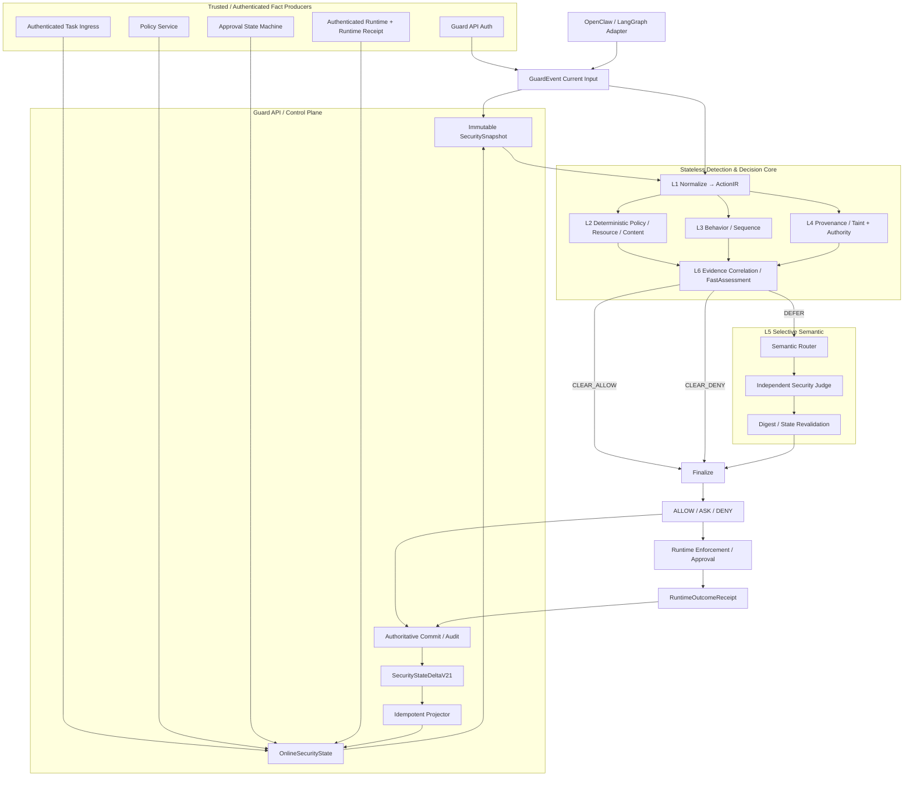

# 00 — AgentGuard Core V2.1-Final：最终架构与冻结边界

> 当前状态：`frozen`。本文件冻结目标契约，不代表对应代码已经实现。

## 1. 目标

AgentGuard Core 判定模块需要同时尽可能满足五个相互制约的目标：

- **高召回**：覆盖明确违规、语义改写、跨事件攻击、长期记忆污染、工具劫持和数据外泄；
- **低误报**：避免“见到不可信文本就拒绝”，避免多个同源 detector 重复计分，控制 benign ASK；
- **实时性**：工具执行前的 Fast Path 保持纯内存、有界、无外部模型依赖；
- **可解释**：决策能回溯到 Observed/Derived/Policy/Model/Runtime 证据，而不是只给风险分或 LLM 文本理由；
- **高可信**：权限来源、状态版本、摘要绑定、审计、执行回执、失败降级均有明确契约。

这五个目标不能通过“增加更多正则/关键词”，也不能通过“所有事件交给一个 LLM Judge”同时解决。因此采用混合分层架构。

---

## 2. 最终系统架构



### 关键顺序冻结

**本次当前事件**可以直接参与本次 Core 判定，但只有已经提交成功的权威记录，才能通过 Projector 成为**后续事件**的历史安全状态。

禁止：

```text
收到 event
→ 先更新 OnlineSecurityState
→ 再尝试写 Audit
```

冻结为：

```text
Current Event
→ Current Decision
→ 生成权威 Audit/Record + StateDelta
→ Commit 成功
→ Projector 幂等应用 committed delta
→ OnlineSecurityState
→ 下一事件 Snapshot
```

如果 committed record 已成功但 Projector 未应用：

- state 标记 `dirty/degraded`；
- 对依赖该域的后续动作，Coverage 不得为 `complete`；
- 必需域缺失时禁止 `CLEAR_ALLOW`；
- 后台/同步 bounded replay 修复后恢复。

---

## 3. 六层职责

### L1 — Event & Action Normalization

目标：把不同 Runtime/工具的原始调用转换成统一 `ActionIR`。

负责：

- canonical action type；
- typed CanonicalResource / Destination；
- ActionEffect 多维副作用；
- stable data/artifact references；
- 内部授权指纹与审计展示指纹；
- subject、task、branch、sequence 关联。

不负责最终安全判定。

### L2 — Deterministic Policy / Resource / Content

负责：

- system invariant violation；
- hard policy；
- 敏感资源/凭据/危险命令；
- tool/resource/profile mismatch；
- prompt injection/jailbreak marker 等低成本内容 signal；
- canonical resource 与 capability 约束基础检查。

特点：确定、低延迟、可回归。

### L3 — Behavior & Sequence

负责多事件行为：

- 高频/预算异常；
- 敏感读取后外发；
- 未信任工具结果后高影响动作；
- memory write → later retrieval → action；
- privilege escalation；
- 跨任务/跨主体行为。

L3 不把“时间相邻”自动解释为“因果成立”。

### L4 — Provenance / Taint + Authority

内部严格拆成两个平面：

**Data / Influence Plane**

```text
数据来自哪里 → 如何进入上下文/产物 → 是否到达 sink
```

**Authority Plane**

```text
谁授权了什么主体 → 在什么 task/scope 下 → 允许什么动作/资源/目的地
```

任何 data/influence edge 都不能自动传递 Authority。

### L5 — Selective Semantic Analysis

只处理：

- task/action alignment 灰区；
- instruction-vs-data 语义灰区；
- deterministic evidence 已齐全但语义关系不明确的 `DEFER`。

不能处理：

- 缺失 capability；
- 缺失 required state；
- exact sensitive egress；
- system invariant violation；
- hard deny。

### L6 — Evidence Correlation & Decision

不使用简单 `max(score)` 或无脑加权。

使用：

1. Security Invariant / Hard Policy；
2. Authority verdict；
3. Source-to-sink flow verdict；
4. Coverage/degradation；
5. Behavior patterns；
6. Content signals；
7. Semantic judgment（若存在）；
8. Evidence group 去重。

先产出 `FastAssessment`，再 finalize 为公开 `GuardDecision`。

---

## 4. F0 System Security Invariants — 最终冻结

### F0-1：Authority 只能来自权威根

允许产生 Authority 的根来源：

- server-side policy；
- authenticated task ingress；
- authenticated human approval；
- 明确受策略信任的 runtime identity grant。

以下不能产生 Authority：

- Agent LLM；
- Semantic Judge；
- RAG/document/web/email；
- tool result；
- memory content；
- Adapter 自报 metadata。

### F0-2：Data/Influence Path 不传递 Authority

`derived_from / influenced_by / assembled_into / returned_by / read_from` 不得解释为 `authorizes`。

### F0-3：Missing Required Fact ≠ Safe

RequiredCheckPlan 中任一必需域不是 `complete/not_applicable` 时，不得 `CLEAR_ALLOW`。

### F0-4：Taint 单调传播

`CREDENTIAL / SENSITIVE / PERSISTENT_UNTRUSTED / UNTRUSTED` 不因 hop 数自动消失。只有可信 `DeclassificationFact` 可以改变标签。

### F0-5：Decision 不等于执行事实

`DENY` 或 `ASK` 不能被统计为“确认未调用”。只有 RuntimeOutcomeReceipt 能证明 `not_invoked/executed/failed/unknown`。

### F0-6：Semantic 不得 fail-open

timeout、unavailable、schema invalid、digest mismatch、stale judgment 都不能产生 `ALLOW`。

### F0-7：Required Component Failure 不得静默放行

required detector/projector/state/provider 故障必须结构化产生 `EvaluationDegradation`；若影响 RequiredCheckPlan，则禁止 CLEAR_ALLOW。

### F0-8：Uncommitted Fact 不得成为历史安全状态

Projector 只能消费 committed authoritative record / committed projection envelope。

### F0-9：allow_once 严格一次性绑定

Human approval 生成的 grant：

- 必须绑定内部 `authorization_fingerprint`；
- `usage_limit=1`；
- `delegable=false`；
- 原子/CAS 消费；
- 不得被相似动作复用。

### F0-10：认证生产者不等于权威事实

认证只证明“谁上报”，不能自动证明“上报内容真实/受授权”。Producer Trust 与 Fact Authority 必须分开建模。

### F0-11：Task Authority 必须来自专用入口

普通 evaluate 事件中的 `user_task` 只作为 producer claim。只有持有 `task:write` scope 的受信 Task Ingress 调用专用任务接口后，Guard API 才能生成 authoritative `TaskFact`。服务端负责 `task_id/revision/task_digest/scope_digest`，Adapter 不得自报或覆盖。

### F0-12：V2 allow_once 必须执行前原子消费

V2 `allow_once` 只允许由认证人工审批产生。Runtime 必须在执行前以 `approval_id + action_id + authorization_fingerprint` 原子消费一次授权并取得短期不透明 execution lease；Receipt 必须关联 `consumption_id/lease_id`。LLM Reviewer 只能 deny 或保持 pending，不得产生 V2 Authority。

---

## 5. Policy 分层冻结

解决现有 `disabled_rules` 与“hard deny 不可覆盖”的冲突。

| 层级 | 含义 | 是否普通配置可关闭 |
|---|---|---|
| `system_invariant` | F0 结构安全属性 | 否 |
| `system_hard_policy` | 产品级安全底线 | 仅发布级配置/审计变更 |
| `tenant_hard_policy` | 部署方 hard policy | 是，版本化审计 |
| `review_policy` | ASK/DENY 审批策略 | 是 |
| `security_signal` | detector 证据 | 不直接等于 policy |

现有 `PolicyBundle.disabled_rules/rule_overrides` 只允许影响明确声明为 tenant/review 层的规则，不得改变 `system_invariant`。

---

## 6. Minimal Competition Scope

比赛版必须完成：

- ActionIR + CanonicalResource + ActionEffect；
- Fact Authority / Authenticated TaskFact；
- SecurityStateScope + StateDelta + OnlineSecurityState；
- 域级 Coverage；
- SecuritySignal / PolicyViolation / EvaluationDegradation；
- 3 条核心跨事件 flow：
  - untrusted source → high-impact action；
  - sensitive/credential → external sink；
  - poisoned memory → later action；
- Capability/Authority；
- Behavior B1-B6 最小集；
- FastAssessment + frozen fusion matrix；
- DecisionEvidenceV21；
- Runtime Receipt 关联；
- Semantic Shadow；
- latency/ASK/ASR/utility benchmark；
- Shadow → Limited Enable。

不要求：完整分布式生产态。

---

## 7. Full / Production Scope

后置能力：

- 多 worker shared state + CAS/事务一致性；
- Outbox/CDC 式 Projector；
- checkpoint + crash recovery；
- 复杂 delegation；
- 更大跨会话长期状态；
- 复杂 graph query；
- Semantic Stage 3 低风险 de-escalation；
- 校准后的模型置信度；
- 多租户 namespace / policy federation。

---

## 8. 不再讨论的架构选择

以下在 Final 中冻结，不再重复评审：

- Stateless Core 保留；
- Guard API 持有状态；
- Provenance 进入 Minimal；
- Provenance 与 Authority 分离；
- Fast/Slow Path 分离；
- LLM 不做全量裁决；
- Runtime Receipt 独立于 GuardDecision；
- 公共 GuardDecision 暂不扩展；
- Legacy 逐规则迁移，不长期双裁决；
- 不使用 hop-decay 清除 taint；
- 不使用单一 risk score 作为最终真值。
