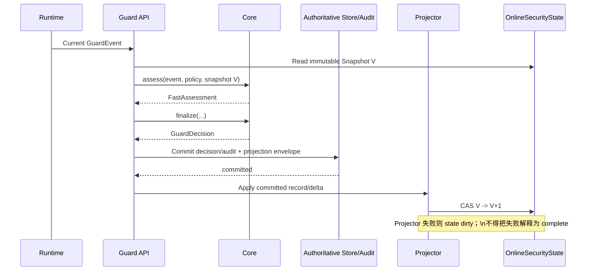
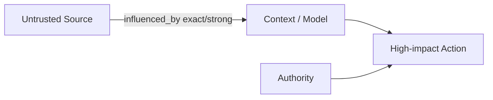

# 02 — 状态投影、Provenance/Taint 与 Authority

## 1. 为什么需要状态层

当前单事件 detector 能处理“当前调用本身已经明显危险”的情况，但无法可靠回答：

- 刚刚是否读取过凭据？
- 当前外发内容是否来自那个凭据？
- 当前动作是否受恶意 Web/Tool Result 影响？
- Memory 中的持久化不可信指令是否在后续被取回？
- 当前动作是否仍处于用户 task / capability 范围内？
- 某个 allow_once grant 是否已被消费？

因此需要 **OnlineSecurityState → SecuritySnapshot**，但 Core 仍保持 stateless。

---

## 2. 三种事实层必须分开

### 2.1 Authoritative Record Plane

可成为权威事实来源的记录：

- Guard API 认证后的 TaskFact；
- Policy revision / system policy；
- Approval 权威状态；
- committed AuditEvent / GuardEvent evidence；
- RuntimeOutcomeReceipt；
- Memory lifecycle authoritative transition；
- 受策略信任的 Runtime identity facts。

### 2.2 Derived Projection Plane

`SecurityStateDeltaV21`、FlowFact、RecentActionFact、部分 SourceFact 是从权威记录确定性投影得到的**派生事实**。

### 2.3 Online Cache / State Plane

`OnlineSecurityState` 是热路径有界投影，不是第二 Authority Root。

任何冲突：

```text
Authoritative Record > Derived Projection > Online Cache
```

---

## 3. Commit / Projector 顺序冻结



### 3.1 原子性要求

Minimal 单 worker 可使用：

- per-scope lock；
- DB transaction 写 Audit/权威记录；
- commit 成功后同步 apply delta；
- apply 失败则写 dirty marker，并在下一次 state-dependent decision 前 bounded rebuild。

Production 建议：

```text
Authoritative record + projection outbox
```

同事务提交，再由幂等 Projector 消费。

冻结的不变量是：

> **没有 committed authoritative record，就不能让该事实成为后续历史状态。**

不强制所有状态表与 Audit row 永远同一事务物理更新。

---

## 4. Projector 幂等与版本

Projector 幂等键：

```text
(scope_digest,
 source_record_type,
 source_record_id,
 source_revision,
 projector_version)
```

禁止只用 `event_id`。

### 4.1 State Version

每个 scope 维护单调：

```text
state_version = 0, 1, 2, ...
```

应用 delta 必须：

```text
current_state_version == delta.base_state_version
```

否则：

- 幂等重放：若 projection identity 已存在且 digest 相同 → no-op；
- 版本领先/缺失 → reconcile/rebuild；
- digest 冲突 → state dirty + security alert，不静默覆盖。

### 4.2 projector_version

改变以下任一逻辑必须提升版本：

- resource normalization；
- taint propagation；
- flow construction；
- behavior aggregation；
- capability projection；
- coverage computation。

---

## 5. OnlineSecurityState 容器

建议内部：

```text
OnlineSecurityState
├── task
├── active_grants
├── revocations / consumptions
├── source_index
├── sticky_taint_summary
├── relevant_flows
├── recent_actions
├── behavior_aggregates
├── memory_index
├── runtime_outcomes
├── execution_leases / consumptions
├── watermarks / gaps
├── state_version
└── dirty_domains
```

上述安全相关内容必须由 `SecurityStateDeltaV21` 的 typed update 重建，不允许只存在于进程内私有字段。`SequenceRef.domain + producer_binding_id` 决定可比较的顺序域；不同域禁止直接用整数大小推断先后。

### 5.1 安全保持型驱逐

禁止普通 LRU 把安全关键事实“洗掉”。

#### Sticky State

在生命周期结束前不按普通 LRU 驱逐：

- active/revoked grant state；
- `CREDENTIAL` / `PERSISTENT_UNTRUSTED` sticky summary；
- unresolved high-risk flow；
- Memory trust；
- gap/dirty marker。

#### Windowed State

可 bounded：

- recent low-risk actions；
- recent benign source facts；
-普通 observation。

#### Aggregated State

原始事件可驱逐，但保留：

- high-impact count；
- external egress count；
- credential_seen_since_sequence；
- privilege/action budget；
- memory taint summary。

如果驱逐后无法证明 required domain 完整：

```text
coverage(domain) → partial
```

### 5.2 State Flooding 测试

必须覆盖：

```text
credential read
→ N benign actions 填满窗口
→ external send
```

系统不得因为 credential fact 被普通驱逐而 CLEAR_ALLOW。

---

## 6. Coverage Contract — 最终冻结

`CoverageStatus` 不是“数据有没有”，而是“对于当前 required domain，系统能否可靠判断所需事实”。

### 6.1 task

| 状态 | 判定 |
|---|---|
| complete | authoritative TaskFact 存在，scope/principal/revision/digest 有效 |
| partial | task 存在，但 scope 或约束编译信息不完整 |
| stale | task revision 落后当前 authoritative revision |
| unknown | 无 authoritative task / Task ingress 故障 |
| not_applicable | 当前 action 按 policy 不需要 task authority |

### 6.2 source

| 状态 | 判定 |
|---|---|
| complete | 当前 required source refs 均有 producer/trust/taint 事实 |
| partial | 部分 source 只有 claim、缺 trust mapping 或 ref |
| stale | source mapping/projector watermark 落后 required sequence |
| unknown | source projector 不可用或来源身份无法建立 |
| not_applicable | 当前动作不依赖 source/influence 判定 |

### 6.3 capability

| 状态 | 判定 |
|---|---|
| complete | required action/resource/destination 均可 canonicalize，grant/revocation/consumption state 已知 |
| partial | 部分资源 unresolved、部分 constraint 无法判断 |
| stale | grant revision/consumption watermark 落后 |
| unknown | grant store/projector 不可用 |
| not_applicable | policy 明确该低影响动作无需 capability |

### 6.4 behavior

| 状态 | 判定 |
|---|---|
| complete | RequiredCheckPlan 所需窗口与关键 predecessor 已覆盖，无关键 gap |
| partial | 关键 predecessor/ref 缺失或窗口被安全性驱逐影响 |
| stale | behavior aggregate watermark 落后当前 required sequence |
| unknown | behavior projector 不可用 |
| not_applicable | 当前动作无需 sequence/behavior 判断 |

### 6.5 dataflow

| 状态 | 判定 |
|---|---|
| complete | required source/data/sink refs 可解析，相关 flow 构建窗口完整 |
| partial | 存在 unresolved artifact、possible link、关键 parent 缺失 |
| stale | flow watermark 落后当前相关序列 |
| unknown | flow projector/provider 不可用 |
| not_applicable | 当前动作无数据/影响流安全要求 |

重要：

```text
未发现危险 flow + dataflow=complete
```

才可作为安全证据。

```text
未发现危险 flow + dataflow=unknown
```

不能解释为安全。

### 6.6 memory

| 状态 | 判定 |
|---|---|
| complete | required memory refs、change lifecycle、trust/taint、retrieval link 已知 |
| partial | retrieval origin 或 source link 部分缺失 |
| stale | memory lifecycle/taint watermark 落后 |
| unknown | memory state 不可用 |
| not_applicable | 当前动作不读取/依赖 memory |

### 6.7 runtime_outcome

| 状态 | 判定 |
|---|---|
| complete | 当前 required 历史动作 receipt 已知或 runtime 明确支持该 observation |
| partial | expected receipt 尚未到达但已知 pending |
| stale | receipt watermark 落后 required action |
| unknown | runtime 不支持或 receipt channel unavailable |
| not_applicable | 本次 pre-execution decision 不依赖历史执行终态 |

---

## 7. Gap 不是全局 ASK

冻结：

```text
any gap → global ASK
```

**禁止**。

Gap 是否影响当前动作由依赖关系确定，优先级：

1. explicit `parent_event_ids`；
2. stable action/data/memory refs；
3. RequiredCheckPlan 的 required history window；
4. 最后才使用 sequence interval 作为保守补充。

若 gap 与当前 required domain 无关，则该域可以继续 complete。

若无法确定 gap 是否包含必需 predecessor：

```text
相关 domain = partial
```

而不是全局所有 domain partial。

---

## 8. Provenance 最小模型

Minimal 不需要完整图库查询。

核心保存：

- source facts；
- stable data/artifact refs；
- relevant flow facts；
- memory propagation；
- action/resource/sink links；
- evidence refs。

查询目标不是：

```text
遍历全局 20 跳路径
```

而是：

```text
当前 Action 的 bounded relevant subgraph
```

例如：

```text
file:credential
  → read_from
artifact:x
  → derived_from
message:y
  → sent_to
email:external
```

---

## 9. Taint Lattice 与 Flow Strength 分离

### 9.1 Taint Label

表示安全属性：

- `CREDENTIAL`
- `SENSITIVE`
- `UNTRUSTED`
- `EXTERNAL_INSTRUCTION`
- `PERSISTENT_UNTRUSTED`

Taint 不自动衰减。

### 9.2 Flow Strength

表示“这个 source 是否真正流入 target”的证据强度。

#### exact

- stable DataRef 直接传递；
- Runtime artifact identity；
- deterministic copy；
- exact content/token match；
- 明确 file→payload 映射。

#### strong

- 多个一致 deterministic evidence；
- DLP strong match；
- explicit structured transformation mapping；
- 高可信 runtime link。

#### possible

- LLM 看过某输入，输出是否包含其内容未知；
- 仅时间/上下文相关；
- semantic inference；
- 缺少稳定 DataRef。

### 9.3 LLM 变换

```text
credential enters LLM context
→ LLM output "操作完成"
```

输出仍可能携带 `CREDENTIAL influence` 标签，但 flow 默认 `possible`，不能直接当 exact credential exfiltration。

这同时保证：

- 不通过增加 hop 洗 taint；
- 不把“接触过敏感数据”等同于“确切外泄敏感数据”。

---

## 10. Authority Graph

Authority 只允许以下边：

```text
authorizes
delegates
grants
permits
scopes_to
approved_by
```

数据/因果边：

```text
read_from
derived_from
influenced_by
returned_by
assembled_into
```

永远不传递 Authority。

### 10.1 权威链示例

```text
Authenticated Principal
    ↓ owns task
TaskFact
    ↓ compiled_to
CapabilityGrant
    ↓ permits
ActionIR
    ↓ targets
CanonicalResource
```

### 10.2 Prompt Injection 反例

```text
User Task
→ Read Email
→ Malicious Email
→ Model Intent
→ Send Secret
```

这个链在 Data/Influence Plane 可达，**不等于**：

```text
Malicious Email → authorizes Send Secret
```

---

## 11. TaskAuthorizationCompiler

输入：

```text
TaskFact + PolicySnapshot + tool/action schema
```

输出：

```text
CapabilityGrant(s)
```

原则：

- 默认最小权限；
- 不因自然语言模糊词生成无限制 grant；
- 对高影响动作更倾向窄 scope 或 human approval；
- compiler version 进入 grant digest；
- compiler 输出是 Derived Authority，根仍然是 authoritative TaskFact/Policy；
- 不允许 Agent 自己调用 compiler 扩权。

Minimal 可先使用 deterministic task→capability mapping + tool schema，不要求 LLM 自动生成权限。

TaskFact 只能来自持有 `task:write` scope 的专用 Task Ingress。普通 evaluate 中的 `security_context.user_task` 只作为已认证 producer claim；即使内容相同，也不能创建、更新或覆盖 authoritative TaskFact。

---

## 12. Approval → CapabilityGrant

现有 Approval 状态机继续是权威记录。

```text
Pending Approval
→ authenticated human allow_once
→ Approval resolved
→ projector generates CapabilityGrant
```

Grant 绑定：

```text
authorization_fingerprint
usage_limit=1
remaining_uses=1
delegable=false
```

V2 中只有 `resolution_source=human` 的 `allow_once` 可以投影为可消费 grant。现有 LLM Approval Reviewer 在 Legacy 共存期保持旧行为，但不得成为 V2 Authority issuer；V2 路径只能让它 deny 或保持 pending。

Runtime 执行前调用 execution-lease consume 接口，Guard API 在原子事务中完成 fingerprint 校验、remaining-use CAS、GrantConsumption 与 lease 生成。Receipt 必须关联 `consumption_id/lease_id`，不能在执行后才补做消费。这样才能避免两个并发 action 同时使用一个 allow_once。

---

## 13. 三条 Minimal 核心跨事件链

### P1 — Untrusted Influence → High-Impact Action



判定：

- strong/exact influence + 明确 capability scope mismatch → deny；
- strong/exact influence + authority missing/unknown → defer；
- possible influence → signal/defer，不单独 hard deny。

### P2 — Sensitive/Credential → External Sink

```text
Sensitive/Credential source
→ artifact/data
→ external destination
```

结合 flow strength 与 authority 使用冻结矩阵，见判定文档。

### P3 — Poisoned Memory → Later Action

```text
untrusted source
→ memory write
→ committed memory with persistent taint
→ later retrieval
→ context
→ future action
```

Memory lifecycle status 与 trust/taint 分开判断。

---

## 14. Behavior B1-B6

Minimal 定义：

- **B1** sensitive read → external egress；
- **B2** untrusted tool result → high-impact action；
- **B3** credential read → network/API/email；
- **B4** memory write/retrieve → future action；
- **B5** privilege escalation / action scope expansion；
- **B6** action budget / frequency anomaly。

Behavior 本身通常生成 signal，不应仅凭“异常”直接 deny；需要与 policy/authority/flow 相关联。
