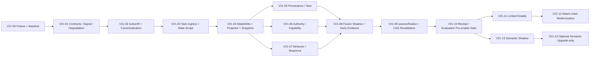

# 04 — 兼容迁移与实施计划

## 1. 总原则

V2.1-Final 不采用“大爆炸重写”。迁移遵循：

```text
Contract Freeze
→ Instrument
→ Shadow
→ Compare
→ Gate
→ Limited Enable
→ Rule-by-rule ownership transfer
→ Remove legacy authority
```

每一步必须能回滚。

---

## 2. Legacy 与 V2 共存冻结规则

### 2.1 Shadow 阶段

```text
Legacy GuardDecision = official
V2.1 FastAssessment = shadow only
```

V2 不能改变执行。

### 2.2 Limited Enable 阶段

只允许**单向收紧**：

| Legacy | V2.1 enabled result | Final |
|---|---|---|
| deny | 任意 | deny |
| ask | clear_allow | ask |
| ask | clear_deny | deny |
| allow | clear_allow | allow |
| allow | defer | ask |
| allow | clear_deny | deny |

冻结：

- V2 `CLEAR_ALLOW` 不得在迁移期降低 legacy ASK/DENY；
- V2 degraded path 只有对应 domain 已正式 enable 后才影响 final；
- 未 enable 的 V2 结果只写 shadow evidence。

### 2.3 Rule Ownership Transfer

当某条 legacy rule 已：

- V2 equivalent 实现；
- retained gate 不回退；
- independent holdout 通过；
- benign regression 通过；
- latency 通过；
- shadow divergence 已解释；

才可以：

```text
legacy rule loses decision authority
→ V2 becomes sole authority for this rule
```

禁止 Legacy/V2 长期成为两个平级裁决者。

---

## 3. `evaluate()` 兼容入口

在 V21-12 前：

```python
def evaluate(event, policies=None):
    return legacy_evaluate(event, policies)
```

V2 Shadow 使用新入口：

```python
assessment = engine.assess(event, policies, snapshot)
```

禁止为了兼容把 `snapshot=None` 伪造成 `coverage=complete`。

V21-12 后可：

```python
def evaluate(...):
    # only for callers that have full V2 context
    assessment = assess(...)
    return finalize(...)
```

但离线/旧调用仍应有明确 compatibility adapter。

---

## 4. Public Contract 策略

Minimal 不把 GuardDecision breaking change 作为前置。

### 保持

- `decision`
- `risk_score`
- `severity`
- `categories`
- `rule_hits`
- `reason`
- `approval_intent`
- `latency_ms`

### V2 新证据

进入：

```text
AuditEvent 0.4 evidence.decision_v21
```

因此：

- OpenClaw/LangGraph response parsing 不必立即大改；
- 历史 GuardDecision replay 不被新 required 字段破坏；
- Dashboard 可渐进读取 v21 evidence；
- 未来若 GuardDecision V2 公共化，再单独版本化。

---

## 5. 15 Phase 最终实施 DAG



---

## 6. V21-00 — Final Freeze + Baseline Tooling

### 交付

1. Candidate 文档与机器 Schema 签入特性分支；
2. 固定 baseline SHA；
3. 固定 fixture IDs；
4. Core latency benchmark；
5. Guard API E2E latency benchmark；
6. decision distribution collector；
7. benign/malicious ASK/DENY 分桶；
8. multi-event fixture 框架；
9. independent holdout 目录约定；
10. benchmark environment manifest。
11. Contract/Fusion Schema 自动校验；
12. freeze-readiness 报告；

### 必须先有的输出

```text
P50/P95/P99
allow/ask/deny distribution
retained Recall/FPR
benign ASK rate
current final ASR（若 runtime bench 支持）
```

没有 baseline 不进入 decision-changing PR。V21-00 自动门禁通过后仍保持 `candidate-for-freeze`；显式评审签字后才单独切换 `frozen`。

---

## 7. V21-01 — Contract Scaffold

新增内部模型：

- EvidenceRef / FactRef；
- SecuritySignal；
- PolicyViolation；
- EvaluationDegradation；
- AuthorityVerdict / FlowVerdict；
- FastAssessment；
- DecisionEvidenceV21 envelope。

Legacy DetectionResult 通过 adapter 映射成 SecuritySignal，**行为不变**。

验收：

```text
legacy decision == current production decision
```

逐 fixture 一致。

---

## 8. V21-02 — ActionIR + Canonicalization

实现：

- ActionEffect；
- CanonicalResource typed normalizer；
- Resource/Destination constraint DSL；
- authorization_fingerprint；
- audit_fingerprint；
- ActionIR builder。

Shadow 输出，不改变 decision。

必须做 canonicalization attack tests：

- `..`；
- Windows case/short path；
- symlink unresolved；
- URL IDN/default port；
- redirect policy；
- email domain normalization；
- JSON type mismatch。

---

## 9. V21-03 — Authenticated Task Ingress + SecurityStateScope

实现：

- TaskFact；
- 专用 `task:write` Task API；
- principal/scope binding；
- Task revision；
- Adapter `user_task` 永久保持 claim，不得覆盖 TaskFact；
- deterministic TaskAuthorizationCompiler 最小版；
- SecurityStateScope。

必须保证：

```text
恶意 Adapter 修改 user_task
≠ 自动扩大 Authority
```

---

## 10. V21-04 — StateDelta + Idempotent Projector + Snapshot

这是后续状态能力前置。

实现：

- ProjectionRecordIdentity；
- SecurityStateDeltaV21；
- OnlineSecurityState；
- state version；
- dirty marker；
- replay/rebuild；
- CoverageMap；
- RequiredCheckPlan；
- safe eviction。

测试：

- commit failure；
- projector failure；
- duplicate projection；
- digest conflict；
- crash/replay；
- state flooding；
- gap localized degradation。

---

## 11. V21-05 — Minimal Provenance / Taint

实现：

- SourceFact；
- FlowFact；
- DeclassificationFact；
- bounded relevant flow lookup；
- exact/strong/possible；
- taint monotonicity。

优先完成：

```text
credential/sensitive → external sink
```

Shadow。

---

## 12. V21-06 — Authority / Capability

实现：

- CapabilityGrant；
- deterministic TaskFact→Grant；
- Approval→allow_once Grant projection；
- revocation/expiry；
- GrantConsumption CAS；
- 人工 allow_once → execution lease 的执行前原子消费；
- AuthorityVerdict。

测试：

- forged issuer；
- scope mismatch；
- expired/revoked；
- allow_once double-spend；
- fingerprint mismatch；
- destination mismatch。
- LLM reviewer 不得生成 V2 allow_once grant；
- lease consume 同内容幂等、异内容冲突；
- receipt 只关联 lease/consumption ID，不泄露 token。

---

## 13. V21-07 — Behavior / Sequence

实现 B1-B6。

强调：

- branch/parent refs 优先于纯 sequence；
- behavior signal 不单独决定所有 deny；
- sticky summary 防 state flood。

---

## 14. V21-08 — Fusion Shadow + Early Audit Evidence

**DecisionEvidenceV21 不等到后期才做。**

Shadow 即保存：

- assessment_digest；
- coverage；
- state_version；
- authority；
- flow；
- signal/policy/degradation refs；
- legacy decision；
- v21 disposition；
- divergence category。

用于分析：

```text
legacy allow / v21 deny
legacy ask / v21 allow
legacy deny / v21 defer
```

---

## 15. V21-09 — assess/finalize + CAS Revalidation

正式 Core API：

```python
class GuardEngine:
    def assess(
        self,
        event: GuardEvent,
        policies: PolicyBundle,
        snapshot: SecuritySnapshot,
    ) -> FastAssessment: ...

    def finalize(
        self,
        assessment: FastAssessment,
        semantic: SemanticJudgment | None = None,
    ) -> GuardDecision: ...
```

Guard API 编排：

```text
snapshot V
→ assess
→ optional semantic outside tx
→ revalidate V/digests/evaluation clock
→ finalize
→ commit authoritative record
→ project
```

在 Limited Enable 前完成 stale judgment、state CAS、task/policy/snapshot digest revalidation。

---

## 16. V21-10 — Receipt / Evaluation Pre-enable Gate

在任何 decision-changing enable 前补齐：

- runtime receipt 与 action/decision/policy audit 的稳定关联；
- V2 execution lease 的 `consumption_id/lease_id` 目标契约；
- eligible receipt denominator；
- failure injection、rollback 和 circuit breaker；
- shadow divergence、benign ASK、Final ASR、Receipt Coverage 和性能报告；
- evidence/authority/flow/coverage 的最小可审阅视图。

Dashboard 美化可以后置，但上述证据和门禁不能后置。

---

## 17. V21-11 — Limited Enable

只启用最有确定性的 V2 path：

1. exact/strong credential unauthorized external egress；
2. explicit capability scope mismatch high-impact；
3. required state degradation → ASK；
4. forged Authority issuer / allow_once mismatch。

采用单向收紧共存规则。

---

## 18. V21-12 — 三类核心攻击链现代化

### Prompt Injection

从：

```text
marker hit
```

升级为：

```text
source trust
+ instruction-like signal
+ influence flow
+ task alignment
+ authority
+ action impact
```

### Agent Abuse

升级为：

```text
Goal × Capability × Resource × Sequence × Effect × Recipient × Budget
```

### Memory Poisoning

升级为：

```text
write-time lifecycle
+ read-time persistent taint
+ future influence/action path
```

---

## 19. V21-13 — Semantic Shadow

复用现有 LLM transport/timeout/structured JSON 实现范式，但职责独立。

输出 `SemanticJudgment`，不直接 `allow/deny`。

至少评测：

- semantic paraphrase；
- benign high-impact；
- indirect prompt injection；
- agent abuse gray cases；
- repeated runs variance。

---

## 20. V21-14 — Optional Semantic Upgrade-only

只有独立评测证明：

- misaligned precision 足够；
- benign deny 无显著增加；
- model/prompt version 固定；
- rollback/circuit breaker 完成；

才允许：

```text
DEFER → DENY
```

比赛不要求 Stage 3 自动放行。

---

## 21. 每个判定类 PR 的最小门禁

1. unit tests；
2. contract tests；
3. retained regression；
4. independent holdout 不得用于调参；
5. benign-hard regression；
6. latency delta；
7. ASK/DENY distribution；
8. replay/idempotency；
9. failure injection；
10. explainability/evidence test；
11. no F0 violation；
12. rollback path documented。

---

## 22. PR 拆分纪律

禁止一个 PR 同时：

```text
重构模型
+ 改 detector
+ 改阈值
+ 改 benchmark
```

推荐：

- structure-only；
- shadow-only；
- behavior change；
- benchmark data；

分开审阅。
