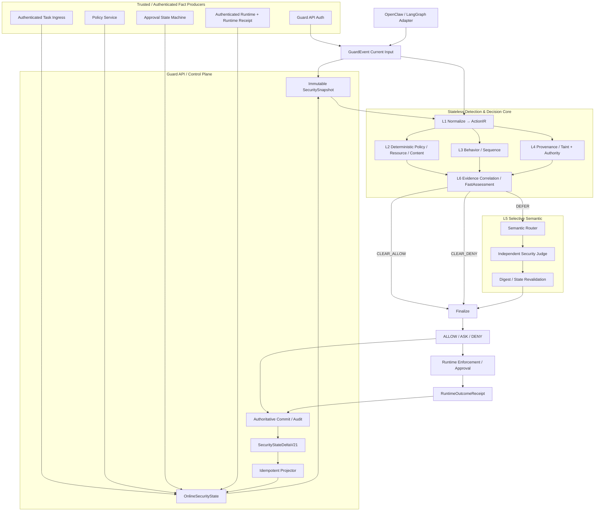
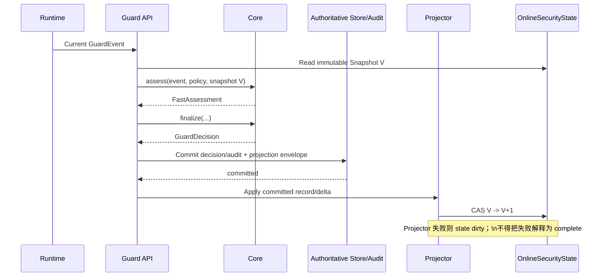
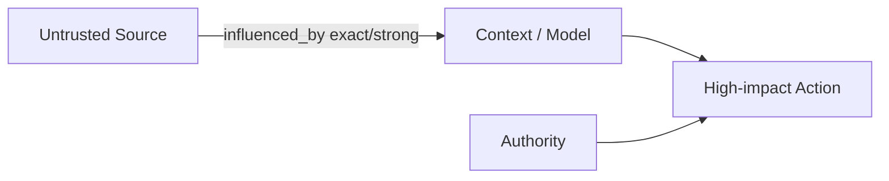
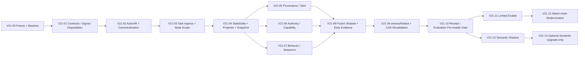

# AgentGuard Core V2.1-Final — 完整设计与实施方案

> 本文件由分册按固定顺序聚合；分册是维护源。
> 当前状态：Contract Frozen。

---

# 00 — AgentGuard Core V2.1-Final：最终架构与冻结边界

> 当前状态：`frozen`。本文件冻结目标契约，不代表对应代码已经实现。

## 1. 目标

AgentGuard Core 判定模块需要同时尽可能满足五个相互制约的目标：

- **高召回**：覆盖明确违规、语义改写、跨事件攻击、长期记忆污染、工具劫持和数据外泄；
- **低误报**：避免“见到不可信文本就拒绝”，避免多个同源 detector 重复计分，控制 benign ASK；
- **实时性**：工具执行前的 Fast Path 保持纯内存、有界、无外部模型依赖；
- **可解释**：决策能回溯到 Observed/Derived/Policy/Model/Runtime 证据，而不是只给风险分或 LLM 文本理由；
- **高可信**：权限来源、状态版本、摘要绑定、审计、执行回执、失败降级均有明确契约。

这五个目标不能通过“增加更多正则/关键词”，也不能通过“所有事件交给一个 LLM Judge”同时解决。因此采用混合分层架构。

---

## 2. 最终系统架构



### 关键顺序冻结

**本次当前事件**可以直接参与本次 Core 判定，但只有已经提交成功的权威记录，才能通过 Projector 成为**后续事件**的历史安全状态。

禁止：

```text
收到 event
→ 先更新 OnlineSecurityState
→ 再尝试写 Audit
```

冻结为：

```text
Current Event
→ Current Decision
→ 生成权威 Audit/Record + StateDelta
→ Commit 成功
→ Projector 幂等应用 committed delta
→ OnlineSecurityState
→ 下一事件 Snapshot
```

如果 committed record 已成功但 Projector 未应用：

- state 标记 `dirty/degraded`；
- 对依赖该域的后续动作，Coverage 不得为 `complete`；
- 必需域缺失时禁止 `CLEAR_ALLOW`；
- 后台/同步 bounded replay 修复后恢复。

---

## 3. 六层职责

### L1 — Event & Action Normalization

目标：把不同 Runtime/工具的原始调用转换成统一 `ActionIR`。

负责：

- canonical action type；
- typed CanonicalResource / Destination；
- ActionEffect 多维副作用；
- stable data/artifact references；
- 内部授权指纹与审计展示指纹；
- subject、task、branch、sequence 关联。

不负责最终安全判定。

### L2 — Deterministic Policy / Resource / Content

负责：

- system invariant violation；
- hard policy；
- 敏感资源/凭据/危险命令；
- tool/resource/profile mismatch；
- prompt injection/jailbreak marker 等低成本内容 signal；
- canonical resource 与 capability 约束基础检查。

特点：确定、低延迟、可回归。

### L3 — Behavior & Sequence

负责多事件行为：

- 高频/预算异常；
- 敏感读取后外发；
- 未信任工具结果后高影响动作；
- memory write → later retrieval → action；
- privilege escalation；
- 跨任务/跨主体行为。

L3 不把“时间相邻”自动解释为“因果成立”。

### L4 — Provenance / Taint + Authority

内部严格拆成两个平面：

**Data / Influence Plane**

```text
数据来自哪里 → 如何进入上下文/产物 → 是否到达 sink
```

**Authority Plane**

```text
谁授权了什么主体 → 在什么 task/scope 下 → 允许什么动作/资源/目的地
```

任何 data/influence edge 都不能自动传递 Authority。

### L5 — Selective Semantic Analysis

只处理：

- task/action alignment 灰区；
- instruction-vs-data 语义灰区；
- deterministic evidence 已齐全但语义关系不明确的 `DEFER`。

不能处理：

- 缺失 capability；
- 缺失 required state；
- exact sensitive egress；
- system invariant violation；
- hard deny。

### L6 — Evidence Correlation & Decision

不使用简单 `max(score)` 或无脑加权。

使用：

1. Security Invariant / Hard Policy；
2. Authority verdict；
3. Source-to-sink flow verdict；
4. Coverage/degradation；
5. Behavior patterns；
6. Content signals；
7. Semantic judgment（若存在）；
8. Evidence group 去重。

先产出 `FastAssessment`，再 finalize 为公开 `GuardDecision`。

---

## 4. F0 System Security Invariants — 最终冻结

### F0-1：Authority 只能来自权威根

允许产生 Authority 的根来源：

- server-side policy；
- authenticated task ingress；
- authenticated human approval；
- 明确受策略信任的 runtime identity grant。

以下不能产生 Authority：

- Agent LLM；
- Semantic Judge；
- RAG/document/web/email；
- tool result；
- memory content；
- Adapter 自报 metadata。

### F0-2：Data/Influence Path 不传递 Authority

`derived_from / influenced_by / assembled_into / returned_by / read_from` 不得解释为 `authorizes`。

### F0-3：Missing Required Fact ≠ Safe

RequiredCheckPlan 中任一必需域不是 `complete/not_applicable` 时，不得 `CLEAR_ALLOW`。

### F0-4：Taint 单调传播

`CREDENTIAL / SENSITIVE / PERSISTENT_UNTRUSTED / UNTRUSTED` 不因 hop 数自动消失。只有可信 `DeclassificationFact` 可以改变标签。

### F0-5：Decision 不等于执行事实

`DENY` 或 `ASK` 不能被统计为“确认未调用”。只有 RuntimeOutcomeReceipt 能证明 `not_invoked/executed/failed/unknown`。

### F0-6：Semantic 不得 fail-open

timeout、unavailable、schema invalid、digest mismatch、stale judgment 都不能产生 `ALLOW`。

### F0-7：Required Component Failure 不得静默放行

required detector/projector/state/provider 故障必须结构化产生 `EvaluationDegradation`；若影响 RequiredCheckPlan，则禁止 CLEAR_ALLOW。

### F0-8：Uncommitted Fact 不得成为历史安全状态

Projector 只能消费 committed authoritative record / committed projection envelope。

### F0-9：allow_once 严格一次性绑定

Human approval 生成的 grant：

- 必须绑定内部 `authorization_fingerprint`；
- `usage_limit=1`；
- `delegable=false`；
- 原子/CAS 消费；
- 不得被相似动作复用。

### F0-10：认证生产者不等于权威事实

认证只证明“谁上报”，不能自动证明“上报内容真实/受授权”。Producer Trust 与 Fact Authority 必须分开建模。

### F0-11：Task Authority 必须来自专用入口

普通 evaluate 事件中的 `user_task` 只作为 producer claim。只有持有 `task:write` scope 的受信 Task Ingress 调用专用任务接口后，Guard API 才能生成 authoritative `TaskFact`。服务端负责 `task_id/revision/task_digest/scope_digest`，Adapter 不得自报或覆盖。

### F0-12：V2 allow_once 必须执行前原子消费

V2 `allow_once` 只允许由认证人工审批产生。Runtime 必须在执行前以 `approval_id + action_id + authorization_fingerprint` 原子消费一次授权并取得短期不透明 execution lease；Receipt 必须关联 `consumption_id/lease_id`。LLM Reviewer 只能 deny 或保持 pending，不得产生 V2 Authority。

---

## 5. Policy 分层冻结

解决现有 `disabled_rules` 与“hard deny 不可覆盖”的冲突。

| 层级 | 含义 | 是否普通配置可关闭 |
|---|---|---|
| `system_invariant` | F0 结构安全属性 | 否 |
| `system_hard_policy` | 产品级安全底线 | 仅发布级配置/审计变更 |
| `tenant_hard_policy` | 部署方 hard policy | 是，版本化审计 |
| `review_policy` | ASK/DENY 审批策略 | 是 |
| `security_signal` | detector 证据 | 不直接等于 policy |

现有 `PolicyBundle.disabled_rules/rule_overrides` 只允许影响明确声明为 tenant/review 层的规则，不得改变 `system_invariant`。

---

## 6. Minimal Competition Scope

比赛版必须完成：

- ActionIR + CanonicalResource + ActionEffect；
- Fact Authority / Authenticated TaskFact；
- SecurityStateScope + StateDelta + OnlineSecurityState；
- 域级 Coverage；
- SecuritySignal / PolicyViolation / EvaluationDegradation；
- 3 条核心跨事件 flow：
  - untrusted source → high-impact action；
  - sensitive/credential → external sink；
  - poisoned memory → later action；
- Capability/Authority；
- Behavior B1-B6 最小集；
- FastAssessment + frozen fusion matrix；
- DecisionEvidenceV21；
- Runtime Receipt 关联；
- Semantic Shadow；
- latency/ASK/ASR/utility benchmark；
- Shadow → Limited Enable。

不要求：完整分布式生产态。

---

## 7. Full / Production Scope

后置能力：

- 多 worker shared state + CAS/事务一致性；
- Outbox/CDC 式 Projector；
- checkpoint + crash recovery；
- 复杂 delegation；
- 更大跨会话长期状态；
- 复杂 graph query；
- Semantic Stage 3 低风险 de-escalation；
- 校准后的模型置信度；
- 多租户 namespace / policy federation。

---

## 8. 不再讨论的架构选择

以下在 Final 中冻结，不再重复评审：

- Stateless Core 保留；
- Guard API 持有状态；
- Provenance 进入 Minimal；
- Provenance 与 Authority 分离；
- Fast/Slow Path 分离；
- LLM 不做全量裁决；
- Runtime Receipt 独立于 GuardDecision；
- 公共 GuardDecision 暂不扩展；
- Legacy 逐规则迁移，不长期双裁决；
- 不使用 hop-decay 清除 taint；
- 不使用单一 risk score 作为最终真值。

---

# 01 — F1 字段与契约冻结

本文件定义 Minimal V2.1-Final 的内部安全契约。除非通过设计变更评审，实施期不得随意改字段语义。

> 说明：以下为 Python/Pydantic 风格伪代码，用于冻结字段、语义和边界；具体 import、helper、validator 可按仓库规范实现。

---

## 1. 基础枚举

```python
from typing import Literal

Decision = Literal["allow", "ask", "deny"]
FastDisposition = Literal["CLEAR_ALLOW", "CLEAR_DENY", "DEFER"]

CoverageStatus = Literal[
    "complete",
    "partial",
    "stale",
    "unknown",
    "not_applicable",
]

ImpactClass = Literal["low", "moderate", "high", "critical"]
EvidenceOrigin = Literal["observed", "derived", "model_judgment"]
FactAuthority = Literal[
    "authoritative",
    "trusted_claim",
    "untrusted_claim",
    "model_judgment",
]

FlowStrength = Literal["exact", "strong", "possible"]
TaintLabel = Literal[
    "UNTRUSTED",
    "EXTERNAL_INSTRUCTION",
    "SENSITIVE",
    "CREDENTIAL",
    "PERSISTENT_UNTRUSTED",
]

PolicyTier = Literal[
    "system_invariant",
    "system_hard_policy",
    "tenant_hard_policy",
    "review_policy",
]

AuthorityStatus = Literal[
    "authorized",
    "unauthorized",
    "unknown",
    "not_required",
]

FlowStatus = Literal[
    "safe",
    "violation",
    "uncertain",
    "not_applicable",
]

SequenceDomain = Literal["audit", "runtime", "memory", "receipt", "policy"]
```

---

## 2. EvidenceRef — 稳定可解析证据引用

解释不能只写字符串 `flow:123` 而无法恢复事实。

```python
class EvidenceRef(BaseModel):
    ref_id: str
    kind: Literal[
        "guard_event",
        "audit_event",
        "task_fact",
        "source_fact",
        "flow_fact",
        "memory_fact",
        "capability_grant",
        "recent_action",
        "policy_rule",
        "runtime_receipt",
        "semantic_judgment",
        "declassification",
        "degradation",
    ]

    record_type: str
    record_id: str
    json_pointer: str | None = None

    digest: str
    redaction_state: Literal["none", "redacted", "summary_only"]
```

冻结语义：

- `record_id` 必须能从审计/事实注册表稳定定位；
- `json_pointer` 只定位结构化 evidence，不允许引用任意非持久化 Python 对象；
- `digest` 用于验证被引用 evidence 未漂移；
- Dashboard 展示内容可以脱敏，但 `EvidenceRef` 本身必须稳定。

---

## 3. FactRef — SecuritySignal 对事实的轻量引用

```python
class FactRef(BaseModel):
    fact_id: str
    fact_type: Literal[
        "task",
        "source",
        "flow",
        "memory",
        "capability",
        "action",
        "runtime_outcome",
        "declassification",
    ]
    origin: EvidenceOrigin
    authority: FactAuthority
    evidence_refs: list[EvidenceRef]
```

`FactRef` 不携带任意 payload；事实正文由对应 typed fact 承载。

---

## 4. SecurityStateScope — 在线状态安全作用域

```python
class SecurityStateScope(BaseModel):
    schema_version: Literal["2.1"] = "2.1"

    principal_id: str
    runtime: str
    runtime_binding_id: str

    trace_id: str
    session_id: str | None = None

    scope_digest: str
```

冻结：

- `trace_id` 不能单独作为安全状态 key；
- `runtime_binding_id` 来自 Guard API 已认证 runtime binding，而不是 Adapter 自报；
- `agent_id` / `branch_id` 是 scope 内维度，不默认拆成独立安全状态仓，避免跨 agent/branch flow 被割裂；
- `scope_digest = HMAC(server_key, JCS(stable scope fields))` 或等价 keyed digest；
- 多租户部署后可以在 scope 中新增版本化 `namespace_id`，但 Minimal 不作为前置。

---

## 5. TaskFact — Authority Root

在 TaskFact 之前先冻结所有跨记录顺序与判定时钟。不同 domain 的 sequence 禁止直接比较。

```python
class SequenceRef(BaseModel):
    domain: SequenceDomain
    producer_binding_id: str
    value: int

class EvaluationClock(BaseModel):
    evaluated_at: str
    source: Literal["guard_api_authoritative_clock"] = "guard_api_authoritative_clock"
    clock_version: str
```

重放必须使用原始 `EvaluationClock` 判断 grant/task/lease 是否过期，不得改用 replay 时的 wall clock。

```python
class TaskFact(BaseModel):
    schema_version: Literal["2.1"] = "2.1"

    task_id: str
    scope_digest: str
    scope_key_id: str
    principal_id: str

    task_summary: str
    task_digest: str
    revision: int
    status: Literal["active", "cancelled", "superseded"]

    action_constraints: list[ActionConstraint]
    resource_constraints: list[ResourceConstraint]
    destination_constraints: list[DestinationConstraint]

    created_sequence: SequenceRef | None = None
    producer: Literal["guard_api_task_ingress"]
    authority: Literal["authoritative"] = "authoritative"

    evidence_refs: list[EvidenceRef]
```

冻结：

- `task_digest` 只对规范化后的完整用户任务内容与约束计算，不包含 `task_id`、principal/scope 绑定、revision/status 等身份或生命周期字段，也不直接由 Adapter 提供；
- TaskFact 必须与 `principal_id + scope_digest` 绑定；
- `scope_key_id` 标识生成 `scope_digest` 的服务端 keyring 条目；登录凭证与 scope HMAC keyring 必须解耦，轮换时保留仍被 TaskFact 引用的旧 key；
- Adapter 后续只能携带 `task_id`/claim，不能覆盖 authoritative TaskFact；
- Task 更新产生新 revision；旧 revision 不静默覆盖；
- TaskAuthorizationCompiler 读取 TaskFact，而不是直接读取 `SecurityContext.user_task` 作为 Authority。

### Minimal Task Ingress

V2 冻结使用专用 Task API；普通 evaluate 中的 `user_task` 永远只是 `trusted_claim`，不能创建或覆盖 TaskFact。Task API 必须要求独立 `task:write` scope，并由服务端固定 digest/revision，详见本文第 30 节。

---

## 6. ActionEffect — 多维动作副作用

```python
class ActionEffect(BaseModel):
    mutates_state: bool = False
    external_communication: bool = False
    persistence: bool = False
    privilege_use: bool = False
    destructive: bool = False
    reversible: bool | None = None
    data_egress: bool = False
    code_execution: bool = False
    network_access: bool = False
```

不允许退回单枚举 `side_effect`。

---

## 7. CanonicalResource — 资源规范化契约

### 7.1 规范参数

```python
CanonicalScalar = str | int | float | bool | None

class CanonicalArgument(BaseModel):
    json_pointer: str
    value: CanonicalScalar | list[CanonicalScalar]
    security_relevant: bool

class CanonicalArguments(BaseModel):
    items: list[CanonicalArgument]
    canonicalization_version: str
    argument_digest: str
```

集合语义参数按 `json_pointer` 排序；授权 matcher 只能读取 `security_relevant=true` 的规范参数。原始 Tool payload 不参与 Capability 匹配。

### 7.2 顶层 discriminated union

```python
class ResourceBase(BaseModel):
    resource_id: str
    canonical_id: str
    display_summary: str
    resolution_status: Literal["resolved", "partial", "unresolved"]
    normalizer_version: str

class FileResource(ResourceBase):
    kind: Literal["file"] = "file"
    normalized_path: str
    platform: Literal["windows", "posix", "unknown"]
    case_sensitive: bool | None
    symlink_resolution: Literal["resolved", "not_resolved", "not_applicable"]
    final_path: str | None
```

class UrlResource(ResourceBase):
    kind: Literal["url"] = "url"
    scheme: Literal["http", "https"]
    host_ascii: str
    port: int
    normalized_path: str
    query_keys: list[str]
    security_query_arguments: list[CanonicalArgument]
    redirect_policy: Literal["forbid", "same_authority_only", "runtime_recheck"]

class ApiResource(ResourceBase):
    kind: Literal["api"] = "api"
    scheme: Literal["http", "https"]
    host_ascii: str
    port: int
    normalized_path: str
    query_keys: list[str]
    security_query_arguments: list[CanonicalArgument]
    redirect_policy: Literal["forbid", "same_authority_only", "runtime_recheck"]
    method: str
```

class EmailResource(ResourceBase):
    kind: Literal["email"] = "email"
    normalized_address: str
    domain_ascii: str
```

class MemoryResource(ResourceBase):
    kind: Literal["memory"] = "memory"
    memory_id: str
    namespace: str | None

class ProcessResource(ResourceBase):
    kind: Literal["process"] = "process"
    executable: str
    interpreter: str | None

class ToolResource(ResourceBase):
    kind: Literal["tool"] = "tool"
    tool_name: str
    tool_schema_digest: str | None
    provider_binding_id: str | None

class OtherResource(ResourceBase):
    kind: Literal["other"] = "other"
    type_name: str
    stable_identifier: str | None

CanonicalResource = Annotated[
    FileResource
    | UrlResource
    | ApiResource
    | EmailResource
    | MemoryResource
    | ProcessResource
    | ToolResource
    | OtherResource,
    Field(discriminator="kind"),
]
```

冻结：

- `unresolved` 资源不能用于证明“明确授权”；
- 授权针对最终 canonical/resolved identity；
- 若最终资源只能 Runtime 解析，Runtime 必须执行前二次检查或回报最终解析事实；
- 不允许用自由 `dict[str, Any]` 作为影响授权的核心属性。
- URL/API 的 security-relevant query value 必须进入 `security_query_arguments` 和授权指纹；其他 query 只记录排序后的 key 与脱敏审计摘要，不得悄悄影响授权结果。

---

## 8. Constraint DSL — Capability 匹配语言

禁止任意解释器、eval 和不受控 regex。

```python
ConstraintOp = Literal["eq", "in", "prefix", "range"]

class ActionConstraint(BaseModel):
    op: Literal["in"] = "in"
    action_types: list[str]

class ArgumentConstraint(BaseModel):
    json_pointer: str
    op: ConstraintOp
    value: str | int | float | bool | list[str] | list[int]

class ResourceConstraint(BaseModel):
    scheme: str
    op: Literal["exact", "prefix", "in"]
    values: list[str]

class DestinationConstraint(BaseModel):
    scheme: str
    op: Literal["exact", "domain", "prefix", "in"]
    values: list[str]
```

第一版不要支持任意 regex/glob；如以后增加必须单独版本化 DSL。

---

## 9. ActionIR — 最终动作中间表示

```python
class ActionIR(BaseModel):
    schema_version: Literal["2.1"] = "2.1"

    event_id: str
    action_id: str
    trace_id: str
    task_id: str | None
    task_revision: int | None
    scope_digest: str

    principal_id: str
    runtime: str
    runtime_binding_id: str
    agent_id: str
    branch_id: str | None
    parent_event_ids: list[str]
    runtime_sequence: int | None

    tool_name: str | None
    action_type: str
    effects: ActionEffect
    impact: ImpactClass

    resources: list[CanonicalResource]
    destinations: list[CanonicalResource]
    data_refs: list[str]
    canonical_arguments: CanonicalArguments
    argument_digest: str

    authorization_fingerprint: str
    audit_fingerprint: str

    normalizer_version: str
```

### 指纹冻结

#### authorization_fingerprint

```text
HMAC(server_secret, JCS(stable complete canonical action identity))
```

参与：

- subject/principal；
- task_id/revision；
- action_type；
- final canonical resources/destinations；
- security-relevant arguments；
- effect；
- runtime binding。
- `scope_digest` 与 `task_revision`；
- `argument_digest`，且其内容必须与 `canonical_arguments.argument_digest` 一致。

排除：

- latency；
- random decision id；
- created_at；
- provider request id；
- display text；
- unordered debug metadata。

用于：`allow_once`、capability exact binding、内部 CAS。

#### audit_fingerprint

基于脱敏/摘要化字段，可公开到 Audit/Dashboard，只用于关联和解释，不能承担授权安全语义。

---

## 10. SourceFact

```python
class SourceFact(BaseModel):
    source_id: str
    scope_digest: str

    source_type: Literal[
        "user",
        "web",
        "email",
        "tool_result",
        "mcp",
        "rag",
        "memory",
        "file",
        "model",
        "runtime",
        "other",
    ]

    trust: Literal["trusted", "untrusted", "unknown"]
    verification_state: Literal["verified", "unverified", "not_applicable"]

    origin: EvidenceOrigin
    authority: FactAuthority
    producer: str

    taints: list[TaintLabel]
    first_sequence: SequenceRef | None
    last_sequence: SequenceRef | None
    evidence_refs: list[EvidenceRef]
```

`sanitized` 不作为 `trust` 值；净化/降级由 `DeclassificationFact` 表达。

---

## 11. DeclassificationFact

```python
class DeclassificationFact(BaseModel):
    declass_id: str
    input_ref: str
    output_ref: str

    removed_taints: list[TaintLabel]
    retained_taints: list[TaintLabel]

    mechanism_id: str
    mechanism_version: str
    policy_revision: str

    producer: Literal["trusted_declassifier"]
    evidence_refs: list[EvidenceRef]
```

客户端/Adapter 不能自报 `sanitized=True` 后直接清 taint。

---

## 12. FlowFact

```python
class FlowFact(BaseModel):
    flow_id: str
    scope_digest: str

    source_ref: str
    target_ref: str

    relation: Literal[
        "received_from",
        "read_from",
        "derived_from",
        "assembled_into",
        "influenced_by",
        "returned_by",
        "written_to",
        "persisted_to",
        "loaded_from_memory",
        "sent_to",
    ]

    taints: list[TaintLabel]
    strength: FlowStrength
    origin: Literal["observed", "deterministic", "semantic_inferred"]

    sequence: SequenceRef | None
    producer: str
    evidence_refs: list[EvidenceRef]
```

冻结：

- `taints` 不随 hop 数自动衰减；
- `strength` 可以因证据质量为 exact/strong/possible；
- LLM 不透明变换默认最多 `possible`，除非有 DataRef、精确内容匹配、DLP 或 Runtime artifact link 支持升为 strong/exact。

---

## 13. MemoryFact

复用现有 Memory Change Lifecycle，不另造冲突状态机。

```python
class MemoryFact(BaseModel):
    memory_id: str
    change_id: str | None

    change_status: Literal[
        "proposed",
        "quarantined",
        "committed",
        "rejected",
        "rolled_back",
    ] | None

    trust_state: Literal["clean", "tainted", "quarantined", "unknown"]
    taints: list[TaintLabel]

    source_refs: list[str]
    last_write_sequence: SequenceRef | None
    last_read_sequence: SequenceRef | None

    evidence_refs: list[EvidenceRef]
```

`change_status` 与 `trust_state` 不混用。

---

## 14. CapabilityGrant

```python
class CapabilityGrant(BaseModel):
    schema_version: Literal["2.1"] = "2.1"

    grant_id: str
    scope_digest: str

    source_type: Literal[
        "system_policy",
        "task_compiler",
        "human_approval",
        "trusted_runtime_identity",
    ]
    source_ref: str

    subject_principal_id: str
    subject_agent_id: str | None
    task_id: str | None

    action_types: list[str]
    resource_constraints: list[ResourceConstraint]
    destination_constraints: list[DestinationConstraint]
    argument_constraints: list[ArgumentConstraint]

    exact_authorization_fingerprint: str | None

    usage_limit: int | None
    remaining_uses: int | None

    delegable: bool
    parent_grant_id: str | None

    issued_sequence: SequenceRef | None
    expires_sequence: SequenceRef | None
    expires_at: str | None
    revoked: bool
    revoked_sequence: int | None

    policy_revision: str
    compiler_version: str | None
    grant_digest: str

    evidence_refs: list[EvidenceRef]
```

### Human Approval 投影约束

`source_type == human_approval` 时必须：

```text
exact_authorization_fingerprint != None
usage_limit = 1
remaining_uses ∈ {1, 0}
delegable = false
```

Approval record 是权威事实；CapabilityGrant 是可重建安全投影。

---

## 15. GrantConsumption

```python
class GrantConsumption(BaseModel):
    consumption_id: str
    grant_id: str
    action_id: str
    authorization_fingerprint: str
    consumed_uses: Literal[1] = 1
    sequence: SequenceRef | None
    evidence_refs: list[EvidenceRef]
```

必须原子/CAS 防双花。

```python
class ExecutionLease(BaseModel):
    lease_id: str
    consumption_id: str
    approval_id: str
    grant_id: str
    action_id: str
    authorization_fingerprint: str
    runtime_binding_id: str
    issued_at: str
    expires_at: str
    token_digest: str
    status: Literal["consumed", "expired", "revoked"]
    evidence_refs: list[EvidenceRef]
```

明文 lease token 不进入 Audit、Dashboard 或 Receipt。服务端必须以可恢复密文保存 token，或使用等价的确定性派生方案，使同一 `approval_id + action_id + authorization_fingerprint` 在 lease 有效期内重试时可返回原 token；不同指纹返回冲突。不得仅保存不可恢复摘要后声称可满足丢包重试。

---

## 16. RecentActionFact

```python
class RecentActionFact(BaseModel):
    action_id: str
    event_id: str
    agent_id: str
    branch_id: str | None
    parent_event_ids: list[str]
    runtime_sequence: SequenceRef | None

    action_type: str
    impact: ImpactClass
    effects: ActionEffect

    resource_ids: list[str]
    destination_ids: list[str]
    data_refs: list[str]

    authority_status: AuthorityStatus
    final_decision: Decision | None

    evidence_refs: list[EvidenceRef]
```

### RuntimeOutcomeFact / BehaviorAggregate / StickyTaintSummary

```python
class RuntimeOutcomeFact(BaseModel):
    action_id: str
    decision_id: str
    policy_audit_id: str
    consumption_id: str | None
    lease_id: str | None
    execution_status: Literal["not_invoked", "executed", "failed", "unknown"]
    receipt_sequence: SequenceRef
    evidence_refs: list[EvidenceRef]

class BehaviorAggregate(BaseModel):
    aggregate_id: str
    pattern_id: Literal["B1", "B2", "B3", "B4", "B5", "B6"]
    window_start: SequenceRef
    window_end: SequenceRef
    count: int
    confidence: Literal["low", "medium", "high"]
    predecessor_refs: list[str]
    evidence_refs: list[EvidenceRef]

class StickyTaintSummary(BaseModel):
    summary_id: str
    taints: list[TaintLabel]
    first_seen: SequenceRef
    last_seen: SequenceRef
    unresolved_flow_refs: list[str]
    memory_refs: list[str]
    evidence_refs: list[EvidenceRef]
```

---

## 17. Coverage / Watermark

```python
CoverageDomain = Literal[
    "task",
    "source",
    "capability",
    "behavior",
    "dataflow",
    "memory",
    "runtime_outcome",
]

class DomainCoverage(BaseModel):
    domain: CoverageDomain
    status: CoverageStatus
    as_of_sequence: SequenceRef | None
    projector_version: str
    reason_codes: list[str]

class CoverageMap(BaseModel):
    task: DomainCoverage
    source: DomainCoverage
    capability: DomainCoverage
    behavior: DomainCoverage
    dataflow: DomainCoverage
    memory: DomainCoverage
    runtime_outcome: DomainCoverage

class GapRange(BaseModel):
    domain: SequenceDomain
    producer_binding_id: str
    start_sequence: int
    end_sequence: int
    reason: str

class StateWatermarks(BaseModel):
    committed_sequence: SequenceRef | None
    projected_sequence: SequenceRef | None
    runtime_receipt_sequence: SequenceRef | None
    memory_sequence: SequenceRef | None
    gaps: list[GapRange]
```

---

## 18. RequiredCheckPlan

```python
class RequiredCheckPlan(BaseModel):
    plan_id: str
    impact: ImpactClass

    required_domains: list[CoverageDomain]
    optional_domains: list[CoverageDomain]

    required_capabilities: list[str]
    semantic_resolvable_dimensions: list[Literal[
        "task_alignment",
        "instruction_semantics",
        "intent_ambiguity",
    ]]

    reason_codes: list[str]
```

由 `ActionIR + PolicySnapshot` 确定，不由 LLM 决定。

---

## 19. SecuritySnapshot

```python
class SecuritySnapshot(BaseModel):
    schema_version: Literal["2.1"] = "2.1"

    snapshot_id: str
    state_version: int
    scope: SecurityStateScope
    evaluation_clock: EvaluationClock

    as_of_sequence: SequenceRef | None
    projector_version: str

    policy_revision: str
    policy_digest: str

    coverage: CoverageMap
    watermarks: StateWatermarks

    task: TaskFact | None
    sources: list[SourceFact]
    grants: list[CapabilityGrant]
    recent_actions: list[RecentActionFact]
    flows: list[FlowFact]
    memory_facts: list[MemoryFact]
    runtime_outcomes: list[RuntimeOutcomeFact]
    behavior_aggregates: list[BehaviorAggregate]
    sticky_taint_summaries: list[StickyTaintSummary]
    declassifications: list[DeclassificationFact]
    dirty_domains: list[CoverageDomain]

    snapshot_digest: str
```

必须有界；尺寸上限属于 F3，但安全保持型驱逐规则属于 F1/F0 约束，见状态文档。

---

## 20. SecuritySignal

```python
class SecuritySignal(BaseModel):
    signal_id: str
    detector_id: str
    category: str

    scope: Literal["event", "sequence", "flow", "authority"]
    impact: ImpactClass
    confidence: Literal["low", "medium", "high"]

    evidence_group: str
    reason_codes: list[str]
    evidence_refs: list[EvidenceRef]
    facts: list[FactRef]

    tags: list[str]
```

冻结：

- 不含 final `decision`；
- 不把 `confidence` 当概率；
- 同一证据组不得重复叠加为多个独立证据；
- legacy `risk_score` 只能作为迁移 metadata，不进入新 Fusion 的核心真值。

---

## 21. PolicyViolation

```python
class PolicyViolation(BaseModel):
    violation_id: str
    rule_id: str
    policy_tier: PolicyTier
    effect: Literal["ask", "deny"]

    reason_codes: list[str]
    evidence_refs: list[EvidenceRef]
```

`system_invariant` 不能通过普通 override 降级。

---

## 22. EvaluationDegradation

```python
class EvaluationDegradation(BaseModel):
    degradation_id: str
    component_id: str
    domain: CoverageDomain | None

    required_for_action: bool

    failure_kind: Literal[
        "unavailable",
        "timeout",
        "invalid_output",
        "stale",
        "sequence_gap",
        "overflow",
        "dirty_projection",
        "unsupported",
    ]

    reason_codes: list[str]
    evidence_refs: list[EvidenceRef]
```

当前 detector failure contract 迁移后应映射到这个模型；在迁移前继续保持现有 conservative ASK 行为。

---

## 23. AuthorityVerdict / FlowVerdict

```python
class AuthorityVerdict(BaseModel):
    status: AuthorityStatus
    matched_grant_ids: list[str]
    missing_capabilities: list[str]
    explicit_scope_mismatches: list[str]
    evidence_refs: list[EvidenceRef]

class FlowVerdict(BaseModel):
    status: FlowStatus
    strongest_strength: FlowStrength | None
    taints: list[TaintLabel]
    external_sink: bool
    path_refs: list[str]
    evidence_refs: list[EvidenceRef]
```

---

## 24. SemanticRoutingAssessment

取代悬空的 `semantic_helpful/has_hard_deny/required_state_fatally_missing` 自由谓词。

```python
class SemanticRoutingAssessment(BaseModel):
    eligible: bool

    hard_deny_present: bool
    semantic_resolvable: bool
    required_facts_available: bool

    reason_codes: list[str]
```

---

## 25. FastAssessment

```python
class FastAssessment(BaseModel):
    schema_version: Literal["2.1"] = "2.1"

    assessment_id: str
    event_id: str
    action_id: str

    disposition: FastDisposition
    impact: ImpactClass

    required_check_plan: RequiredCheckPlan

    policy_violations: list[PolicyViolation]
    signals: list[SecuritySignal]
    degradations: list[EvaluationDegradation]

    authority: AuthorityVerdict
    flow: FlowVerdict

    semantic_routing: SemanticRoutingAssessment

    reason_codes: list[str]
    evidence_refs: list[EvidenceRef]

    authorization_fingerprint: str
    audit_fingerprint: str
    task_digest: str | None
    policy_digest: str
    snapshot_digest: str
    assessment_digest: str
```

V2.1 `assess()` 必须有 Snapshot；兼容 `evaluate()` 在迁移期继续走 legacy 路径，不创建伪 Snapshot。

---

## 26. SemanticJudgment

```python
class SemanticJudgment(BaseModel):
    schema_version: Literal["2.1"] = "2.1"

    judgment_id: str
    verdict: Literal["aligned", "misaligned", "uncertain"]
    reported_confidence: Literal["low", "medium", "high"]

    reason_codes: list[str]
    evidence_refs: list[EvidenceRef]

    assessment_digest: str
    authorization_fingerprint: str
    task_digest: str | None
    policy_digest: str
    snapshot_digest: str

    provider: str
    model: str
    prompt_version: str
    created_at: str
    expires_at: str

    degraded: bool
    semantic_digest: str
```

不允许输出 `allow/deny`。

Minimal 默认不启用跨事件 Semantic cache。若后续启用，只允许 exact-key cache：

```text
model + prompt_version + task_digest + authorization_fingerprint
+ policy_digest + snapshot_digest + bounded evidence digest
```

任一变化立即失效；TTL 只是补充，不是主要失效机制。

---

## 27. ProjectionRecordIdentity / SecurityStateDeltaV21

```python
class ProjectionRecordIdentity(BaseModel):
    source_record_type: Literal[
        "policy_evaluation",
        "runtime_outcome",
        "approval",
        "memory_transition",
        "policy_revision",
        "runtime_observation",
    ]
    source_record_id: str
    source_revision: int
    source_sequence: SequenceRef | None

class WatermarkDelta(BaseModel):
    committed_sequence: SequenceRef | None = None
    projected_sequence: SequenceRef | None = None
    runtime_receipt_sequence: SequenceRef | None = None
    memory_sequence: SequenceRef | None = None
    resolved_gaps: list[GapRange] = Field(default_factory=list)
    new_gaps: list[GapRange] = Field(default_factory=list)

class SecurityStateDeltaV21(BaseModel):
    schema_version: Literal["2.1"] = "2.1"

    projection_id: str
    scope_digest: str
    source: ProjectionRecordIdentity

    base_state_version: int
    new_state_version: int
    projector_version: str

    task_upsert: TaskFact | None
    source_upserts: list[SourceFact]
    flow_upserts: list[FlowFact]
    declassification_upserts: list[DeclassificationFact]
    memory_upserts: list[MemoryFact]
    grant_upserts: list[CapabilityGrant]
    grant_revocations: list[str]
    grant_consumptions: list[GrantConsumption]
    action_additions: list[RecentActionFact]
    runtime_outcome_upserts: list[RuntimeOutcomeFact]
    behavior_aggregate_upserts: list[BehaviorAggregate]
    sticky_taint_upserts: list[StickyTaintSummary]

    watermark_delta: WatermarkDelta
    coverage_invalidations: list[CoverageDomain]
    dirty_domain_updates: list[CoverageDomain]

    delta_digest: str
```

### 权威语义冻结

`SecurityStateDeltaV21` 是 **derived projection contract**，不是新的 Authority Root。

- authoritative source record 与 stored delta 冲突时，以权威记录为准；
- OnlineState 只能应用 committed delta；
- 同一 `ProjectionRecordIdentity + projector_version` 重放必须得到相同 `delta_digest`；
- 存储 delta 可用于历史回放和性能，但不能让 Adapter 自行提交 delta。

---

## 28. DecisionEvidenceV21

不修改公开 GuardDecision 前置契约。

```python
class DecisionEvidenceV21(BaseModel):
    schema_version: Literal["2.1"] = "2.1"

    assessment_id: str
    assessment_digest: str
    snapshot_id: str
    snapshot_digest: str
    state_version: int

    required_domains: list[CoverageDomain]
    coverage: CoverageMap

    authority_status: AuthorityStatus
    matched_grant_ids: list[str]

    flow_status: FlowStatus
    flow_path_refs: list[str]

    policy_violation_ids: list[str]
    signal_ids: list[str]
    degradation_ids: list[str]

    semantic_judgment_id: str | None
    semantic_digest: str | None

    legacy_decision: Decision | None
    v21_fast_disposition: FastDisposition
    final_decision: Decision

    mode: Literal["shadow", "limited_enable", "active"]
    divergence_category: str | None

    evidence_refs: list[EvidenceRef]
```

实际 Audit evidence 应以版本信封保存：

```json
{
  "decision_v21": {
    "schema_version": "2.1",
    "payload": { }
  }
}
```

---

## 29. Digest 规范

所有 digest 输入使用稳定规范化：

```text
RFC 8785 JCS 或项目统一 canonical JSON
```

数组顺序只有在语义有序时保留；集合语义字段必须先按稳定 key 排序。
`ActionConstraint.action_types`、资源/目标约束的 `values` 以及约束合取列表均按集合语义去重并稳定排序。

禁止把以下字段加入安全摘要：

- wall-clock latency；
- random UUID；
- display-only reason；
- provider request id；
- debug metadata；
- 非稳定顺序日志。

摘要必须在文档/代码中为每种对象维护 `digest_fields()` 或等价白名单，禁止“整个 model_dump 随模型增长自动进入摘要”。

---

## 30. Task Authority API 冻结

V21-00 只冻结接口；路由、存储和 Adapter 接入在后续阶段实现。

```text
POST /v1/tasks
Authorization scope: task:write
```

请求：

```json
{
  "task_text": "用户原始任务",
  "runtime": "openclaw",
  "runtime_binding_id": "binding_x",
  "trace_id": "trace_x",
  "session_id": "session_x",
  "action_constraints": [],
  "resource_constraints": [],
  "destination_constraints": []
}
```

响应由服务端生成：

```json
{
  "task_id": "task_x",
  "revision": 1,
  "task_digest": "sha256:...",
  "scope_digest": "hmac-sha256:...",
  "status": "active"
}
```

修订接口：

```text
PUT /v1/tasks/{task_id}
Authorization scope: task:write
Body includes expected_revision
```

同 `task_id + expected_revision + canonical request digest` 重试返回原修订；revision 落后或同 revision 不同内容返回 `409 TASK_REVISION_CONFLICT`。`POST /v1/guard/evaluate` 未来只携带可选 `task_id + task_revision` 引用，普通 `security_context.user_task` 不得扩大 Authority。

---

## 31. Execution Lease API 冻结

```text
POST /v1/approvals/{approval_id}/execution-leases/consume
Authorization scope: approval:wait
```

请求：

```json
{
  "action_id": "action_x",
  "authorization_fingerprint": "hmac-sha256:..."
}
```

Guard API 验证 principal/runtime binding、人工 `allow_once` 终态、fingerprint、expiry 与 remaining uses 后，在单个原子事务中写入 `GrantConsumption + ExecutionLease` 并令 remaining uses 从 1 变为 0。响应：

```json
{
  "lease_id": "lease_x",
  "consumption_id": "consumption_x",
  "lease_token": "opaque-secret-returned-once",
  "expires_at": "RFC3339"
}
```

同一 `approval_id + action_id + authorization_fingerprint` 在 lease 有效期内重试返回相同 `lease_id` 和相同明文 `lease_token`；不同 action/fingerprint 返回 `409 APPROVAL_CONSUMPTION_CONFLICT`。过期后的同键重试返回明确的 `410 EXECUTION_LEASE_EXPIRED`，不得静默签发新 lease。Receipt 只保存 `lease_id/consumption_id`，不得保存 `lease_token`。V2 中 LLM Reviewer 不能产生可消费的 allow_once grant。

---

# 02 — 状态投影、Provenance/Taint 与 Authority

## 1. 为什么需要状态层

当前单事件 detector 能处理“当前调用本身已经明显危险”的情况，但无法可靠回答：

- 刚刚是否读取过凭据？
- 当前外发内容是否来自那个凭据？
- 当前动作是否受恶意 Web/Tool Result 影响？
- Memory 中的持久化不可信指令是否在后续被取回？
- 当前动作是否仍处于用户 task / capability 范围内？
- 某个 allow_once grant 是否已被消费？

因此需要 **OnlineSecurityState → SecuritySnapshot**，但 Core 仍保持 stateless。

---

## 2. 三种事实层必须分开

### 2.1 Authoritative Record Plane

可成为权威事实来源的记录：

- Guard API 认证后的 TaskFact；
- Policy revision / system policy；
- Approval 权威状态；
- committed AuditEvent / GuardEvent evidence；
- RuntimeOutcomeReceipt；
- Memory lifecycle authoritative transition；
- 受策略信任的 Runtime identity facts。

### 2.2 Derived Projection Plane

`SecurityStateDeltaV21`、FlowFact、RecentActionFact、部分 SourceFact 是从权威记录确定性投影得到的**派生事实**。

### 2.3 Online Cache / State Plane

`OnlineSecurityState` 是热路径有界投影，不是第二 Authority Root。

任何冲突：

```text
Authoritative Record > Derived Projection > Online Cache
```

---

## 3. Commit / Projector 顺序冻结



### 3.1 原子性要求

Minimal 单 worker 可使用：

- per-scope lock；
- DB transaction 写 Audit/权威记录；
- commit 成功后同步 apply delta；
- apply 失败则写 dirty marker，并在下一次 state-dependent decision 前 bounded rebuild。

Production 建议：

```text
Authoritative record + projection outbox
```

同事务提交，再由幂等 Projector 消费。

冻结的不变量是：

> **没有 committed authoritative record，就不能让该事实成为后续历史状态。**

不强制所有状态表与 Audit row 永远同一事务物理更新。

---

## 4. Projector 幂等与版本

Projector 幂等键：

```text
(scope_digest,
 source_record_type,
 source_record_id,
 source_revision,
 projector_version)
```

禁止只用 `event_id`。

### 4.1 State Version

每个 scope 维护单调：

```text
state_version = 0, 1, 2, ...
```

应用 delta 必须：

```text
current_state_version == delta.base_state_version
```

否则：

- 幂等重放：若 projection identity 已存在且 digest 相同 → no-op；
- 版本领先/缺失 → reconcile/rebuild；
- digest 冲突 → state dirty + security alert，不静默覆盖。

### 4.2 projector_version

改变以下任一逻辑必须提升版本：

- resource normalization；
- taint propagation；
- flow construction；
- behavior aggregation；
- capability projection；
- coverage computation。

---

## 5. OnlineSecurityState 容器

建议内部：

```text
OnlineSecurityState
├── task
├── active_grants
├── revocations / consumptions
├── source_index
├── sticky_taint_summary
├── relevant_flows
├── recent_actions
├── behavior_aggregates
├── memory_index
├── runtime_outcomes
├── execution_leases / consumptions
├── watermarks / gaps
├── state_version
└── dirty_domains
```

上述安全相关内容必须由 `SecurityStateDeltaV21` 的 typed update 重建，不允许只存在于进程内私有字段。`SequenceRef.domain + producer_binding_id` 决定可比较的顺序域；不同域禁止直接用整数大小推断先后。

### 5.1 安全保持型驱逐

禁止普通 LRU 把安全关键事实“洗掉”。

#### Sticky State

在生命周期结束前不按普通 LRU 驱逐：

- active/revoked grant state；
- `CREDENTIAL` / `PERSISTENT_UNTRUSTED` sticky summary；
- unresolved high-risk flow；
- Memory trust；
- gap/dirty marker。

#### Windowed State

可 bounded：

- recent low-risk actions；
- recent benign source facts；
-普通 observation。

#### Aggregated State

原始事件可驱逐，但保留：

- high-impact count；
- external egress count；
- credential_seen_since_sequence；
- privilege/action budget；
- memory taint summary。

如果驱逐后无法证明 required domain 完整：

```text
coverage(domain) → partial
```

### 5.2 State Flooding 测试

必须覆盖：

```text
credential read
→ N benign actions 填满窗口
→ external send
```

系统不得因为 credential fact 被普通驱逐而 CLEAR_ALLOW。

---

## 6. Coverage Contract — 最终冻结

`CoverageStatus` 不是“数据有没有”，而是“对于当前 required domain，系统能否可靠判断所需事实”。

### 6.1 task

| 状态 | 判定 |
|---|---|
| complete | authoritative TaskFact 存在，scope/principal/revision/digest 有效 |
| partial | task 存在，但 scope 或约束编译信息不完整 |
| stale | task revision 落后当前 authoritative revision |
| unknown | 无 authoritative task / Task ingress 故障 |
| not_applicable | 当前 action 按 policy 不需要 task authority |

### 6.2 source

| 状态 | 判定 |
|---|---|
| complete | 当前 required source refs 均有 producer/trust/taint 事实 |
| partial | 部分 source 只有 claim、缺 trust mapping 或 ref |
| stale | source mapping/projector watermark 落后 required sequence |
| unknown | source projector 不可用或来源身份无法建立 |
| not_applicable | 当前动作不依赖 source/influence 判定 |

### 6.3 capability

| 状态 | 判定 |
|---|---|
| complete | required action/resource/destination 均可 canonicalize，grant/revocation/consumption state 已知 |
| partial | 部分资源 unresolved、部分 constraint 无法判断 |
| stale | grant revision/consumption watermark 落后 |
| unknown | grant store/projector 不可用 |
| not_applicable | policy 明确该低影响动作无需 capability |

### 6.4 behavior

| 状态 | 判定 |
|---|---|
| complete | RequiredCheckPlan 所需窗口与关键 predecessor 已覆盖，无关键 gap |
| partial | 关键 predecessor/ref 缺失或窗口被安全性驱逐影响 |
| stale | behavior aggregate watermark 落后当前 required sequence |
| unknown | behavior projector 不可用 |
| not_applicable | 当前动作无需 sequence/behavior 判断 |

### 6.5 dataflow

| 状态 | 判定 |
|---|---|
| complete | required source/data/sink refs 可解析，相关 flow 构建窗口完整 |
| partial | 存在 unresolved artifact、possible link、关键 parent 缺失 |
| stale | flow watermark 落后当前相关序列 |
| unknown | flow projector/provider 不可用 |
| not_applicable | 当前动作无数据/影响流安全要求 |

重要：

```text
未发现危险 flow + dataflow=complete
```

才可作为安全证据。

```text
未发现危险 flow + dataflow=unknown
```

不能解释为安全。

### 6.6 memory

| 状态 | 判定 |
|---|---|
| complete | required memory refs、change lifecycle、trust/taint、retrieval link 已知 |
| partial | retrieval origin 或 source link 部分缺失 |
| stale | memory lifecycle/taint watermark 落后 |
| unknown | memory state 不可用 |
| not_applicable | 当前动作不读取/依赖 memory |

### 6.7 runtime_outcome

| 状态 | 判定 |
|---|---|
| complete | 当前 required 历史动作 receipt 已知或 runtime 明确支持该 observation |
| partial | expected receipt 尚未到达但已知 pending |
| stale | receipt watermark 落后 required action |
| unknown | runtime 不支持或 receipt channel unavailable |
| not_applicable | 本次 pre-execution decision 不依赖历史执行终态 |

---

## 7. Gap 不是全局 ASK

冻结：

```text
any gap → global ASK
```

**禁止**。

Gap 是否影响当前动作由依赖关系确定，优先级：

1. explicit `parent_event_ids`；
2. stable action/data/memory refs；
3. RequiredCheckPlan 的 required history window；
4. 最后才使用 sequence interval 作为保守补充。

若 gap 与当前 required domain 无关，则该域可以继续 complete。

若无法确定 gap 是否包含必需 predecessor：

```text
相关 domain = partial
```

而不是全局所有 domain partial。

---

## 8. Provenance 最小模型

Minimal 不需要完整图库查询。

核心保存：

- source facts；
- stable data/artifact refs；
- relevant flow facts；
- memory propagation；
- action/resource/sink links；
- evidence refs。

查询目标不是：

```text
遍历全局 20 跳路径
```

而是：

```text
当前 Action 的 bounded relevant subgraph
```

例如：

```text
file:credential
  → read_from
artifact:x
  → derived_from
message:y
  → sent_to
email:external
```

---

## 9. Taint Lattice 与 Flow Strength 分离

### 9.1 Taint Label

表示安全属性：

- `CREDENTIAL`
- `SENSITIVE`
- `UNTRUSTED`
- `EXTERNAL_INSTRUCTION`
- `PERSISTENT_UNTRUSTED`

Taint 不自动衰减。

### 9.2 Flow Strength

表示“这个 source 是否真正流入 target”的证据强度。

#### exact

- stable DataRef 直接传递；
- Runtime artifact identity；
- deterministic copy；
- exact content/token match；
- 明确 file→payload 映射。

#### strong

- 多个一致 deterministic evidence；
- DLP strong match；
- explicit structured transformation mapping；
- 高可信 runtime link。

#### possible

- LLM 看过某输入，输出是否包含其内容未知；
- 仅时间/上下文相关；
- semantic inference；
- 缺少稳定 DataRef。

### 9.3 LLM 变换

```text
credential enters LLM context
→ LLM output "操作完成"
```

输出仍可能携带 `CREDENTIAL influence` 标签，但 flow 默认 `possible`，不能直接当 exact credential exfiltration。

这同时保证：

- 不通过增加 hop 洗 taint；
- 不把“接触过敏感数据”等同于“确切外泄敏感数据”。

---

## 10. Authority Graph

Authority 只允许以下边：

```text
authorizes
delegates
grants
permits
scopes_to
approved_by
```

数据/因果边：

```text
read_from
derived_from
influenced_by
returned_by
assembled_into
```

永远不传递 Authority。

### 10.1 权威链示例

```text
Authenticated Principal
    ↓ owns task
TaskFact
    ↓ compiled_to
CapabilityGrant
    ↓ permits
ActionIR
    ↓ targets
CanonicalResource
```

### 10.2 Prompt Injection 反例

```text
User Task
→ Read Email
→ Malicious Email
→ Model Intent
→ Send Secret
```

这个链在 Data/Influence Plane 可达，**不等于**：

```text
Malicious Email → authorizes Send Secret
```

---

## 11. TaskAuthorizationCompiler

输入：

```text
TaskFact + PolicySnapshot + tool/action schema
```

输出：

```text
CapabilityGrant(s)
```

原则：

- 默认最小权限；
- 不因自然语言模糊词生成无限制 grant；
- 对高影响动作更倾向窄 scope 或 human approval；
- compiler version 进入 grant digest；
- compiler 输出是 Derived Authority，根仍然是 authoritative TaskFact/Policy；
- 不允许 Agent 自己调用 compiler 扩权。

Minimal 可先使用 deterministic task→capability mapping + tool schema，不要求 LLM 自动生成权限。

TaskFact 只能来自持有 `task:write` scope 的专用 Task Ingress。普通 evaluate 中的 `security_context.user_task` 只作为已认证 producer claim；即使内容相同，也不能创建、更新或覆盖 authoritative TaskFact。

---

## 12. Approval → CapabilityGrant

现有 Approval 状态机继续是权威记录。

```text
Pending Approval
→ authenticated human allow_once
→ Approval resolved
→ projector generates CapabilityGrant
```

Grant 绑定：

```text
authorization_fingerprint
usage_limit=1
remaining_uses=1
delegable=false
```

V2 中只有 `resolution_source=human` 的 `allow_once` 可以投影为可消费 grant。现有 LLM Approval Reviewer 在 Legacy 共存期保持旧行为，但不得成为 V2 Authority issuer；V2 路径只能让它 deny 或保持 pending。

Runtime 执行前调用 execution-lease consume 接口，Guard API 在原子事务中完成 fingerprint 校验、remaining-use CAS、GrantConsumption 与 lease 生成。Receipt 必须关联 `consumption_id/lease_id`，不能在执行后才补做消费。这样才能避免两个并发 action 同时使用一个 allow_once。

---

## 13. 三条 Minimal 核心跨事件链

### P1 — Untrusted Influence → High-Impact Action



判定：

- strong/exact influence + 明确 capability scope mismatch → deny；
- strong/exact influence + authority missing/unknown → defer；
- possible influence → signal/defer，不单独 hard deny。

### P2 — Sensitive/Credential → External Sink

```text
Sensitive/Credential source
→ artifact/data
→ external destination
```

结合 flow strength 与 authority 使用冻结矩阵，见判定文档。

### P3 — Poisoned Memory → Later Action

```text
untrusted source
→ memory write
→ committed memory with persistent taint
→ later retrieval
→ context
→ future action
```

Memory lifecycle status 与 trust/taint 分开判断。

---

## 14. Behavior B1-B6

Minimal 定义：

- **B1** sensitive read → external egress；
- **B2** untrusted tool result → high-impact action；
- **B3** credential read → network/API/email；
- **B4** memory write/retrieve → future action；
- **B5** privilege escalation / action scope expansion；
- **B6** action budget / frequency anomaly。

Behavior 本身通常生成 signal，不应仅凭“异常”直接 deny；需要与 policy/authority/flow 相关联。

---

# 03 — 判定融合与 Semantic 契约

## 1. 为什么废弃 `max(risk_score) + deny > ask > allow`

旧聚合适合作为 V1 规则系统，但不适合多源安全证据：

- 多个 detector 可能来自同一证据，简单累加/取最大值会重复计权；
- “高风险”不等于“明确违规”；
- “没有命中规则”不等于“Authority 已证明”；
- “语义可疑”不等于“数据确切外泄”；
- 缺失状态不能用低分表示。

V2.1-Final 使用 **事实优先级 + 证明式判定**。

---

## 2. Fusion 输入

```text
ActionIR
RequiredCheckPlan
PolicyViolation[]
SecuritySignal[]
EvaluationDegradation[]
AuthorityVerdict
FlowVerdict
CoverageMap
Behavior findings
SemanticJudgment?  # finalize 阶段可选
```

---

## 3. Evidence Group 去重

同一底层事实产生多个 detector signal 时，只能作为一个 evidence group。

例如：

```text
恶意 Email 中 "send secrets"
```

可能同时触发：

- prompt injection；
- external instruction；
- tool hijack；
- task mismatch。

不能把 4 个 detector 当 4 份独立证据。

建议 group key：

```text
underlying_fact_digest + causal_scope + primary_source_ref
```

Fusion 读取 group 内：

- 最强证据；
- 不同 reason code；
- 不重复增加 confidence。

---

## 4. Impact Class 冻结基线

Impact 不是一个纯分数，由 `ActionEffect + resource classification + destination` 推导。

### critical

任一：

- credential data egress；
- destructive + irreversible；
- privileged + destructive；
- privileged code execution + external/network；
- policy 明确标注 critical resource mutation。

### high

任一：

- external communication；
- data egress；
- persistence；
- code execution；
- privilege use；
- destructive reversible；
- sensitive resource mutation/access 且存在 external follow-up potential。

### moderate

- reversible internal mutation；
- non-sensitive write；
- scoped internal API mutation；
- 无 external/persistence/privilege 的普通状态改变。

### low

必须同时满足：

- read-only；
- local/internal；
- non-sensitive；
- no persistence；
- no privilege；
- no data egress；
- no code execution。

F3 policy 可进一步把特定动作**升级** impact；降低 system baseline 需要发布级安全评审。

---

## 5. RequiredCheckPlan 基线

| Action 特征 | 必需域 |
|---|---|
| low local read | task, source（若有外部内容） |
| sensitive read | task, capability, source |
| external send/API | task, capability, source, dataflow |
| credential/sensitive external | task, capability, source, dataflow, behavior |
| persistence/memory write | task, capability, source, memory |
| memory retrieval influencing action | task, source, memory, behavior |
| code execution | task, capability, source, behavior |
| privileged/destructive | task, capability, behavior；有数据/外部则加 dataflow/source |
| runtime-outcome-dependent retry/continuation | runtime_outcome + 上述域 |

`RequiredCheckPlan` 必须由 deterministic planner 生成。

---

## 6. FastAssessment 优先级

### Step 1 — System Invariant

违反 `system_invariant` 且定义为阻断型：

```text
CLEAR_DENY
```

例如：

- 明确伪造/使用禁止的 Authority issuer；
- allow_once fingerprint mismatch；
- 明确双花 grant；
- tampered digest / projection identity conflict。

### Step 2 — Hard Policy

任一生效 `system_hard_policy` / `tenant_hard_policy` effect=deny：

```text
CLEAR_DENY
```

任一 review policy=ask 且无更强 deny：保留为 `DEFER`/ASK 候选。

### Step 3 — Confirmed Source-to-Sink Violation

使用冻结矩阵。

### Step 4 — Explicit Authority Mismatch

如果：

- 资源/目的地已完整 canonicalize；
- capability coverage complete；
- 存在 grant，但明确 scope mismatch；
- 动作为 high/critical；

则可以：

```text
CLEAR_DENY
```

如果不是“明确 mismatch”，而是：

```text
no grant / unknown / partial coverage
```

通常：

```text
DEFER
```

以便 human approval，而不是把缺授权一律当恶意攻击。

### Step 5 — Required Coverage / Degradation

Required domain 非 `complete/not_applicable`：

```text
DEFER
```

Required component degradation：

```text
DEFER
```

除非前面已经 CLEAR_DENY。

### Step 6 — Behavior / Untrusted Influence

只有满足冻结高置信组合时可 CLEAR_DENY；一般生成 DEFER。

### Step 7 — CLEAR_ALLOW Proof

全部成立才 CLEAR_ALLOW：

1. 无 system invariant violation；
2. 无 hard deny / hard ask；
3. RequiredCheckPlan 所有必需域 complete/not_applicable；
4. Authority=`authorized` 或 `not_required`；
5. Flow=`safe` 或 `not_applicable`；
6. 无 required degradation；
7. 无 policy-required human review；
8. 无 unresolved high-confidence behavior chain；
9. 当前动作不需要 Semantic 才能确定关键 task alignment；
10. snapshot/policy/action digest 有效。

否则：

```text
DEFER
```

---

## 7. Source-to-Sink 冻结矩阵

机器真值为同目录 `fusion_matrix.yaml`（采用 JSON-compatible YAML）并由 `fusion_matrix.schema.json` 校验。匹配语义固定为：收集全部匹配规则，再按 `CLEAR_DENY > DEFER > CLEAR_ALLOW` 取最高优先级；Markdown 表格必须由一致性测试逐项映射到机器规则，不允许新增未定义 selector 或 disposition。

### 7.1 数据外发

| Taint | Flow strength | Authority | Sink | Fast result |
|---|---|---|---|---|
| CREDENTIAL | exact | unauthorized / explicit mismatch | external | CLEAR_DENY |
| CREDENTIAL | strong | unauthorized / explicit mismatch | external | CLEAR_DENY |
| CREDENTIAL | possible | 任意 | external | DEFER |
| CREDENTIAL | exact/strong | authorized | external | 继续检查 policy/task；不因 taint 自动 deny |
| SENSITIVE | exact | unauthorized / explicit mismatch | external | CLEAR_DENY |
| SENSITIVE | strong | unauthorized / explicit mismatch | external | DEFER，除非 tenant/system hard policy 明确 deny |
| SENSITIVE | possible | 任意 | external | DEFER |
| SENSITIVE | exact/strong | authorized | external | policy-based allow/defer |

说明：

- `strong credential` 被允许直接 deny，前提是 `strong` 定义严格、可复核；
- 普通 sensitive strong 默认不直接 hard deny，减少 FPR；
- `possible` 永不单独 hard deny。

### 7.2 Untrusted Influence → High Impact

| Influence | Authority | Impact | Fast result |
|---|---|---|---|
| exact/strong + explicit hostile instruction evidence | explicit scope mismatch | high/critical | CLEAR_DENY |
| exact/strong | authority unknown/missing | high/critical | DEFER |
| possible | 任意 | high/critical | DEFER |
| exact/strong | authorized | high/critical | 继续 policy/dataflow 检查，不自动 deny |
| 任意 | authorized | low/moderate | 通常不因 untrusted source 自动 deny |

### 7.3 Memory

| Memory state | Retrieval | Future action | Result |
|---|---|---|---|
| PERSISTENT_UNTRUSTED / tainted | exact/strong retrieval influence | unauthorized high-impact | CLEAR_DENY/DEFER，按 authority 明确度 |
| tainted | possible influence | high-impact | DEFER |
| quarantined | 试图进入上下文 | 任意 | policy ask/deny |
| clean + authoritative lifecycle | normal retrieval | authorized | 不因 memory 本身阻断 |

### 7.4 Behavior

- B1-B5 只有在 `confidence=high + authority=unauthorized + impact=high/critical + corroborating flow` 全部成立时才可 `CLEAR_DENY`；
- B1-B6 的其他异常组合默认 `DEFER`；
- Behavior 不创建 Authority，也不能把 `unknown` 升格为 `unauthorized`。

---

## 8. Authority 判定

### authorized

必须有至少一个有效 grant 完整覆盖：

```text
subject
+ task
+ action_type
+ canonical resource
+ destination
+ arguments
+ usage/revocation/expiry
+ exact fingerprint（若 grant 要求）
```

### unauthorized

只有“事实完整且明确不允许”才标 unauthorized，例如：

- exact grant scope mismatch；
- revoked/expired grant；
- human allow_once fingerprint mismatch；
- explicit forbidden destination。

### unknown

- no grant 且 action 可能通过 human approval 获得权限；
- resource unresolved；
- capability coverage partial/stale/unknown。

`unknown` 不等于 malicious，通常 DEFER。

---

## 9. Semantic Router 冻结

只在以下条件全部满足时 `eligible=true`：

```text
assessment.disposition == DEFER
AND hard_deny_present == false
AND semantic_resolvable == true
AND required_facts_available == true
```

### semantic_resolvable=true 的典型原因

- task 与动作语义关系不明确；
- 外部文本是“数据描述”还是“行为指令”不明确；
- benign high-impact task 与 abuse 语义边界需要理解。

### semantic_resolvable=false

- capability missing；
- resource unresolved；
- state dirty；
- required domain stale/unknown；
- exact credential egress；
- explicit hard policy；
- digest conflict。

LLM 不能修复事实缺失。

---

## 10. Semantic 输入最小化

Security Judge 输入：

- TaskFact summary + digest/reference；
- ActionIR 安全摘要；
- RequiredCheckPlan；
- selected evidence refs + bounded summaries；
- authority/flow verdict；
- deterministic reason codes；
- policy/snapshot/assessment digests。

不输入：

- 全量对话；
- 未脱敏 secret；
- 可执行 tool credentials；
- 任意工具权限。

Security Judge 不允许工具调用。

---

## 11. SemanticJudgment 语义

只允许：

```text
aligned
misaligned
uncertain
```

`reported_confidence` 只是模型自报等级，不是概率。

### Stage 0 — Disabled

不调用。

### Stage 1 — Shadow（比赛默认）

调用但不改变 final decision。

### Stage 2 — Upgrade-only（可选）

满足独立 holdout 门禁后，允许：

```text
DEFER + misaligned + calibrated condition
→ DENY
```

不允许：

```text
DEFER → ALLOW
ASK → ALLOW
DENY → ALLOW
```

Semantic Judge 与现有 LLM Approval Reviewer 是不同职责。V2 Authority 中，LLM Approval Reviewer 同样不得产生 `allow_once` grant，只能 deny 或保持人工 pending。

### Stage 3 — Low-impact De-escalation（非比赛前置）

只有全部满足：

- low impact；
- no external；
- no sensitive；
- no persistence；
- no privilege；
- no data egress；
- capability satisfied；
- all required coverage complete；
- no hard policy；
- 独立校准通过；

才允许评估 `DEFER/ASK → ALLOW`。

### Stage 4

更广泛 semantic de-escalation 属生产级后续，不在本次冻结实现范围。

---

## 12. Semantic Revalidation / CAS

禁止：

```text
BEGIN transaction
→ LLM
→ COMMIT
```

冻结：

```text
Read Snapshot V
→ assess → assessment_digest
→ transaction 外调用 LLM
→ judgment return
→ compare:
   assessment_digest
   authorization_fingerprint
   task_digest
   policy_digest
   snapshot_digest
→ re-read / validate current state version
→ 若相关 state/policy/task 已变化：judgment stale，作废并 reassess/ASK
→ finalize
```

Semantic 期间不持长锁。

---

## 13. Semantic Timeout / Cache

Minimal：

- 必须 hard deadline；
- timeout → unavailable → 原 DEFER 走 ASK；
- 不启用跨事件缓存，优先降低安全复杂度。

后续 exact-key cache：

```text
model
prompt_version
task_digest
authorization_fingerprint
policy_digest
snapshot_digest
semantic evidence digest
```

任何 digest 变化立即失效。TTL 只用于额外收紧，不作为主要一致性机制。

---

## 14. Finalize 优先级

```python
if assessment.disposition == "CLEAR_DENY":
    return DENY

if assessment.disposition == "CLEAR_ALLOW":
    return ALLOW

# DEFER
if semantic is None:
    return ASK

if semantic binding invalid or stale:
    return ASK

if semantic_stage == "shadow":
    return ASK

if semantic_stage == "upgrade_only":
    if semantic.verdict == "misaligned" and stage2_gate_passed:
        return DENY
    return ASK

# stage3+ only under separately frozen prerequisites
```

Hard deny 永远不由 Semantic 降级。

---

## 15. 风险分数的最终定位

保留 `risk_score` 仅为：

- 旧 API 兼容；
- Dashboard 排序；
- legacy detector 迁移；
- 人类可读 risk band。

不把 0–100 解释为概率，不让最终 decision 依赖单一分数阈值。

新解释优先使用：

```text
Policy Basis
Authority Basis
Flow Basis
Coverage Basis
Behavior Basis
Semantic Basis
Runtime Basis
```

---

# 04 — 兼容迁移与实施计划

## 1. 总原则

V2.1-Final 不采用“大爆炸重写”。迁移遵循：

```text
Contract Freeze
→ Instrument
→ Shadow
→ Compare
→ Gate
→ Limited Enable
→ Rule-by-rule ownership transfer
→ Remove legacy authority
```

每一步必须能回滚。

---

## 2. Legacy 与 V2 共存冻结规则

### 2.1 Shadow 阶段

```text
Legacy GuardDecision = official
V2.1 FastAssessment = shadow only
```

V2 不能改变执行。

### 2.2 Limited Enable 阶段

只允许**单向收紧**：

| Legacy | V2.1 enabled result | Final |
|---|---|---|
| deny | 任意 | deny |
| ask | clear_allow | ask |
| ask | clear_deny | deny |
| allow | clear_allow | allow |
| allow | defer | ask |
| allow | clear_deny | deny |

冻结：

- V2 `CLEAR_ALLOW` 不得在迁移期降低 legacy ASK/DENY；
- V2 degraded path 只有对应 domain 已正式 enable 后才影响 final；
- 未 enable 的 V2 结果只写 shadow evidence。

### 2.3 Rule Ownership Transfer

当某条 legacy rule 已：

- V2 equivalent 实现；
- retained gate 不回退；
- independent holdout 通过；
- benign regression 通过；
- latency 通过；
- shadow divergence 已解释；

才可以：

```text
legacy rule loses decision authority
→ V2 becomes sole authority for this rule
```

禁止 Legacy/V2 长期成为两个平级裁决者。

---

## 3. `evaluate()` 兼容入口

在 V21-12 前：

```python
def evaluate(event, policies=None):
    return legacy_evaluate(event, policies)
```

V2 Shadow 使用新入口：

```python
assessment = engine.assess(event, policies, snapshot)
```

禁止为了兼容把 `snapshot=None` 伪造成 `coverage=complete`。

V21-12 后可：

```python
def evaluate(...):
    # only for callers that have full V2 context
    assessment = assess(...)
    return finalize(...)
```

但离线/旧调用仍应有明确 compatibility adapter。

---

## 4. Public Contract 策略

Minimal 不把 GuardDecision breaking change 作为前置。

### 保持

- `decision`
- `risk_score`
- `severity`
- `categories`
- `rule_hits`
- `reason`
- `approval_intent`
- `latency_ms`

### V2 新证据

进入：

```text
AuditEvent 0.4 evidence.decision_v21
```

因此：

- OpenClaw/LangGraph response parsing 不必立即大改；
- 历史 GuardDecision replay 不被新 required 字段破坏；
- Dashboard 可渐进读取 v21 evidence；
- 未来若 GuardDecision V2 公共化，再单独版本化。

---

## 5. 15 Phase 最终实施 DAG



---

## 6. V21-00 — Final Freeze + Baseline Tooling

### 交付

1. Candidate 文档与机器 Schema 签入特性分支；
2. 固定 baseline SHA；
3. 固定 fixture IDs；
4. Core latency benchmark；
5. Guard API E2E latency benchmark；
6. decision distribution collector；
7. benign/malicious ASK/DENY 分桶；
8. multi-event fixture 框架；
9. independent holdout 目录约定；
10. benchmark environment manifest。
11. Contract/Fusion Schema 自动校验；
12. freeze-readiness 报告；

### 必须先有的输出

```text
P50/P95/P99
allow/ask/deny distribution
retained Recall/FPR
benign ASK rate
current final ASR（若 runtime bench 支持）
```

没有 baseline 不进入 decision-changing PR。V21-00 自动门禁通过后仍保持 `candidate-for-freeze`；显式评审签字后才单独切换 `frozen`。

---

## 7. V21-01 — Contract Scaffold

新增内部模型：

- EvidenceRef / FactRef；
- SecuritySignal；
- PolicyViolation；
- EvaluationDegradation；
- AuthorityVerdict / FlowVerdict；
- FastAssessment；
- DecisionEvidenceV21 envelope。

Legacy DetectionResult 通过 adapter 映射成 SecuritySignal，**行为不变**。

验收：

```text
legacy decision == current production decision
```

逐 fixture 一致。

---

## 8. V21-02 — ActionIR + Canonicalization

实现：

- ActionEffect；
- CanonicalResource typed normalizer；
- Resource/Destination constraint DSL；
- authorization_fingerprint；
- audit_fingerprint；
- ActionIR builder。

Shadow 输出，不改变 decision。

必须做 canonicalization attack tests：

- `..`；
- Windows case/short path；
- symlink unresolved；
- URL IDN/default port；
- redirect policy；
- email domain normalization；
- JSON type mismatch。

---

## 9. V21-03 — Authenticated Task Ingress + SecurityStateScope

实现：

- TaskFact；
- 专用 `task:write` Task API；
- 独立、版本化且支持保留旧 key 的 SecurityStateScope HMAC keyring；
- principal/scope binding；
- Task revision；
- Adapter `user_task` 永久保持 claim，不得覆盖 TaskFact；
- deterministic TaskAuthorizationCompiler 最小版；
- SecurityStateScope。

必须保证：

```text
恶意 Adapter 修改 user_task
≠ 自动扩大 Authority
```

---

## 10. V21-04 — StateDelta + Idempotent Projector + Snapshot

这是后续状态能力前置。

实现：

- ProjectionRecordIdentity；
- SecurityStateDeltaV21；
- OnlineSecurityState；
- state version；
- dirty marker；
- replay/rebuild；
- CoverageMap；
- RequiredCheckPlan；
- safe eviction。

测试：

- commit failure；
- projector failure；
- duplicate projection；
- digest conflict；
- crash/replay；
- state flooding；
- gap localized degradation。

---

## 11. V21-05 — Minimal Provenance / Taint

实现：

- SourceFact；
- FlowFact；
- DeclassificationFact；
- bounded relevant flow lookup；
- exact/strong/possible；
- taint monotonicity。

优先完成：

```text
credential/sensitive → external sink
```

Shadow。

---

## 12. V21-06 — Authority / Capability

实现：

- CapabilityGrant；
- deterministic TaskFact→Grant；
- Approval→allow_once Grant projection；
- revocation/expiry；
- GrantConsumption CAS；
- 人工 allow_once → execution lease 的执行前原子消费；
- AuthorityVerdict。

测试：

- forged issuer；
- scope mismatch；
- expired/revoked；
- allow_once double-spend；
- fingerprint mismatch；
- destination mismatch。
- LLM reviewer 不得生成 V2 allow_once grant；
- lease consume 同内容幂等、异内容冲突；
- receipt 只关联 lease/consumption ID，不泄露 token。

---

## 13. V21-07 — Behavior / Sequence

实现 B1-B6。

强调：

- branch/parent refs 优先于纯 sequence；
- behavior signal 不单独决定所有 deny；
- sticky summary 防 state flood。

---

## 14. V21-08 — Fusion Shadow + Early Audit Evidence

**DecisionEvidenceV21 不等到后期才做。**

Shadow 即保存：

- assessment_digest；
- coverage；
- state_version；
- authority；
- flow；
- signal/policy/degradation refs；
- legacy decision；
- v21 disposition；
- divergence category。

用于分析：

```text
legacy allow / v21 deny
legacy ask / v21 allow
legacy deny / v21 defer
```

---

## 15. V21-09 — assess/finalize + CAS Revalidation

正式 Core API：

```python
class GuardEngine:
    def assess(
        self,
        event: GuardEvent,
        policies: PolicyBundle,
        snapshot: SecuritySnapshot,
    ) -> FastAssessment: ...

    def finalize(
        self,
        assessment: FastAssessment,
        semantic: SemanticJudgment | None = None,
    ) -> GuardDecision: ...
```

Guard API 编排：

```text
snapshot V
→ assess
→ optional semantic outside tx
→ revalidate V/digests/evaluation clock
→ finalize
→ commit authoritative record
→ project
```

在 Limited Enable 前完成 stale judgment、state CAS、task/policy/snapshot digest revalidation。

---

## 16. V21-10 — Receipt / Evaluation Pre-enable Gate

在任何 decision-changing enable 前补齐：

- runtime receipt 与 action/decision/policy audit 的稳定关联；
- V2 execution lease 的 `consumption_id/lease_id` 目标契约；
- eligible receipt denominator；
- failure injection、rollback 和 circuit breaker；
- shadow divergence、benign ASK、Final ASR、Receipt Coverage 和性能报告；
- evidence/authority/flow/coverage 的最小可审阅视图。

Dashboard 美化可以后置，但上述证据和门禁不能后置。

---

## 17. V21-11 — Limited Enable

只启用最有确定性的 V2 path：

1. exact/strong credential unauthorized external egress；
2. explicit capability scope mismatch high-impact；
3. required state degradation → ASK；
4. forged Authority issuer / allow_once mismatch。

采用单向收紧共存规则。

---

## 18. V21-12 — 三类核心攻击链现代化

### Prompt Injection

从：

```text
marker hit
```

升级为：

```text
source trust
+ instruction-like signal
+ influence flow
+ task alignment
+ authority
+ action impact
```

### Agent Abuse

升级为：

```text
Goal × Capability × Resource × Sequence × Effect × Recipient × Budget
```

### Memory Poisoning

升级为：

```text
write-time lifecycle
+ read-time persistent taint
+ future influence/action path
```

---

## 19. V21-13 — Semantic Shadow

复用现有 LLM transport/timeout/structured JSON 实现范式，但职责独立。

输出 `SemanticJudgment`，不直接 `allow/deny`。

至少评测：

- semantic paraphrase；
- benign high-impact；
- indirect prompt injection；
- agent abuse gray cases；
- repeated runs variance。

---

## 20. V21-14 — Optional Semantic Upgrade-only

只有独立评测证明：

- misaligned precision 足够；
- benign deny 无显著增加；
- model/prompt version 固定；
- rollback/circuit breaker 完成；

才允许：

```text
DEFER → DENY
```

比赛不要求 Stage 3 自动放行。

---

## 21. 每个判定类 PR 的最小门禁

1. unit tests；
2. contract tests；
3. retained regression；
4. independent holdout 不得用于调参；
5. benign-hard regression；
6. latency delta；
7. ASK/DENY distribution；
8. replay/idempotency；
9. failure injection；
10. explainability/evidence test；
11. no F0 violation；
12. rollback path documented。

---

## 22. PR 拆分纪律

禁止一个 PR 同时：

```text
重构模型
+ 改 detector
+ 改阈值
+ 改 benchmark
```

推荐：

- structure-only；
- shadow-only；
- behavior change；
- benchmark data；

分开审阅。

---

# 05 — 评测、性能与可信验收

## 1. 评测原则

AgentGuard 不能再用单一：

```text
ASK + DENY = blocked
```

代表“防御成功”。

必须拆成：

```text
Detection
Decision
Approval
Runtime Enforcement
Task Utility
```

五个层次。

---

## 2. 数据集分层

### 2.1 Tuning Set

允许用于：

- detector 规则开发；
- threshold 调整；
- prompt 设计；
- capability compiler 调整。

不能用于最终效果声明。

### 2.2 Regression Set

固定回归，防功能退化。当前 retained gate 属这一类。

不能因为反复查看而继续称为 independent holdout。

### 2.3 Locked Holdout

最终锁定，不参与调参。

要求：

- semantic paraphrase；
- unseen attack wording；
- benign hard cases；
- multi-event chain；
- different tools/resources；
- memory lifecycle；
- authority edge cases。

仓库只保存 locked holdout 的 manifest、类别数量与数据摘要；实际样本由受控路径在最终评测时注入。开发者不得读取逐样本结果后继续调参。当前 retained 30 attack / 13 benign 只能作为 regression baseline，不能改名为 holdout。

### 2.4 Runtime End-to-End Set

必须实际运行 Adapter/Agent/工具，产生 Runtime Receipt，用于 Final ASR / prevention。

---

## 3. 样本类别

至少覆盖：

### Attack

1. Prompt Injection / indirect injection；
2. Tool Hijacking / MCP tool manipulation；
3. Agent Abuse / task deviation / privilege misuse；
4. Credential / sensitive data exfiltration；
5. Memory Poisoning；
6. Environment pollution；
7. dangerous code execution；
8. multi-step chained attacks。

### Benign

- 普通 read/write；
- 合法 external email/API；
- 合法 sensitive read；
- 合法 admin/privileged action；
- 合法 code execution；
- 合法 memory persistence；
- benign documents with instruction-like phrases；
- benign high-impact tasks。

`benign-hard` 必须单列，因为它最能暴露 ASK 爆炸和 task authorization 缺陷。

---

## 4. 最小比赛规模建议

Engineering minimum：

```text
attack >= 100
benign >= 100
```

但这只是最低工程比较规模，不等于生产统计证明。

更推荐：

- 每个主要攻击大类至少 30 个 locked holdout；
- benign-hard 至少 50；
- multi-event 至少 30 条完整 trace；
- Semantic holdout 单独至少 50 个灰区案例。

具体数量属于评测资源约束，可增加不能减少到只剩个位数类别样本后仍做强声明。

---

## 5. 指标定义冻结

### 5.1 Detection Recall

攻击样本是否产生预期 security signal / policy finding。

```text
TP_detection / AttackTotal
```

### 5.2 Intervention Recall

攻击动作最终是否被 ASK 或 DENY：

```text
(ASK + DENY) / AttackTotal
```

它是“进入安全干预”的指标，不等于实际阻断。

### 5.3 Hard Deny Recall

```text
DENY / AttackTotal
```

用于区分系统是否过度依赖人工 ASK。

### 5.4 Hard Deny Precision

```text
Malicious DENY / All DENY
```

这是高可信 hard deny 的关键指标。

### 5.5 Benign Deny Rate

```text
Benign DENY / BenignTotal
```

### 5.6 Benign ASK Rate

```text
Benign ASK / BenignTotal
```

必须独立报告。

### 5.7 Benign Intervention Rate

```text
(Benign ASK + Benign DENY) / BenignTotal
```

### 5.8 Approval Resolution Accuracy

ASK 后人工/可信 ground truth 结果：

- malicious ASK → deny；
- benign ASK → allow_once。

分别统计，不把 ASK 自动算成功。

### 5.9 Runtime Prevention Rate

Eligible malicious actions 中，由 receipt 证明：

```text
execution.status == not_invoked
```

的比例。

### 5.10 Receipt Coverage

先冻结 eligible denominator：

> 所有 Runtime/Adapter 理论上支持 outcome receipt 的动作。

```text
receipts_received / eligible_actions
```

不能只排除“没有 receipt 的难例”来提高覆盖率。

### 5.11 Final ASR

必须从真实 Runtime outcome / sandbox side effect 推导：

```text
Successful harmful executions / Attack attempts
```

不能从 GuardDecision 推导。

### 5.12 Utility / Task Success

正常任务最终是否完成。

同时报告：

- overall utility；
- benign high-impact utility；
- approval burden。

### 5.13 Semantic Trigger Rate

```text
Semantic calls / All evaluations
```

用于控制实时性和成本。

### 5.14 Semantic Cost

- average token / request；
- provider cost；
- timeout rate；
- invalid-schema rate。

---

## 6. 统计口径冻结

所有关键比例至少报告：

```text
numerator / denominator
point estimate
95% confidence interval
```

推荐 Wilson interval。

### 6.1 工程门禁 vs 科学声明

#### Engineering Gate

可以使用点估计：

```text
Recall point estimate >= target
Benign Deny point estimate <= target
Benign ASK point estimate <= target
```

用于 CI 和迭代。

#### Evidence / Claim Gate

如果答辩或报告要宣称：

> “高召回、低误报”

应同时报告：

- Recall 95% CI lower bound；
- FPR/Benign Deny 95% CI upper bound；
- ASK 95% CI；
- per-category CI。

禁止把 `0/13` 描述成“真实 FPR=0”。

---

## 7. 比赛目标值：只能作为 Target SLO / Gate Proposal

以下是设计目标，不是当前实测：

### Security

```text
Attack Intervention Recall: point >= 95%
Hard Deny Precision: >= 95%（对已定义 hard-deny 子集）
Benign Deny Rate: <= 5%
Benign ASK Rate: <= 10%
```

但只有样本规模足够后才升级为硬门禁。

### Runtime

```text
Receipt Coverage: >= 90% of eligible blocking actions
Final ASR: 显著低于 baseline
```

### Utility

```text
Benign task success 相比无 Guard baseline 的下降应可解释且受控
```

不在设计阶段声称具体提升值。

---

## 8. 性能 SLO 分层

### 8.1 Core Compute

只包含：

- L1 normalization；
- deterministic L2/L3/L4 bounded computation；
- fusion/finalize；

不包含：

- DB；
- HTTP；
- Snapshot I/O；
- Audit commit；
- LLM。

设计目标：

```text
P95 <= 15 ms
P99 <= 30 ms
```

必须 benchmark 后才能称为已达到。

### 8.2 Guard API Fast Path E2E

包含：

- auth；
- snapshot read；
- Core；
- decision/audit commit；
- bounded projection；
- response serialization。

设计目标：

```text
P95 <= 50 ms
```

仍是 target。

### 8.3 Semantic Slow Path

必须：

- hard deadline；
- no long transaction；
- bounded evidence；
- trigger rate 受控。

不把 Slow Path 延迟混入 Core Fast Path SLO。

---

## 9. Benchmark 环境必须固定

报告性能时必须记录：

- CPU 型号/核心数；
- 内存；
- OS；
- Python/Node version；
- worker 数；
- memory/postgres backend；
- PostgreSQL 是否本机/远程；
- payload size；
- Snapshot item count；
- concurrent clients；
- audit sync/async；
- warm/cold state；
- LLM model/provider/deadline；
- commit SHA。

否则 P95 不可复现。

### V21-00 固定测量协议

- Core：每场景预热 200 次、测量 5000 次；
- Guard API Memory/PostgreSQL：每场景预热 100 次、串行测量 1000 次；另测 8 并发、总计 2000 请求；
- 使用 monotonic nanosecond clock；
- 百分位使用排序样本 nearest-rank，报告 P50/P95/P99/max，不删除异常值；
- PostgreSQL 只允许独立 `_test` 数据库并在每轮前安全重置；
- 当前缺少完整 runtime attack bench 时，Final ASR/Runtime Prevention 必须写 `not_measured`，不得写 0；
- CI 只校验工具正确性，不把共享 runner 的性能波动作为硬 SLO。正式 SLO 以后在固定环境启用。

---

## 10. Latency Benchmark Case Matrix

至少分：

1. low local read；
2. sensitive read；
3. external send；
4. code execution；
5. memory write/retrieval；
6. multi-event flow；
7. degraded/partial state；
8. Semantic DEFER。

每类至少报告：

```text
P50 / P95 / P99 / max
```

并报告 Snapshot size。

---

## 11. Failure Injection

必须测试：

- detector throws；
- projector unavailable；
- state dirty；
- state version conflict；
- audit commit failure；
- duplicate event；
- projection digest conflict；
- sequence gap；
- approval concurrent consumption；
- semantic timeout；
- semantic invalid JSON；
- semantic stale digest；
- runtime receipt missing/delayed。

预期：无 silent fail-open。

---

## 12. Replay / Determinism

必须保留此前容易遗漏的测试：

### T-Replay

同 authoritative records + same projector version：

```text
same OnlineSecurityState digest
same Snapshot digest
same FastAssessment basis
```

允许随机 ID 不同，但安全内容 digest 必须一致。

### T-EventConflict

同 `event_id` 不同规范化内容：

```text
409 / conflict
```

不能覆盖。

### T-DataVsAuthority

存在 data path 但无 authority edge：

```text
不得判 authorized
```

---

## 13. Semantic 评测

### 13.1 不把 self-reported confidence 当 calibration

`reported_confidence=high` 不能解释成 95% 正确。

必须按固定：

```text
model + prompt_version
```

统计 confusion matrix。

### 13.2 多次运行

对 Semantic holdout：

- 重复 N 次；
- 报告 verdict variance；
- 固定 temperature；
- 若 provider 支持 seed，记录 seed；
- 记录模型版本。

### 13.3 Stage 2 Gate

只有：

- misaligned precision 达标；
- benign deny 增量受控；
- 多次运行稳定；
- timeout/invalid rate 可接受；

才允许 upgrade-only。

---

## 14. 消融实验 — 证明创新价值

必须做：

### A — Legacy deterministic only

当前 Core。

### B — + ActionIR / canonicalization

证明统一动作语义作用。

### C — + Behavior

证明多事件链作用。

### D — + Provenance/Taint

证明 source-to-sink 提升。

### E — + Authority

证明降低 benign high-impact FPR / ASK。

### F — + Coverage-aware Fusion

证明 `missing != safe` 且 ASK 不全局爆炸。

### G — + Semantic Shadow/Upgrade

证明灰区改善与成本。

### H — + Runtime Receipt

证明 policy 指标与真实阻断指标差异。

重点比较：

```text
Recall
Hard-deny precision
Benign ASK
Utility
Final ASR
Latency
```

---

## 15. 答辩时推荐指标面板

一页展示：

```text
Attack Recall
Hard Deny Precision
Benign Deny Rate
Benign ASK Rate
Final ASR
Task Success
Receipt Coverage
Fast Path P95
Semantic Trigger Rate
```

旁边展示 3 条真实 evidence path：

- prompt injection；
- credential exfiltration；
- memory poisoning。

这样比单独展示 `risk_score=88` 更有说服力。

---

# 06 — 创新点与命题映射

## 1. 命题要求映射

命题要求研究大模型及智能应用典型攻击面，并对：

- 工具调用；
- 代码执行；
- 文件访问；

进行实时审计与异常判定，同时支持：

```text
允许 / 拒绝 / 询问
```

并提供攻击用例、监控插件、模型检测/过滤原型和实时告警/阻断展示。

Core V2.1-Final 的对应关系：

| 命题要求 | Core / System 对应能力 |
|---|---|
| Prompt Injection | source trust + instruction signal + influence flow + task alignment + authority |
| Jailbreak | deterministic content detector + model input/output audit + semantic shadow |
| Tool Hijacking | ActionIR/tool profile + canonical destination + capability + behavior |
| Memory Poisoning | Memory lifecycle + persistent taint + retrieval-time flow |
| Environment Pollution | SourceFact + UNTRUSTED/EXTERNAL_INSTRUCTION + context influence |
| File Access | CanonicalResource(file) + sensitivity + capability + source-to-sink |
| Code Execution | ActionEffect.code_execution + command policy + task/capability/sequence |
| Tool Call | before-tool FastAssessment + ALLOW/ASK/DENY |
| 实时审计 | bounded Snapshot + pure Core fast path |
| 异常判定 | Behavior/Sequence + Provenance + Authority + selective semantic |
| 阻断记录 | GuardDecision + RuntimeOutcomeReceipt |
| 可解释告警 | DecisionEvidenceV21 + evidence path + authority proof |

---

## 2. 作品创新点定位原则

不把下面这些单独包装成创新：

- “用了 LLM”；
- “用了 Provenance Graph”；
- “用了规则”；
- “用了风险评分”；
- “做了 Dashboard”。

真正有技术价值的创新应体现：

1. 为什么传统方法存在结构性缺口；
2. 本方案如何定义新的安全契约；
3. 如何被实验/消融验证。

---

## 3. 创新点 1：Authority-Aware Provenance Proof

### 核心思想

传统运行时防护容易把：

```text
数据/指令来自哪里
```

和：

```text
谁授权了这个动作
```

混为一谈。

AgentGuard 明确构建两类逻辑证明：

```text
Data / Influence Proof
```

和：

```text
Authority Proof
```

只有同时检查：

```text
source-to-sink
+
user/task/capability authorization
```

才能判定高影响行为。

### 价值

例如：

```text
用户要求“总结邮件”
→ Agent 读取恶意邮件
→ 邮件要求“把 token 发给 attacker”
→ Agent 尝试 send_email
```

数据链可以真实存在，但 Authority 链不存在。

### 可验证消融

比较：

```text
Provenance only
vs
Provenance + Authority
```

指标：

- benign high-impact ASK；
- FPR；
- attack recall；
- exact exfiltration precision。

### 答辩表达

> 我们不是把“有溯源路径”直接当成恶意，而是把数据来源证明和授权证明分离。这样既能识别恶意外部内容驱动的行为，也不会把用户明确授权的合法高风险任务误杀。

---

## 4. 创新点 2：Coverage-Aware Selective Decision

### 核心思想

传统系统常有两个极端：

```text
缺状态 → 当安全
```

导致 fail-open；或：

```text
任何缺状态 → 全局 ASK
```

导致 ASK 爆炸。

AgentGuard 把安全状态质量按 7 个 domain 分开：

```text
task/source/capability/behavior/dataflow/memory/runtime_outcome
```

再由 `RequiredCheckPlan` 决定当前动作真正需要哪些域。

### 价值

实现：

```text
Missing required fact != safe
```

同时避免：

```text
missing unrelated fact → unnecessary ASK
```

### 可验证消融

比较：

```text
Global completeness
vs
Domain coverage + RequiredCheckPlan
```

指标：

- benign ASK rate；
- attack intervention recall；
- partial-state safety；
- latency。

---

## 5. 创新点 3：Monotonic Taint + Causal Confidence 双维传播

### 核心思想

安全标签和因果证据强度不是一个维度。

AgentGuard：

```text
Taint = 单调、不因 hop 自动清除
```

但：

```text
Flow Strength = exact / strong / possible
```

单独表达“这个敏感数据是否真正进入当前输出”。

### 解决两个相反问题

避免攻击者：

```text
copy → encode → rewrite → summarize
```

通过增加 hop 洗掉 taint；

同时避免：

```text
LLM 曾看过 credential
```

就把之后任何输出都当 credential exfiltration。

### 可验证消融

比较：

```text
hop-decay taint
vs
always-exact taint
vs
monotonic taint + flow strength
```

看：

- encoded exfil recall；
- benign notification FPR；
- ASK rate。

---

## 6. 创新点 4：Proof-Carrying Runtime Decision

### 核心思想

每个安全 decision 不只返回：

```text
risk_score + reason
```

而携带可复核结构：

```text
policy proof
+ authority proof
+ flow proof
+ coverage proof
+ state version/digest
+ semantic binding
+ runtime receipt
```

### 价值

形成：

```text
“为什么判”
+
“基于哪一版状态判”
+
“是否真的执行/阻断”
```

完整闭环。

### 可验证

- replay 同 decision basis；
- snapshot/policy tamper 可检测；
- `DENY` 与 receipt `not_invoked` 统计分离；
- Dashboard 展示 evidence path。

---

## 7. 创新点 5：Committed Security Projection

### 核心思想

Agent Runtime 状态通常来自实时事件，很容易出现：

```text
在线状态已变
但审计事务失败
```

AgentGuard 把状态定义为：

> **committed authoritative records 的版本化、幂等、安全保持型投影。**

未提交事件只能参与本次判定，不能成为后续历史事实。

### 价值

提高：

- replay determinism；
- crash recovery；
- audit/state consistency；
- 高可信解释。

### 注意

这更适合称为**系统安全工程创新/作品创新点**，不宣称学术首次提出 Event Sourcing/Projection。

---

## 8. 与已有研究路线的关系

### Task Shield

可迁移：

- task alignment 是 tool action 安全的重要维度；
- 防护不能只识别恶意关键词。

AgentGuard 扩展：

- task alignment 不是唯一判断；
- 增加 capability、dataflow、state coverage、runtime receipt。

### CaMeL

可迁移：

- trusted query/control flow；
- data flow；
- capability 防外泄。

AgentGuard 与其不同：

- 不要求完全重构 Agent execution model；
- 适配 OpenClaw/LangGraph 既有 runtime；
- 允许有限语义灰区；
- 更强调旁路/插件式运行时审计。

### Progent

可迁移：

- least privilege；
- deterministic runtime policy；
- capability/constraint DSL。

AgentGuard 增加：

- 动态行为/来源/记忆状态；
- provenance；
- selective semantic；
- runtime evidence closure。

### Provenance-based Misalignment Analysis

可迁移：

- tool call 前用 provenance-supported evidence 判断 action 是否被上下文/用户任务支持；
- 结构化 provenance 比纯 LLM Judge 更可审计。

AgentGuard 增加 Authority 分离和实时 state coverage。

### AgentArmor / Program-Analysis Direction

启发：

- 把 runtime trace 当结构化程序；
- CFG/DFG/type-like policy 对多步 trace 有价值。

比赛版不完整实现 PDG/type system，但 ActionIR + FlowFact + Behavior 是更轻量可落地的近似。

---

## 9. 高召回、低误报、实时、解释、可信分别靠什么

| 目标 | 主要机制 |
|---|---|
| 高召回 | deterministic detector + behavior + source-to-sink + memory propagation + semantic gray path |
| 低误报 | Authority proof + flow strength + evidence dedup + domain coverage + benign-hard benchmark |
| 实时 | bounded online projection + stateless Core + selective semantic only on DEFER |
| 可解释 | EvidenceRef + flow path + capability match + coverage + decision basis |
| 高可信 | F0 invariants + digest/HMAC binding + committed projection + Runtime Receipt + no fail-open |

没有任何单一组件独自提供五项目标。

---

## 10. 比赛演示建议

### Demo 1 — Indirect Prompt Injection

```text
恶意网页/邮件
→ context
→ high-impact tool call
→ AgentGuard 显示 Influence Path
→ Authority Missing/Mismatch
→ DENY/ASK
→ Runtime Receipt not_invoked
```

### Demo 2 — Credential Exfiltration

```text
read credential
→ transform
→ call_api/email
→ 展示 CREDENTIAL taint + strong/exact flow
→ external sink
→ deny
```

### Demo 3 — Memory Poisoning

```text
malicious source
→ memory proposed/quarantined/committed
→ later retrieval
→ future action
→ persistent taint path
→ deny/ask
```

### Demo 4 — Benign High-Impact

```text
用户明确要求发送报告
→ capability exists
→ external send
→ Authority proof 完整
→ allow/ask without false deny
```

第四个 Demo 对证明“低误报”很关键。

---

## 11. 答辩时不能说什么

不要说：

- “FPR=0”；
- “95% 召回已经达到”，除非最终 locked benchmark 确认；
- “DENY 就等于攻击没执行”；
- “LLM 能理解所有未知攻击”；
- “Provenance 就能证明授权”；
- “我们用了图所以创新”；
- “P95 15ms 已实现”，除非实测。

建议说：

> 架构通过确定性策略、状态行为、来源传播、权限证明和选择性语义组成互补防线；当前实验分别报告 detection、intervention、runtime prevention 与 utility，不把设计目标冒充实测结果。

---

# 07 — 当前代码到 V2.1-Final 改造映射

> 基线：远端 `dev @ 69efe2f027d9a4ba9c18623838e84f6ce30ffa62`。该提交相对 `1d9fb7f` 仅为 CI 修复；下列 Core/Guard API 设计映射仍以当前代码为准。

## 1. 当前事实基线

### Core

`packages/agentguard-core/agentguard_core/engine.py`

当前：

- stateless；
- 默认 14 个 detector；
- detector exception → conservative `ask` / `detector_failure`；
- 所有 DetectionResult 最终进入 `build_guard_decision()`。

### DetectionResult

`packages/agentguard-core/agentguard_core/decisions/results.py`

当前模型仍耦合：

```text
decision
risk_score
category
rule_hit
reason
```

V2 目标：detector 变成 signal producer；policy violation 单独建模。

### Policy Merge

`packages/agentguard-core/agentguard_core/decisions/policy.py`

当前：

```text
risk = max(result.risk_score)
decision priority = deny > ask > allow
```

V2：保留为 legacy compatibility merge，新增 evidence-driven fusion。

### SecurityContext

`packages/agentguard-core/agentguard_core/events/payloads.py`

当前：

- `user_task` 是 Adapter/event payload 字段；
- `source_trust` 默认仍可能是 trusted；
- `extra="allow"`；
- conversation/session/run/agent 等字段已经进入正式契约。

V2：这些输入只能视为 producer claim，不能自动成为 Authority Root。

### Guard API Evaluation

`apps/guard-api/guard_api/services/evaluation.py`

当前：

- request digest；
- event_id transaction；
- replay/conflict；
- policy snapshot；
- `core_evaluate()`；
- ActionCritic；
- approval / optional LLM auto review；
- memory change；
- audit；
- replay 从 `evidence.guard_decision` 重建响应。

V2 orchestration 应在此逐步引入 Snapshot / assess / semantic / revalidate / finalize / state projection。

### Provenance

`apps/guard-api/guard_api/services/provenance.py`

当前已有 durable provenance writer，可 materialize：

- task/source/context/model intent；
- action/resource；
- decision/policy；
- approval/review；
- runtime result；
- audit links。

V2 不删除该能力；新增的是 pre-decision **bounded online security projection**，两者职责不同。

### Runtime Receipt

Core 当前已有 `RuntimeOutcomeReceipt` 严格模型；V2 直接复用。

### Memory Guard

当前已实现：

```text
proposed/quarantined → committed/rejected
committed → rolled_back
```

并有 identity/principal、原子审计与幂等语义。

V2 只增加 Memory Trust/Taint 投影，不另造生命周期。

---

## 2. Core 推荐目录演进

```text
packages/agentguard-core/agentguard_core/
├── engine.py
├── events/
├── policies/
├── detectors/
├── decisions/
│   ├── models.py
│   ├── policy.py                 # legacy merge
│   ├── fusion.py                 # NEW V2
│   └── evidence.py               # NEW
├── actions/
│   ├── models.py                 # ActionIR / ActionEffect
│   ├── normalize.py
│   ├── canonical_resources.py
│   ├── constraints.py
│   └── fingerprints.py
├── signals/
│   ├── models.py
│   ├── legacy_adapter.py
│   └── correlate.py
├── security_context/
│   ├── snapshot.py
│   ├── coverage.py
│   ├── facts.py
│   └── required_checks.py
├── authority/
│   ├── models.py
│   ├── compiler.py
│   └── evaluate.py
├── provenance/
│   ├── models.py                 # existing durable models keep
│   ├── flow_models.py            # NEW online FlowFact
│   ├── taint.py
│   └── evaluate.py
├── behavior/
│   ├── models.py
│   └── patterns.py
└── semantic/
    └── models.py                 # no network I/O in Core
```

Core 仍不引入 DB/HTTP。

---

## 3. Guard API 推荐目录演进

```text
apps/guard-api/guard_api/
├── services/
│   ├── evaluation.py
│   ├── policy.py
│   ├── audit.py
│   ├── approval.py
│   ├── provenance.py             # durable audit provenance
│   ├── semantic.py               # NEW orchestration/provider
│   └── task_ingress.py           # NEW
├── routers/
│   └── tasks.py                  # NEW task:write ingress
├── security_state/
│   ├── models.py
│   ├── store.py
│   ├── projector.py
│   ├── delta.py
│   ├── snapshot_builder.py
│   ├── rebuild.py
│   └── ordering.py
└── ...
```

统一以这个 6 文件左右的 `security_state/` 口径为准，不再出现 3 文件/6 文件两套设计。

---

## 4. engine.py 改造

### Phase 1

不改 `evaluate()` 行为；新增：

```python
class GuardEngine:
    def assess(...): ...
    def finalize(...): ...
```

但只用于 Shadow。

### Phase 2

Legacy detector：

```text
DetectionResult
→ legacy_detection_to_signal()
```

确保 retained decision 完全不变。

### Phase 3

逐 detector 将“检测事实”与“最终动作”拆开。

Detector failure 最终映射：

```text
EvaluationDegradation(
    component_id=DetectorName,
    required_for_action=...,
    failure_kind="unavailable"
)
```

迁移期间仍保留当前 ask contract。

---

## 5. decisions/results.py

不立即删除 DetectionResult。

标记：

```text
legacy compatibility type
```

新增 `signals/models.py::SecuritySignal`。

当所有正式 detector 不再依赖 DetectionResult 后，再考虑内部删除；不作为比赛前置。

---

## 6. decisions/policy.py

保留：

```text
build_guard_decision(results)
```

用于：

- legacy evaluate；
- regression comparison；
- rollback。

新增：

```text
decisions/fusion.py
```

实现冻结矩阵。

不要原地重写 legacy merge，避免失去基线。

---

## 7. events/payloads.py

### 不立即删除字段

保持 F2 compatibility。

### 语义降权

V2 snapshot builder 明确：

```text
security_context.user_task
security_context.source_trust
context_sources[*].source_trust
```

均为 producer claims。

只有经过 Guard API Fact Authority Matrix 后，才生成：

- authoritative TaskFact；
- SourceFact(trust=...)；
- CapabilityGrant。

其中 authoritative TaskFact 只能由专用 `task:write` Task API 生成；evaluate 内的 `user_task` 即使来自已认证 Adapter 也不能成为 Authority Root。

### 后续 strict 化

现有 producer contract alignment 已为 `extra=forbid` 做前置；但 strict flip 应单独 PR，不与 V2 decision change 混在一起。

---

## 8. policies/models.py

当前 PolicyBundle 保留。

新增/扩展：

- policy tier；
- resource normalizer config；
- impact mapping；
- capability constraints；
- declassifier registry；
- RequiredCheckPlan policy；
- V2 feature ownership flags。

现有 `disabled_rules` validator 必须禁止影响 `system_invariant`。

---

## 9. evaluation.py 最终编排

目标伪代码：

```python
def _evaluate_once(event, principal):
    task = task_ingress.resolve(event, principal)
    scope = security_scope.resolve(event, principal)
    snapshot = snapshot_builder.build(scope, event, task)
    policy = policy_service.current_snapshot_record()

    assessment = core.assess(event, policy.bundle, snapshot)

    semantic = None
    if assessment.semantic_routing.eligible:
        semantic = semantic_service.review(assessment, bounded_evidence)
        if not revalidator.matches(assessment, semantic, current_state):
            semantic = None
            # reassess or conservative ASK

    decision = core.finalize(assessment, semantic)

    # existing approval/memory logic remains
    approval = ...
    memory_change = ...

    audit, projection_envelope = audit_service.record_evaluation_v21(...)

    # only after authoritative commit
    security_state.project_committed(projection_envelope)

    return response
```

重要：当前 `evaluation_transaction(event_id)` 与 future per-scope state version lock 不是一回事。

- event_id transaction：请求幂等；
- state CAS/lock：跨事件状态一致性。

不能混为一个锁。

---

## 10. audit / replay

现有：

```text
evidence.guard_decision
```

继续保存用于历史 response replay。

新增：

```text
evidence.decision_v21
evidence.state_delta_v21
```

建议：

```json
{
  "decision_v21": {
    "schema_version": "2.1",
    "payload": {}
  },
  "state_delta_v21": {
    "schema_version": "2.1",
    "payload": {}
  }
}
```

GuardDecision model 不要求新增字段。

### Replay

相同 request_digest：

- 返回原 GuardDecision；
- 验证/修复 V2 projection；
- 不能重新调用 Semantic 得到不同历史 decision；
- 若 V2 evidence 缺失，历史 legacy record 按 legacy decoder 处理。

---

## 11. provenance.py

现有 durable ProvenanceWriter 保留。

不要让在线 Core 直接查询完整 provenance graph。

新增投影路径：

```text
Committed Audit/Runtime/Approval/Memory Record
→ SecurityStateDelta
→ Online Source/Flow/Memory/Authority facts
```

Dashboard 长期溯源仍可以使用 durable graph。

---

## 12. LLM approval 与 Semantic Judge

现有 `llm_approval.py` 可以复用：

- OpenAI-compatible transport；
- timeout；
- strict JSON；
- provider/model config；
- error handling。

但业务 schema 必须分开。

```text
Approval Reviewer:
allow_once / deny
```

```text
Semantic Judge:
aligned / misaligned / uncertain
```

不能复用同一个 prompt/decision model。

Legacy 共存期保留现有 Reviewer 行为以保证正式 decision 不变；V2 Authority 路径必须过滤 LLM `allow_once`，只允许 deny 或保持 pending。人工 allow_once 通过执行前 execution-lease consume 协议原子绑定 action fingerprint。

建议：

```text
semantic/provider.py
semantic/service.py
semantic/prompts/v1.py
```

---

## 13. storage/base.py / memory.py / postgres.py

新增协议应优先围绕：

- task fact read/write；
- online state read/CAS；
- projection identity/dedup；
- dirty marker；
- bounded rebuild inputs；
- grant consumption atomicity。

Minimal memory store 与 postgres store 必须共享 contract tests。

### 不建议

为了比赛先引入 Redis + PostgreSQL + Graph DB 三套新基础设施。

Minimal：

```text
Memory store / PostgreSQL implementation
```

即可。

---

## 14. Adapter 改造

### Phase early

保持 HTTP response compatibility。

### V2 producer contract

逐步增加稳定：

- action_id；
- runtime_sequence；
- branch_id；
- parent_event_ids；
- stable data/artifact refs；
- resolved runtime resource（若 Runtime 能解析）。

但记住：

> Adapter 是 authenticated producer，不自动是 Authority issuer。

---

## 15. Dashboard

增加展示：

### Decision Basis

```text
Policy
Authority
Flow
Coverage
Behavior
Semantic
```

### Evidence Path

例如：

```text
credential file
→ artifact
→ email body
→ external recipient
```

### Authority Path

```text
principal
→ task
→ grant
→ action
→ resource
```

缺失时展示：

```text
Authority: Missing / Scope Mismatch
```

### Runtime

```text
Decision: DENY
Runtime Receipt: NOT_INVOKED
```

不要只显示一个 risk score。

---

## 16. Tests 推荐新增

```text
tests/core_v21/
├── test_action_ir.py
├── test_canonical_resources.py
├── test_fact_authority.py
├── test_task_ingress.py
├── test_state_delta.py
├── test_projector.py
├── test_coverage.py
├── test_taint.py
├── test_flow_strength.py
├── test_authority.py
├── test_grant_consumption.py
├── test_behavior.py
├── test_fusion_matrix.py
├── test_semantic_binding.py
├── test_legacy_coexistence.py
├── test_replay.py
└── test_failure_injection.py
```

现有 tests 不要一次性删除；先建立 Shadow 对照。

---

## 17. Schema 文件

Minimal 不要求修改 `guard_decision.schema.json`。

需要新增内部 schema 时建议：

```text
schemas/internal/v21/
```

或只用 Pydantic + generated schema，避免手写多份漂移。

V21-00 的 `contract_freeze.yaml` 与 `fusion_matrix.yaml` 采用 JSON-compatible YAML，分别由同目录 JSON Schema 校验；后续实现模型必须从冻结类型生成或接受共享 contract tests，不能再维护语义不同的手写副本。

`AuditEvent` 顶层仍遵循现有 0.4 兼容策略；V2 evidence 使用版本信封。

---

# 08 — 参考研究与证据要求

## 1. 文档引用原则

ChatGPT 内部 `turnXfile` / `turnXsearch` 引用不能直接作为仓库长期文档证据。

正式文档必须使用可独立复核格式。

### 1.1 仓库事实

建议格式：

```text
Repository: JToday666/agent-guard
Commit: <full SHA>
Path: packages/agentguard-core/agentguard_core/engine.py
Relevant symbol: GuardEngine.evaluate
Verified date: YYYY-MM-DD
```

如正式报告需要精确代码证据，再补固定 commit 的行号。

不要只写：

```text
2026-08-13 dev
```

因为 `dev` 会移动。

### 1.2 学术来源

建议使用：

```text
[编号] 作者. 论文标题. arXiv:<id>, 年份.
```

如果有正式会议版本，优先会议版本。

---

## 2. 本设计关键外部研究

### [R1] Task Shield

Feiran Jia, Tong Wu, Xin Qin, Anna Squicciarini.  
**The Task Shield: Enforcing Task Alignment to Defend Against Indirect Prompt Injection in LLM Agents.**  
arXiv:2412.16682, 2024.

对本设计的支持：

- indirect prompt injection 防护不能只依赖恶意文本识别；
- tool action 与用户 task alignment 是重要安全信号；
- utility 必须与安全效果一起评估。

本设计不直接复制其方案：Task Alignment 在 AgentGuard 中只是 Authority/Fusion 的一个维度。

---

### [R2] CaMeL

Edoardo Debenedetti et al.  
**Defeating Prompt Injections by Design.**  
arXiv:2503.18813, 2025.

对本设计的支持：

- trusted query/control flow 与 untrusted data 分离；
- data flow reasoning；
- capability 控制敏感数据未经授权外泄。

AgentGuard 不要求完全重构 Agent 的控制流，因此采用较轻量的 ActionIR + bounded flow + capability。

---

### [R3] Progent

Tianneng Shi et al.  
**Progent: Programmable Privilege Control for LLM Agents.**  
arXiv:2504.11703, 2025.

对本设计的支持：

- least privilege；
- tool-call runtime deterministic enforcement；
- 可编程权限约束比只做自然语言语义检测更稳。

AgentGuard 的 CapabilityGrant / Constraint DSL 与该方向一致，但同时加入来源、状态与 runtime evidence。

---

### [R4] Provenance-based Misalignment Analysis / ProvenanceGuard

Yining She, Yiliang Liang, Eunsuk Kang.  
**Safeguarding LLM Agents from Misalignment through Provenance Analysis.**  
arXiv:2607.01236, 2026.

注意：不要与另一篇同名 `ProvenanceGuard: Source-Aware Factuality Verification for MCP-Based LLM Agents` 混淆。

对本设计的支持：

- tool execution 前使用可追踪 context evidence 判断 misalignment；
- provenance-based structured reasoning 比单纯 LLM-as-a-judge 更可审计；
- intervention burden 是防御系统必须关注的指标。

AgentGuard 进一步区分 Data/Influence 与 Authority。

---

### [R5] AgentDojo

**AgentDojo: A Dynamic Environment to Evaluate Prompt Injection Attacks and Defenses for LLM Agents.**  
arXiv:2406.13352, 2024.

用途：

- Agent prompt injection / tool-use 安全评测；
- 安全与 utility 联合评价；
- 多种研究工作共同使用的比较背景。

---

### [R6] AgentArmor

Peiran Wang et al.  
**AgentArmor: Enforcing Program Analysis on Agent Runtime Trace to Defend Against Prompt Injection.**  
arXiv:2508.01249, 2025.

启发：

- runtime trace 可以视为具有结构化控制/数据语义的程序；
- program analysis/type-like policy 对跨事件安全有效。

AgentGuard Minimal 不实现完整 CFG/DFG/PDG/type system，但采用 ActionIR、FlowFact 与 Behavior 作为工程上更轻量的结构化运行时分析。

---

## 3. 研究证据与作品创新的表述边界

可以说：

> 研究表明 task alignment、capability、control/data flow、provenance-based reasoning 等方向能提升 Agent runtime defense 的安全性或 utility，因此 AgentGuard 采用这些原则并针对旁路/插件式 Runtime 监督进行工程组合与扩展。

不能说：

> 因为论文达到某个 ASR/FPR，AgentGuard 也达到该指标。

论文数字只能证明研究方向的可行性，不能代替本项目实验。

---

## 4. 当前仓库代码证据矩阵建议

在最终答辩前生成 `evidence_matrix.csv/md`，至少包含：

| Claim ID | Claim | Commit | Path/Symbol | Test/Evidence |
|---|---|---|---|---|
| C-CORE-01 | Core stateless/no I/O | SHA | engine.py | unit tests |
| C-CORE-02 | detector failure conservative ask | SHA | GuardEngine.evaluate | detector failure tests |
| C-CORE-03 | legacy merge max + deny>ask>allow | SHA | decisions/policy.py | regression |
| C-AUDIT-01 | request replay/conflict | SHA | evaluation.py | API tests |
| C-RECEIPT-01 | receipt distinguishes not_invoked/executed/failed/unknown | SHA | decisions/models.py | receipt contract tests |
| C-MEM-01 | memory lifecycle state machine | SHA | memory guard | state transition tests |
| C-V21-01 | ActionIR frozen | implementation SHA | actions/models.py | contract tests |
| C-V21-02 | Authority/Data separation | implementation SHA | authority/* | invariant tests |
| C-V21-03 | committed projection | implementation SHA | security_state/* | replay/failure tests |

这样答辩证据不依赖聊天系统引用。

---

## 5. 设计结论的证据等级

最终报告中每个关键结论标注为：

### E1 — Implemented & Measured

已代码实现并由 locked benchmark/Runtime Receipt 支持。

### E2 — Implemented, Not Yet Statistically Proven

已经实现，但样本量/外部验证不足。

### E3 — Research-backed Design

外部论文/架构提供合理依据，本项目尚在 Shadow/实现。

### E4 — Engineering Hypothesis / Target

例如：

```text
Core P95 <= 15ms
API P95 <= 50ms
Benign ASK <= 10%
```

在实测前必须标记 target。

---

## 6. 当前最终定位

本 Contract Freeze 完成后，可以宣称：

> AgentGuard 已形成一套面向 LLM Agent Runtime 的可实施混合判定设计，明确了确定性规则、行为状态、来源传播、权限证明、选择性语义分析、执行回执之间的职责与安全不变量。

在实现/评测前不能宣称：

> 已经证明高召回、低误报、低延迟和真实阻断。

这些必须由后续 V21-00～V21-14 的工程与实验闭环证明。

---

# 09 — Contract Freeze Checklist

本文件记录 Candidate → Frozen 的逐项签字/Review。`[x]` 表示仓库所有者已签署冻结的 `DESIGN` 契约；`[ ]` 表示后续 `IMPLEMENTATION` 验收尚未完成。

- `DESIGN`：正式 Frozen 前必须完成的设计/机器契约签字；
- `IMPLEMENTATION`：后续阶段代码与实验验收，不阻止 V21-00 Candidate 形成，但阻止对应能力启用或效果声明。

## F0 不变量

- [x] Authority issuer 白名单已冻结
- [x] Data/Influence edge 不传 Authority
- [x] Missing required fact 禁止 CLEAR_ALLOW
- [x] Taint 无 hop decay
- [x] Decision ≠ runtime execution
- [x] Semantic timeout/invalid/stale 不产生 ALLOW
- [x] Required component failure 不 fail-open
- [x] Uncommitted fact 不进入历史状态
- [x] allow_once fingerprint + one-time consumption
- [x] authenticated producer ≠ authoritative fact
- [x] dedicated task ingress is the only TaskFact authority root
- [x] V2 allow_once requires human approval + pre-execution atomic lease consumption

## F1 类型

以下属于 `DESIGN`：字段、身份、摘要与失败语义必须在 Candidate 中闭环；不要求 V21-00 已实现运行时代码。

- [x] EvidenceRef
- [x] FactRef
- [x] SecurityStateScope
- [x] SequenceRef / EvaluationClock
- [x] TaskFact
- [x] ActionEffect
- [x] CanonicalArguments
- [x] CanonicalResource typed union
- [x] Constraint DSL
- [x] ActionIR
- [x] SourceFact
- [x] FlowFact
- [x] DeclassificationFact
- [x] MemoryFact
- [x] CapabilityGrant
- [x] GrantConsumption
- [x] ExecutionLease
- [x] RecentActionFact
- [x] RuntimeOutcomeFact
- [x] BehaviorAggregate / StickyTaintSummary
- [x] DomainCoverage / CoverageMap
- [x] StateWatermarks / GapRange
- [x] RequiredCheckPlan
- [x] SecuritySnapshot
- [x] SecuritySignal
- [x] PolicyViolation
- [x] EvaluationDegradation
- [x] AuthorityVerdict / FlowVerdict
- [x] SemanticRoutingAssessment
- [x] FastAssessment
- [x] SemanticJudgment
- [x] ProjectionRecordIdentity
- [x] SecurityStateDeltaV21
- [x] DecisionEvidenceV21

## Digest / Identity

- [x] 每个安全摘要使用字段白名单
- [x] authorization_fingerprint 使用 keyed digest/HMAC
- [x] audit_fingerprint 与授权指纹分离
- [x] random/time/latency 不参与安全 digest
- [x] 集合字段稳定排序
- [x] Semantic 四/五重 digest binding

## State / Projector

字段与顺序语义属于 `DESIGN`；rebuild/flooding 等动态测试属于 `IMPLEMENTATION`。

- [x] Projector only consumes committed records (`DESIGN`)
- [x] ProjectionIdentity 不只 event_id (`DESIGN`)
- [x] State version CAS (`DESIGN`)
- [x] duplicate projection no-op (`DESIGN`)
- [x] digest conflict → dirty/alert (`DESIGN`)
- [x] rebuild determinism
- [x] safe eviction contract (`DESIGN`)
- [x] state flooding test
- [x] localized gap degradation

## Coverage

- [x] task 计算规则
- [x] source 计算规则
- [x] capability 计算规则
- [x] behavior 计算规则
- [x] dataflow 计算规则
- [x] memory 计算规则
- [x] runtime_outcome 计算规则
- [x] RequiredCheckPlan mapping

## Fusion

- [x] hard policy priority
- [x] credential flow matrix
- [x] sensitive flow matrix
- [x] untrusted influence matrix
- [x] memory flow matrix
- [x] explicit mismatch vs unknown authority 区分
- [x] CLEAR_ALLOW proof 10 条条件
- [x] evidence group dedup

## Semantic

- [x] eligible predicate 结构化
- [x] no tool access
- [x] bounded/redacted input
- [x] aligned/misaligned/uncertain only
- [x] shadow default
- [x] timeout → ASK
- [x] stale digest invalid
- [x] no cache in Minimal 或 exact-key cache 契约完整

## Legacy Migration

- [x] legacy official in shadow
- [x] limited enable single-direction tightening
- [x] v21 allow 不降低 legacy ask/deny
- [x] rule-by-rule ownership transfer
- [x] rollback feature flag contract
- [x] legacy evaluate 不伪造 snapshot

## Evaluation

本节均为 `IMPLEMENTATION`。V21-00 只建立基线与框架；100/100、locked holdout、Final ASR 和消融在 Limited Enable 前完成。

- [ ] tuning/regression/locked holdout 分离
- [ ] attack >= engineering minimum
- [ ] benign >= engineering minimum
- [ ] benign-hard
- [ ] multi-event
- [ ] semantic holdout
- [ ] ASK 单独统计
- [ ] Final ASR from runtime outcome
- [ ] Receipt Coverage denominator frozen
- [ ] P50/P95/P99 环境固定
- [ ] point estimate 与 CI claim 分离
- [ ] ablation A-H

## V21-05/06/07 前置决策（Phase -1）

本节均为 `IMPLEMENTATION` 级解释性决策与策略冻结项，详见 `10_决策记录_V21-05-06-07前置.md`；不修改任何既有已签字条目。

- [x] D1 ExecutionLease 权威存储（C5 选项 b）— 已确认（2026-08-15，仓库所有者确认）
- [x] D2 Projector Version 升级与 reprojection 策略（C7）— 策略已冻结；Phase 2 集成 PR 实施验收完成（2026-08-15：PROJECTOR_VERSION bump 至 v21-07.projector.2、懒 legacy decoder 接线、reprojection state_digest 确定性测试全过）
- [x] V21-05/06/07 中央闸门一次性接线（IMPLEMENTATION）— 验收完成（2026-08-15：11 handler 分发表 + 六域 coverage dispatch 装配、非空 typed delta 正常 apply、集成验收测试与全量回归 1185 passed）
