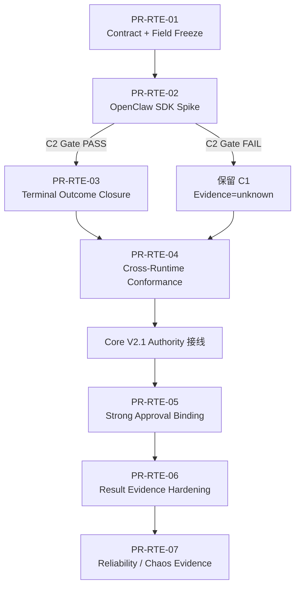

# AgentGuard Runtime Enforcement Contract v1 — 设计与实施方案索引

> 状态：**Design Freeze Candidate / 实施基线**  
> 仓库：`JToday666/agent-guard`  
> 基线分支：`dev`  
> 基线 Commit：`efe1c95df52b2be3e62d4b48510bfc410397c69f`  
> 重写日期：`2026-08-15`  
> 适用范围：LangGraph Adapter、OpenClaw Plugin、Guard API / Control Plane、AgentGuard Core V2.1、Audit / Provenance / AttackBench

---

## 1. 本设计包解决什么问题

AgentGuard 当前并不缺少 Runtime Enforcement：LangGraph 已经拥有受保护工具调用边界、ASK 等待、真实调用与 `not_invoked / executed / failed` 回执；OpenClaw 也已经具备真实 `deny/ask` 阻断、fail-closed、工具结果净化/隔离和 durable runtime-outcome 投递。当前真正需要解决的是：

1. 将分散在 Adapter、Guard API、Receipt Schema、Dashboard 设计中的执行语义收敛成一套**冻结、跨 Runtime、可机器验证**的 Runtime Enforcement Contract；
2. 补齐 OpenClaw `ALLOW / approval_release → terminal execution fact` 的证据闭环，但严格遵守“只记录 Runtime 能证明的事实”；
3. 将 `Decision / Approval / Enforcement Gate / Runtime Execution` 四层事实彻底分离；
4. 将 Strong Approval Binding 对齐 Core V2.1 已冻结的 `authorization_fingerprint → CapabilityGrant → GrantConsumption → ExecutionLease`，**不另造第二套授权机制**；
5. 用 Cross-Runtime Conformance Suite 把“文档约定”升级为“机器可验证契约”。

本轮是**契约收敛与执行证据闭环**，不是重写 Runtime Adapter，也不是新增一套 Runtime Event Universe。

### 1.1 基线漂移说明

设计包原基线为 `ce9b33e`（短形），本轮刷新为 `efe1c95df52b2be3e62d4b48510bfc410397c69f`。两个基线之间仅差 1 个提交（V21-04 State Projection/Snapshot，`feat(core)` PR #129），改动面只触及：

- `packages/agentguard-core/agentguard_core/security_context/`；
- `apps/guard-api/guard_api/security_state/`；
- storage 迁移 `0015` 与相关测试。

该提交未触及本设计包锚定的 schemas/receipt/approval/plugin/adapter 面，属低风险漂移；分册中的 CURRENT/TARGET 结论无需重判。

---

## 2. 文档地图

| 文档 | 定位 | 主要读者 |
|---|---|---|
| `01_Runtime_Enforcement_Contract_v1.md` | 总体规范性契约：架构、状态机、安全属性、ALLOW/ASK/DENY、故障与证据语义 | 架构/安全评审、Core/Runtime 开发 |
| `02_字段与Schema契约冻结.md` | 字段、枚举、ID、GateState、Receipt、Approval/Lease API 的精确冻结 | 后端/Adapter/测试开发 |
| `03_OpenClaw实施方案.md` | `after_tool_call` Spike、terminal closure、correlation lifecycle、代码改动点 | OpenClaw 插件开发 |
| `04_LangGraph_Reference_Profile.md` | LangGraph Reference Enforcement 边界、现状与 contract tests | Python Adapter/Bench 开发 |
| `05_Cross_Runtime_Conformance与可靠性验证.md` | Capability Profile、CF 测例、Failure Matrix、CI/Chaos/指标 | 测试/评测/答辩证据 |
| `06_迁移_PR与实施计划.md` | Phase A/B、PR 拆分、依赖、DoD、风险与 Freeze Gate | 项目管理/开发负责人 |
| `07_比赛证据与答辩口径.md` | 题目映射、演示链、可声明/不可声明能力、最终证据 | 比赛报告/答辩 |
| `AgentGuard_Runtime_Enforcement_Contract_v1_完整方案.md` | 上述文档合并版 | 设计评审、归档 |

> **事实源声明**：00–07 八个分册是本设计包的唯一事实源；`AgentGuard_Runtime_Enforcement_Contract_v1_完整方案.md` 为 2026-08-15 评审归档快照（基线 ce9b33e），后续修订只进分册、不再同步合并版。

---

## 3. 事实状态标签

所有设计结论使用以下标签，禁止把目标态写成现状：

- **CURRENT**：当前 `efe1c95df52b2be3e62d4b48510bfc410397c69f` 已实现并可由代码/测试证明。
- **TARGET-P0**：本轮 Runtime Contract 必须完成，属于比赛/闭环主线。
- **TARGET-P1**：依赖 Core V2.1 或 SDK 能力的增强目标。
- **DEFERRED**：明确不进入本轮主线。

---

## 4. 本轮最终冻结的核心决策

### 4.1 四层事实永久分离

```text
Policy Decision  ≠  Approval Resolution  ≠  Enforcement Gate  ≠  Runtime Execution Fact
```

- `decision=deny` 不能自动推出 `execution=not_invoked`；
- `approval=allow_once` 不能自动推出 `execution=executed`；
- `blocked=true` 只作为策略层摘要，不能当作真实 Runtime 阻断证据；
- 真实执行事实只由 Runtime 观察点产生。

### 4.2 Runtime Outcome 四态保持不变

```text
not_invoked | executed | failed | unknown
```

ResultDisposition 五态保持不变：

```text
not_applicable | passed_through | modified | quarantined | unknown
```

### 4.3 ExecutionLease 交付通道服从 Core V2.1 已冻结契约

不再采用“随 approval wait response 下发 lease”的旧设计。Strong Profile 固定：

```text
GET /v1/approvals/{approval_id}/wait
    ↓ resolved allow_once
POST /v1/approvals/{approval_id}/execution-leases/consume
    ↓
GrantConsumption + ExecutionLease
    ↓
Runtime release exact action
```

### 4.4 OpenClaw C2 能力有明确 Gate

只有 SDK Spike 证明全部 C2 Gate 判据成立——稳定跨 hook 关联 identity、pre-hook happens-before、success/error 语义、blocked-call 行为、多插件改写不破坏安全关键 identity——才允许宣称 OpenClaw `C2 Execution Closure`。5 条判据的权威清单详见 `03_OpenClaw实施方案.md` §2.2（唯一判据源），本节不再重复完整清单，避免两份清单漂移。

不满足时：OpenClaw 保持 C1，terminal fact 为 `unknown`，**不伪造 executed**。

### 4.5 DENY 后观察到执行不是“忽略”，而是 Enforcement Violation

若 Spike 证明 `after_tool_call` 代表真实 invocation/completion，而 Runtime 在 `gate_state=blocked/timed_out/binding_failed` 后仍产生 terminal observation，则必须记录真实 `execution_completed/execution_failed`，同时：

```text
intervention.type = enforcement_violation
```

这是安全异常，不能为了保持“deny=blocked”的叙事而删除事实。

---

## 5. 基线证据入口

本设计包以以下仓库事实为主要基线：

- `docs/02_core/interface_contract.md`
- `docs/04_apps/runtime_safety_observability_design.md`
- `docs/03_adapters/runtime_hooks_inventory.md`
- `docs/AgentGuard_Core_V2.1_Final_Contract_Freeze/01_F1字段与契约冻结.md`
- `packages/agentguard-langgraph-adapter/agentguard_langgraph_adapter/tool_gateway.py`
- `packages/agentguard-langgraph-adapter/agentguard_langgraph_adapter/runtime_receipts.py`
- `packages/agentguard-openclaw-plugin/src/hooks/tool.ts`
- `packages/agentguard-openclaw-plugin/src/runtime/enforcement.ts`
- `packages/agentguard-openclaw-plugin/src/runtime/state.ts`
- `packages/agentguard-openclaw-plugin/src/runtime/outcome-delivery.ts`
- `packages/agentguard-openclaw-plugin/src/mapping/audit-outcomes.ts`
- `schemas/runtime_outcome_receipt.schema.json`
- `apps/guard-api/guard_api/services/evaluation.py`
- `apps/guard-api/guard_api/services/approval.py`
- `packages/agentguard-core/agentguard_core/security_context/facts.py`（CapabilityGrant/GrantConsumption/ExecutionLease 冻结模型，含 human_approval single-use 校验器）
- `apps/guard-api/guard_api/security_state/`（V21-04 SecurityState 服务与存储）

---

## 6. 推荐实施顺序



P0 不等待 Core V2.1 全部落地：Contract、Spike、OpenClaw terminal closure、Conformance 可独立推进。Strong Approval Binding 才依赖 V2.1 production wiring。
