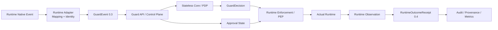
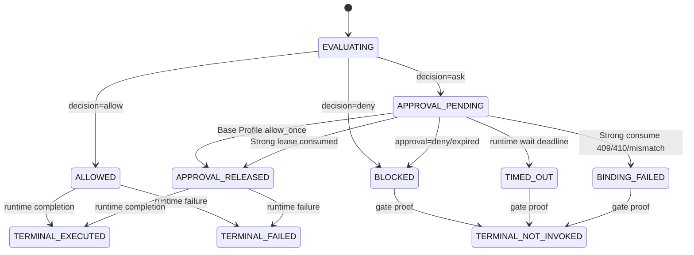

# AgentGuard Runtime Enforcement Contract v1

> 状态：**Normative Design Freeze Candidate**  
> 基线：`dev@efe1c95df52b2be3e62d4b48510bfc410397c69f`  
> 本文使用 RFC 2119 风格的 **MUST / MUST NOT / SHOULD / MAY** 表示规范强度。

---

## 1. 目标与非目标

### 1.1 目标

本契约定义 AgentGuard Runtime Security Plane 在不同 Runtime 中必须保持一致的安全语义，覆盖：

- Runtime Native Event → `GuardEvent` 的映射边界；
- `ALLOW / ASK / DENY` 的执行语义；
- 审批等待、超时、晚到审批和 Strong Approval Binding；
- 执行前阻断、执行后终态、结果隔离；
- Runtime Outcome 的事实权威和证据等级；
- 网络失败、重启、重复请求、重复回执；
- LangGraph/OpenClaw 的能力差异与 Conformance 口径。

### 1.2 非目标

本轮明确不做：

1. 不重写 Guard API / Core；
2. 不新增 `/v1/runtime/outcomes`；Runtime Outcome 继续复用 `POST /v1/audit/events`；
3. 不新增第三套 `RuntimeEvent/AgentActionEvent` 后端事实模型；
4. 不把所有 Runtime 强行做成相同能力；
5. 不声称 `after_tool_call` 能证明外部业务副作用；
6. 不建立企业级完整 Chaos Framework；
7. 不在本轮解决所有 Context/Memory V2.1 强制语义。

---

## 2. Runtime Security Plane 架构



职责边界冻结：

| 组件 | 权威职责 | 禁止职责 |
|---|---|---|
| Adapter | 原生字段映射、action identity、Runtime capability 声明 | 不重新做风险判定 |
| Core / PDP | “应该如何处理”：allow/ask/deny | 不声称动作实际执行/未执行 |
| Control Plane | 鉴权、策略快照、审批、审计、强授权消费 | 不伪造 Runtime terminal fact |
| Enforcement / PEP | 真正阻断/暂停/释放受保护动作 | 不修改 Core decision 语义 |
| Runtime Observation | 证明开始、完成、失败、结果处置 | 不从 decision 推断执行事实 |
| Dashboard / AttackBench | 投影、聚合、统计 | 不补造未来事实 |

---

## 3. 五条设计原则

### RTE-P1 — Four-Layer Fact Separation

```text
Decision ≠ Approval ≠ Gate ≠ Execution
```

四层可以组合展示，但任何一层不得覆盖另一层。

### RTE-P2 — Unknown Is Safer Than Fabrication

无法证明的执行状态必须是 `unknown`；无法测量的副作用必须是 `not_measured/unknown`。

### RTE-P3 — No New Event Universe

继续复用现有：

```text
GuardEvent
GuardDecision
Approval
AuditEvent
RuntimeOutcomeReceipt
```

### RTE-P4 — Complete Mediation Is Scoped

“完全中介”只能在 **instrumented / protected execution boundary** 内成立。

- LangGraph：调用必须经 `GuardedToolGateway/SecureToolNode`；
- OpenClaw：调用必须经过插件已验证的 blocking hook；
- 绕过这些路径的直接 Runtime 调用不在当前保护域内。

### RTE-P5 — Runtime Fact Authority

只有 Runtime 或拥有该执行边界的 Adapter/Plugin 能回答：

```text
是否真正调用？是否完成？是否失败？结果是否被隔离？
```

---

## 4. 安全属性

| ID | 属性 | 冻结要求 |
|---|---|---|
| S01 | Pre-execution mediation | `pre_execution=true` 的受保护动作必须先 evaluate |
| S02 | Decision fidelity | Runtime 不得把 deny/ask 重解释为 allow |
| S03 | ASK pause | 未获得允许的 ASK 不得进入 invocation |
| S04 | Fail-safe | enforce 模式下关键 pre-exec evaluation failure 不得 silent fail-open |
| S05 | Stable action identity | 跨 hook 终态闭环必须有稳定 Runtime-native correlation identity |
| S06 | Evaluation idempotency | Transport retry 使用相同 `event_id + canonical content` |
| S07 | Approval freshness | runtime wait timeout 后晚到审批不得复活旧 attempt |
| S08 | Approval binding | Strong Profile 必须 exact-bind canonical action fingerprint |
| S09 | No double execution | evaluate/receipt/approval retry 不得导致重复工具执行 |
| S10 | Evidence honesty | 未观察事实保持 unknown/null |
| S11 | Receipt idempotency | 相同 runtime fact 重投不产生重复权威事实 |
| S12 | Restart safety | 重启后不自动恢复无法证明身份的旧动作 |
| S13 | Result isolation honesty | `quarantined` 不得伪装成 `not_invoked` |
| S14 | Side-effect honesty | 未测量副作用不得填写 count |
| S15 | Infrastructure accounting | fail-closed infra block 不计 detector 成功 |
| S16 | Gate/terminal consistency | terminal fact 与 gate 预期冲突必须显式标记 violation |
| S17 | Active-state integrity | 活跃 correlation state 不得被普通 FIFO 静默淘汰 |
| S18 | Hook capability gate | Runtime 未通过 SDK/Conformance 验证不得宣称对应 capability |
| S19 | Secret minimization | ephemeral/durable correlation 不得新增不必要秘密副本 |
| S20 | LLM authority isolation | V2 Strong Profile 中 LLM allow_once 不得变成可消费 ExecutionLease |

---

## 5. 事实权威表

| 事实 | 权威生产者 |
|---|---|
| `GuardEvent` 原生动作映射 | Adapter / Plugin |
| `GuardDecision` | Core，经 Guard API 返回 |
| `policy_audit_id` | Guard API policy-evaluation writer |
| Approval 状态 | Guard API / Control Plane |
| Gate 状态 | Runtime Enforcement |
| `not_invoked` | 真正位于 invocation 前的 Gate |
| `executed/failed` | 真实 Runtime terminal observation |
| Tool result modified/quarantined | 能实际改写/隔离结果的 Runtime hook |
| side effects | sandbox/runtime/external system 的真实 measurement |
| Provenance | Control Plane writer 对权威事实的投影 |

---

## 6. Gate 状态机冻结

为避免 `released:boolean` 无法区分普通 ALLOW 与 ASK release，内部 Gate 状态固定为：

```text
EVALUATING
ALLOWED
APPROVAL_PENDING
APPROVAL_RELEASED
BLOCKED
TIMED_OUT
BINDING_FAILED
```

其中：

```text
execution_authorized = gate_state ∈ {ALLOWED, APPROVAL_RELEASED}
```

状态机：



`TERMINAL_*` 是逻辑状态，不要求新增公共后端模型。

注：本节 UPPERCASE 仅为图示记法；wire/代码规范形态为 lowercase 字面量，冻结定义回指 `02_字段与Schema契约冻结.md` §3。逐值等价映射：EVALUATING↔`evaluating`、ALLOWED↔`allowed`、APPROVAL_PENDING↔`approval_pending`、APPROVAL_RELEASED↔`approval_released`、BLOCKED↔`blocked`、TIMED_OUT↔`timed_out`、BINDING_FAILED↔`binding_failed`。

---

## 7. ALLOW / DENY / ASK 精确语义

### 7.1 ALLOW

Runtime MUST：

1. 在 `before_tool_call` 返回前完成 decision linkage；
2. 将 `gate_state=ALLOWED`；
3. 仅在受保护边界内放行；
4. 若 Runtime 支持 C2，等待真实 terminal hook 后产生 `execution_completed/failed`；
5. 若不支持 C2，terminal execution 保持 `unknown`。

ALLOW 不是执行成功证明。

### 7.2 DENY

Runtime MUST：

```text
gate_state = BLOCKED
actual invocation = 0（在受保护边界内）
RuntimeOutcome = pre_execution_deny
execution.status = not_invoked
result.disposition = not_applicable
```

只有 Gate 真正位于 invocation 之前，才能产生 `not_invoked`。

### 7.3 ASK → deny/expired

```text
ASK → APPROVAL_PENDING → deny/expired → BLOCKED → not_invoked
```

### 7.4 ASK → runtime wait timeout

`runtime_wait_deadline` 与 Approval TTL 是两个概念。Runtime 超时后：

```text
gate_state = TIMED_OUT
current attempt = terminal not_invoked
late approval cannot resurrect current attempt
```

新的用户/Runtime 尝试必须重新 evaluate。

### 7.5 ASK → allow_once（Base Profile）

在 Strong Profile 尚未接线前，现有兼容路径可以：

```text
wait resolved allow_once
→ gate_state=APPROVAL_RELEASED
→ runtime continues
```

但不得宣称 exact canonical action binding 已完成。

### 7.6 ASK → allow_once（Strong Profile）

固定流程：

```mermaid
sequenceDiagram
    participant R as Runtime Adapter
    participant G as Guard API
    participant A as Approval Store
    participant X as Execution Lease Service

    R->>G: POST /v1/guard/evaluate
    G-->>R: ask + approval_id + enforcement_binding
    loop until runtime deadline
        R->>G: GET /v1/approvals/{id}/wait
        G-->>R: pending / resolved
    end
    R->>X: POST /v1/approvals/{id}/execution-leases/consume
(action_id, authorization_fingerprint)
    X->>A: atomic validate + consume usage
    X-->>R: lease_id + consumption_id + lease_token + expires_at
    R->>R: verify returned binding fields / expiry
    R->>R: gate_state=APPROVAL_RELEASED
    R->>R: invoke exact current action
```

**不得**把 lease 随 `/wait` 响应下发；独立 consume endpoint 是 V2.1 冻结契约。

---

## 8. 双时钟审批模型

### Approval Lifetime

服务端 `ApprovalRequest.expires_at` 决定审批事实寿命。

### Runtime Wait Deadline

插件本次同步阻塞愿意等待的时间，例如 OpenClaw 当前默认约 25 秒。

冻结：

```text
runtime_wait_deadline <= approval_expires_at
```

两者不要求相等。

Late approval 规则：

- 超时 attempt 已终止；
- 晚到 approval 不得直接恢复原 hook；
- 若 Runtime 重新发起动作，必须重新 evaluate；
- Strong Profile 不得拿旧 approval 给不同 action/fingerprint 消费。

---

## 9. Execution Outcome 与 Gate 冲突

若 Runtime 在 `BLOCKED/TIMED_OUT/BINDING_FAILED` 后仍观察到**被 SDK 证明为真实 completion 的** `after_tool_call`：

1. 不得静默忽略；
2. 不得继续保留 `not_invoked` 作为唯一终态；
3. MUST 上报真实 terminal outcome：

```text
metadata.outcome_kind = execution_completed | execution_failed
execution.status = executed | failed
intervention.type = enforcement_violation
```

4. policy decision 保持原 `deny/ask`；
5. 生成高优先级安全告警/诊断；
6. AttackBench 不得把该 case 计为 confirmed prevention。

这保证“Runtime 事实高于预期叙事”。

---

## 10. Runtime Outcome Contract

公共 schema 继续使用 `RuntimeOutcomeReceipt 0.4`，不新增 endpoint。

### ExecutionStatus

```text
not_invoked | executed | failed | unknown
```

### ResultDisposition

```text
not_applicable | passed_through | modified | quarantined | unknown
```

### OutcomeKind

```text
pre_execution_deny
approval_release
tool_result_modified
tool_result_quarantined
execution_completed
execution_failed
```

关键映射：

| kind | execution.status | result.disposition | 说明 |
|---|---|---|---|
| pre_execution_deny | not_invoked | not_applicable | Gate 确认未进入 Runtime |
| approval_release | unknown | unknown | 只证明释放，不证明执行 |
| execution_completed | executed | unknown/可证明值 | 真实 completion observation |
| execution_failed | failed | not_applicable/unknown | invocation 已进入但失败 |
| tool_result_modified | executed | modified | 工具已执行，结果被改写 |
| tool_result_quarantined | executed | quarantined | 工具已执行，结果未进入目标 context/persistence |

### `blocked` 的冻结解释

Python `GuardDecision.blocked` 是 derived property，不是 GuardDecision wire JSON 的稳定显式字段。AuditEvent/RuntimeOutcomeReceipt 顶层 `blocked` 是**policy-level summary**。

因此：

```text
blocked=true  ≠  confirmed not_invoked
```

Confirmed prevention 只能由：

```text
execution.status == not_invoked
```

证明。

---

## 11. Side Effect / Proof Level

证据等级冻结：

```text
P0 Intent          动作被提出
P1 Decision        Core 作出判定
P2 Gate            Runtime 阻断/释放
P3 Invocation      Runtime 明确观察到调用开始
P4 Completion      Runtime 明确观察到调用完成/失败
P5 External Effect 外部系统确认真实副作用
```

`after_tool_call` 最多天然提供 P4；不得自动宣称 P5。

副作用字段：

- 未测量：`measurement_status=not_measured, count=null`；
- pre-exec deny：在 invocation 入口确实未进入时可 `measured,count=0`；
- LangGraph sandbox `snapshot/diff` 可以提供更高质量本地 side-effect evidence；
- 外部邮件/API 最终业务效果需额外 ack/telemetry，P0 不强求。

---

## 12. Fail-Closed 与故障语义

### Pre-execution evaluate 不可用

Enforce 模式的受保护高影响动作 MUST fail closed。

Observe 模式 MAY fail open，但必须产生 diagnostic。

### Approval wait 故障

- timeout → 当前 attempt `TIMED_OUT/not_invoked`；
- 4xx permanent error → 不释放；
- 网络错误若未到 deadline可重试；到 deadline 终止。

### Receipt delivery 故障

动作已经完成后，receipt delivery 失败**不得改变已经发生的执行事实**。

OpenClaw 继续使用 durable at-least-once spool；receipt retry 不得重执行 action。

### Receipt 无 policy_audit_id

禁止伪造 policy-linked RuntimeOutcome；记录 bounded diagnostic + evidence degradation。

---

## 13. Restart / Crash

### 13.1 未获批准/未释放动作

重启后不得自动恢复旧 pending action。

### 13.2 已消费 ExecutionLease 但进程崩溃

P0/P1 采取保守策略：

- 不因相同 lease 自动重新调用非幂等工具；
- 若无法证明“旧调用未进入 Runtime”，必须要求新的 Runtime attempt / user action；
- 只有工具本身支持稳定 idempotency key 且另行评审后，才可设计 crash-resume。

### 13.3 Outcome spool

已持久化 RuntimeOutcome 可以重启后 drain；这只恢复证据，不恢复动作。

---

## 14. Secret Minimization

Ephemeral correlation state MUST NOT 新增：

```text
lease_token
raw credentials
full sensitive tool result
unbounded secret arguments
```

允许保存：

```text
action_id
event_id
decision_id
policy_audit_id
approval_id
authorization_fingerprint（非明文秘密）
canonical/bounded resource identity
bounded/redacted diagnostic summary
```

当前 OpenClaw `toolParams` 是既有兼容状态；P1 应逐步缩减为安全必要字段，而不是继续复制秘密。

---

## 15. Capability Profiles

| Profile | 能力 |
|---|---|
| C0 Observe | 能映射和审计事件 |
| C1 Pre-Execution Enforcement | ALLOW/ASK/DENY + fail-closed + not_invoked proof |
| C2 Execution Closure | 稳定 action correlation + executed/failed terminal proof |
| C3 Strong Approval Binding | exact fingerprint + one-use lease consume |
| C4 Result Isolation | modified/quarantined 真实结果处置 |
| C5 Side-Effect Measurement | 可证明副作用 measurement |

Capability 是**可验证属性**，不是成熟度评分。Runtime 只有通过对应 conformance tests 才能在 heartbeat/文档中声明。

---

## 16. 规范性 MUST 清单

| ID | 规范 |
|---|---|
| RTE-001 | `pre_execution=true` 的受保护工具动作执行前 MUST evaluate |
| RTE-002 | Core `deny` 在受保护边界内 MUST 阻止 invocation |
| RTE-003 | `ask` MUST 暂停当前动作 |
| RTE-004 | v1 release decision 只接受 `allow_once`；legacy 其他值不得扩大语义 |
| RTE-005 | enforce 模式关键 pre-exec evaluate failure MUST fail closed |
| RTE-006 | Core MUST NOT 产生 Runtime execution fact |
| RTE-007 | transport retry MUST 复用相同 event_id 与 canonical content |
| RTE-008 | 新 Runtime attempt MUST 使用新 event_id |
| RTE-009 | C2 Runtime MUST 具备稳定 native action correlation identity |
| RTE-010 | `event_id` 与 `action_id` MUST NOT 混用 |
| RTE-011 | policy-linked RuntimeOutcome MUST 关联真实 `policy_audit_id` |
| RTE-012 | 无权威 evaluate 时 MUST NOT 伪造 policy-linked receipt |
| RTE-013 | 只有真实 pre-invocation Gate 才能写 `not_invoked` |
| RTE-014 | 只有真实 terminal observation 才能写 `executed` |
| RTE-015 | `failed` MUST 来自真实 invocation failure，且 error bounded |
| RTE-016 | `approval_release` MUST 保持 execution=`unknown` |
| RTE-017 | `result=quarantined` MUST 保持 execution=`executed` |
| RTE-018 | 未测量 side effects MUST NOT 填 count |
| RTE-019 | 顶层 `blocked` MUST NOT 当作 confirmed runtime block |
| RTE-020 | runtime wait timeout 后旧 attempt MUST NOT 被 late approval 复活 |
| RTE-021 | runtime wait deadline MUST NOT 晚于 server approval expiry |
| RTE-022 | Strong Profile allow_once MUST exact-bind `authorization_fingerprint` |
| RTE-023 | Strong Profile MUST 通过独立 execution-lease consume endpoint 原子消费 |
| RTE-024 | Strong grant MUST one-use / CAS，禁止双花 |
| RTE-025 | `lease_token` MUST NOT 进入 Audit/Dashboard/Receipt |
| RTE-026 | LLM-resolved allow_once MUST NOT 产生 V2 可消费 ExecutionLease |
| RTE-027 | Runtime receipt audit_id MUST deterministic |
| RTE-028 | same audit_id + different content MUST 冲突 |
| RTE-029 | receipt retry MUST NOT 重新执行 action |
| RTE-030 | Adapter restart MUST NOT 自动 resume 无法证明身份的旧动作 |
| RTE-031 | Complete mediation 声明 MUST 限定 instrumented boundary |
| RTE-032 | Adapter MUST 声明且验证 capability profile |
| RTE-033 | 能力可以不同，但 MUST NOT 伪造跨 Runtime 等价事实 |
| RTE-034 | `before_tool_call` linkage MUST 在 handler return 前同步完成 |
| RTE-035 | active correlation state MUST NOT 因普通 FIFO 容量静默驱逐 |
| RTE-036 | correlation capacity exhaustion MUST 产生显式 degradation 或策略化 fail-closed |
| RTE-037 | `after_tool_call` capability MUST 先通过 SDK spike 与 runtime smoke |
| RTE-038 | blocked/timed_out 后真实 terminal observation MUST 记录 enforcement violation |
| RTE-039 | after_tool_call handler failure MUST NOT 覆盖真实工具结果；必须 bounded diagnostic |
| RTE-040 | ephemeral correlation MUST 最小化敏感数据复制 |
| RTE-041 | result disposition 与 execution status MUST 独立解释 |
| RTE-042 | AttackBench confirmed prevention MUST 以 `execution.status=not_invoked` 为核心证据 |
