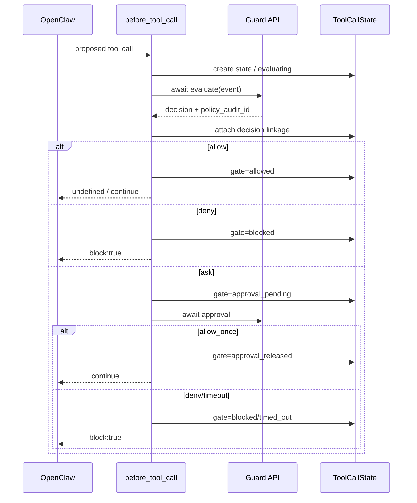

# AgentGuard Runtime Enforcement Contract v1 — OpenClaw 实施方案

> 基线：`dev@efe1c95df52b2be3e62d4b48510bfc410397c69f`  
> 目标：在不重写插件、不虚构 Runtime 事实的前提下，将 OpenClaw 从 **C1 Pre-Execution Enforcement + 部分 C4** 收敛到可验证的 **C2 Execution Closure（若 SDK Gate 通过）**。

---

## 1. CURRENT 基线

当前插件已经具备：

- `before_tool_call`：同步 evaluate，enforce 模式真实 `block:true`；
- `ask`：调用 Guard API approval wait，只有 `allow_once` 才返回继续；
- evaluate/approval 异常：enforce 模式 fail closed；
- `tool_result_persist`：同步本地 credential redaction / persistent instruction sanitation；
- modified 时写 runtime outcome；处理异常时本地 quarantine；
- durable at-least-once outcome spool：先本地持久化再 HTTP，网络/429/5xx 重试；
- `SessionState/ToolCallState`：当前为进程内 Map。

当前主要证据缺口：

```text
ALLOW / approval_release
→ Runtime 执行
→ 普通成功/失败
→ 缺统一 terminal execution_completed / execution_failed fact
```

`approval_release` 当前正确保持 `execution.status=unknown`，这一点不得改坏。

---

## 2. P0-C2 SDK Spike — 先验证再编码

### 2.1 必测问题

Spike 必须在当前 pin 的 OpenClaw SDK/runtime 上回答：

1. `after_tool_call` 是否真实存在于当前 pin；
2. handler 输入的实际 TypeScript type/字段；
3. `event.toolCallId` / `ctx.toolCallId` 是否稳定提供；
4. 是否与 `before_tool_call` 的 ID 完全一致；
5. success path 的 `result` 形状；
6. tool throw/error path 是否仍触发；
7. error 字段与 duration 字段语义；
8. `before_tool_call` handler 完成是否 happens-before tool invocation；
9. 被 `block:true` 的调用是否仍触发 `after_tool_call`；
10. `after_tool_call` 与 `tool_result_persist` 的顺序；
11. handler 自身 throw 时 Runtime 如何处理；
12. 多插件存在时 AgentGuard 看到的 params/result 是原始值、改写前值还是最终值；
13. 其他插件在 approval 后、执行前是否还能改写 params；
14. retry 时 toolCallId 是否复用。

### 2.2 C2 Gate 判据

只有以下全部成立才进入 C2（本节为 5 条 C2 Gate 判据的唯一权威源，`00_README_设计包索引.md` §4.4 仅简述引用）：

```text
stable cross-hook action id = yes
pre hook completes before invocation = yes
success/error semantics = deterministic enough
blocked-call behavior = understood and testable
multi-plugin rewrites do not break security-critical identity = yes
```

否则：

```text
C1 remains PASS
C2 = NOT_SUPPORTED
terminal execution stays unknown
```

**不允许为了完成计划而用时间邻近/工具名/参数相似度猜 terminal linkage。**

---

## 3. 代码结构调整

### 3.1 `src/runtime/state.ts`

新增：

```ts
export type EnforcementGateState =
  | "evaluating"
  | "allowed"
  | "approval_pending"
  | "approval_released"
  | "blocked"
  | "timed_out"
  | "binding_failed";
```

扩展 `ToolCallState`：

```ts
export type ToolCallState = {
  // existing
  toolCallId: string;
  toolName: string;
  toolKind?: string | null;
  toolInputKind?: string | null;
  runId?: string | null;
  derivedResources: DerivedResource[];
  derivedPaths: string[];

  // RTE P0
  correlationSource: "native_tool_call_id" | "local_fallback";
  guardEventId: string;
  traceId: string;
  policyAuditId?: string;
  decisionId?: string;
  decision?: "allow" | "ask" | "deny";
  gateState: EnforcementGateState;
  approvalId?: string | null;
  approvalStatus?: "pending" | "allowed" | "denied" | "expired" | "unknown";
  terminalStatus?: "executed" | "failed";
  terminalObservedAt?: string;
  resultPersistObserved?: boolean;
  createdAtMs: number;
  updatedAtMs: number;

  // P1 strong profile
  authorizationFingerprint?: string;
  runtimeBindingId?: string;
  leaseId?: string;
  consumptionId?: string;
};
```

### 3.2 `rememberToolCallState` 调整

初始状态：

```text
gateState=evaluating
correlationSource=native_tool_call_id | local_fallback
```

如果是 local fallback：

- 允许继续做 C1 pre-exec enforcement；
- `C2Eligible=false`；
- 不在 heartbeat 中声称 stable correlation。

---

## 4. `before_tool_call` 精确顺序

现有路径需要变为显式状态转换：



冻结不变量：

> `policyAuditId + decisionId + decision + final gateState` 必须在 handler 返回给 OpenClaw 前同步写入 correlation state。

禁止 fire-and-forget linkage 更新。

---

## 5. `registerAfterToolCall` TARGET-P0

### 5.1 基本算法

```ts
api.on("after_tool_call", (event, context) => {
  try {
    const callId = resolveNativeToolCallId(event, context);
    if (!callId) {
      recordEvidenceDegradation("after_tool_call_missing_action_id");
      return;
    }

    const state = toolCallState.get(callId);
    if (!state) {
      recordEvidenceDegradation("after_tool_call_correlation_missing");
      return;
    }

    if (!state.policyAuditId || !state.decisionId || !state.decision) {
      recordEvidenceDegradation("after_tool_call_policy_linkage_missing");
      return;
    }

    const terminal = classifyAfterToolCall(event);
    const gateExpectedExecution =
      state.gateState === "allowed" ||
      state.gateState === "approval_released";

    const interventionType = gateExpectedExecution
      ? "runtime_observation"
      : "enforcement_violation";

    fireTerminalOutcome({
      kind: terminal === "failed" ? "execution_failed" : "execution_completed",
      executionStatus: terminal === "failed" ? "failed" : "executed",
      interventionType,
      state,
      event,
    });

    state.terminalStatus = terminal;
    state.terminalObservedAt = now();
    state.updatedAtMs = Date.now();
    maybeEvict(state);
  } catch (error) {
    logBoundedDiagnostic("after_tool_call mapping failed", error);
  }
});
```

### 5.2 为什么 blocked call 不能简单 skip

若 Spike 证明 blocked call 仍会收到 after hook，但 hook 不代表 invocation，则按 SDK 语义记录 diagnostic、不得生成 terminal fact。

若 Spike 证明 after hook 只在实际 invocation/completion 后触发，则：

```text
state.gateState = blocked/timed_out/binding_failed
AND after_tool_call observed
```

代表 Enforcement Violation，必须记录真实 executed/failed。

---

## 6. Outcome Mapper 扩展

当前 `RuntimeOutcomeKind` mapper 只生产三类。P0 扩展支持：

```ts
"execution_completed"
"execution_failed"
```

推荐参数：

```ts
type TerminalOutcomeOptions = {
  invokedAt?: string | null;
  completedAt: string;
  error?: string | null;
  interventionType: "runtime_observation" | "enforcement_violation";
  resultDisposition: "unknown" | "not_applicable";
};
```

### Success

```text
execution.status = executed
error = null
result.disposition = unknown
side_effects.measurement_status = not_measured
```

### Failure

```text
execution.status = failed
error = bounded string
result.disposition = not_applicable/unknown
side_effects.measurement_status = not_measured
```

不得因为 after hook 提供 result 就自动写：

```text
tool_result_entered_context=true
persisted=true
```

除非 SDK hook 语义能直接证明。

---

## 7. Tool Result Evidence

### 7.1 CURRENT 保留

`tool_result_persist` 的同步本地安全处理继续承担：

- credential redaction；
- persistent instruction sanitation；
- fail-closed quarantine fallback。

### 7.2 P0 修正

当前 modified 路径使用 `tool_result_quarantine` kind + disposition=`modified`，最终 mapper 转成 `tool_result_modified`，这一兼容逻辑可以保留。

需要补：

- fail-closed quarantine 如果能够关联原 action/policy，应写 `tool_result_quarantined`；
- 无关联时只 diagnostic，不伪造 policy link。

### 7.3 普通未改写结果

P0 不强制新增“passed-through receipt”，因为 `tool_result_persist` 是持久化前 hook，返回 `undefined` 未必等于最终持久化已完成。

只有额外 hook/SDK 事实能证明时，P1 才把 `passed_through` 升为可宣称事实。

---

## 8. Correlation 生命周期与驱逐

当前通用 `setLimited(..., 200)` FIFO 不能继续作为 C2 active-state 主驱逐策略。

### 8.1 生命周期

```text
created/evaluating
→ decision linked
→ gate final
→ [optional approval release]
→ terminal after_tool_call
→ [optional result persist]
→ grace period
→ evict
```

### 8.2 可立即驱逐

```text
blocked + pre_execution_deny receipt safely queued
 timed_out + receipt safely queued
 binding_failed + receipt safely queued
 terminal failed + receipt safely queued
```

### 8.3 需要短暂保留

`execution_completed` 后应保留短 grace TTL，允许 `tool_result_persist` 补充 result disposition。

### 8.4 Active state 保护

以下不得因普通 FIFO 静默淘汰：

```text
evaluating
approval_pending
allowed but terminal not observed
approval_released but terminal not observed
```

### 8.5 Capacity Exhaustion

推荐：

```text
active capacity hard limit
→ do not evict active state
→ emit evidence degradation
→ if policy require_terminal_evidence=true: fail closed before new high-impact action
→ otherwise preserve C1 enforcement but mark C2 degraded
```

P0 默认可以选择第二种，避免把 evidence subsystem 变成无条件 availability killer；但必须显式暴露 degradation。

---

## 9. Restart 语义

当前 correlation Map 是进程内，重启后丢失。

P0：

- 不持久化全部 session/tool state；
- 不自动恢复 pending ASK；
- 已阻断动作保持终止；
- durable outcome spool 继续 drain；
- 重启后的新 Runtime call 重新 evaluate。

P1 Strong Profile：即使已拿 lease，也不自动重放非幂等动作。

---

## 10. Strong Approval Binding P1

### 10.1 依赖

必须等 Guard API/Core V2.1 production evaluate 提供 `enforcement_binding`。

### 10.2 流程

```text
ask
→ wait allow_once
→ still within runtime deadline
→ consume ExecutionLease(action_id, authorization_fingerprint)
→ 2xx exact response
→ gate=approval_released
→ invoke
```

### 10.3 失败

```text
409 mismatch/conflict → binding_failed + not_invoked
410 expired           → binding_failed + not_invoked
network until deadline→ timed_out + not_invoked
LLM allow_once         → consume rejected / no strong release
```

---

## 11. 文件修改清单

### PR-RTE-02 Spike

- `packages/agentguard-openclaw-plugin/test/...`：最小真实 SDK/runtime probe
- `docs/03_adapters/runtime_hooks_inventory.md`
- 可增加 `scripts/openclaw-after-tool-call-spike.mjs`

### PR-RTE-03 Terminal Closure

- `src/runtime/state.ts`
- `src/hooks/tool.ts`
- `src/mapping/audit-outcomes.ts`
- `src/runtime/outcome-receipt.ts`
- `src/index.ts`
- `src/types.ts`
- `hook-contract.mjs`
- `README.md`
- 相关 unit/contract/e2e tests

### P1 Strong Binding

- `guard-api-client.ts` 增 consume method
- `types.ts` 增加 target additive types
- `hooks/tool.ts` ASK release 接 consume
- Guard API/Core 由 V2.1 PR 负责 production wiring

---

## 12. OpenClaw P0 验收

必须同时通过：

1. deny → `block:true` + `not_invoked`；
2. ask deny → `not_invoked`；
3. ask timeout → `not_invoked`，late approval 不恢复；
4. allow → 若 C2 Gate PASS，真实 `execution_completed/failed`；
5. ask allow_once → `approval_release(unknown)` 后真实 terminal receipt；
6. blocked-call after-hook 语义有自动化测试；
7. native toolCallId 不稳定时 capability 自动降为 C1；
8. active state 不被 FIFO 静默淘汰；
9. receipt 网络故障不重复执行；
10. handler mapping 异常只影响证据，不篡改已经完成的 Runtime tool result。
