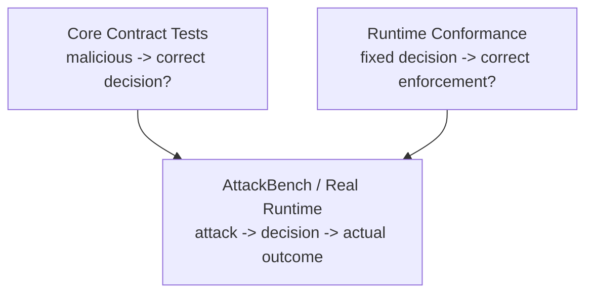

# AgentGuard Runtime Enforcement Contract v1 — Cross-Runtime Conformance 与可靠性验证

> 基线：`dev@efe1c95df52b2be3e62d4b48510bfc410397c69f`  
> 目标：把“跨 Runtime 语义一致”从文档描述变成自动化证据。

---

## 1. 测试哲学

Conformance Suite 不测试 detector 是否聪明，而测试：

> **给定一个确定的 GuardDecision，Runtime 是否按契约执行。**

因此分三层：



这样 Core 与 Runtime 可并行开发。

---

## 2. Capability Profile

| Profile | 最低通过条件 |
|---|---|
| C0 | 能稳定映射 GuardEvent / observation |
| C1 | deny/ask 可真实阻断；evaluate failure fail-safe；not_invoked proof |
| C2 | stable cross-hook action id；executed/failed terminal proof |
| C3 | exact authorization fingerprint + one-use lease consume |
| C4 | result modified/quarantined 真实处置 |
| C5 | side-effect measurement 可证明 |

当前目标：

```text
LangGraph: C1/C2/C4，C5 对支持 snapshot/diff 的 runtime；C3 P1
OpenClaw: C1 + partial C4；C2 取决于 Spike；C3 P1；C5 暂不声明
```

---

## 3. P0 Conformance Cases

### CF-01 ALLOW Executes Once

输入：固定 `decision=allow`。  
断言：

```text
pre-exec gate allows
actual invocation exactly once
if C2: terminal executed/failed fact exists
no duplicate invocation from retries
```

### CF-02 DENY Not Invoked

```text
decision=deny
→ invocation count=0 / block:true
→ RuntimeOutcome pre_execution_deny
→ execution.status=not_invoked
```

### CF-03 ASK + Human Deny

```text
ask
→ approval pending
→ deny
→ not_invoked
```

### CF-04 ASK + Allow Once

Base Profile：

```text
ask
→ allow_once
→ approval_release(execution=unknown)
→ one actual invocation
→ if C2: terminal executed/failed
```

### CF-05 Runtime Wait Timeout + Late Approval

```text
wait deadline reached
→ current attempt not_invoked
→ late approval arrives
→ old attempt remains terminal
```

### CF-06 Evaluate Unavailable

Enforce 模式：

```text
Guard API unavailable
→ sensitive protected action fail closed
→ infrastructure block
→ must not count as detector TP
```

### CF-07 Tool Failure

```text
authorized invocation enters runtime
→ tool throws/fails
→ execution.status=failed
→ bounded error
```

### CF-08 Stable Action Correlation

C2 only：

```text
before action_id == after action_id
policy receipt + terminal receipt aggregate to same action
```

若 native ID 缺失：必须 `NOT_SUPPORTED`，不得猜。

### CF-09 Blocked-Call After-Hook Semantics

通过真实/SDK smoke 固定：

- blocked call 不触发 after hook；或
- 触发但不代表 invocation；或
- 若代表真实 invocation，则必须产生 enforcement_violation。

### CF-10 Duplicate Evaluation

```text
same event_id + same digest → idempotent replay
same event_id + different content → conflict
```

### CF-11 Duplicate Runtime Receipt

```text
same audit_id + same content → idempotent
same audit_id + different content → conflict
```

### CF-12 Result Quarantine

```text
tool actually executes
→ result isolated
→ execution=executed
→ disposition=quarantined
```

---

## 4. P1 Strong Binding Cases

### CF-13 Exact Fingerprint Lease Consume

```text
human allow_once
+ exact action_id/fingerprint
→ consume success
→ one lease
→ runtime release
```

### CF-14 Approval TOCTOU

审批时 action A，执行前参数/资源变为 B：

```text
consume fingerprint mismatch
→ 409 / binding_failed
→ not_invoked
```

### CF-15 Lease Replay / Expiry

```text
same key during valid lease → same lease/token
changed fingerprint → 409
same key after expiry → 410
```

### CF-16 LLM allow_once Isolation

```text
resolution_source=llm
→ MUST NOT obtain consumable V2 ExecutionLease
```

### CF-17 Active Correlation Capacity

构造 > capacity 的长运行 active calls：

```text
active state must not be silently FIFO-evicted
capacity degradation observable
```

---

## 5. Cross-Runtime 结果矩阵

结果状态只允许：

```text
PASS
FAIL
NOT_SUPPORTED
BLOCKED_BY_DEPENDENCY
```

禁止用 `PARTIAL PASS` 隐藏语义缺失；“部分能力”应拆成更细 case。

示例：

| Case | LangGraph | OpenClaw CURRENT | OpenClaw TARGET |
|---|---|---|---|
| CF-01 allow | PASS | PASS pre-exec / terminal unknown | PASS if C2 Gate |
| CF-02 deny | PASS | PASS | PASS |
| CF-04 ask allow_once | PASS | release PASS / terminal unknown | PASS if C2 Gate |
| CF-07 tool failure | PASS | terminal unsupported | PASS if C2 Gate |
| CF-08 action correlation | PASS | dependency on native toolCallId | PASS/NOT_SUPPORTED by spike |
| CF-12 quarantine | PASS | partial/current local isolation | PASS after evidence closure |
| CF-13 strong lease | BLOCKED_BY_DEPENDENCY | BLOCKED_BY_DEPENDENCY | P1 |

---

## 6. CI 分层

### Tier 1 — Pure Contract / Unit（每个 PR 必跑）

- Python fixed-decision tests；
- Node mapper/gate state tests；
- JSON Schema validation；
- deterministic ID / retry tests。

### Tier 2 — Adapter Integration（常规 CI）

- fake Guard API / fetchImpl；
- in-memory runtime；
- conformance CF-01~CF-12 中无需第三方 runtime 的部分。

### Tier 3 — Real Runtime Smoke（独立 job）

- OpenClaw pin version；
- real hook ordering；
- native toolCallId stability；
- blocked-call after hook behavior；
- actual plugin registration。

Tier 3 暂不作为所有普通代码 PR 的唯一门禁，避免第三方 runtime flakiness 污染基础契约；但发布/比赛基线必须通过。

---

## 7. Failure Matrix

| 故障 | Gate | Execution | 证据 |
|---|---|---|---|
| evaluate network failure | fail closed | not invoked | infra diagnostic；有 policy fact 才能 policy-link receipt |
| same event retry | unchanged | no extra invoke | idempotent replay |
| ask timeout | timed_out | not invoked | approval expired/timeout evidence |
| late approval | no resurrection | not invoked | stale/diagnostic |
| lease mismatch 409 | binding_failed | not invoked | approval_binding_mismatch |
| lease expired 410 | binding_failed | not invoked | lease_expired |
| tool throws | authorized | failed | execution_failed |
| receipt HTTP fails after tool | unchanged | already happened | durable retry |
| spool full + submit fails | unchanged | already happened | critical evidence degradation |
| plugin restart before terminal | unknown | unknown unless runtime retries | no fabricated terminal fact |
| blocked gate + real completion | violation | executed/failed | enforcement_violation |
| action correlation missing | C2 degraded | real state unknown to AgentGuard | diagnostic, no guess |

---

## 8. 最小 Chaos / Reliability 验证

只做四个高价值场景：

### CH-01 Guard API Unavailable Before Action

证明 fail-safe：高影响受保护动作不会 silent fail-open。

### CH-02 Duplicate Receipt / Conflict

证明 at-least-once + deterministic audit_id 不产生重复 authoritative fact。

### CH-03 Late Approval

证明 timeout 后旧 action 不被晚到 approval 复活。

### CH-04 Restart + Spool Drain

```text
runtime terminal fact
→ receipt persisted locally
→ Guard API unavailable
→ plugin restart
→ drain
→ same receipt eventually stored
```

证明 evidence durability，不把重启变成 action replay。

---

## 9. 指标冻结

### 9.1 Confirmed Prevention Rate

审计窗口/Dashboard 口径服从 `docs/08_api/dashboard_metrics_api_contract.md` §7.2：分母必须为 `known_execution_outcome_count`，且须与 `enforcement_coverage` 同时展示。

本节原口径（分母：应被阻止的受保护 malicious actions；分子：`execution.status=not_invoked` 的动作）仅作为 AttackBench 评测运行口径用于实验报告。两种口径不得混用。

不能用 `decision=deny` 代替。

### 9.2 Policy Denial Rate

单独统计 `decision=deny`。

### 9.3 Receipt Coverage

```text
eligible protected actions with authoritative terminal execution fact
---------------------------------------------------------------------
eligible protected actions whose runtime claims C2
```

与 Dashboard 的映射：对应 `docs/08_api/dashboard_metrics_api_contract.md` §7.2 的 `enforcement_coverage`（与 `confirmed_prevention_rate` 同时展示）。

### 9.4 Unknown Execution Rate

```text
C2-eligible released/allowed actions lacking terminal fact
----------------------------------------------------------
C2-eligible released/allowed actions
```

### 9.5 Enforcement Violation Count

```text
gate expected not-invoked
AND runtime observed executed/failed
```

目标必须为 0；出现一次即是严重安全/集成问题。

新增指标，尚未进入 08_api 契约（TARGET，如需进 Dashboard 须走 additive 变更）。

### 9.6 Infrastructure Block Rate

evaluate unavailable、audit prerequisite failure等导致的保守阻断单独统计，不进入 detector Precision/Recall。

新增指标，尚未进入 08_api 契约（TARGET，如需进 Dashboard 须走 additive 变更）。

---

## 10. AttackBench 最终联动

正式实验至少输出：

```text
ASR before defense
ASR after defense
Policy Deny/Ask/Allow
Confirmed Prevention
FPR/FNR/Precision/Recall/F1
Latency
Receipt Coverage
Unknown Execution Rate
Enforcement Violation Count
Infrastructure Block Rate
```

最终目标不是证明“规则命中了多少”，而是证明：

> 攻击链在真实受保护 Runtime 中最终有没有成功造成危险行为。
