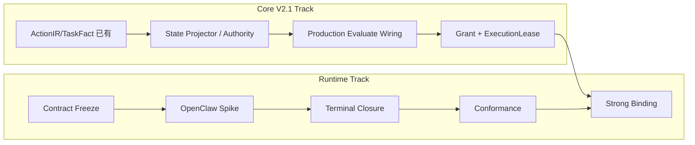

# AgentGuard Runtime Enforcement Contract v1 — 迁移、PR 与实施计划

> 基线：`dev@efe1c95df52b2be3e62d4b48510bfc410397c69f`

---

## 1. 总体实施策略

原则：

```text
不重写
不新增事件宇宙
先冻结语义
先验证 SDK
再补 OpenClaw 终态
再做机器化 Conformance
最后接 V2.1 Strong Binding
```

---

## 2. Phase A / Phase B

### Phase A — Base Enforcement Contract（立即可做，P0）

不依赖 Core V2.1 production wiring：

- GateState 冻结；
- ID / retry / timeout / fail-closed；
- OpenClaw SDK Spike；
- terminal execution closure；
- lifecycle-aware correlation；
- Cross-Runtime Conformance；
- minimal reliability tests。

### Phase B — Strong Authorization Profile（P1）

依赖：

- V2.1 ActionIR 进入生产 evaluate；
- authoritative `authorization_fingerprint` 暴露；
- human approval CapabilityGrant；
- GrantConsumption/ExecutionLease service；
- additive `enforcement_binding` response。

---

## 3. PR-RTE-01 — Contract & Field Freeze

### Scope

只改文档/schema fixtures/contract tests，不改真实 Runtime 行为。

### 主要内容

1. 加入本设计包核心文档；
2. 冻结 GateState；
3. 修正旧方案 ExecutionLease 通道：采用独立 consume endpoint；
4. 明确 `GuardDecision.blocked` wire 语义；
5. 冻结 C0~C5 capability；
6. 增加 RTE-001~042 checklist；
7. 更新 `runtime_hooks_inventory.md` 中 after_tool_call 计划状态。

### DoD

- 文档之间无冲突；
- 不与 Core V2.1 §31 冲突；
- 所有 CURRENT/TARGET/DEFERRED 标注明确；
- schema 示例通过当前 JSON Schema。

---

## 4. PR-RTE-02 — OpenClaw `after_tool_call` SDK Spike

### Scope

不先上 production terminal mapping，只验证真实 SDK 语义。

### 输出

- spike script/test；
- 一份机器可读 capability result 或测试断言；
- 文档结论：C2 Gate PASS / FAIL。

### 必须回答

```text
stable toolCallId?
hook ordering?
blocked call behavior?
error path?
plugin mutation visibility?
handler throw behavior?
retry identity?
```

### DoD

若任何关键问题未知：C2 不进入正式实现。

---

## 5. PR-RTE-03 — OpenClaw Terminal Outcome Closure

**前置：PR-RTE-02 C2 Gate PASS。**

### 修改文件

- `src/runtime/state.ts`
- `src/hooks/tool.ts`
- `src/mapping/audit-outcomes.ts`
- `src/runtime/outcome-receipt.ts`
- `src/types.ts`
- `src/index.ts`
- `hook-contract.mjs`
- tests/docs

### 功能

- gateState；
- synchronous policy linkage before return；
- after_tool_call → execution_completed/failed；
- blocked terminal → enforcement_violation；
- lifecycle-aware eviction；
- capacity degradation；
- fail-safe diagnostics。

### DoD

- normal allow terminal fact；
- ask release terminal fact；
- tool failure terminal fact；
- denied action 无 invocation；
- contradiction path有 violation test；
- native ID missing 时不伪造 C2。

---

## 6. PR-RTE-04 — Cross-Runtime Conformance Suite

### 结构建议

```text
tests/runtime_conformance/
  contract_cases.*
  langgraph_profile.*
  openclaw_profile.*
  expected_capabilities.*
```

或保持 Python/Node 各自测试目录，但共享 case IDs 与 YAML/JSON fixture。

### 第一批进入常规 CI

```text
CF-01 ~ CF-07
CF-10 ~ CF-12
```

### Real Runtime job

```text
CF-08/09 + OpenClaw hook semantics
```

---

## 7. Core V2.1 Freeze Gate

PR-RTE-05 前必须确认：

| 项目 | 必须冻结 |
|---|---|
| ActionIR action_id | 是 |
| authorization_fingerprint algorithm/version | 是 |
| runtime_binding_id authority | 是 |
| human approval CapabilityGrant projection | 是 |
| GrantConsumption CAS | 是 |
| ExecutionLease consume endpoint | 已冻结，实施需完成 |
| LLM allow_once non-consumable rule | 是 |
| evaluation response enforcement_binding | 需 additive freeze |

---

## 8. PR-RTE-05 — Strong Approval Binding

### Guard API

实现/接线：

```text
POST /v1/approvals/{id}/execution-leases/consume
```

必须单事务：验证 + consume + lease。

### Core/State

将 V2.1 ActionIR/CapabilityGrant/Consumption/Lease 接 production path。

### Runtime

OpenClaw/LangGraph：

```text
wait allow_once
→ consume lease
→ exact identity checks
→ release
```

### DoD

- exact match success；
- modified args/resource 409；
- expired 410；
- double consume safe；
- LLM allow_once 不可消费；
- lease token 不出现在日志/audit/receipt。

---

## 9. PR-RTE-06 — Result Evidence Hardening

### P1 内容

- OpenClaw fail-closed result quarantine receipt；
- result persistence/correlation 更完整；
- 减少 full `toolParams` 内存复制；
- 若 SDK 能证明 passed-through，再正式使用 disposition=`passed_through`；
- Context/Memory enforcement 等 Core V2.1 StateDelta/taint interface 冻结后再接。

---

## 10. PR-RTE-07 — Reliability Evidence

只做：

```text
CH-01 API unavailable
CH-02 duplicate receipt
CH-03 late approval
CH-04 restart + drain
```

不构建通用 chaos platform。

---

## 11. 并行开发关系



两条线共享 Freeze Gate，但 P0 不互相阻塞。

---

## 12. 风险登记

| 风险 | 级别 | 缓解 |
|---|---|---|
| ExecutionLease endpoint 与旧 Runtime 文档冲突 | P0 blocker | 统一服从 V2.1 consume endpoint |
| after_tool_call 非 completion 语义 | P0 blocker | Spike Gate；失败则 C2 NOT_SUPPORTED |
| native toolCallId 不稳定 | C2 blocker | 不猜 identity，保留 C1 |
| active state FIFO 驱逐 | P0/P1 | lifecycle-aware eviction |
| handler ordering 与预期不同 | P0 blocker | real runtime smoke |
| evaluate linkage 异步写入 | implementation bug | handler return 前同步 attach |
| LLM allow_once 权限升级 | P1 blocker | consume 只接受 human authority |
| correlation 内秘密复制 | P1 | 最小化 state |
| smoke flakiness | CI | Tier 1/2 与 Tier 3 分层 |
| 过度做 Context/Memory | 进度风险 | 等 Core interface Freeze |

---

## 13. P0 完成定义

P0 只有在以下同时成立才算完成：

### Contract

- RTE-001~042 无冲突；
- Core V2.1 ExecutionLease 端点完全一致；
- fields/schema examples 可验证。

### LangGraph

- Reference boundary 明确；
- deny→0 invocation；
- ask→真实 pause/release；
- terminal outcome tests 通过。

### OpenClaw

- Spike 有确定结论；
- C2 Gate PASS 时完成 terminal closure；Gate FAIL 时准确降级；
- denied/timeout 仍真实阻断；
- active state 不静默丢失；
- durable receipt retry 保持。

### Conformance

- P0 fixed-decision cases 自动化；
- 能力矩阵由测试结果生成/维护；
- real runtime smoke 独立可跑。

---

## 14. P1 完成定义

- V2.1 production evaluate 输出 authoritative binding；
- ExecutionLease consume 原子实现；
- human allow_once exact binding；
- LLM allow_once 不可消费；
- TOCTOU/replay/expiry conformance 通过；
- result evidence 与 Context/Memory interface 不冲突。

---

## 15. 明确不做

```text
× 重写 LangGraph Adapter
× 重写 OpenClaw Plugin
× 新 RuntimeEvent 数据库模型
× 新 runtime outcome API
× 用 LLM 参与 Runtime gate 事实判断
× 自动把 deny 当作 not_invoked
× 自动把 approval_release 当作 executed
× 在 OpenClaw C2 Gate 未通过前做“近似 correlation”
× 为比赛构建完整 HA/Service Mesh/Chaos 平台
```
