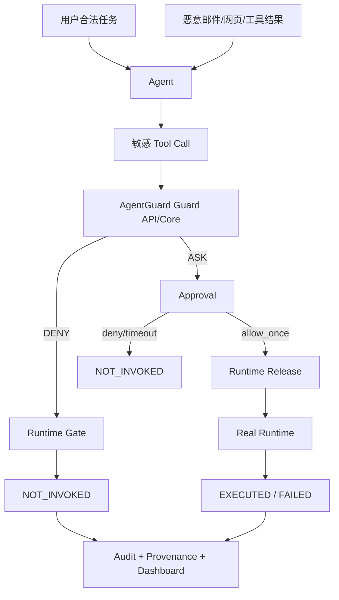

# AgentGuard Runtime Enforcement Contract v1 — 比赛证据与答辩口径

> 本文只定义 Runtime Security Plane 在比赛/报告中的准确表达，不替代正式竞赛题目文档。

---

## 1. 为什么 Runtime Enforcement 是主线能力

AgentGuard 的价值不只是：

```text
发现风险
```

而是：

```text
观察 Agent 行为
→ 实时判定
→ ALLOW / ASK / DENY
→ 真正控制工具/消息/文件/API 行为
→ 产生可验证 Runtime 结果
```

这与“行为监督、工具交互控制、允许/拒绝/询问、实时告警/阻断记录”的作品目标直接对应。

---

## 2. 最强技术叙事

不要把亮点表述成：

> “我们适配了 OpenClaw 和 LangGraph。”

更准确的是：

> **AgentGuard 将安全判定与真实执行结果分离，通过跨 Runtime Enforcement Contract 统一动作身份、审批、执行控制和 Runtime Receipt，使策略决定能够被真实执行边界落实并形成可重放证据。**

Adapter 是工程基础；真正的设计亮点是：

```text
Decision / Approval / Gate / Execution 分离
+ Runtime-independent contract
+ Strong authorization binding
+ Proof-carrying runtime evidence
```

---

## 3. 演示链建议



现场最好同时展示：

1. 恶意外发：`DENY + NOT_INVOKED`；
2. 模糊高风险动作：`ASK → 人工 allow_once → EXECUTED`；
3. 合法正常动作：`ALLOW → EXECUTED`；
4. 工具结果污染：`EXECUTED + QUARANTINED`。

这四条能直观证明安全性、可用性、人机协同和上下文隔离不是一回事。

---

## 4. 可以准确声明

### 当前/完成相应验收后可说

- “AgentGuard 在受保护 Runtime 执行边界上实施 pre-execution mediation。”
- “策略 `deny` 与真实 `not_invoked` 分开记录。”
- “ASK 会真正暂停动作并等待审批，而不是只显示标签。”
- “Runtime Receipt 区分 `not_invoked/executed/failed/unknown`。”
- “工具执行与工具结果隔离被分开建模；`executed + quarantined` 不会被误报成未执行。”
- “跨 Runtime 的能力可以不同，但通过 conformance profile 保持安全语义一致。”
- “OpenClaw outcome receipt 采用 durable at-least-once 投递，不以网络瞬时失败篡改已经发生的 Runtime 事实。”

### Strong Profile 完成后可说

- “人工单次批准与 canonical action fingerprint exact binding，并通过 one-use ExecutionLease 原子消费防止审批双花与 TOCTOU。”

---

## 5. 禁止或必须加限定的表述

### 禁止

> “Core 返回 deny 就证明攻击已被阻断。”

正确：

> “只有 Runtime `execution.status=not_invoked` 才作为 confirmed prevention。”

### 禁止

> “approval allow_once 就证明工具执行成功。”

正确：

> “Approval release 与 execution terminal fact 分开记录。”

### 禁止

> “OpenClaw after_tool_call 证明邮件/API 最终业务副作用已发生。”

正确：

> “它最多证明 Runtime completion；外部业务效果需要 P5 evidence。”

### 必须限定

> “AgentGuard 是 Reference Monitor。”

应说：

> “在 instrumented protected execution boundary 内提供 reference-monitor style complete mediation。”

### Strong Profile 未完成前禁止

> “所有 allow_once 都已经 canonical exact-binding。”

---

## 6. 评委最可能追问的 Runtime 问题

### Q1：你说 deny，怎么证明工具真没执行？

答：

```text
Decision 是 PDP 事实；Runtime Gate 独立产生 not_invoked receipt。
正式阻断率只统计 not_invoked，不把 deny 自动算成成功阻断。
```

### Q2：ASK 是真的暂停吗？

答：展示真实 wait、pending approval、allow_once/deny 后 Runtime 的继续/终止。

### Q3：批准后参数被换了怎么办？

Strong Profile：`authorization_fingerprint + one-use ExecutionLease consume` 防 TOCTOU；未完成前如实说明是 P1 contract。

### Q4：Guard API 掉了怎么办？

Enforce 模式高影响 pre-exec gate fail closed；infra block 单独统计，不计 detector 成功。

### Q5：OpenClaw 和 LangGraph 为什么证据不完全一样？

答：Runtime hook authority 不同。LangGraph Gateway 拥有 actual invoke 边界；OpenClaw 是 host plugin。AgentGuard 采用 capability profile，宁可 `unknown`，也不制造跨 Runtime 假等价。

### Q6：插件能不能被绕过？

答：Complete mediation 有保护边界前提。绕过 instrumented path 的直接 Runtime 调用属于部署/集成边界，需要通过集成检查、强制包装或未来 hardening 解决，不做无限范围宣称。

---

## 7. 最终实验表格建议

| 指标 | 说明 |
|---|---|
| ASR Before | 无防御攻击成功率 |
| ASR After | 开启 AgentGuard 后最终攻击成功率 |
| Recall/FNR | 判定层覆盖 |
| FPR | 正常任务可用性 |
| Confirmed Prevention | Runtime `not_invoked` |
| ASK Release Success | 人工协同执行闭环 |
| Receipt Coverage | C2 Runtime 终态事实覆盖 |
| Unknown Execution Rate | 证据不完整比例 |
| Enforcement Violation | 应为 0 |
| Guard API Latency | 判定延时 |
| Runtime Added Latency | Adapter/approval/receipt 开销 |
| Infrastructure Block Rate | 系统故障保守阻断 |

---

## 8. 一句话作品定位

建议最终表述：

> **AgentGuard 是面向 AI Agent 的运行时安全监督与审计系统：在受保护执行边界中将来源、权限与行为证据用于风险判定，通过 ALLOW/ASK/DENY 控制真实工具交互，并以独立 Runtime Outcome 证明动作最终是否发生，从而形成从检测、授权、执行到审计的可验证安全闭环。**
