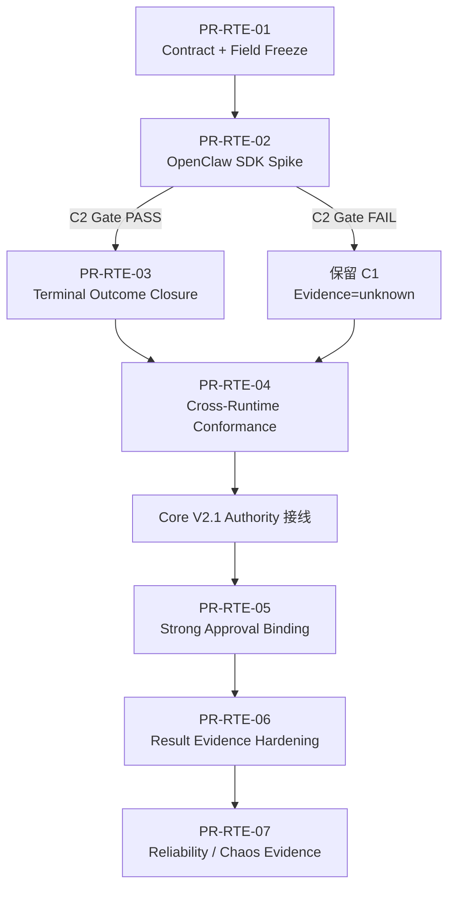
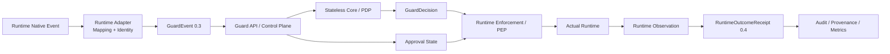
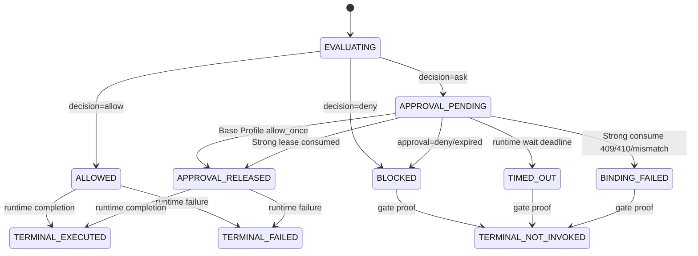
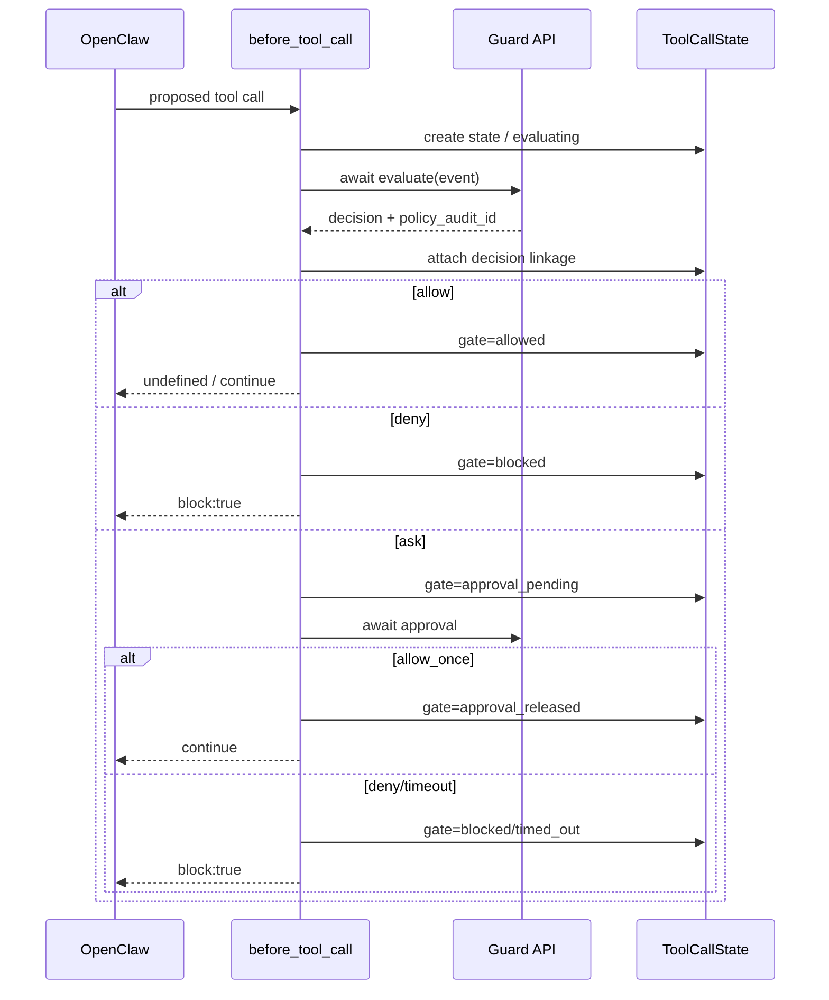
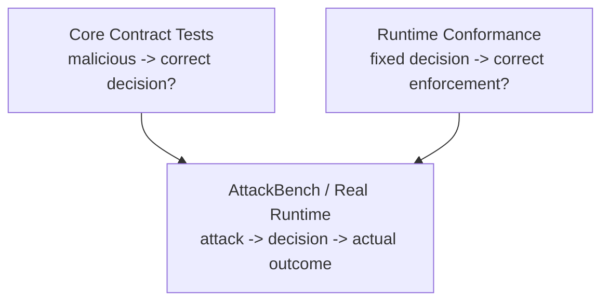
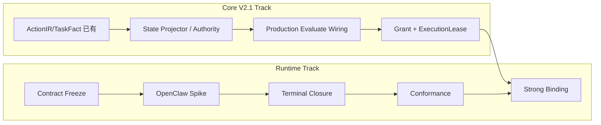
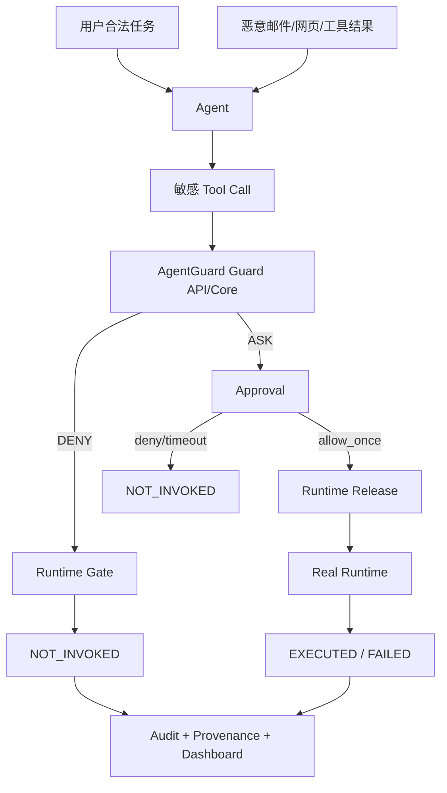

# AgentGuard Runtime Enforcement Contract v1 — 完整设计与实施方案

> 基线：`dev@efe1c95df52b2be3e62d4b48510bfc410397c69f`  
> 日期：`2026-08-15`  
> 本文件为分册合并版；各分册为更适合协作评审与实施的规范来源。


---

# AgentGuard Runtime Enforcement Contract v1 — 设计与实施方案索引

> 状态：**Design Freeze Candidate / 实施基线**  
> 仓库：`JToday666/agent-guard`  
> 基线分支：`dev`  
> 基线 Commit：`ce9b33ed9c99fd812d31ddea031583453462e9fd`  
> 重写日期：`2026-08-15`  
> 适用范围：LangGraph Adapter、OpenClaw Plugin、Guard API / Control Plane、AgentGuard Core V2.1、Audit / Provenance / AttackBench

---

## 1. 本设计包解决什么问题

AgentGuard 当前并不缺少 Runtime Enforcement：LangGraph 已经拥有受保护工具调用边界、ASK 等待、真实调用与 `not_invoked / executed / failed` 回执；OpenClaw 也已经具备真实 `deny/ask` 阻断、fail-closed、工具结果净化/隔离和 durable runtime-outcome 投递。当前真正需要解决的是：

1. 将分散在 Adapter、Guard API、Receipt Schema、Dashboard 设计中的执行语义收敛成一套**冻结、跨 Runtime、可机器验证**的 Runtime Enforcement Contract；
2. 补齐 OpenClaw `ALLOW / approval_release → terminal execution fact` 的证据闭环，但严格遵守“只记录 Runtime 能证明的事实”；
3. 将 `Decision / Approval / Enforcement Gate / Runtime Execution` 四层事实彻底分离；
4. 将 Strong Approval Binding 对齐 Core V2.1 已冻结的 `authorization_fingerprint → CapabilityGrant → GrantConsumption → ExecutionLease`，**不另造第二套授权机制**；
5. 用 Cross-Runtime Conformance Suite 把“文档约定”升级为“机器可验证契约”。

本轮是**契约收敛与执行证据闭环**，不是重写 Runtime Adapter，也不是新增一套 Runtime Event Universe。

---

## 2. 文档地图

| 文档 | 定位 | 主要读者 |
|---|---|---|
| `01_Runtime_Enforcement_Contract_v1.md` | 总体规范性契约：架构、状态机、安全属性、ALLOW/ASK/DENY、故障与证据语义 | 架构/安全评审、Core/Runtime 开发 |
| `02_字段与Schema契约冻结.md` | 字段、枚举、ID、GateState、Receipt、Approval/Lease API 的精确冻结 | 后端/Adapter/测试开发 |
| `03_OpenClaw实施方案.md` | `after_tool_call` Spike、terminal closure、correlation lifecycle、代码改动点 | OpenClaw 插件开发 |
| `04_LangGraph_Reference_Profile.md` | LangGraph Reference Enforcement 边界、现状与 contract tests | Python Adapter/Bench 开发 |
| `05_Cross_Runtime_Conformance与可靠性验证.md` | Capability Profile、CF 测例、Failure Matrix、CI/Chaos/指标 | 测试/评测/答辩证据 |
| `06_迁移_PR与实施计划.md` | Phase A/B、PR 拆分、依赖、DoD、风险与 Freeze Gate | 项目管理/开发负责人 |
| `07_比赛证据与答辩口径.md` | 题目映射、演示链、可声明/不可声明能力、最终证据 | 比赛报告/答辩 |
| `AgentGuard_Runtime_Enforcement_Contract_v1_完整方案.md` | 上述文档合并版 | 设计评审、归档 |

---

## 3. 事实状态标签

所有设计结论使用以下标签，禁止把目标态写成现状：

- **CURRENT**：当前 `ce9b33ed9c99fd812d31ddea031583453462e9fd` 已实现并可由代码/测试证明。
- **TARGET-P0**：本轮 Runtime Contract 必须完成，属于比赛/闭环主线。
- **TARGET-P1**：依赖 Core V2.1 或 SDK 能力的增强目标。
- **DEFERRED**：明确不进入本轮主线。

---

## 4. 本轮最终冻结的核心决策

### 4.1 四层事实永久分离

```text
Policy Decision  ≠  Approval Resolution  ≠  Enforcement Gate  ≠  Runtime Execution Fact
```

- `decision=deny` 不能自动推出 `execution=not_invoked`；
- `approval=allow_once` 不能自动推出 `execution=executed`；
- `blocked=true` 只作为策略层摘要，不能当作真实 Runtime 阻断证据；
- 真实执行事实只由 Runtime 观察点产生。

### 4.2 Runtime Outcome 四态保持不变

```text
not_invoked | executed | failed | unknown
```

ResultDisposition 五态保持不变：

```text
not_applicable | passed_through | modified | quarantined | unknown
```

### 4.3 ExecutionLease 交付通道服从 Core V2.1 已冻结契约

不再采用“随 approval wait response 下发 lease”的旧设计。Strong Profile 固定：

```text
GET /v1/approvals/{approval_id}/wait
    ↓ resolved allow_once
POST /v1/approvals/{approval_id}/execution-leases/consume
    ↓
GrantConsumption + ExecutionLease
    ↓
Runtime release exact action
```

### 4.4 OpenClaw C2 能力有明确 Gate

只有 SDK Spike 证明以下条件后，才允许宣称 OpenClaw `C2 Execution Closure`：

- `before_tool_call` 与 `after_tool_call` 具有稳定一一关联 ID；
- `after_tool_call` 的 success/error 语义可确定；
- `before_tool_call` handler 完成 happens-before 工具 invocation；
- blocked call 的 `after_tool_call` 行为已实测；
- 多插件改写不会破坏安全关键 identity。

不满足时：OpenClaw 保持 C1，terminal fact 为 `unknown`，**不伪造 executed**。

### 4.5 DENY 后观察到执行不是“忽略”，而是 Enforcement Violation

若 Spike 证明 `after_tool_call` 代表真实 invocation/completion，而 Runtime 在 `gate_state=blocked/timed_out/binding_failed` 后仍产生 terminal observation，则必须记录真实 `execution_completed/execution_failed`，同时：

```text
intervention.type = enforcement_violation
```

这是安全异常，不能为了保持“deny=blocked”的叙事而删除事实。

---

## 5. 基线证据入口

本设计包以以下仓库事实为主要基线：

- `docs/02_core/interface_contract.md`
- `docs/04_apps/runtime_safety_observability_design.md`
- `docs/03_adapters/runtime_hooks_inventory.md`
- `docs/AgentGuard_Core_V2.1_Final_Contract_Freeze/01_F1字段与契约冻结.md`
- `packages/agentguard-langgraph-adapter/agentguard_langgraph_adapter/tool_gateway.py`
- `packages/agentguard-langgraph-adapter/agentguard_langgraph_adapter/runtime_receipts.py`
- `packages/agentguard-openclaw-plugin/src/hooks/tool.ts`
- `packages/agentguard-openclaw-plugin/src/runtime/enforcement.ts`
- `packages/agentguard-openclaw-plugin/src/runtime/state.ts`
- `packages/agentguard-openclaw-plugin/src/runtime/outcome-delivery.ts`
- `packages/agentguard-openclaw-plugin/src/mapping/audit-outcomes.ts`
- `schemas/runtime_outcome_receipt.schema.json`
- `apps/guard-api/guard_api/services/evaluation.py`
- `apps/guard-api/guard_api/services/approval.py`

---

## 6. 推荐实施顺序



P0 不等待 Core V2.1 全部落地：Contract、Spike、OpenClaw terminal closure、Conformance 可独立推进。Strong Approval Binding 才依赖 V2.1 production wiring。


---

# AgentGuard Runtime Enforcement Contract v1

> 状态：**Normative Design Freeze Candidate**  
> 基线：`dev@ce9b33ed9c99fd812d31ddea031583453462e9fd`  
> 本文使用 RFC 2119 风格的 **MUST / MUST NOT / SHOULD / MAY** 表示规范强度。

---

## 1. 目标与非目标

### 1.1 目标

本契约定义 AgentGuard Runtime Security Plane 在不同 Runtime 中必须保持一致的安全语义，覆盖：

- Runtime Native Event → `GuardEvent` 的映射边界；
- `ALLOW / ASK / DENY` 的执行语义；
- 审批等待、超时、晚到审批和 Strong Approval Binding；
- 执行前阻断、执行后终态、结果隔离；
- Runtime Outcome 的事实权威和证据等级；
- 网络失败、重启、重复请求、重复回执；
- LangGraph/OpenClaw 的能力差异与 Conformance 口径。

### 1.2 非目标

本轮明确不做：

1. 不重写 Guard API / Core；
2. 不新增 `/v1/runtime/outcomes`；Runtime Outcome 继续复用 `POST /v1/audit/events`；
3. 不新增第三套 `RuntimeEvent/AgentActionEvent` 后端事实模型；
4. 不把所有 Runtime 强行做成相同能力；
5. 不声称 `after_tool_call` 能证明外部业务副作用；
6. 不建立企业级完整 Chaos Framework；
7. 不在本轮解决所有 Context/Memory V2.1 强制语义。

---

## 2. Runtime Security Plane 架构



职责边界冻结：

| 组件 | 权威职责 | 禁止职责 |
|---|---|---|
| Adapter | 原生字段映射、action identity、Runtime capability 声明 | 不重新做风险判定 |
| Core / PDP | “应该如何处理”：allow/ask/deny | 不声称动作实际执行/未执行 |
| Control Plane | 鉴权、策略快照、审批、审计、强授权消费 | 不伪造 Runtime terminal fact |
| Enforcement / PEP | 真正阻断/暂停/释放受保护动作 | 不修改 Core decision 语义 |
| Runtime Observation | 证明开始、完成、失败、结果处置 | 不从 decision 推断执行事实 |
| Dashboard / AttackBench | 投影、聚合、统计 | 不补造未来事实 |

---

## 3. 五条设计原则

### RTE-P1 — Four-Layer Fact Separation

```text
Decision ≠ Approval ≠ Gate ≠ Execution
```

四层可以组合展示，但任何一层不得覆盖另一层。

### RTE-P2 — Unknown Is Safer Than Fabrication

无法证明的执行状态必须是 `unknown`；无法测量的副作用必须是 `not_measured/unknown`。

### RTE-P3 — No New Event Universe

继续复用现有：

```text
GuardEvent
GuardDecision
Approval
AuditEvent
RuntimeOutcomeReceipt
```

### RTE-P4 — Complete Mediation Is Scoped

“完全中介”只能在 **instrumented / protected execution boundary** 内成立。

- LangGraph：调用必须经 `GuardedToolGateway/SecureToolNode`；
- OpenClaw：调用必须经过插件已验证的 blocking hook；
- 绕过这些路径的直接 Runtime 调用不在当前保护域内。

### RTE-P5 — Runtime Fact Authority

只有 Runtime 或拥有该执行边界的 Adapter/Plugin 能回答：

```text
是否真正调用？是否完成？是否失败？结果是否被隔离？
```

---

## 4. 安全属性

| ID | 属性 | 冻结要求 |
|---|---|---|
| S01 | Pre-execution mediation | `pre_execution=true` 的受保护动作必须先 evaluate |
| S02 | Decision fidelity | Runtime 不得把 deny/ask 重解释为 allow |
| S03 | ASK pause | 未获得允许的 ASK 不得进入 invocation |
| S04 | Fail-safe | enforce 模式下关键 pre-exec evaluation failure 不得 silent fail-open |
| S05 | Stable action identity | 跨 hook 终态闭环必须有稳定 Runtime-native correlation identity |
| S06 | Evaluation idempotency | Transport retry 使用相同 `event_id + canonical content` |
| S07 | Approval freshness | runtime wait timeout 后晚到审批不得复活旧 attempt |
| S08 | Approval binding | Strong Profile 必须 exact-bind canonical action fingerprint |
| S09 | No double execution | evaluate/receipt/approval retry 不得导致重复工具执行 |
| S10 | Evidence honesty | 未观察事实保持 unknown/null |
| S11 | Receipt idempotency | 相同 runtime fact 重投不产生重复权威事实 |
| S12 | Restart safety | 重启后不自动恢复无法证明身份的旧动作 |
| S13 | Result isolation honesty | `quarantined` 不得伪装成 `not_invoked` |
| S14 | Side-effect honesty | 未测量副作用不得填写 count |
| S15 | Infrastructure accounting | fail-closed infra block 不计 detector 成功 |
| S16 | Gate/terminal consistency | terminal fact 与 gate 预期冲突必须显式标记 violation |
| S17 | Active-state integrity | 活跃 correlation state 不得被普通 FIFO 静默淘汰 |
| S18 | Hook capability gate | Runtime 未通过 SDK/Conformance 验证不得宣称对应 capability |
| S19 | Secret minimization | ephemeral/durable correlation 不得新增不必要秘密副本 |
| S20 | LLM authority isolation | V2 Strong Profile 中 LLM allow_once 不得变成可消费 ExecutionLease |

---

## 5. 事实权威表

| 事实 | 权威生产者 |
|---|---|
| `GuardEvent` 原生动作映射 | Adapter / Plugin |
| `GuardDecision` | Core，经 Guard API 返回 |
| `policy_audit_id` | Guard API policy-evaluation writer |
| Approval 状态 | Guard API / Control Plane |
| Gate 状态 | Runtime Enforcement |
| `not_invoked` | 真正位于 invocation 前的 Gate |
| `executed/failed` | 真实 Runtime terminal observation |
| Tool result modified/quarantined | 能实际改写/隔离结果的 Runtime hook |
| side effects | sandbox/runtime/external system 的真实 measurement |
| Provenance | Control Plane writer 对权威事实的投影 |

---

## 6. Gate 状态机冻结

为避免 `released:boolean` 无法区分普通 ALLOW 与 ASK release，内部 Gate 状态固定为：

```text
EVALUATING
ALLOWED
APPROVAL_PENDING
APPROVAL_RELEASED
BLOCKED
TIMED_OUT
BINDING_FAILED
```

其中：

```text
execution_authorized = gate_state ∈ {ALLOWED, APPROVAL_RELEASED}
```

状态机：



`TERMINAL_*` 是逻辑状态，不要求新增公共后端模型。

---

## 7. ALLOW / DENY / ASK 精确语义

### 7.1 ALLOW

Runtime MUST：

1. 在 `before_tool_call` 返回前完成 decision linkage；
2. 将 `gate_state=ALLOWED`；
3. 仅在受保护边界内放行；
4. 若 Runtime 支持 C2，等待真实 terminal hook 后产生 `execution_completed/failed`；
5. 若不支持 C2，terminal execution 保持 `unknown`。

ALLOW 不是执行成功证明。

### 7.2 DENY

Runtime MUST：

```text
gate_state = BLOCKED
actual invocation = 0（在受保护边界内）
RuntimeOutcome = pre_execution_deny
execution.status = not_invoked
result.disposition = not_applicable
```

只有 Gate 真正位于 invocation 之前，才能产生 `not_invoked`。

### 7.3 ASK → deny/expired

```text
ASK → APPROVAL_PENDING → deny/expired → BLOCKED → not_invoked
```

### 7.4 ASK → runtime wait timeout

`runtime_wait_deadline` 与 Approval TTL 是两个概念。Runtime 超时后：

```text
gate_state = TIMED_OUT
current attempt = terminal not_invoked
late approval cannot resurrect current attempt
```

新的用户/Runtime 尝试必须重新 evaluate。

### 7.5 ASK → allow_once（Base Profile）

在 Strong Profile 尚未接线前，现有兼容路径可以：

```text
wait resolved allow_once
→ gate_state=APPROVAL_RELEASED
→ runtime continues
```

但不得宣称 exact canonical action binding 已完成。

### 7.6 ASK → allow_once（Strong Profile）

固定流程：

```mermaid
sequenceDiagram
    participant R as Runtime Adapter
    participant G as Guard API
    participant A as Approval Store
    participant X as Execution Lease Service

    R->>G: POST /v1/guard/evaluate
    G-->>R: ask + approval_id + enforcement_binding
    loop until runtime deadline
        R->>G: GET /v1/approvals/{id}/wait
        G-->>R: pending / resolved
    end
    R->>X: POST /v1/approvals/{id}/execution-leases/consume
(action_id, authorization_fingerprint)
    X->>A: atomic validate + consume usage
    X-->>R: lease_id + consumption_id + lease_token + expires_at
    R->>R: verify returned binding fields / expiry
    R->>R: gate_state=APPROVAL_RELEASED
    R->>R: invoke exact current action
```

**不得**把 lease 随 `/wait` 响应下发；独立 consume endpoint 是 V2.1 冻结契约。

---

## 8. 双时钟审批模型

### Approval Lifetime

服务端 `ApprovalRequest.expires_at` 决定审批事实寿命。

### Runtime Wait Deadline

插件本次同步阻塞愿意等待的时间，例如 OpenClaw 当前默认约 25 秒。

冻结：

```text
runtime_wait_deadline <= approval_expires_at
```

两者不要求相等。

Late approval 规则：

- 超时 attempt 已终止；
- 晚到 approval 不得直接恢复原 hook；
- 若 Runtime 重新发起动作，必须重新 evaluate；
- Strong Profile 不得拿旧 approval 给不同 action/fingerprint 消费。

---

## 9. Execution Outcome 与 Gate 冲突

若 Runtime 在 `BLOCKED/TIMED_OUT/BINDING_FAILED` 后仍观察到**被 SDK 证明为真实 completion 的** `after_tool_call`：

1. 不得静默忽略；
2. 不得继续保留 `not_invoked` 作为唯一终态；
3. MUST 上报真实 terminal outcome：

```text
metadata.outcome_kind = execution_completed | execution_failed
execution.status = executed | failed
intervention.type = enforcement_violation
```

4. policy decision 保持原 `deny/ask`；
5. 生成高优先级安全告警/诊断；
6. AttackBench 不得把该 case 计为 confirmed prevention。

这保证“Runtime 事实高于预期叙事”。

---

## 10. Runtime Outcome Contract

公共 schema 继续使用 `RuntimeOutcomeReceipt 0.4`，不新增 endpoint。

### ExecutionStatus

```text
not_invoked | executed | failed | unknown
```

### ResultDisposition

```text
not_applicable | passed_through | modified | quarantined | unknown
```

### OutcomeKind

```text
pre_execution_deny
approval_release
tool_result_modified
tool_result_quarantined
execution_completed
execution_failed
```

关键映射：

| kind | execution.status | result.disposition | 说明 |
|---|---|---|---|
| pre_execution_deny | not_invoked | not_applicable | Gate 确认未进入 Runtime |
| approval_release | unknown | unknown | 只证明释放，不证明执行 |
| execution_completed | executed | unknown/可证明值 | 真实 completion observation |
| execution_failed | failed | not_applicable/unknown | invocation 已进入但失败 |
| tool_result_modified | executed | modified | 工具已执行，结果被改写 |
| tool_result_quarantined | executed | quarantined | 工具已执行，结果未进入目标 context/persistence |

### `blocked` 的冻结解释

Python `GuardDecision.blocked` 是 derived property，不是 GuardDecision wire JSON 的稳定显式字段。AuditEvent/RuntimeOutcomeReceipt 顶层 `blocked` 是**policy-level summary**。

因此：

```text
blocked=true  ≠  confirmed not_invoked
```

Confirmed prevention 只能由：

```text
execution.status == not_invoked
```

证明。

---

## 11. Side Effect / Proof Level

证据等级冻结：

```text
P0 Intent          动作被提出
P1 Decision        Core 作出判定
P2 Gate            Runtime 阻断/释放
P3 Invocation      Runtime 明确观察到调用开始
P4 Completion      Runtime 明确观察到调用完成/失败
P5 External Effect 外部系统确认真实副作用
```

`after_tool_call` 最多天然提供 P4；不得自动宣称 P5。

副作用字段：

- 未测量：`measurement_status=not_measured, count=null`；
- pre-exec deny：在 invocation 入口确实未进入时可 `measured,count=0`；
- LangGraph sandbox `snapshot/diff` 可以提供更高质量本地 side-effect evidence；
- 外部邮件/API 最终业务效果需额外 ack/telemetry，P0 不强求。

---

## 12. Fail-Closed 与故障语义

### Pre-execution evaluate 不可用

Enforce 模式的受保护高影响动作 MUST fail closed。

Observe 模式 MAY fail open，但必须产生 diagnostic。

### Approval wait 故障

- timeout → 当前 attempt `TIMED_OUT/not_invoked`；
- 4xx permanent error → 不释放；
- 网络错误若未到 deadline可重试；到 deadline 终止。

### Receipt delivery 故障

动作已经完成后，receipt delivery 失败**不得改变已经发生的执行事实**。

OpenClaw 继续使用 durable at-least-once spool；receipt retry 不得重执行 action。

### Receipt 无 policy_audit_id

禁止伪造 policy-linked RuntimeOutcome；记录 bounded diagnostic + evidence degradation。

---

## 13. Restart / Crash

### 13.1 未获批准/未释放动作

重启后不得自动恢复旧 pending action。

### 13.2 已消费 ExecutionLease 但进程崩溃

P0/P1 采取保守策略：

- 不因相同 lease 自动重新调用非幂等工具；
- 若无法证明“旧调用未进入 Runtime”，必须要求新的 Runtime attempt / user action；
- 只有工具本身支持稳定 idempotency key 且另行评审后，才可设计 crash-resume。

### 13.3 Outcome spool

已持久化 RuntimeOutcome 可以重启后 drain；这只恢复证据，不恢复动作。

---

## 14. Secret Minimization

Ephemeral correlation state MUST NOT 新增：

```text
lease_token
raw credentials
full sensitive tool result
unbounded secret arguments
```

允许保存：

```text
action_id
event_id
decision_id
policy_audit_id
approval_id
authorization_fingerprint（非明文秘密）
canonical/bounded resource identity
bounded/redacted diagnostic summary
```

当前 OpenClaw `toolParams` 是既有兼容状态；P1 应逐步缩减为安全必要字段，而不是继续复制秘密。

---

## 15. Capability Profiles

| Profile | 能力 |
|---|---|
| C0 Observe | 能映射和审计事件 |
| C1 Pre-Execution Enforcement | ALLOW/ASK/DENY + fail-closed + not_invoked proof |
| C2 Execution Closure | 稳定 action correlation + executed/failed terminal proof |
| C3 Strong Approval Binding | exact fingerprint + one-use lease consume |
| C4 Result Isolation | modified/quarantined 真实结果处置 |
| C5 Side-Effect Measurement | 可证明副作用 measurement |

Capability 是**可验证属性**，不是成熟度评分。Runtime 只有通过对应 conformance tests 才能在 heartbeat/文档中声明。

---

## 16. 规范性 MUST 清单

| ID | 规范 |
|---|---|
| RTE-001 | `pre_execution=true` 的受保护工具动作执行前 MUST evaluate |
| RTE-002 | Core `deny` 在受保护边界内 MUST 阻止 invocation |
| RTE-003 | `ask` MUST 暂停当前动作 |
| RTE-004 | v1 release decision 只接受 `allow_once`；legacy 其他值不得扩大语义 |
| RTE-005 | enforce 模式关键 pre-exec evaluate failure MUST fail closed |
| RTE-006 | Core MUST NOT 产生 Runtime execution fact |
| RTE-007 | transport retry MUST 复用相同 event_id 与 canonical content |
| RTE-008 | 新 Runtime attempt MUST 使用新 event_id |
| RTE-009 | C2 Runtime MUST 具备稳定 native action correlation identity |
| RTE-010 | `event_id` 与 `action_id` MUST NOT 混用 |
| RTE-011 | policy-linked RuntimeOutcome MUST 关联真实 `policy_audit_id` |
| RTE-012 | 无权威 evaluate 时 MUST NOT 伪造 policy-linked receipt |
| RTE-013 | 只有真实 pre-invocation Gate 才能写 `not_invoked` |
| RTE-014 | 只有真实 terminal observation 才能写 `executed` |
| RTE-015 | `failed` MUST 来自真实 invocation failure，且 error bounded |
| RTE-016 | `approval_release` MUST 保持 execution=`unknown` |
| RTE-017 | `result=quarantined` MUST 保持 execution=`executed` |
| RTE-018 | 未测量 side effects MUST NOT 填 count |
| RTE-019 | 顶层 `blocked` MUST NOT 当作 confirmed runtime block |
| RTE-020 | runtime wait timeout 后旧 attempt MUST NOT 被 late approval 复活 |
| RTE-021 | runtime wait deadline MUST NOT 晚于 server approval expiry |
| RTE-022 | Strong Profile allow_once MUST exact-bind `authorization_fingerprint` |
| RTE-023 | Strong Profile MUST 通过独立 execution-lease consume endpoint 原子消费 |
| RTE-024 | Strong grant MUST one-use / CAS，禁止双花 |
| RTE-025 | `lease_token` MUST NOT 进入 Audit/Dashboard/Receipt |
| RTE-026 | LLM-resolved allow_once MUST NOT 产生 V2 可消费 ExecutionLease |
| RTE-027 | Runtime receipt audit_id MUST deterministic |
| RTE-028 | same audit_id + different content MUST 冲突 |
| RTE-029 | receipt retry MUST NOT 重新执行 action |
| RTE-030 | Adapter restart MUST NOT 自动 resume 无法证明身份的旧动作 |
| RTE-031 | Complete mediation 声明 MUST 限定 instrumented boundary |
| RTE-032 | Adapter MUST 声明且验证 capability profile |
| RTE-033 | 能力可以不同，但 MUST NOT 伪造跨 Runtime 等价事实 |
| RTE-034 | `before_tool_call` linkage MUST 在 handler return 前同步完成 |
| RTE-035 | active correlation state MUST NOT 因普通 FIFO 容量静默驱逐 |
| RTE-036 | correlation capacity exhaustion MUST 产生显式 degradation 或策略化 fail-closed |
| RTE-037 | `after_tool_call` capability MUST 先通过 SDK spike 与 runtime smoke |
| RTE-038 | blocked/timed_out 后真实 terminal observation MUST 记录 enforcement violation |
| RTE-039 | after_tool_call handler failure MUST NOT 覆盖真实工具结果；必须 bounded diagnostic |
| RTE-040 | ephemeral correlation MUST 最小化敏感数据复制 |
| RTE-041 | result disposition 与 execution status MUST 独立解释 |
| RTE-042 | AttackBench confirmed prevention MUST 以 `execution.status=not_invoked` 为核心证据 |


---

# AgentGuard Runtime Enforcement Contract v1 — 字段与 Schema 契约冻结

> 基线：`dev@ce9b33ed9c99fd812d31ddea031583453462e9fd`  
> 本文冻结**公共字段、内部执行状态、ID 语义、Strong Approval Binding 与 Receipt 映射**。实施期不得随意改变语义；如需变更必须进行 contract review。

---

## 1. Freeze 层级

### F0 — 已有公共稳定契约，P0 不破坏

- `GuardEvent schema_version=0.3`
- `GuardDecision` 当前 wire contract
- `AuditEvent / RuntimeOutcomeReceipt schema_version=0.4`
- `POST /v1/guard/evaluate`
- `GET /v1/approvals/{approval_id}/wait`
- `POST /v1/audit/events`
- `RuntimeExecutionStatus`
- `RuntimeResultDisposition`
- `RuntimeOutcomeKind`

### F1 — 本轮新增/收敛的 Runtime 内部契约

- `EnforcementGateState`
- `RuntimeCorrelationState`
- Capability Profile
- lifecycle-aware eviction
- C2 Spike Gate

### F2 — Core V2.1 Strong Profile additive contract

- `GuardEvaluationResponse.enforcement_binding?`
- `POST /v1/approvals/{approval_id}/execution-leases/consume`
- `ExecutionLeaseConsumeRequest/Response`
- Receipt 中可选 `lease_id/consumption_id`（如后续 schema 正式扩展，必须 additive + version review）

---

## 2. ID 契约

| 字段 | 语义 | 生产者 | Retry 规则 |
|---|---|---|---|
| `trace_id` | 一次 Agent 运行/调查链 | Runtime/Adapter | 同链稳定 |
| `event_id` | 一次 GuardEvent/evaluation attempt | Adapter | transport retry 复用；新 attempt 新建 |
| `action_id` | 一个逻辑可执行动作 | Runtime-native ID 优先 | 跨 pre/post hook 必须稳定 |
| `decision_id` | 一次 Core 决策 | Core | evaluate idempotent replay 返回同事实 |
| `policy_audit_id` | policy_evaluation AuditEvent ID | Guard API | 权威关联 |
| `approval_id` | 一次审批请求 | Guard API | 不可替代 action identity |
| `audit_id` | 一条持久化审计事实 | producer 按契约 | runtime receipt deterministic |
| `lease_id` | Strong Profile 执行租约 | Guard API | consume 同键有效期内重试返回同 lease |
| `consumption_id` | one-use grant 消费事实 | Guard API | 与 grant/action/fingerprint 原子绑定 |

### 2.1 `event_id != action_id`

禁止：

```text
event_id 直接当 action_id
```

因为同一个 action 可以产生：

```text
pre-exec GuardEvent
runtime outcome
result GuardEvent
result isolation receipt
```

这些记录有不同 event_id，但应通过同一 action_id 聚合。

### 2.2 OpenClaw native ID Gate

当前 mapper 在 native `toolCallId` 缺失时会生成 local call id。该 fallback 对单次 pre-exec evaluate 有效，但**不能自动证明跨 hook C2 correlation**。

因此：

```text
C1: local fallback MAY be used
C2: MUST have stable native/cross-hook identity
```

若 `after_tool_call` 无法获得与 `before_tool_call` 相同 ID：

```text
C2 = NOT_SUPPORTED
terminal execution = unknown
```

---

## 3. EnforcementGateState 冻结

```ts
export type EnforcementGateState =
  | "evaluating"
  | "allowed"
  | "approval_pending"
  | "approval_released"
  | "blocked"
  | "timed_out"
  | "binding_failed";
```

派生：

```ts
executionAuthorized =
  gateState === "allowed" || gateState === "approval_released";
```

禁止再以单个：

```ts
released: boolean
```

承担全部 gate 语义。

---

## 4. OpenClaw RuntimeCorrelationState 冻结

这是**插件内 ephemeral state**，不是新后端事实模型。

```ts
export type RuntimeCorrelationState = {
  // Native identity
  toolCallId: string;
  runtimeActionId: string;
  correlationSource: "native_tool_call_id" | "local_fallback";

  // Guard linkage
  guardEventId: string;
  traceId: string;
  policyAuditId?: string;
  decisionId?: string;
  decision?: "allow" | "ask" | "deny";

  // Gate lifecycle
  gateState: EnforcementGateState;
  approvalId?: string | null;
  approvalStatus?: "pending" | "allowed" | "denied" | "expired" | "unknown";

  // Strong binding (P1)
  authorizationFingerprint?: string;
  runtimeBindingId?: string;
  leaseId?: string;
  consumptionId?: string;
  // leaseToken MUST NOT be stored here

  // Terminal observation
  terminalStatus?: "executed" | "failed";
  terminalObservedAt?: string;
  resultPersistObserved?: boolean;

  // Bounded lifecycle
  createdAtMs: number;
  updatedAtMs: number;

  // Existing context fields may remain temporarily
  toolName: string;
  toolKind?: string | null;
  toolInputKind?: string | null;
  derivedPaths: string[];
  // Full raw params SHOULD be reduced in P1.
};
```

### 4.1 不持久化字段

以下禁止进入 durable correlation/spool：

```text
leaseToken
raw API secret
raw credential
full tool result
unbounded prompt/context
```

### 4.2 `policyAuditId/decisionId` 写入顺序

在 `before_tool_call` 中：

```text
remember state(gate=evaluating)
→ await evaluate
→ attach decisionId + policyAuditId + decision
→ set gate state
→ await approval if needed
→ final gate state
→ RETURN handler
```

这条 happens-before 是 P0 contract invariant。

---

## 5. GuardDecision Wire 语义

当前 `GuardDecision` 的稳定 wire 字段包括：

```text
decision_id
decision
risk_score
severity
categories
rule_hits
reason
safe_message
approval_intent
latency_ms
```

Python `GuardDecision.blocked` 是 derived property；不要把它假定为 GuardDecision JSON wire field。

公共统计应使用：

```text
policy decision: decision
runtime prevention: RuntimeOutcome.evidence.execution.status
```

---

## 6. Strong EnforcementBinding TARGET-P1

当 Core V2.1 ActionIR/Authority 接入生产 evaluate 后，`GuardEvaluationResponse` MAY additive 增加：

```json
{
  "enforcement_binding": {
    "schema_version": "2.1",
    "action_id": "call_001",
    "authorization_fingerprint": "hmac-sha256:...",
    "runtime_binding_id": "binding_x",
    "requires_execution_lease": true
  }
}
```

建议模型：

```python
class EnforcementBinding(BaseModel):
    schema_version: Literal["2.1"] = "2.1"
    action_id: str
    authorization_fingerprint: str
    runtime_binding_id: str
    requires_execution_lease: bool
```

冻结要求：

- `action_id` 必须与本次 canonical `ActionIR.action_id` 一致；
- fingerprint 只能由服务端/Core V2.1 authoritative normalization 产生；
- Adapter 不得本地重新计算另一套授权 fingerprint；
- `audit_fingerprint` 不能替代 `authorization_fingerprint`。

---

## 7. Execution Lease API — 服从 V2.1 Frozen Contract

### 7.1 Endpoint

```text
POST /v1/approvals/{approval_id}/execution-leases/consume
Authorization scope: approval:wait
```

### 7.2 Request

```json
{
  "action_id": "action_x",
  "authorization_fingerprint": "hmac-sha256:..."
}
```

```python
class ExecutionLeaseConsumeRequest(BaseModel):
    action_id: str
    authorization_fingerprint: str
```

### 7.3 Authoritative Server Checks

单事务内验证：

1. Adapter credential principal/runtime binding；
2. approval 存在且为人工 `allow_once` 终态；
3. approval 未过期；
4. action_id exact match；
5. authorization_fingerprint exact match；
6. CapabilityGrant `remaining_uses == 1`；
7. CAS 消费成功；
8. 写 `GrantConsumption + ExecutionLease`；
9. 返回 lease。

### 7.4 Response

```json
{
  "lease_id": "lease_x",
  "consumption_id": "consumption_x",
  "lease_token": "opaque-secret-returned-once",
  "expires_at": "2026-08-15T02:00:00+08:00"
}
```

### 7.5 Retry / Conflict

```text
same approval_id + action_id + fingerprint, lease valid
→ same lease_id + same plaintext lease_token

different action/fingerprint
→ 409 APPROVAL_CONSUMPTION_CONFLICT

same key after lease expiry
→ 410 EXECUTION_LEASE_EXPIRED
```

### 7.6 Runtime handling

Runtime MUST：

- 只在 consume 2xx 成功后进入 `approval_released`；
- 校验响应 lease identity 与当前 action/fingerprint/runtime binding（若 response 含 binding 字段）；
- `lease_token` 仅驻留最短必要作用域；不得写 Map、日志、Audit、Receipt、Dashboard；
- 不发明新的 token validate endpoint。

### 7.7 LLM allow_once 隔离

当前 legacy Approval Service 可以让低/中风险 LLM reviewer resolve `allow_once`，但 **V2 Strong Profile 不允许这种 approval 产生可消费 grant/lease**。

因此 consume service MUST 检查 `resolution_source`，至少：

```text
resolution_source == human
```

才可建立 human-approval CapabilityGrant/ExecutionLease。

---

## 8. RuntimeOutcomeReceipt 0.4 冻结

### 8.1 Required identity

```text
audit_id
schema_version=0.4
record_type=runtime_outcome
trace_id
runtime
timestamp
stage
event_type=runtime_outcome
summary
decision
risk_score
severity
blocked
links
metadata
evidence
```

### 8.2 Links

```text
event_id        REQUIRED
decision_id     REQUIRED
policy_audit_id REQUIRED
action_id       OPTIONAL but REQUIRED for action-level C1/C2 conformance
approval_id     OPTIONAL
parent_audit_id OPTIONAL
```

Strong Profile 后续若正式加入：

```text
lease_id
consumption_id
```

应做 additive schema review，不得直接塞进 `metadata` 规避契约。

### 8.3 Execution evidence

```python
status: Literal["not_invoked", "executed", "failed", "unknown"]
receipt_recorded: Literal[True]
invoked_at: str | None
completed_at: str
error: str | None
tool_result_entered_context: bool | None
persisted: bool | None
```

约束：

- `failed` 必须有 error；
- `not_invoked/executed` 不得带 error；
- `invoked_at <= completed_at`；
- `completed_at == receipt.timestamp`。

### 8.4 Result evidence

```text
not_applicable
passed_through
modified
quarantined
unknown
```

`execution.status` 与 `result.disposition` 正交。

例如：

```text
executed + quarantined
```

表示工具已经执行，但结果被隔离。

### 8.5 Side effects

```text
measurement_status = measured | not_measured | unknown
```

- measured → count 必填；
- 非 measured → count 必须 null。

---

## 9. Outcome Kind 精确映射

### pre_execution_deny

```json
{
  "execution": {
    "status": "not_invoked",
    "receipt_recorded": true,
    "invoked_at": null,
    "completed_at": "<same as receipt timestamp>",
    "error": null,
    "tool_result_entered_context": false,
    "persisted": false
  },
  "side_effects": {
    "measurement_status": "measured",
    "count": 0,
    "summary": "Invocation gate stopped the protected call before runtime entry."
  },
  "result": {
    "disposition": "not_applicable",
    "summary": "No tool result was produced.",
    "sanitized": false
  }
}
```

### approval_release

```text
execution.status = unknown
result.disposition = unknown
approval.status = allowed
approval.decision = allow_once
```

### execution_completed

```text
execution.status = executed
error = null
result.disposition = unknown unless hook proves stronger fact
```

### execution_failed

```text
execution.status = failed
error = bounded non-empty string
```

### tool_result_modified

```text
execution.status = executed
result.disposition = modified
```

### tool_result_quarantined

```text
execution.status = executed
result.disposition = quarantined
tool_result_entered_context = false when hook can prove it
```

---

## 10. Enforcement Violation 表达

不新增新的 `RuntimeOutcomeKind`。

如果 gate 预期阻断，但真实 terminal hook 证明已执行：

```text
metadata.outcome_kind = execution_completed | execution_failed
intervention.type = enforcement_violation
execution.status = executed | failed
policy decision remains deny/ask
```

这样既不破坏现有 schema，又保留真实矛盾事实。

---

## 11. Capability heartbeat TARGET

建议 heartbeat capability 采用结构化声明：

```json
{
  "runtime_enforcement_contract": "1.0",
  "profiles": {
    "C0_observe": true,
    "C1_pre_execution_enforcement": true,
    "C2_execution_closure": false,
    "C3_strong_approval_binding": false,
    "C4_result_isolation": true,
    "C5_side_effect_measurement": false
  },
  "correlation": {
    "stable_native_action_id": false
  }
}
```

禁止基于“代码里有函数”就宣称 capability；必须通过 conformance/smoke gate。

---

## 12. Schema 变更规则

1. F0 字段语义 P0 不允许破坏；
2. 新 optional 字段必须 additive；
3. authorization 安全字段不能偷偷塞入自由 `metadata`；
4. 任何新的 security-critical digest 必须明确白名单字段与版本；
5. RuntimeOutcome 新 outcome kind 需要同步：Python model、JSON Schema、TS type、mapper、Guard API validation、fixtures、Dashboard、metrics；
6. 本轮优先复用现有六个 outcome kind，不扩枚举。


---

# AgentGuard Runtime Enforcement Contract v1 — OpenClaw 实施方案

> 基线：`dev@ce9b33ed9c99fd812d31ddea031583453462e9fd`  
> 目标：在不重写插件、不虚构 Runtime 事实的前提下，将 OpenClaw 从 **C1 Pre-Execution Enforcement + 部分 C4** 收敛到可验证的 **C2 Execution Closure（若 SDK Gate 通过）**。

---

## 1. CURRENT 基线

当前插件已经具备：

- `before_tool_call`：同步 evaluate，enforce 模式真实 `block:true`；
- `ask`：调用 Guard API approval wait，只有 `allow_once` 才返回继续；
- evaluate/approval 异常：enforce 模式 fail closed；
- `tool_result_persist`：同步本地 credential redaction / persistent instruction sanitation；
- modified 时写 runtime outcome；处理异常时本地 quarantine；
- durable at-least-once outcome spool：先本地持久化再 HTTP，网络/429/5xx 重试；
- `SessionState/ToolCallState`：当前为进程内 Map。

当前主要证据缺口：

```text
ALLOW / approval_release
→ Runtime 执行
→ 普通成功/失败
→ 缺统一 terminal execution_completed / execution_failed fact
```

`approval_release` 当前正确保持 `execution.status=unknown`，这一点不得改坏。

---

## 2. P0-C2 SDK Spike — 先验证再编码

### 2.1 必测问题

Spike 必须在当前 pin 的 OpenClaw SDK/runtime 上回答：

1. `after_tool_call` 是否真实存在于当前 pin；
2. handler 输入的实际 TypeScript type/字段；
3. `event.toolCallId` / `ctx.toolCallId` 是否稳定提供；
4. 是否与 `before_tool_call` 的 ID 完全一致；
5. success path 的 `result` 形状；
6. tool throw/error path 是否仍触发；
7. error 字段与 duration 字段语义；
8. `before_tool_call` handler 完成是否 happens-before tool invocation；
9. 被 `block:true` 的调用是否仍触发 `after_tool_call`；
10. `after_tool_call` 与 `tool_result_persist` 的顺序；
11. handler 自身 throw 时 Runtime 如何处理；
12. 多插件存在时 AgentGuard 看到的 params/result 是原始值、改写前值还是最终值；
13. 其他插件在 approval 后、执行前是否还能改写 params；
14. retry 时 toolCallId 是否复用。

### 2.2 C2 Gate 判据

只有以下全部成立才进入 C2：

```text
stable cross-hook action id = yes
pre hook completes before invocation = yes
success/error semantics = deterministic enough
blocked-call behavior = understood and testable
```

否则：

```text
C1 remains PASS
C2 = NOT_SUPPORTED
terminal execution stays unknown
```

**不允许为了完成计划而用时间邻近/工具名/参数相似度猜 terminal linkage。**

---

## 3. 代码结构调整

### 3.1 `src/runtime/state.ts`

新增：

```ts
export type EnforcementGateState =
  | "evaluating"
  | "allowed"
  | "approval_pending"
  | "approval_released"
  | "blocked"
  | "timed_out"
  | "binding_failed";
```

扩展 `ToolCallState`：

```ts
export type ToolCallState = {
  // existing
  toolCallId: string;
  toolName: string;
  toolKind?: string | null;
  toolInputKind?: string | null;
  runId?: string | null;
  derivedResources: DerivedResource[];
  derivedPaths: string[];

  // RTE P0
  correlationSource: "native_tool_call_id" | "local_fallback";
  guardEventId: string;
  traceId: string;
  policyAuditId?: string;
  decisionId?: string;
  decision?: "allow" | "ask" | "deny";
  gateState: EnforcementGateState;
  approvalId?: string | null;
  approvalStatus?: "pending" | "allowed" | "denied" | "expired" | "unknown";
  terminalStatus?: "executed" | "failed";
  terminalObservedAt?: string;
  resultPersistObserved?: boolean;
  createdAtMs: number;
  updatedAtMs: number;

  // P1 strong profile
  authorizationFingerprint?: string;
  runtimeBindingId?: string;
  leaseId?: string;
  consumptionId?: string;
};
```

### 3.2 `rememberToolCallState` 调整

初始状态：

```text
gateState=evaluating
correlationSource=native_tool_call_id | local_fallback
```

如果是 local fallback：

- 允许继续做 C1 pre-exec enforcement；
- `C2Eligible=false`；
- 不在 heartbeat 中声称 stable correlation。

---

## 4. `before_tool_call` 精确顺序

现有路径需要变为显式状态转换：



冻结不变量：

> `policyAuditId + decisionId + decision + final gateState` 必须在 handler 返回给 OpenClaw 前同步写入 correlation state。

禁止 fire-and-forget linkage 更新。

---

## 5. `registerAfterToolCall` TARGET-P0

### 5.1 基本算法

```ts
api.on("after_tool_call", (event, context) => {
  try {
    const callId = resolveNativeToolCallId(event, context);
    if (!callId) {
      recordEvidenceDegradation("after_tool_call_missing_action_id");
      return;
    }

    const state = toolCallState.get(callId);
    if (!state) {
      recordEvidenceDegradation("after_tool_call_correlation_missing");
      return;
    }

    if (!state.policyAuditId || !state.decisionId || !state.decision) {
      recordEvidenceDegradation("after_tool_call_policy_linkage_missing");
      return;
    }

    const terminal = classifyAfterToolCall(event);
    const gateExpectedExecution =
      state.gateState === "allowed" ||
      state.gateState === "approval_released";

    const interventionType = gateExpectedExecution
      ? "runtime_observation"
      : "enforcement_violation";

    fireTerminalOutcome({
      kind: terminal === "failed" ? "execution_failed" : "execution_completed",
      executionStatus: terminal === "failed" ? "failed" : "executed",
      interventionType,
      state,
      event,
    });

    state.terminalStatus = terminal;
    state.terminalObservedAt = now();
    state.updatedAtMs = Date.now();
    maybeEvict(state);
  } catch (error) {
    logBoundedDiagnostic("after_tool_call mapping failed", error);
  }
});
```

### 5.2 为什么 blocked call 不能简单 skip

若 Spike 证明 blocked call 仍会收到 after hook，但 hook 不代表 invocation，则按 SDK 语义记录 diagnostic、不得生成 terminal fact。

若 Spike 证明 after hook 只在实际 invocation/completion 后触发，则：

```text
state.gateState = blocked/timed_out/binding_failed
AND after_tool_call observed
```

代表 Enforcement Violation，必须记录真实 executed/failed。

---

## 6. Outcome Mapper 扩展

当前 `RuntimeOutcomeKind` mapper 只生产三类。P0 扩展支持：

```ts
"execution_completed"
"execution_failed"
```

推荐参数：

```ts
type TerminalOutcomeOptions = {
  invokedAt?: string | null;
  completedAt: string;
  error?: string | null;
  interventionType: "runtime_observation" | "enforcement_violation";
  resultDisposition: "unknown" | "not_applicable";
};
```

### Success

```text
execution.status = executed
error = null
result.disposition = unknown
side_effects.measurement_status = not_measured
```

### Failure

```text
execution.status = failed
error = bounded string
result.disposition = not_applicable/unknown
side_effects.measurement_status = not_measured
```

不得因为 after hook 提供 result 就自动写：

```text
tool_result_entered_context=true
persisted=true
```

除非 SDK hook 语义能直接证明。

---

## 7. Tool Result Evidence

### 7.1 CURRENT 保留

`tool_result_persist` 的同步本地安全处理继续承担：

- credential redaction；
- persistent instruction sanitation；
- fail-closed quarantine fallback。

### 7.2 P0 修正

当前 modified 路径使用 `tool_result_quarantine` kind + disposition=`modified`，最终 mapper 转成 `tool_result_modified`，这一兼容逻辑可以保留。

需要补：

- fail-closed quarantine 如果能够关联原 action/policy，应写 `tool_result_quarantined`；
- 无关联时只 diagnostic，不伪造 policy link。

### 7.3 普通未改写结果

P0 不强制新增“passed-through receipt”，因为 `tool_result_persist` 是持久化前 hook，返回 `undefined` 未必等于最终持久化已完成。

只有额外 hook/SDK 事实能证明时，P1 才把 `passed_through` 升为可宣称事实。

---

## 8. Correlation 生命周期与驱逐

当前通用 `setLimited(..., 200)` FIFO 不能继续作为 C2 active-state 主驱逐策略。

### 8.1 生命周期

```text
created/evaluating
→ decision linked
→ gate final
→ [optional approval release]
→ terminal after_tool_call
→ [optional result persist]
→ grace period
→ evict
```

### 8.2 可立即驱逐

```text
blocked + pre_execution_deny receipt safely queued
 timed_out + receipt safely queued
 binding_failed + receipt safely queued
 terminal failed + receipt safely queued
```

### 8.3 需要短暂保留

`execution_completed` 后应保留短 grace TTL，允许 `tool_result_persist` 补充 result disposition。

### 8.4 Active state 保护

以下不得因普通 FIFO 静默淘汰：

```text
evaluating
approval_pending
allowed but terminal not observed
approval_released but terminal not observed
```

### 8.5 Capacity Exhaustion

推荐：

```text
active capacity hard limit
→ do not evict active state
→ emit evidence degradation
→ if policy require_terminal_evidence=true: fail closed before new high-impact action
→ otherwise preserve C1 enforcement but mark C2 degraded
```

P0 默认可以选择第二种，避免把 evidence subsystem 变成无条件 availability killer；但必须显式暴露 degradation。

---

## 9. Restart 语义

当前 correlation Map 是进程内，重启后丢失。

P0：

- 不持久化全部 session/tool state；
- 不自动恢复 pending ASK；
- 已阻断动作保持终止；
- durable outcome spool 继续 drain；
- 重启后的新 Runtime call 重新 evaluate。

P1 Strong Profile：即使已拿 lease，也不自动重放非幂等动作。

---

## 10. Strong Approval Binding P1

### 10.1 依赖

必须等 Guard API/Core V2.1 production evaluate 提供 `enforcement_binding`。

### 10.2 流程

```text
ask
→ wait allow_once
→ still within runtime deadline
→ consume ExecutionLease(action_id, authorization_fingerprint)
→ 2xx exact response
→ gate=approval_released
→ invoke
```

### 10.3 失败

```text
409 mismatch/conflict → binding_failed + not_invoked
410 expired           → binding_failed + not_invoked
network until deadline→ timed_out + not_invoked
LLM allow_once         → consume rejected / no strong release
```

---

## 11. 文件修改清单

### PR-RTE-02 Spike

- `packages/agentguard-openclaw-plugin/test/...`：最小真实 SDK/runtime probe
- `docs/03_adapters/runtime_hooks_inventory.md`
- 可增加 `scripts/openclaw-after-tool-call-spike.mjs`

### PR-RTE-03 Terminal Closure

- `src/runtime/state.ts`
- `src/hooks/tool.ts`
- `src/mapping/audit-outcomes.ts`
- `src/runtime/outcome-receipt.ts`
- `src/index.ts`
- `src/types.ts`
- `hook-contract.mjs`
- `README.md`
- 相关 unit/contract/e2e tests

### P1 Strong Binding

- `guard-api-client.ts` 增 consume method
- `types.ts` 增加 target additive types
- `hooks/tool.ts` ASK release 接 consume
- Guard API/Core 由 V2.1 PR 负责 production wiring

---

## 12. OpenClaw P0 验收

必须同时通过：

1. deny → `block:true` + `not_invoked`；
2. ask deny → `not_invoked`；
3. ask timeout → `not_invoked`，late approval 不恢复；
4. allow → 若 C2 Gate PASS，真实 `execution_completed/failed`；
5. ask allow_once → `approval_release(unknown)` 后真实 terminal receipt；
6. blocked-call after-hook 语义有自动化测试；
7. native toolCallId 不稳定时 capability 自动降为 C1；
8. active state 不被 FIFO 静默淘汰；
9. receipt 网络故障不重复执行；
10. handler mapping 异常只影响证据，不篡改已经完成的 Runtime tool result。


---

# AgentGuard Runtime Enforcement Contract v1 — LangGraph Reference Enforcement Profile

> 基线：`dev@ce9b33ed9c99fd812d31ddea031583453462e9fd`  
> 定位：**Reference Enforcement Implementation（受保护调用边界内）**。

---

## 1. 为什么 LangGraph 可作为 Reference

当前 `GuardedToolGateway.invoke_tool()` 拥有一个关键性质：

> AgentGuard 自己持有实际 `tool_runtime.invoke(tool_name, arguments)` 调用点。

因此在该保护边界内，可以精确保证：

```text
evaluate
→ deny/ask gate
→ optional memory gate
→ optional tool_call_started
→ actual invoke
→ result guard
→ executed/failed outcome
```

这比旁路 hook 更容易证明 C1/C2。

---

## 2. Protected Boundary

“完全中介”声明必须写成：

> All tool invocations routed through `GuardedToolGateway` / `SecureToolNode` are mediated before execution.

不能写：

> AgentGuard 无条件中介 LangGraph 中任意 Python 直接工具调用。

如果业务绕过 Gateway 直接调用：

```python
tool_runtime.invoke(...)
```

则该调用不在当前保护域内。

---

## 3. CURRENT 能力映射

| 能力 | CURRENT |
|---|---|
| C0 Observe | PASS |
| C1 Pre-exec enforcement | PASS |
| deny → invocation count 0 | PASS |
| ASK wait / allow_once | PASS |
| approval not obtained → not_invoked | PASS |
| start observation | ASK 释放路径已实现 |
| executed terminal receipt | PASS |
| failed terminal receipt | PASS |
| result quarantine | PASS |
| sandbox snapshot/diff side effects | 支持具备 snapshot/diff 的 runtime |
| C3 V2 Strong binding | 尚未 production 接入 |

---

## 4. Reference Contract 不要求重构

本轮不建议为了“架构更漂亮”拆成大量新模块。保持现有 Gateway，主要增加：

1. 与统一 RTE contract 的 conformance tests；
2. capability profile 明确声明；
3. V2.1 Strong Binding 接线时对齐 execution-lease consume；
4. 避免 bench-only approval fingerprint 机制演变成第二套公共算法。

---

## 5. ASK Strong Profile TARGET-P1

现有 bench 已有较强 approval binding 检查经验，但正式长期机制统一采用 V2.1：

```text
ActionIR.authorization_fingerprint
→ human approval CapabilityGrant
→ POST execution-leases/consume
→ one-use GrantConsumption
→ ExecutionLease
→ exact action release
```

LangGraph Runtime release 前只消费服务端给出的 authoritative binding，不本地自建另一套 hash 规则。

---

## 6. Receipt Failure 语义

当前 LangGraph ASK release 后在真实 invoke 前写 `tool_call_started` observation；若该关键 start receipt 不能记录，会阻止已审批工具执行。

该行为属于 Reference Profile 的较强 evidence policy，可以保留，但必须与 OpenClaw 区分：

- LangGraph 拥有调用边界，因此可以在调用前做这种强制；
- OpenClaw 的 terminal receipt 是事后 observation，失败不得反向声称工具没有执行。

跨 Runtime conformance 比较安全语义，而不是强行要求内部实现完全一致。

---

## 7. LangGraph 必加 Contract Tests

### LG-CF-ALLOW

```text
fixed decision=allow
→ tool_runtime.invoke == 1
→ execution_completed/executed
```

### LG-CF-DENY

```text
fixed decision=deny
→ invoke == 0
→ pre_execution_deny/not_invoked
```

### LG-CF-ASK-DENY

```text
ask + approval deny
→ invoke == 0
→ not_invoked
```

### LG-CF-ASK-ALLOW

```text
ask + allow_once
→ started observation
→ invoke == 1
→ terminal executed/failed
```

### LG-CF-TOOL-FAILURE

```text
allow/released
→ invoke raises
→ execution_failed
```

### LG-CF-RESULT-QUARANTINE

```text
tool executes
→ result guard deny
→ executed + quarantined
```

### LG-CF-DUP-RECEIPT

同一 deterministic audit_id 重投不产生重复 authoritative fact。

---

## 8. Reference Profile 验收口径

LangGraph 被称为 Reference 的前提：

- 文档明确 protected boundary；
- contract tests 保证 deny 之后 invocation count=0；
- decision/approval/execution 分离；
- terminal receipt 不由 policy result 推断；
- Strong Profile 上线后必须通过同一 consume endpoint，不得保留平行安全契约。


---

# AgentGuard Runtime Enforcement Contract v1 — Cross-Runtime Conformance 与可靠性验证

> 基线：`dev@ce9b33ed9c99fd812d31ddea031583453462e9fd`  
> 目标：把“跨 Runtime 语义一致”从文档描述变成自动化证据。

---

## 1. 测试哲学

Conformance Suite 不测试 detector 是否聪明，而测试：

> **给定一个确定的 GuardDecision，Runtime 是否按契约执行。**

因此分三层：



这样 Core 与 Runtime 可并行开发。

---

## 2. Capability Profile

| Profile | 最低通过条件 |
|---|---|
| C0 | 能稳定映射 GuardEvent / observation |
| C1 | deny/ask 可真实阻断；evaluate failure fail-safe；not_invoked proof |
| C2 | stable cross-hook action id；executed/failed terminal proof |
| C3 | exact authorization fingerprint + one-use lease consume |
| C4 | result modified/quarantined 真实处置 |
| C5 | side-effect measurement 可证明 |

当前目标：

```text
LangGraph: C1/C2/C4，C5 对支持 snapshot/diff 的 runtime；C3 P1
OpenClaw: C1 + partial C4；C2 取决于 Spike；C3 P1；C5 暂不声明
```

---

## 3. P0 Conformance Cases

### CF-01 ALLOW Executes Once

输入：固定 `decision=allow`。  
断言：

```text
pre-exec gate allows
actual invocation exactly once
if C2: terminal executed/failed fact exists
no duplicate invocation from retries
```

### CF-02 DENY Not Invoked

```text
decision=deny
→ invocation count=0 / block:true
→ RuntimeOutcome pre_execution_deny
→ execution.status=not_invoked
```

### CF-03 ASK + Human Deny

```text
ask
→ approval pending
→ deny
→ not_invoked
```

### CF-04 ASK + Allow Once

Base Profile：

```text
ask
→ allow_once
→ approval_release(execution=unknown)
→ one actual invocation
→ if C2: terminal executed/failed
```

### CF-05 Runtime Wait Timeout + Late Approval

```text
wait deadline reached
→ current attempt not_invoked
→ late approval arrives
→ old attempt remains terminal
```

### CF-06 Evaluate Unavailable

Enforce 模式：

```text
Guard API unavailable
→ sensitive protected action fail closed
→ infrastructure block
→ must not count as detector TP
```

### CF-07 Tool Failure

```text
authorized invocation enters runtime
→ tool throws/fails
→ execution.status=failed
→ bounded error
```

### CF-08 Stable Action Correlation

C2 only：

```text
before action_id == after action_id
policy receipt + terminal receipt aggregate to same action
```

若 native ID 缺失：必须 `NOT_SUPPORTED`，不得猜。

### CF-09 Blocked-Call After-Hook Semantics

通过真实/SDK smoke 固定：

- blocked call 不触发 after hook；或
- 触发但不代表 invocation；或
- 若代表真实 invocation，则必须产生 enforcement_violation。

### CF-10 Duplicate Evaluation

```text
same event_id + same digest → idempotent replay
same event_id + different content → conflict
```

### CF-11 Duplicate Runtime Receipt

```text
same audit_id + same content → idempotent
same audit_id + different content → conflict
```

### CF-12 Result Quarantine

```text
tool actually executes
→ result isolated
→ execution=executed
→ disposition=quarantined
```

---

## 4. P1 Strong Binding Cases

### CF-13 Exact Fingerprint Lease Consume

```text
human allow_once
+ exact action_id/fingerprint
→ consume success
→ one lease
→ runtime release
```

### CF-14 Approval TOCTOU

审批时 action A，执行前参数/资源变为 B：

```text
consume fingerprint mismatch
→ 409 / binding_failed
→ not_invoked
```

### CF-15 Lease Replay / Expiry

```text
same key during valid lease → same lease/token
changed fingerprint → 409
same key after expiry → 410
```

### CF-16 LLM allow_once Isolation

```text
resolution_source=llm
→ MUST NOT obtain consumable V2 ExecutionLease
```

### CF-17 Active Correlation Capacity

构造 > capacity 的长运行 active calls：

```text
active state must not be silently FIFO-evicted
capacity degradation observable
```

---

## 5. Cross-Runtime 结果矩阵

结果状态只允许：

```text
PASS
FAIL
NOT_SUPPORTED
BLOCKED_BY_DEPENDENCY
```

禁止用 `PARTIAL PASS` 隐藏语义缺失；“部分能力”应拆成更细 case。

示例：

| Case | LangGraph | OpenClaw CURRENT | OpenClaw TARGET |
|---|---|---|---|
| CF-01 allow | PASS | PASS pre-exec / terminal unknown | PASS if C2 Gate |
| CF-02 deny | PASS | PASS | PASS |
| CF-04 ask allow_once | PASS | release PASS / terminal unknown | PASS if C2 Gate |
| CF-07 tool failure | PASS | terminal unsupported | PASS if C2 Gate |
| CF-08 action correlation | PASS | dependency on native toolCallId | PASS/NOT_SUPPORTED by spike |
| CF-12 quarantine | PASS | partial/current local isolation | PASS after evidence closure |
| CF-13 strong lease | BLOCKED_BY_DEPENDENCY | BLOCKED_BY_DEPENDENCY | P1 |

---

## 6. CI 分层

### Tier 1 — Pure Contract / Unit（每个 PR 必跑）

- Python fixed-decision tests；
- Node mapper/gate state tests；
- JSON Schema validation；
- deterministic ID / retry tests。

### Tier 2 — Adapter Integration（常规 CI）

- fake Guard API / fetchImpl；
- in-memory runtime；
- conformance CF-01~CF-12 中无需第三方 runtime 的部分。

### Tier 3 — Real Runtime Smoke（独立 job）

- OpenClaw pin version；
- real hook ordering；
- native toolCallId stability；
- blocked-call after hook behavior；
- actual plugin registration。

Tier 3 暂不作为所有普通代码 PR 的唯一门禁，避免第三方 runtime flakiness 污染基础契约；但发布/比赛基线必须通过。

---

## 7. Failure Matrix

| 故障 | Gate | Execution | 证据 |
|---|---|---|---|
| evaluate network failure | fail closed | not invoked | infra diagnostic；有 policy fact 才能 policy-link receipt |
| same event retry | unchanged | no extra invoke | idempotent replay |
| ask timeout | timed_out | not invoked | approval expired/timeout evidence |
| late approval | no resurrection | not invoked | stale/diagnostic |
| lease mismatch 409 | binding_failed | not invoked | approval_binding_mismatch |
| lease expired 410 | binding_failed | not invoked | lease_expired |
| tool throws | authorized | failed | execution_failed |
| receipt HTTP fails after tool | unchanged | already happened | durable retry |
| spool full + submit fails | unchanged | already happened | critical evidence degradation |
| plugin restart before terminal | unknown | unknown unless runtime retries | no fabricated terminal fact |
| blocked gate + real completion | violation | executed/failed | enforcement_violation |
| action correlation missing | C2 degraded | real state unknown to AgentGuard | diagnostic, no guess |

---

## 8. 最小 Chaos / Reliability 验证

只做四个高价值场景：

### CH-01 Guard API Unavailable Before Action

证明 fail-safe：高影响受保护动作不会 silent fail-open。

### CH-02 Duplicate Receipt / Conflict

证明 at-least-once + deterministic audit_id 不产生重复 authoritative fact。

### CH-03 Late Approval

证明 timeout 后旧 action 不被晚到 approval 复活。

### CH-04 Restart + Spool Drain

```text
runtime terminal fact
→ receipt persisted locally
→ Guard API unavailable
→ plugin restart
→ drain
→ same receipt eventually stored
```

证明 evidence durability，不把重启变成 action replay。

---

## 9. 指标冻结

### 9.1 Confirmed Prevention Rate

分母：应被阻止的受保护 malicious actions。  
分子：`execution.status=not_invoked` 的动作。

不能用 `decision=deny` 代替。

### 9.2 Policy Denial Rate

单独统计 `decision=deny`。

### 9.3 Receipt Coverage

```text
eligible protected actions with authoritative terminal execution fact
---------------------------------------------------------------------
eligible protected actions whose runtime claims C2
```

### 9.4 Unknown Execution Rate

```text
C2-eligible released/allowed actions lacking terminal fact
----------------------------------------------------------
C2-eligible released/allowed actions
```

### 9.5 Enforcement Violation Count

```text
gate expected not-invoked
AND runtime observed executed/failed
```

目标必须为 0；出现一次即是严重安全/集成问题。

### 9.6 Infrastructure Block Rate

evaluate unavailable、audit prerequisite failure等导致的保守阻断单独统计，不进入 detector Precision/Recall。

---

## 10. AttackBench 最终联动

正式实验至少输出：

```text
ASR before defense
ASR after defense
Policy Deny/Ask/Allow
Confirmed Prevention
FPR/FNR/Precision/Recall/F1
Latency
Receipt Coverage
Unknown Execution Rate
Enforcement Violation Count
Infrastructure Block Rate
```

最终目标不是证明“规则命中了多少”，而是证明：

> 攻击链在真实受保护 Runtime 中最终有没有成功造成危险行为。


---

# AgentGuard Runtime Enforcement Contract v1 — 迁移、PR 与实施计划

> 基线：`dev@ce9b33ed9c99fd812d31ddea031583453462e9fd`

---

## 1. 总体实施策略

原则：

```text
不重写
不新增事件宇宙
先冻结语义
先验证 SDK
再补 OpenClaw 终态
再做机器化 Conformance
最后接 V2.1 Strong Binding
```

---

## 2. Phase A / Phase B

### Phase A — Base Enforcement Contract（立即可做，P0）

不依赖 Core V2.1 production wiring：

- GateState 冻结；
- ID / retry / timeout / fail-closed；
- OpenClaw SDK Spike；
- terminal execution closure；
- lifecycle-aware correlation；
- Cross-Runtime Conformance；
- minimal reliability tests。

### Phase B — Strong Authorization Profile（P1）

依赖：

- V2.1 ActionIR 进入生产 evaluate；
- authoritative `authorization_fingerprint` 暴露；
- human approval CapabilityGrant；
- GrantConsumption/ExecutionLease service；
- additive `enforcement_binding` response。

---

## 3. PR-RTE-01 — Contract & Field Freeze

### Scope

只改文档/schema fixtures/contract tests，不改真实 Runtime 行为。

### 主要内容

1. 加入本设计包核心文档；
2. 冻结 GateState；
3. 修正旧方案 ExecutionLease 通道：采用独立 consume endpoint；
4. 明确 `GuardDecision.blocked` wire 语义；
5. 冻结 C0~C5 capability；
6. 增加 RTE-001~042 checklist；
7. 更新 `runtime_hooks_inventory.md` 中 after_tool_call 计划状态。

### DoD

- 文档之间无冲突；
- 不与 Core V2.1 §31 冲突；
- 所有 CURRENT/TARGET/DEFERRED 标注明确；
- schema 示例通过当前 JSON Schema。

---

## 4. PR-RTE-02 — OpenClaw `after_tool_call` SDK Spike

### Scope

不先上 production terminal mapping，只验证真实 SDK 语义。

### 输出

- spike script/test；
- 一份机器可读 capability result 或测试断言；
- 文档结论：C2 Gate PASS / FAIL。

### 必须回答

```text
stable toolCallId?
hook ordering?
blocked call behavior?
error path?
plugin mutation visibility?
handler throw behavior?
retry identity?
```

### DoD

若任何关键问题未知：C2 不进入正式实现。

---

## 5. PR-RTE-03 — OpenClaw Terminal Outcome Closure

**前置：PR-RTE-02 C2 Gate PASS。**

### 修改文件

- `src/runtime/state.ts`
- `src/hooks/tool.ts`
- `src/mapping/audit-outcomes.ts`
- `src/runtime/outcome-receipt.ts`
- `src/types.ts`
- `src/index.ts`
- `hook-contract.mjs`
- tests/docs

### 功能

- gateState；
- synchronous policy linkage before return；
- after_tool_call → execution_completed/failed；
- blocked terminal → enforcement_violation；
- lifecycle-aware eviction；
- capacity degradation；
- fail-safe diagnostics。

### DoD

- normal allow terminal fact；
- ask release terminal fact；
- tool failure terminal fact；
- denied action 无 invocation；
- contradiction path有 violation test；
- native ID missing 时不伪造 C2。

---

## 6. PR-RTE-04 — Cross-Runtime Conformance Suite

### 结构建议

```text
tests/runtime_conformance/
  contract_cases.*
  langgraph_profile.*
  openclaw_profile.*
  expected_capabilities.*
```

或保持 Python/Node 各自测试目录，但共享 case IDs 与 YAML/JSON fixture。

### 第一批进入常规 CI

```text
CF-01 ~ CF-07
CF-10 ~ CF-12
```

### Real Runtime job

```text
CF-08/09 + OpenClaw hook semantics
```

---

## 7. Core V2.1 Freeze Gate

PR-RTE-05 前必须确认：

| 项目 | 必须冻结 |
|---|---|
| ActionIR action_id | 是 |
| authorization_fingerprint algorithm/version | 是 |
| runtime_binding_id authority | 是 |
| human approval CapabilityGrant projection | 是 |
| GrantConsumption CAS | 是 |
| ExecutionLease consume endpoint | 已冻结，实施需完成 |
| LLM allow_once non-consumable rule | 是 |
| evaluation response enforcement_binding | 需 additive freeze |

---

## 8. PR-RTE-05 — Strong Approval Binding

### Guard API

实现/接线：

```text
POST /v1/approvals/{id}/execution-leases/consume
```

必须单事务：验证 + consume + lease。

### Core/State

将 V2.1 ActionIR/CapabilityGrant/Consumption/Lease 接 production path。

### Runtime

OpenClaw/LangGraph：

```text
wait allow_once
→ consume lease
→ exact identity checks
→ release
```

### DoD

- exact match success；
- modified args/resource 409；
- expired 410；
- double consume safe；
- LLM allow_once 不可消费；
- lease token 不出现在日志/audit/receipt。

---

## 9. PR-RTE-06 — Result Evidence Hardening

### P1 内容

- OpenClaw fail-closed result quarantine receipt；
- result persistence/correlation 更完整；
- 减少 full `toolParams` 内存复制；
- 若 SDK 能证明 passed-through，再正式使用 disposition=`passed_through`；
- Context/Memory enforcement 等 Core V2.1 StateDelta/taint interface 冻结后再接。

---

## 10. PR-RTE-07 — Reliability Evidence

只做：

```text
CH-01 API unavailable
CH-02 duplicate receipt
CH-03 late approval
CH-04 restart + drain
```

不构建通用 chaos platform。

---

## 11. 并行开发关系



两条线共享 Freeze Gate，但 P0 不互相阻塞。

---

## 12. 风险登记

| 风险 | 级别 | 缓解 |
|---|---|---|
| ExecutionLease endpoint 与旧 Runtime 文档冲突 | P0 blocker | 统一服从 V2.1 consume endpoint |
| after_tool_call 非 completion 语义 | P0 blocker | Spike Gate；失败则 C2 NOT_SUPPORTED |
| native toolCallId 不稳定 | C2 blocker | 不猜 identity，保留 C1 |
| active state FIFO 驱逐 | P0/P1 | lifecycle-aware eviction |
| handler ordering 与预期不同 | P0 blocker | real runtime smoke |
| evaluate linkage 异步写入 | implementation bug | handler return 前同步 attach |
| LLM allow_once 权限升级 | P1 blocker | consume 只接受 human authority |
| correlation 内秘密复制 | P1 | 最小化 state |
| smoke flakiness | CI | Tier 1/2 与 Tier 3 分层 |
| 过度做 Context/Memory | 进度风险 | 等 Core interface Freeze |

---

## 13. P0 完成定义

P0 只有在以下同时成立才算完成：

### Contract

- RTE-001~042 无冲突；
- Core V2.1 ExecutionLease 端点完全一致；
- fields/schema examples 可验证。

### LangGraph

- Reference boundary 明确；
- deny→0 invocation；
- ask→真实 pause/release；
- terminal outcome tests 通过。

### OpenClaw

- Spike 有确定结论；
- C2 Gate PASS 时完成 terminal closure；Gate FAIL 时准确降级；
- denied/timeout 仍真实阻断；
- active state 不静默丢失；
- durable receipt retry 保持。

### Conformance

- P0 fixed-decision cases 自动化；
- 能力矩阵由测试结果生成/维护；
- real runtime smoke 独立可跑。

---

## 14. P1 完成定义

- V2.1 production evaluate 输出 authoritative binding；
- ExecutionLease consume 原子实现；
- human allow_once exact binding；
- LLM allow_once 不可消费；
- TOCTOU/replay/expiry conformance 通过；
- result evidence 与 Context/Memory interface 不冲突。

---

## 15. 明确不做

```text
× 重写 LangGraph Adapter
× 重写 OpenClaw Plugin
× 新 RuntimeEvent 数据库模型
× 新 runtime outcome API
× 用 LLM 参与 Runtime gate 事实判断
× 自动把 deny 当作 not_invoked
× 自动把 approval_release 当作 executed
× 在 OpenClaw C2 Gate 未通过前做“近似 correlation”
× 为比赛构建完整 HA/Service Mesh/Chaos 平台
```


---

# AgentGuard Runtime Enforcement Contract v1 — 比赛证据与答辩口径

> 本文只定义 Runtime Security Plane 在比赛/报告中的准确表达，不替代正式竞赛题目文档。

---

## 1. 为什么 Runtime Enforcement 是主线能力

AgentGuard 的价值不只是：

```text
发现风险
```

而是：

```text
观察 Agent 行为
→ 实时判定
→ ALLOW / ASK / DENY
→ 真正控制工具/消息/文件/API 行为
→ 产生可验证 Runtime 结果
```

这与“行为监督、工具交互控制、允许/拒绝/询问、实时告警/阻断记录”的作品目标直接对应。

---

## 2. 最强技术叙事

不要把亮点表述成：

> “我们适配了 OpenClaw 和 LangGraph。”

更准确的是：

> **AgentGuard 将安全判定与真实执行结果分离，通过跨 Runtime Enforcement Contract 统一动作身份、审批、执行控制和 Runtime Receipt，使策略决定能够被真实执行边界落实并形成可重放证据。**

Adapter 是工程基础；真正的设计亮点是：

```text
Decision / Approval / Gate / Execution 分离
+ Runtime-independent contract
+ Strong authorization binding
+ Proof-carrying runtime evidence
```

---

## 3. 演示链建议



现场最好同时展示：

1. 恶意外发：`DENY + NOT_INVOKED`；
2. 模糊高风险动作：`ASK → 人工 allow_once → EXECUTED`；
3. 合法正常动作：`ALLOW → EXECUTED`；
4. 工具结果污染：`EXECUTED + QUARANTINED`。

这四条能直观证明安全性、可用性、人机协同和上下文隔离不是一回事。

---

## 4. 可以准确声明

### 当前/完成相应验收后可说

- “AgentGuard 在受保护 Runtime 执行边界上实施 pre-execution mediation。”
- “策略 `deny` 与真实 `not_invoked` 分开记录。”
- “ASK 会真正暂停动作并等待审批，而不是只显示标签。”
- “Runtime Receipt 区分 `not_invoked/executed/failed/unknown`。”
- “工具执行与工具结果隔离被分开建模；`executed + quarantined` 不会被误报成未执行。”
- “跨 Runtime 的能力可以不同，但通过 conformance profile 保持安全语义一致。”
- “OpenClaw outcome receipt 采用 durable at-least-once 投递，不以网络瞬时失败篡改已经发生的 Runtime 事实。”

### Strong Profile 完成后可说

- “人工单次批准与 canonical action fingerprint exact binding，并通过 one-use ExecutionLease 原子消费防止审批双花与 TOCTOU。”

---

## 5. 禁止或必须加限定的表述

### 禁止

> “Core 返回 deny 就证明攻击已被阻断。”

正确：

> “只有 Runtime `execution.status=not_invoked` 才作为 confirmed prevention。”

### 禁止

> “approval allow_once 就证明工具执行成功。”

正确：

> “Approval release 与 execution terminal fact 分开记录。”

### 禁止

> “OpenClaw after_tool_call 证明邮件/API 最终业务副作用已发生。”

正确：

> “它最多证明 Runtime completion；外部业务效果需要 P5 evidence。”

### 必须限定

> “AgentGuard 是 Reference Monitor。”

应说：

> “在 instrumented protected execution boundary 内提供 reference-monitor style complete mediation。”

### Strong Profile 未完成前禁止

> “所有 allow_once 都已经 canonical exact-binding。”

---

## 6. 评委最可能追问的 Runtime 问题

### Q1：你说 deny，怎么证明工具真没执行？

答：

```text
Decision 是 PDP 事实；Runtime Gate 独立产生 not_invoked receipt。
正式阻断率只统计 not_invoked，不把 deny 自动算成成功阻断。
```

### Q2：ASK 是真的暂停吗？

答：展示真实 wait、pending approval、allow_once/deny 后 Runtime 的继续/终止。

### Q3：批准后参数被换了怎么办？

Strong Profile：`authorization_fingerprint + one-use ExecutionLease consume` 防 TOCTOU；未完成前如实说明是 P1 contract。

### Q4：Guard API 掉了怎么办？

Enforce 模式高影响 pre-exec gate fail closed；infra block 单独统计，不计 detector 成功。

### Q5：OpenClaw 和 LangGraph 为什么证据不完全一样？

答：Runtime hook authority 不同。LangGraph Gateway 拥有 actual invoke 边界；OpenClaw 是 host plugin。AgentGuard 采用 capability profile，宁可 `unknown`，也不制造跨 Runtime 假等价。

### Q6：插件能不能被绕过？

答：Complete mediation 有保护边界前提。绕过 instrumented path 的直接 Runtime 调用属于部署/集成边界，需要通过集成检查、强制包装或未来 hardening 解决，不做无限范围宣称。

---

## 7. 最终实验表格建议

| 指标 | 说明 |
|---|---|
| ASR Before | 无防御攻击成功率 |
| ASR After | 开启 AgentGuard 后最终攻击成功率 |
| Recall/FNR | 判定层覆盖 |
| FPR | 正常任务可用性 |
| Confirmed Prevention | Runtime `not_invoked` |
| ASK Release Success | 人工协同执行闭环 |
| Receipt Coverage | C2 Runtime 终态事实覆盖 |
| Unknown Execution Rate | 证据不完整比例 |
| Enforcement Violation | 应为 0 |
| Guard API Latency | 判定延时 |
| Runtime Added Latency | Adapter/approval/receipt 开销 |
| Infrastructure Block Rate | 系统故障保守阻断 |

---

## 8. 一句话作品定位

建议最终表述：

> **AgentGuard 是面向 AI Agent 的运行时安全监督与审计系统：在受保护执行边界中将来源、权限与行为证据用于风险判定，通过 ALLOW/ASK/DENY 控制真实工具交互，并以独立 Runtime Outcome 证明动作最终是否发生，从而形成从检测、授权、执行到审计的可验证安全闭环。**
