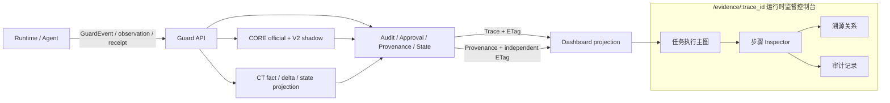
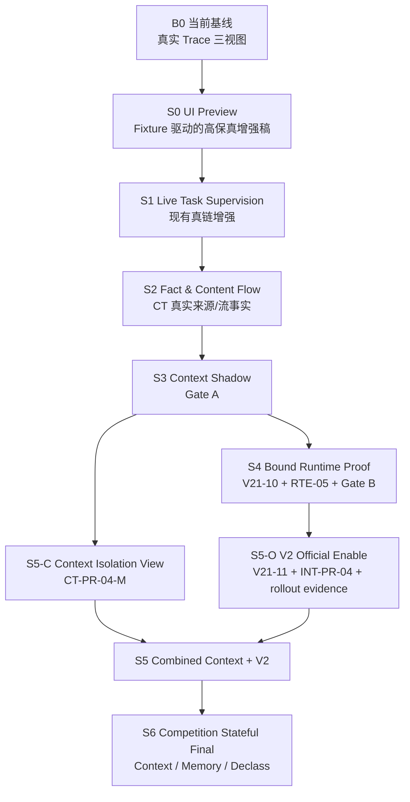

# AgentGuard 运行时监督控制台增强设计包

> 状态：Implementation Freeze Candidate（实施冻结候选稿）
>
> 基线：`dev@3bd42ed`（2026-08-16；CT-PR-03 已完成登记，真实接线由 flag 默认关闭）
>
> 适用范围：Dashboard、Guard API、CORE V2.1、Context/Taint、Runtime Enforcement
>
> 主入口：`/evidence/:trace_id`
>
> 主演示运行时：LangGraph / AttackBench；OpenClaw 在能力门禁通过后作为跨运行时增强

> [!IMPORTANT]
> Productization Alpha 覆盖：本目录是 2026-08-16 的冻结候选设计基线，不是当前运行参数
> 的唯一真值。包内“约 2 秒轮询”表示当时设计值；当前实现由
> `VITE_EVIDENCE_POLL_INTERVAL_MS` 配置，默认 10 秒、下限 2 秒，并在页面隐藏或 Trace
> 明确终态时停止。当前事实以[稳定可观测设计](../04_apps/runtime_safety_observability_design.md)
> 和[状态页](../06_delivery/productization_alpha_status.md)为准。

## 1. 一句话结论

本方案不建设独立“项目成果展示页”，也不在控制台永久放置左右对照图；它在现有 Trace
证据页上增强一套可真实运行的监督工作台，使操作者能够连续回答：

```text
Agent 现在进行到哪一步？
→ 什么内容通过什么渠道进入了上下文？
→ Guard 根据哪些事实和策略作出判断？
→ 是否需要审批，审批到底授权了什么？
→ Runtime 后来是否真的调用、失败或确认未调用？
→ 所有结论能否回到原始审计和溯源证据？
```

展示亮点来自真实产品能力本身，而不是专门为比赛构造的装饰：

1. **实时任务监督图**：任务、上下文、模型检查点、动作、审批和运行结果按稳定身份持续更新；
2. **内容进入上下文路径**：Web、工具结果、Memory 等来源以 CT 的 `SourceFact/FlowFact`
   语义呈现，明确 `exact/strong/possible`，不把推断画成事实；
3. **有权威层级的决策解释**：legacy/current official decision、V2 shadow assessment、审批和
   runtime outcome 分层展示，互不覆盖；
4. **可复核的执行控制**：只有绑定的 `RuntimeOutcomeReceipt` 才能证明
   `execution.status=not_invoked/executed/failed`；
5. **状态安全创新**：后期在同一控制台自然延伸到上下文隔离、Memory 污染、跨会话 taint 和
   declassification proof，无需另建一套演示产品。

## 2. 本设计包与既有文档的关系

本设计包是“监督控制台增强层”，不取代三线冻结合同，也不修改现有事实所有权。

### 2.1 效力顺序

发生冲突时，按以下顺序处理：

1. [CORE V2.1 正式冻结分册](../AgentGuard_Core_V2.1_Final_Contract_Freeze/README.md)；
2. [Context/Taint 正式冻结分册](../AgentGuard_Context_Isolation_Taint_Tracking_Final_RC/README.md)；
3. [Runtime Enforcement v1 正式冻结分册](../AgentGuard_Runtime_Enforcement_Contract_v1_Final/00_README_设计包索引.md)；
4. [现有运行时安全可观测设计](../04_apps/runtime_safety_observability_design.md)、
   [证据链 API 契约](../08_api/evidence_trace_api_contract.md)和鉴权文档；
5. 本设计包；
6. UI 样式稿、Fixture、演示脚本。

本设计包出现的新字段若与上层合同冲突，必须修改本设计包，不能用 Dashboard 需求反向改变
CORE、CT 或 RTE 的安全语义。

### 2.2 继承而不重复建设

现有 `runtime_safety_observability_design.md` 已完成：

- `/evidence/:trace_id` 的执行轨迹、溯源关系、审计记录三视图；
- `ExecutionStepViewModel` 的动作/检查点投影；
- Trace 与 Provenance 独立 ETag；
- 约 2 秒条件轮询；
- Memory/PostgreSQL 上的真实 LangGraph / AttackBench 链路验收。

因此，本方案不是“从零做一张图”，而是增量完成：

```text
现有执行步骤图
  + Task / Trace lifecycle Header（不建立第二套执行节点）
  + 风险动作的 Guard / Approval / Outcome 可展开微流程
  + 执行步骤中的 CT 摘要与跳转；Provenance 中的内容流和 Context Manifest
  + official / shadow / derived 权威标签
  + 更完整的审批依据和 RTE 绑定状态
  + 两条独立 Trace 的调查式差异摘要
```

## 3. 当前真实基线

| 轨道      | 当前已合入能力                                                                                       | 尚未具备的能力                                                                         | 当前允许的展示口径                                                             |
| --------- | ---------------------------------------------------------------------------------------------------- | -------------------------------------------------------------------------------------- | ------------------------------------------------------------------------------ |
| CORE      | V21-09 assess/finalize、CAS revalidation、`decision_v21` 证据信封支持已接线                          | V21-10 pre-enable gate、V21-11 limited enable                                          | V21 shadow flag 默认关；启用后也只能标 `shadow/would-be`，official 仍归 legacy |
| CT        | CT-PR-02/03 已完成；真实 evaluation hook、`ct_transient_facts` commit、commit→project/rebuild 已接线 | V21 shadow flag + server secret + CT flag 的 scoped 激活证据、Gate A、typed Provenance | 仅三门就绪且 plan 有效时产生 CT commit；S2 不据此声称 state 已 apply           |
| RTE       | RTE-01~04、真实 pre-execution gate、terminal receipt、跨运行时 conformance 基础                      | RTE-05 `enforcement_binding` 响应与 lease consume HTTP 接线                            | 可展示当前权威决定、阻断与已关联 receipt；强绑定/单次 lease 尚不可宣称完成     |
| Dashboard | 三视图、执行步骤图、详情 Inspector、ETag 条件轮询、真实 Trace                                        | CT Context Manifest、权威层级标签、动作微流程、调查式 Trace Diff                       | 可展示当前真实 Audit/Approval/Receipt；缺失字段必须显示“未记录/不可用”         |

特别说明：当前 CORE/CT 状态是 `production_wired=yes / both flags default false /
projected=conditional`。因此“代码已接线”不等于“默认生产流量已启用”；S2/S3 必须记录具体
runtime/profile、V21 flag、CT flag、secret readiness（永不记录 secret 值）、materials、commit
envelope、projection/readback 与回滚证据。

## 4. 冻结的产品边界

### 4.1 做什么

- 在现有证据详情页增强运行时监督和调查能力；
- 用图回答“现在发生什么”，用 Inspector 回答“为什么”；
- 复用现有审批页处理审批，不复制审批 mutation；
- 用独立 Trace 记录两次任务，再在 Investigations / Evaluation 中生成紧凑差异摘要；
- 允许开发期 Fixture/Mock 尽早评审视觉效果，但强制来源标识和能力隔离；
- 真实接口不支持的字段使用 `unavailable`，不得在 Live 模式静默回退到 Mock。

### 4.2 不做什么

- 不新增一级“演示中心”“数字驾驶舱”或全屏比赛页；
- 不在主控制台永久并排两个上下文或两个执行图；
- 不展示、推断或命名为模型思维链；
- 不把全部 AuditEvent 都变成顶层图节点；
- 不把审计时间相邻画成已确认因果；
- 不直接展示完整 prompt、Secret、token、lease token、authorization fingerprint 或原始工具参数；
- 不让 Dashboard 重新执行安全判定，也不让前端决定事实权威性；
- 不新增与 AuditEvent / Provenance / RuntimeOutcomeReceipt 冲突的后端事实模型。

## 5. 总体信息架构



控制台的三个层次固定为：

| 层次           | 主要问题                   | 展示对象                              | 是否可操作                   |
| -------------- | -------------------------- | ------------------------------------- | ---------------------------- |
| 任务执行主图   | Agent 现在做到哪一步       | 少量语义节点、明确状态、当前焦点      | 选择、筛选、跟随最新         |
| 步骤 Inspector | 为什么这样做、依据是否充分 | 决策、CT 事实、审批、绑定、回执       | 跳审批页、跳溯源、跳审计     |
| 溯源/审计      | 系统到底记录了什么         | Typed provenance、原始脱敏 AuditEvent | 调查、定位、导出既有 dossier |

## 6. 推荐阶段总览

阶段以“新增一种可见且可信的监督能力”为退出条件，不要求每个底层 PR 都新增 UI。



| Stage | 三线关键依赖                                                                                    | 新增展示效果                                                                             | 允许对外表述                                         |
| ----- | ----------------------------------------------------------------------------------------------- | ---------------------------------------------------------------------------------------- | ---------------------------------------------------- |
| S0    | 无新增 production 依赖；复用冻结 Fixture                                                        | 现有三泳道上的 action capsule、四层详情骨架、来源/权威标签和只读 Preview                 | “这是按冻结契约制作的 UI Preview，不是实时运行结果”  |
| S1    | B0 现有 Trace/Audit/Approval/Provenance + RTE-01~04                                             | 真实 Trace 任务图、动作微流程、审批依据；有 V21 evidence 时显示 shadow，否则 unavailable | “系统可近实时监督当前 Agent 动作、审批和回执”        |
| S2    | CT-PR-03 + INT-RSC-CT-01 三门激活 + INT-RSC-CT-PROV；CT-PR-03R 仅供可选 Replay Preview          | 内容来源及其与 context/model input 的已记录 FlowFact/Provenance 关系                     | “该启用环境提交了这些来源事实，并记录了可深链内容流” |
| S3    | Gate A：CT-PR-03 完成 + INT-PR-01 + CORE V21-09 shadow                                          | Snapshot、coverage、V2 would-be disposition、divergence                                  | “不同上下文导致不同 V2 影子评估，官方决定尚未改变”   |
| S4    | S3/Gate A + CORE V21-10 + RTE-05 + INT-PR-02A / Gate B                                          | Decision→gate→receipt；强授权放行路径增加 binding/lease                                  | “当前权威决定在执行前落实，运行结果可复核”           |
| S5    | S5-C：Gate A + CT-PR-04/04-M；S5-O：S4 + CT-PR-04 + V21-11 + INT-PR-04/02B + INT-RSC-ROLLOUT-01 | CT-PR-04 后两条交付子线合流：Context Manifest + 有审计 scope 的 V2 official              | “在冻结范围内，CT/V2 已实际改变官方决定并驱动 RTE”   |
| S6    | S5 + CORE V21-12 + CT-PR-05/06 + INT-PR-03 + RTE-06/07 + Stateful Rollout Gate                  | 跨会话 Memory 污染、隔离、declassification、可靠性证据                                   | “系统在已启用范围内对有状态攻击链实施持续监督与控制” |

S0 先交付窄范围 Preview 安全壳，S1 沿同一前端主线接真实数据；同一热点文件不并行修改。
Fixture/视觉评审可以与 S1 mapper 准备并行，Mock 字段永不混入 Live 响应。S5-C 与 S5-O
都以 CT-PR-04 为共同功能依赖；其后的 Manifest UI 和 official activation 可并行，只有组合
展示阶段才要求两者都通过。

## 7. 文档清单

| 文档                                                                               | 内容                                                                     | 主要评审人                |
| ---------------------------------------------------------------------------------- | ------------------------------------------------------------------------ | ------------------------- |
| [01_产品边界_总体架构与前端交互.md](01_产品边界_总体架构与前端交互.md)             | 页面结构、任务图、动作微流程、Context/审批交互、Trace Diff               | 产品、前端、安全          |
| [02_字段_状态与投影契约冻结.md](02_字段_状态与投影契约冻结.md)                     | 单一执行投影、四层状态、Provenance、Manifest、Approval/RTE、rollout 字段 | 前后端、CORE/CT/RTE owner |
| [03_API_事件_刷新与安全边界冻结.md](03_API_事件_刷新与安全边界冻结.md)             | 当前接口复用、additive evidence/rollout ref、ETag、鉴权、错误和降级      | Guard API、前端、安全     |
| [04_三线阶段实施_PR拆分与验收.md](04_三线阶段实施_PR拆分与验收.md)                 | B0/S0-S6 依赖、关键节点、PR 切分、退出条件                               | 项目 owner、三线 owner    |
| [05_Fixture_Mock_Replay与演示运行手册.md](05_Fixture_Mock_Replay与演示运行手册.md) | Preview/Replay/Live 隔离、场景、现场恢复和差异运行                       | 前端、测试、答辩人员      |
| [06_测试矩阵_风险与决策记录.md](06_测试矩阵_风险与决策记录.md)                     | 契约/组件/E2E/安全/可访问性测试、风险、ADR                               | QA、安全、架构评审        |

## 8. 冻结注册表

| Freeze ID | 候选冻结项                                                                             | 本设计包位置        |
| --------- | -------------------------------------------------------------------------------------- | ------------------- |
| RSC-F01   | 不新增一级页面，主入口固定 `/evidence/:trace_id`                                       | 01 §2               |
| RSC-F02   | 默认顶层节点是语义步骤，不是每条 AuditEvent                                            | 01 §3、02 §4        |
| RSC-F03   | `decision / approval / enforcement / execution` 四层不可覆盖                           | 02 §2               |
| RSC-F04   | 每个展示对象携带来源/权威；Provenance 边另带确定性                                     | 02 §3、§6           |
| RSC-F05   | Context 只展示 CT-PR-04-M 服务端生产的脱敏、有界 Manifest                              | 02 §7、03 §7        |
| RSC-F06   | S0-S3 不新增 execution-graph 后端事实或专用端点                                        | 03 §2               |
| RSC-F07   | Trace 继续使用约 2 秒 ETag 条件轮询，SSE 暂缓                                          | 03 §9               |
| RSC-F08   | Live 缺字段显示 unavailable，禁止自动 Mock fallback                                    | 03 §11、05 §3       |
| RSC-F09   | `not_invoked` 只来自已记录 RuntimeOutcomeReceipt                                       | 02 §9               |
| RSC-F10   | 主图不做永久左右对照；差异在独立调查摘要中生成                                         | 01 §8               |
| RSC-F11   | authorization fingerprint、lease token 不进入 Dashboard                                | 03 §8               |
| RSC-F12   | 每个 Stage 以证据化退出条件验收，不要求每个 PR 改 UI                                   | 04 §2               |
| RSC-F13   | V21 official 必须有 rollout audit/head CAS、typed ref、tightening/path ownership proof | 02 §10、03 §6       |
| RSC-F14   | V21 official 必须原子切换唯一 GuardDecision，并保持 Live/Replay/RTE exact parity       | 02 §10.3.1、03 §6.4 |
| RSC-F15   | Runtime profile 只能由 server-internal strict attestation 证明，不能由 Adapter 自报    | 02 §10、03 §6.4     |
| RSC-F16   | Scope enable/update 与 evaluation 通过 routing catalog 锁和 epoch/digest 线性化        | 02 §10.3、03 §6.4   |
| RSC-F17   | GuardDecision/replay/rollout 关键载体先预留预算；metadata flooding 不得触发放宽        | 02 §10.4、03 §6.4   |

## 9. 评审与冻结流程

本设计包进入正式实施冻结前，必须按顺序完成：

1. Dashboard owner 确认现有组件复用和交互可实现；
2. CT owner 确认 Context Manifest 只投影已有权威事实，不自创信任结论；
3. CORE owner 确认 official/shadow 标签及 `DecisionEvidenceV21` 映射；
4. RTE owner 确认 binding/receipt 展示不泄露 fingerprint 或 token；
5. Guard API owner 确认不新增图事实端点，additive evidence 符合 64 KiB 与脱敏约束；
6. Security review 确认权限、边界、截断和 Mock 隔离；
7. 以 `runtime_safety_trace_v04.json` 和新增候选 Fixture 跑契约/视觉回归；
8. 将确认后的 Freeze ID 写入实施 PR 描述，并记录偏差。

## 10. 完成定义

本设计工作只有在以下条件同时满足时才算完成：

- 当前能力和目标能力已清楚分开；
- 所有新增展示字段都有事实来源、权威、确定性和缺失语义；
- 所有 API 变化被标为 CURRENT / ADDITIVE TARGET / DEFERRED；
- 每个 Stage 都指出三线依赖、关键节点、退出证据和禁止口径；
- Preview、Replay、Hybrid、Live 不会被用户误认；
- Mermaid、相对链接和 Markdown 格式通过仓库检查；
- 未修改 CORE/CT/RTE 现有冻结语义。
