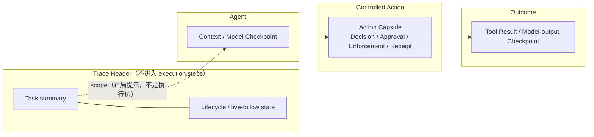
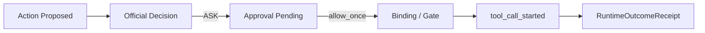
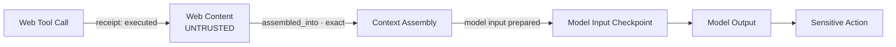

# 01 — 产品边界、总体架构与前端交互

## 1. 设计目标

控制台面向两类真实使用者：

- **运行监督者**：快速知道 Agent 当前在做什么、是否暂停、是否需要人工介入；
- **安全调查者**：在事件发生后复核内容来源、判定依据、审批、执行结果和审计完整性。

界面必须优先满足日常监督，再兼顾比赛演示。比赛展示只是选择一条信息完整的真实 Trace，
不改变页面功能边界。

### 1.1 成功标准

一个第一次接触 AgentGuard 的人应在 30 秒内从主图读出：

1. 用户任务是什么；
2. Agent 已完成哪些语义步骤，当前停在哪里；
3. 哪一步是外部内容、模型检查点、敏感动作或人工审批；
4. Guard 的官方决定是什么，V2 是否只是 shadow；
5. Runtime 是否已给出 `executed/failed/not_invoked` 回执；
6. 点击哪里可以看到完整依据。

安全工程师应能在 3 次以内的点击中，从任一风险节点定位到：

- 对应 `audit_id/event_id/action_id/decision_id/approval_id`；
- 规则、风险和 CT 事实；
- Provenance 节点/边；
- 运行时结果或明确的 `unknown/unavailable`。

## 2. 信息架构冻结

### 2.1 路由不变

不新增一级导航。继续使用：

```text
/overview                 全局态势
/approvals/:approval_id  审批处理
/investigations           调查检索与 Trace 差异摘要
/evidence                 证据列表
/evidence/:trace_id       单 Trace 运行时监督控制台（本方案主入口）
/evaluation               评测与批量结果
/system                   系统状态
```

### 2.2 单 Trace 页面结构

`/evidence/:trace_id` 继续保留执行、溯源、审计三视图；增强发生在执行视图和统一 Inspector，
不是增加第四套页面。

```text
┌──────────────── Trace Header ────────────────┐
│ Task / Runtime / Data Source / Follow-History │
│ 已确认结论 / official-shadow / rollout scope │
└──────────────────────────────────────────────┘
┌────────────── Tabs ──────────────────────────┐
│ [执行监督] [溯源关系] [审计记录]             │
├──────────────────────────┬───────────────────┤
│ 任务执行主图 / 等价列表   │ Step Inspector    │
│                          │ 状态、依据、链接   │
├──────────────────────────┴───────────────────┤
│ 折叠调查摘要 / Evidence Dossier              │
└──────────────────────────────────────────────┘
```

### 2.3 三视图职责

| 视图     | 回答的问题                                            | 不承担的职责                             |
| -------- | ----------------------------------------------------- | ---------------------------------------- |
| 执行监督 | 当前/历史任务经过了哪些受控步骤、停在哪里、人能做什么 | 不展示全部原始事件，不声称时序边是因果边 |
| 溯源关系 | 内容、事实、判定和结果如何关联，证据强度如何          | 不复制实时动作卡片，不承担审批 mutation  |
| 审计记录 | 后端实际持久化了什么，顺序与完整性如何                | 不把逐条记录包装成流程进度               |

## 3. 主图：语义任务图，不是 AuditEvent 墙

### 3.1 节点粒度

用户建议“节点可以是 GuardEvent 或类似”。本方案采纳“类似”的部分，但不把每条
GuardEvent 都变为顶层节点。

冻结规则：

- 顶层节点表示一个操作者可理解的**语义步骤**；
- 同一 `action_id` 的提议、policy evaluation、审批、start 和 outcome 聚合为一个动作胶囊；
- `context_assembled/model_input_prepared/model_output_produced` 等非动作事件形成检查点；
- 重试、重复策略审计、回执更新和原始 GuardEvent 放入节点详情；
- 未知未来事件有稳定 `event_id` 时以“未知检查点”安全回退，不丢失；
- 无稳定身份的记录只进审计视图，不凭时间邻近绑定到某个动作。

这样既保留运行监督的可读性，又不牺牲原始证据。

### 3.2 控制台区域与节点类型

| 控制台元素         | 是否进入执行步骤投影 | 语义                                | 首期来源                                              | 点击后的重点                                      |
| ------------------ | -------------------- | ----------------------------------- | ----------------------------------------------------- | ------------------------------------------------- |
| `task header`      | 否                   | 用户任务和 Trace 范围摘要           | 明确 `trace_started`；或标记为 derived 的脱敏任务摘要 | task/scope/runtime/起点证据                       |
| `checkpoint`       | 是                   | context/model/未知未来 Guard 阶段   | 稳定 `event_id`                                       | 原始类型、Audit、可用的内容摘要和 Provenance 跳转 |
| `action capsule`   | 是                   | 一个稳定 `action_id` 的完整生命周期 | policy、approval、start、outcome 聚合                 | 四层微流程与证据                                  |
| `lifecycle header` | 否                   | Trace 的 observing/终态状态         | `trace_completed/failed/cancelled`；缺失则 observing  | lifecycle audit；不补造终态                       |

`content/source` 是 Provenance 节点，不在执行图再建第二套关系节点。S1 若只有无稳定身份的
`contextSources:string[]`，仅在 checkpoint/action Inspector 展示摘要；S2 有 SourceFact 和
typed Flow/Provenance 后，才提供可深链的内容节点。Guard、Approval 和 Runtime receipt
默认作为 action 胶囊子对象；tool result/model output 可继续作为现有 result checkpoint。
待审批、binding failure、confirmed violation 可作为视觉强调，但不改变顶层步骤身份。

### 3.3 泳道与边

S0-S3 继续复用现有 `agent / controlled / outcome` 三泳道和布局断言：



执行图边只画 `observed_after/audit_order` 时序，不画因果、内容流或 Provenance 叠加层。
checkpoint/action 中的内容入口按钮切换到现有 Provenance Tab 并高亮真实节点。未来若要增加
第四泳道或关系 overlay，必须先修订上位 RSO 冻结文档并单列布局迁移，不属于本增量方案。
Header 到首步的虚线只表达界面范围，不写入 `ExecutionTraceViewModel`，也不参与顺序/因果判断。

### 3.4 Task 与 Trace 生命周期 Header

Task summary 优先来自明确 `trace_started`；缺失时允许用页面 Trace 范围构造一个
`derived_display` 摘要，但必须显示“起点事件未记录”。它是 Header，不是另一个执行节点。

Lifecycle Header 遵循以下纪律：

| 事实                         | Header/动作胶囊可显示                           | 禁止推断                       |
| ---------------------------- | ----------------------------------------------- | ------------------------------ |
| `trace_completed`            | Header `COMPLETED`                              | 不代表所有动作成功             |
| `trace_failed`               | Header `FAILED`                                 | 不反推策略决定                 |
| `trace_cancelled`            | Header `CANCELLED`                              | 不自动写成 Guard 阻断          |
| action receipt `not_invoked` | 动作胶囊“已确认未调用”；BLOCKED 另需 gate state | 不代表整个任务已经结束         |
| action receipt `failed`      | 动作胶囊 `FAILED`                               | 不表示 Guard 拒绝              |
| 无 lifecycle terminal        | Header 保持“实时观察中/终态未记录”              | 不补造 completed/error/blocked |

若未来需要任务级 `BLOCKED`，Runtime 必须在现有 lifecycle observation 中提供明确、冻结的
completion reason；前端不能仅凭 `decision=deny` 或单个动作 receipt 结束整个 Trace。

## 4. 节点状态和视觉编码

### 4.1 中性活动状态

通用步骤只保留中性活动状态：

```text
pending
running
waiting
settled
failed
unknown
```

Decision、Approval、Enforcement、Execution 分别显示独立 badge/subobject。例如
`ASK → allow_once → released → executed` 四个事实必须同时存在，不能用一个节点颜色决定
“最终状态”。

### 4.2 视觉规范

| 状态族            | 色彩建议 | 图标/文字                      | 动效                                      |
| ----------------- | -------- | ------------------------------ | ----------------------------------------- |
| 运行中            | 蓝色     | 运行中                         | 低频脉冲；`prefers-reduced-motion` 时关闭 |
| 等待审批          | 琥珀色   | 等待人工审批                   | 不闪烁，Header 同步出现待处理入口         |
| 已允许/完成       | 绿色     | ALLOW / COMPLETED              | 无持续动效                                |
| 已拒绝/确认未调用 | 红色     | DENY / NOT INVOKED             | 两个独立 badge，分别带证据                |
| 执行失败/控制违例 | 紫红色   | FAILED / ENFORCEMENT VIOLATION | 优先播报且保留证据链接                    |
| CT 内容/事实      | 青色     | SOURCE / FLOW / TAINT          | 边的强度用线型和标签表示                  |
| 未知/不可用       | 灰色     | UNKNOWN / UNAVAILABLE          | 不使用假占位数字                          |

颜色从不单独承载语义。所有状态都有文本、图标和可访问名称。

### 4.3 当前节点

“当前节点”只能由最新未终结语义步骤和显式 lifecycle 事实投影：

- 待审批动作优先成为当前焦点；
- 有 `tool_call_started` 且无 outcome 时显示正在执行；
- 只有 policy evaluation 时显示“已评估，等待运行时回执”，不能显示正在执行；
- 多分支并发时允许多个 active 节点，不强行选唯一当前步骤；
- 用户正在查看旧节点时不抢焦点，只显示“有新进展”按钮。

## 5. 风险动作胶囊与安全微流程

### 5.1 默认形态

默认动作节点保持紧凑：

```text
发送邮件
resource: external@example.test
official: ASK · waiting approval
runtime: UNKNOWN
```

选中后在主图或 Inspector 展开：



### 5.2 四层事实固定分栏

Inspector 固定显示四层，缺失时仍保留槽位并标为未记录：

1. **Decision**：官方 `allow/ask/deny`、decision ID、policy、reason；
2. **Approval**：`pending/allow_once/deny/expired`、审批主体、到期时间；
3. **Enforcement**：RTE gate、binding/lease 的非敏感状态；
4. **Runtime Outcome**：`not_invoked/executed/failed/unknown` 和 receipt。

这四层不做“最终状态覆盖”：例如 `ASK → allow_once → executed` 必须完整保留，不能将原始
`ASK` 改成绿色 `ALLOW`。

### 5.3 违例优先

只有关联唯一且无冲突时，以下事实才能显示 `ENFORCEMENT VIOLATION`：

- official `deny`，但 receipt 为 `executed/failed`；
- approval `deny/expired`，但出现 `tool_call_started` 或 executed receipt；
- binding mismatch 后仍执行。

receipt 的 action/decision/policy links 不一致时，显示
`EVIDENCE CORRELATION CONFLICT / UNVERIFIABLE`，不能确认目标动作发生控制违例。

## 6. 内容进入上下文的 Provenance 可视化

### 6.1 主线

用户提出的“Web 工具后展示内容进入上下文”可行，但落在现有 Provenance 视图：执行图中的
Web action/checkpoint 提供“查看内容去向”，跳转后高亮 Web content、Context 和 Model input
关系。这样既能读出渠道，又不会把时序图冒充因果图。



边的显示规则：

- 工具执行成功不等于结果进入上下文；
- 只有 `FlowFact.relation=assembled_into`、等价确定性证据，或 receipt 明确
  `tool_result_entered_context=true` 才画 confirmed content→context 边；
- LLM 不透明影响最多使用 `possible`，不能用实线表达 exact 因果；
- 没有目标引用时显示孤立 content 节点和“进入情况未知”，不按时间自动连线；
- 被隔离/丢弃内容显示到 Quarantine/Discard 终点，不继续连到模型输入。

### 6.2 Context Manifest，而非完整 Prompt

Context 节点展示服务端生成的有界 Manifest：

- 来源数量：user/web/tool_result/memory/file/rag/model/system；
- included / excluded / quarantined 数量；
- 每个来源的 trust、verification、taint、flow strength；
- 服务端脱敏摘要或 `metadata_only/redacted`；
- 事实/审计引用；
- coverage 和截断状态。

明确禁止：

- 展示系统提示词或模型隐藏思维链；
- 将完整 prompt 发给前端再靠 CSS 隐藏；
- 让前端根据关键词自行判定 trust/taint；
- 将“做过摘要”解释为已经去除 taint；
- 将敏感内容 digest 当作可逆内容展示。

### 6.3 三视图联动

- 执行视图：checkpoint/action 显示来源数量、trust/taint 摘要和“查看内容去向”；
- 溯源视图：显示 content/context 节点和正式 CT relation；
- 选中 Context：只高亮直接来源和后续一个模型检查点；
- 选中 Content：Inspector 展示渠道、taint、处理结果和审计引用；
- `possible` 边使用虚线和文字；legacy causal 显示 unknown，不冒充 confirmed；
- 深链只使用真实 `node_id/action_id/event_id`，不保存布局 synthetic ID。

## 7. 审批依据展示

### 7.1 目标

审批界面不能只显示“高风险 72 分”。审批者需要知道：

```text
谁要做什么
→ 对什么资源/目的地
→ 是否符合原始任务
→ 哪些内容或上下文触发风险
→ 哪些策略/事实支持 ASK
→ allow_once 的范围、有效期和不可委托边界
→ 放行后是否还需要精确绑定
```

### 7.2 Inspector 结构

| 区域           | 展示内容                                             | 来源                            |
| -------------- | ---------------------------------------------------- | ------------------------------- |
| 请求           | action、agent/runtime、资源、目的地、参数脱敏摘要    | Approval + ActionIR 投影        |
| 原始任务对齐   | task 摘要、匹配/不匹配原因                           | policy evidence / V2 assessment |
| 内容与数据风险 | source trust、taint、credential/sensitive、flow path | CT facts / provenance           |
| 策略依据       | rule hits、risk factors、policy revision/digest      | official policy audit           |
| V2 影子意见    | would-be disposition、coverage、divergence           | `decision_v21`，必须标 shadow   |
| 授权边界       | `allow_once`、过期、subject/action/resource 摘要     | Approval / grant projection     |
| 执行绑定       | binding 未签发/可用/已消费/失败/过期                 | RTE-05 非敏感证据               |

处理审批继续跳转现有 `/approvals/:approval_id`。详情页不复制 resolve API 或第二个审批弹窗。

### 7.3 一键决策纪律

- 只保留服务端返回的 `allow_once/deny`；
- 不新增永久允许；
- 提交前清晰显示即将授权的动作和资源摘要；
- 409 后读取服务端终态，不自动重复提交；
- `allow_once` 只代表审批结果，不代表已经执行；
- 只有 RTE-05 完成后才显示强绑定/单次消费成功。

## 8. 两次独立运行的差异查看

不在运行监督主图放置永久左右对照。对照场景按用户建议执行为两条独立任务：

```text
Run A：受信/干净上下文 → trace_A
Run B：不可信/污染上下文 → trace_B
```

之后在 `/investigations` 或 `/evaluation` 选择两个 Trace，生成紧凑差异摘要。差异必须按
实际阶段解释，不能把 shadow 变化与 official/Runtime 变化拼成同一条伪因果链。

S3 shadow-only 示例：

| 差异组            | Run A → Run B                                  |
| ----------------- | ---------------------------------------------- |
| 输入/上下文       | 无 Web source → 新增 untrusted Web source      |
| V2 assessment     | CLEAR_ALLOW → CLEAR_DENY，均标记 shadow        |
| official decision | legacy allow → legacy allow，明确标记“未改变”  |
| 审批              | none → none                                    |
| Runtime           | executed → executed（以两条真实 receipt 为准） |
| 证据              | 新增 recorded FlowFact/Provenance              |

S5 limited-enable 示例：

| 差异组            | Run A → Run B                                                                    |
| ----------------- | -------------------------------------------------------------------------------- |
| 输入/上下文       | trusted → untrusted                                                              |
| official decision | allow → ask，且 V2 已有 official policy/decision + rollout scope ref             |
| 审批              | none → ASK 后人工 deny                                                           |
| Runtime           | executed receipt → `not_invoked` receipt                                         |
| 证据              | Rollout audit/ref、Context Manifest、official decision、approval、receipt 均闭合 |

差异页显示摘要和跳转链接，不复制两张完整图。需要细看时分别打开两个 Trace。

## 9. 实时/伪实时交互

### 9.1 首期机制

继续使用已实现的约 2 秒 ETag 条件轮询，不新增 WebSocket/SSE：

```text
GET /v1/traces/{trace_id}
If-None-Match: <opaque-etag>
```

- `304` 不重建图、不播报、不改变视口；
- `200` 以稳定 ID 合并并只追加/更新受影响节点；
- 页面不可见时暂停，重新可见后立即校准；
- 网络错误保留最后已确认事实，进入有界退避；
- 待审批、失败、阻断、enforcement violation 优先播报；
- 明确 Trace 终态后完成一次 Trace 和 Provenance 最终校准。

### 9.2 用户控制

- 默认自动跟随最新节点；
- 用户拖拽、缩放、选中旧节点后暂停自动跟随；
- 新节点到达时显示“查看最新（N）”；
- “适配画布”是显式操作，不在每次轮询自动执行；
- 断线恢复后显示校准时间和是否有新增事实；
- Replay 使用可控播放速度，但始终显示 `REPLAY`，不模拟 Live 连接灯。

## 10. 组件复用与增量改造

| 当前组件/模块                | 保留职责                          | 增量改造                                               |
| ---------------------------- | --------------------------------- | ------------------------------------------------------ |
| `EvidenceDetailPage.vue`     | 三视图、URL 深链、轮询生命周期    | Header 来源/权威标签、只读传播、Trace 差异入口         |
| `ExecutionTrace.vue`         | 执行视图控制器、筛选、图/列表切换 | 当前节点、Preview/Replay banner、Provenance 跳转       |
| `ExecutionFlowGraph.vue`     | 现有三泳道、确定性布局            | action capsule、四层 badge；不新增关系 overlay         |
| `ExecutionTraceList.vue`     | 无障碍等价列表                    | 与 Graph 共用步骤和四层事实摘要                        |
| `ExecutionStepInspector.vue` | 步骤详情、审批/溯源/审计入口      | Approval Basis、Context 摘要、official/V2/outcome 分栏 |
| `execution-trace.ts`         | 唯一动作生命周期投影              | 保持唯一真相源；只增稳定引用和必要字段                 |
| `ProvenanceGraph.vue`        | 事实关联图                        | certainty/authority 过滤和 unknown 安全回退            |
| `AuditTimeline.vue`          | 原始审计                          | 与新增节点双向定位，不承担新的聚合逻辑                 |

建议新增前端纯模块，不新增后端图模型：

```text
apps/dashboard/src/data/supervision/
  step-details-projector.ts
  provenance-presentation.ts
  context-manifest-projector.ts
  approval-basis-projector.ts
  trace-diff-projector.ts
```

共享类型继续放在 `types/dashboard.ts` 或拆为 `types/runtime-supervision.ts`；选择取决于当前类型
文件增长情况，不在本设计稿强制大规模重构。

## 11. 响应式、性能和可访问性

### 11.1 响应式

- 大屏：主图 + 右侧 Inspector；
- 中屏：主图在上，Inspector 在下；
- 小屏：默认等价列表，图形视图由用户显式打开；
- 不依赖 hover 才能看到关键状态；
- 全屏图仍可退出、可键盘操作。

### 11.2 性能预算

- 顶层语义节点建议软上限 200；超过后按时间窗口/风险过滤，而不是静默丢弃；
- 单次 Trace 当前后端审计上限 1000，页面必须显示 `has_more`；
- Context Manifest 每节点的返回条数和摘要长度见 02/03 文档；
- Provenance 不随每次 Trace 轮询自动重排；
- 节点更新应保持稳定 key，避免全量卸载组件。

### 11.3 可访问性

- 图和列表信息等价；
- 首期节点通过 Tab 选择，Enter/Space 打开 Inspector；方向键 roving focus 另列独立增强 PR；
- 关键更新使用有节制的 `aria-live`；
- 状态色满足对比度并有文本/图标；
- `prefers-reduced-motion` 禁用脉冲和平滑跟随；
- Inspector 标题、section、definition list 具备正确语义；
- 错误和 unknown 不只用灰色弱化，必须可读。

## 12. 页面级验收

前端交互完成至少满足：

- [ ] 不新增一级导航，旧 `/evidence/:trace_id` 深链全部可用；
- [ ] 默认图不把全部 AuditEvent 展开成顶层节点；
- [ ] 一条风险动作可展开 Decision/Approval/Enforcement/Outcome；
- [ ] `ASK → allow_once → executed` 三个事实同时保留；
- [ ] 仅有 deny 时不显示“已确认未执行”；
- [ ] 执行图只画审计顺序；content→context 关系只在 Provenance 中展示；
- [ ] `possible` 边使用虚线和文字；
- [ ] official/shadow/derived 可视觉和辅助技术识别；
- [ ] Live 缺失 CT 数据显示 unavailable，不读取 Mock；
- [ ] 图和列表的节点、状态、链接等价；
- [ ] 用户检查旧节点时新数据不抢焦点；
- [ ] 两 Trace 差异通过调查摘要完成，不在主控制台永久并排；
- [ ] 所有内容摘要已经过服务端脱敏和前端兜底掩码。
