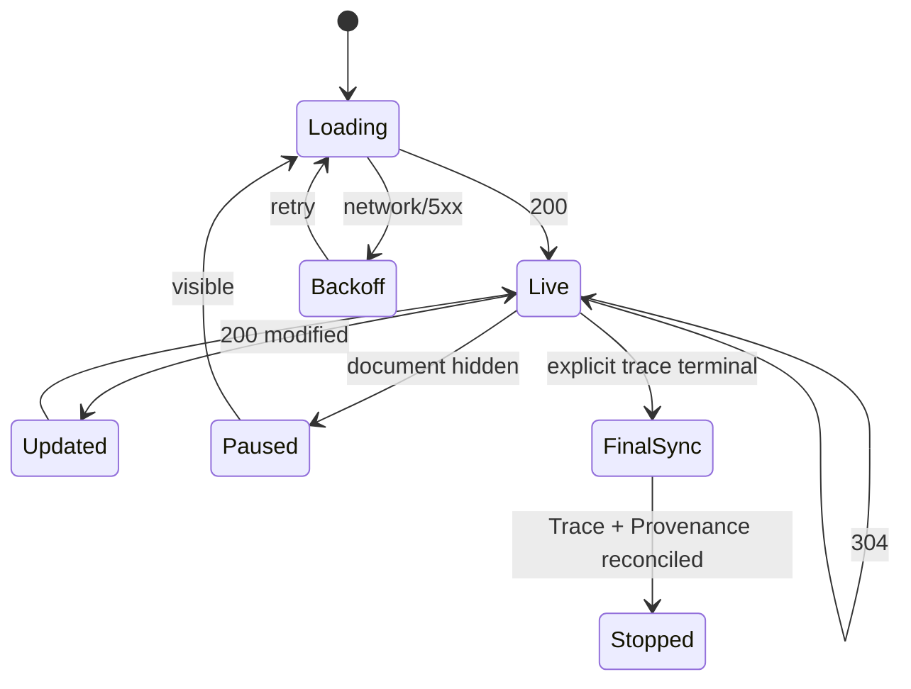

# 03 — API、事件、刷新与安全边界冻结

## 1. API 总原则

本方案冻结“复用现有事实接口，前端确定性投影”的路线：

```text
GET Trace + GET Provenance
        ↓
Dashboard mapper / projector
        ↓
ExecutionTraceViewModel + RuntimeSupervisionViewModel
```

### 1.1 禁止新建第二事实源

S0-S3 明确不新增：

```text
× GET /v1/traces/{trace_id}/execution-graph
× GET /v1/traces/{trace_id}/runtime-outcome
× 持久化 ExecutionNode / GraphNode 表
× Dashboard 专用 RuntimeEvent
× 前端直接查询 OnlineState/数据库
```

原因：现有冻结设计已明确 AuditEvent、Approval、Provenance 是后端事实，执行图是 Dashboard
投影。新增图 API 会产生身份、分页、更新、权限和冲突处理的第二套真相。

只有在真实压测证明 Trace/Provenance 响应无法满足预算，且已有有界 evidence/provenance
扩展仍不足时，才可通过新 ADR 评审通用 read model。该 ADR 必须明确是否 supersede 现有
RSO-02/03/04，而不能由某个前端 PR 隐式引入。

## 2. 接口冻结矩阵

### 2.1 CURRENT：继续复用

| API                                    | 用途                           | 调用者                 | 鉴权                                            | 缓存/分页                          |
| -------------------------------------- | ------------------------------ | ---------------------- | ----------------------------------------------- | ---------------------------------- |
| `GET /v1/traces/{trace_id}`            | Audit、Approval、图投影主数据  | Dashboard / 调查客户端 | browser session 或 bearer `trace:read`          | 独立 ETag；`limit/cursor`          |
| `GET /v1/traces/{trace_id}/provenance` | 事实关系和关联依据             | Dashboard / 调查客户端 | 同上                                            | 独立 ETag；有界节点/边窗口         |
| `GET /v1/audit/window`                 | 原子审计窗口、调查和分页       | Dashboard              | session；或 bearer `audit:read + metrics:read`  | snapshot + cursor                  |
| `GET /v1/approvals/pending`            | 待审批队列                     | Dashboard              | browser session                                 | 当前列表契约                       |
| `POST /v1/approvals/{id}/resolve`      | 人工 `allow_once/deny`         | Dashboard              | browser session + CSRF                          | mutation，不自动重试               |
| `GET /v1/approvals/{id}/wait`          | Runtime 等待审批终态           | Adapter/Plugin         | bearer `approval:wait` + runtime/agent identity | 不供浏览器替代 pending API         |
| `POST /v1/audit/events`                | Adapter 写 observation/receipt | Adapter/Plugin         | bearer `event:audit:write`                      | 按 record type 校验、幂等/冲突检查 |

`AuditEvent 0.4` 外壳当前为 `extra=allow`，不能把整个端点称为严格 schema。只有
`record_type=runtime_outcome` 会二次按 `RuntimeOutcomeReceipt(extra=forbid)` 严格校验；其他
record type 仍需各自的 typed evidence producer/boundary，未知 extra 不会自动获得可信语义。

### 2.2 ADDITIVE TARGET：按 Stage 接入

| 目标                                               | 承载位置                                                                  | 依赖                                       | Dashboard 使用方式                                                      |
| -------------------------------------------------- | ------------------------------------------------------------------------- | ------------------------------------------ | ----------------------------------------------------------------------- |
| Approval `evidence/resolution/llm_review` 类型补齐 | 现有 Trace 的 `approvals[]`                                               | FE-RSC-01                                  | 修复 DTO/mapper 丢字段，无后端新接口                                    |
| official/shadow 显式映射                           | 现有 policy Audit `evidence.decision_v21`                                 | CORE V21-09 已有                           | Inspector 分栏，shadow 不参与官方状态                                   |
| CT fact/state 引用                                 | CURRENT `evidence.ct_transient_facts` 1.1/`ct-fact-2`（兼容读 1.0/`ct-fact-1`）；typed Provenance `ct-provenance/1.0` | CT-PR-03 + INT-RSC-CT-01 + INT-RSC-CT-PROV | Inspector 摘要；真实 Source/Flow 深链；projection ref 不证明 apply      |
| Context Manifest                                   | server-internal strict `ContextManifestAuditRecord` + typed bound channel | CT-PR-04 + CT-PR-04-M/INT                  | 有界、脱敏 chunk/transform；外部 Adapter 不可伪造；不阻塞 V21-11        |
| RTE display evidence + receipt links               | 待冻结的无敏感 evidence；receipt additive `lease_id/consumption_id`       | CORE V21-10 + RTE-05 schema review         | 展示 gate/binding/consume 状态；不返回 fingerprint/token                |
| V21 rollout/enable evidence                        | strict rollout audit + internal head CAS + policy `v21_rollout_ref`       | CORE V21-11/12-R + INT-PR-04/03R           | 证明 scope、tightening、enabled path/rule ownership；不返回 flag/secret |
| comparison key                                     | 待冻结的 Trace/case 字段                                                  | 评测 owner + schema/幂等评审               | 未冻结前只做聚合差异，不做动作自动配对                                  |

### 2.3 DEFERRED：本方案不实施

```text
GET /v1/traces/{trace_id}/stream
GET /v1/traces/compare
GET /v1/context/{context_ref}/raw
GET /v1/prompts/{id}
WebSocket execution graph
通用 GraphQL 图查询
```

SSE 未来只允许作为“快照失效通知”；收到通知后仍必须重新 GET 完整 Trace，不把可能丢失的
增量事件当恢复真相。

## 3. 当前 Trace Wire Contract

`GET /v1/traces/{trace_id}` 当前响应：

```json
{
  "trace_id": "trace_...",
  "audit_events": [],
  "approvals": [],
  "audit_window": {
    "limit": 1000,
    "returned_count": 12,
    "has_more": false,
    "next_cursor": null,
    "snapshot_id": "snapshot_..."
  },
  "approval_window": {
    "limit": 1000,
    "returned_count": 1,
    "has_more": false
  }
}
```

前端类型必须补齐当前服务端已经返回但 `GuardTraceDetailDto` 尚未完整声明的窗口字段，尤其是
`next_cursor/snapshot_id/approval_window`。当任一 `has_more=true` 时：

- 图可以展示当前窗口；
- `completeness` 必须为 `partial`；
- 不得声称证据链完整；
- 用户进入全量调查时按同一 snapshot cursor 分页；
- 不把两个不同 snapshot 的页拼成一个完整窗口。

## 4. 当前 Provenance Wire Contract

`GET /v1/traces/{trace_id}/provenance` 当前响应：

```json
{
  "trace_id": "trace_...",
  "nodes": [
    {
      "node_id": "opaque",
      "trace_id": "trace_...",
      "kind": "action",
      "ref_id": "action_...",
      "label": "send_message",
      "timestamp": "2026-08-16T00:00:00Z",
      "metadata": {}
    }
  ],
  "edges": [
    {
      "edge_id": "opaque",
      "trace_id": "trace_...",
      "source_node_id": "...",
      "target_node_id": "...",
      "relation": "evaluated_by",
      "timestamp": "2026-08-16T00:00:00Z",
      "metadata": {}
    }
  ],
  "provenance_window": {
    "node_limit": 1000,
    "returned_node_count": 10,
    "nodes_have_more": false,
    "edge_limit": 2000,
    "returned_edge_count": 12,
    "edges_have_more": false,
    "has_more": false
  }
}
```

### 4.1 CT additive metadata（INT-RSC-CT-PROV / S2-L TARGET）

S2 起可以在现有 Provenance 节点/边 metadata 中增加有版本的安全字段；字段是事实投影，不
改变顶层 schema：

Node metadata 与 Edge metadata 是两个带 discriminator 的 DTO，不能混写：

```json
{
  "contract": "ct-provenance/1.0",
  "kind": "node",
  "node_kind": "source",
  "node_ref": { "ref_type": "source", "ref_id": "source:web:01" },
  "source_type": "web",
  "trust": "untrusted",
  "verification_state": "verified",
  "fact_authority": "untrusted_claim",
  "taints": ["UNTRUSTED", "EXTERNAL_INSTRUCTION"],
  "coverage": "complete",
  "evidence_refs": [
    {
      "ref_id": "eref_01",
      "kind": "audit_event",
      "record_type": "policy_evaluation",
      "record_id": "audit_01",
      "json_pointer": "/evidence/ct_transient_facts",
      "digest": "sha256:...",
      "redaction_state": "summary_only"
    }
  ]
}
```

Context/Model Input 等非 Source 节点使用同一 common header，但不得伪填 Source 字段：

```json
{
  "contract": "ct-provenance/1.0",
  "kind": "node",
  "node_kind": "context",
  "node_ref": { "ref_type": "context", "ref_id": "context:01" },
  "scope_digest": "sha256:<scope>",
  "manifest_event_id": null,
  "taints": ["UNTRUSTED", "EXTERNAL_INSTRUCTION"],
  "coverage": "complete",
  "evidence_refs": [
    {
      "ref_id": "eref_01",
      "kind": "audit_event",
      "record_type": "policy_evaluation",
      "record_id": "audit_01",
      "json_pointer": "/evidence/ct_transient_facts",
      "digest": "sha256:...",
      "redaction_state": "summary_only"
    }
  ]
}
```

`node_kind` 冻结为以下 discriminated union；未列字段不得跨 variant 搬用：

| node_kind     | 必需业务字段                                                 |
| ------------- | ------------------------------------------------------------ |
| `source`      | `source_type/trust/verification_state/fact_authority/taints` |
| `context`     | `scope_digest/manifest_event_id/taints`                      |
| `model_input` | `event_id/context_ref/model_call_ref/taints`                 |
| `memory`      | `memory_ref/trust/fact_authority/taints`                     |
| `action`      | `action_id`                                                  |
| `other`       | 无额外可信字段；coverage 只能 `unknown/not_applicable`       |

```json
{
  "contract": "ct-provenance/1.0",
  "kind": "edge",
  "flow_id": "flow:01",
  "flow_relation": "assembled_into",
  "source_ref": "source:web:01",
  "target_ref": "context:01",
  "flow_strength": "exact",
  "flow_origin": "observed",
  "coverage": "complete",
  "evidence_refs": [
    {
      "ref_id": "eref_01",
      "kind": "audit_event",
      "record_type": "policy_evaluation",
      "record_id": "audit_01",
      "json_pointer": "/evidence/ct_transient_facts",
      "digest": "sha256:...",
      "redaction_state": "summary_only"
    }
  ]
}
```

要求：

- 未识别 contract 版本时保留节点但不解释安全字段；
- 缺失 certainty/strength 时默认为 `unknown`，不得默认 causal/confirmed；
- `coverage` 只能是 `complete/partial/stale/unknown/not_applicable`，由 CT/Provenance server
  writer 根据输入窗口、refs 和版本产生；Adapter/前端不得升级；
- metadata 只含有界结构和引用，不放完整 content；
- CT edge 顶层 `relation` 必须逐字等于 metadata 的 `flow_relation`，并使用 02 章十种正式
  FlowFact relation 之一；metadata 保留 `flow_id/source_ref/target_ref/strength/origin/refs`；
  不得只写通用 `causal`；
- Edge endpoint 必须存在，不能持久化悬空边；
- top-level `source_node_id/target_node_id` 必须分别解析为 metadata 的
  `source_ref/target_ref` 所指节点（目标 Node 的 `node_ref.ref_id` 必须逐字等于相应 ref）；
- Node 的 `node_ref`、Edge 的 endpoint ref 和 `evidence_refs` 均是唯一引用来源，不另造
  `fact_ref/source_fact_ref` 别名；
- top-level Node `kind/ref_id/trace_id` 必须分别与
  `node_kind/node_ref.ref_id/当前 Trace` 一致，且
  `node_ref.ref_type == node_kind == top-level kind`；
- `node_id = ctnode:sha256(JCS({trace_id,node_ref}))`；
  `edge_id = ctedge:sha256(JCS({trace_id,flow_id,source_ref,target_ref,flow_relation}))`；
- top-level Edge `trace_id` 必须等于当前 Trace，`source_node_id/target_node_id` 对应节点也必须
  属于同一 Trace；
- 同一 `flow_id` 内容冲突时返回受控错误或 degradation，不覆盖。

当前 legacy 边仅有 `causal` 或通用关系时，Dashboard 必须标为 legacy/unknown；只有
`contract=ct-provenance/1.0` 且正式 relation、strength、origin、coverage 和 refs 齐全时，才
启用 CT 样式。映射上限：

| coverage / origin                                        | certainty 上限                               |
| -------------------------------------------------------- | -------------------------------------------- |
| `complete` + exact + observed/deterministic + valid refs | `confirmed`                                  |
| `complete` + strong + valid refs                         | `supported`                                  |
| `complete` + possible，或任何 `semantic_inferred`        | `possible`                                   |
| `partial`                                                | exact/strong 最多 `supported`；possible 不变 |
| `stale/unknown`                                          | `unknown`                                    |
| `not_applicable`                                         | 不显示 CT 因果结论                           |

缺 endpoint、版本或 evidence ref 一律 `unknown`，多个 possible/partial 不可累积升级。

## 5. Approval 字段接入

### 5.1 当前后端字段

当前 Approval 已包含：

```text
approval_id / trace_id / subject_id / subject_type
action_id / action_name / requesting_principal_id
runtime / agent_id / status / decision_options / decision
resource / reason / risk_score / severity
evidence / llm_review
resolution_source / resolved_by / resolution_reason
created_at / expires_at / resolved_at
```

### 5.2 前端契约修复

`GuardApprovalDto` 应 additive 声明：

```ts
evidence?: Record<string, unknown>;
llm_review?: Record<string, unknown> | null;
resolution_source?: "human" | "llm" | "system" | null;
resolved_by?: string | null;
resolution_reason?: string | null;
```

`mapApproval()` 应从 `evidence` 和对应 policy audit 映射：

- 原始 `event_id`；
- user task 的服务端脱敏摘要；
- rule hits 和 decision ID；
- official policy 版本/digest；
- shadow `decision_v21`（若存在）；
- evidence completeness。

无法唯一关联时保留 `unknown`，不按时间最近记录猜测。

### 5.3 Mutation 不变

```http
POST /v1/approvals/{approval_id}/resolve
Cookie: agentguard_session=<HttpOnly>
X-AgentGuard-CSRF: <memory-only-token>
Content-Type: application/json

{"decision":"allow_once"}
```

- 只允许 pending→终态；
- 重复/并发/过期返回 409；
- 409 后刷新 Trace/Approval 展示服务端终态；
- 不自动重试 mutation；
- 页面和 store 必须共同消费 02 章由 store 私有持有的 mutation selector；只有 data-source factory 给出的
  `live_api + approvalMutation`、`temporalState=following`、session/CSRF 有效且
  approval/action/official decision/basis 都是 Live 并唯一关联同一 Trace 时才发 POST；
- Historical、Preview、Replay、Hybrid 整页和审批深链均只读；`readonly=1` 只能额外关闭，
  不能提升 data-source capability；store 拒绝时不得调用网络。

## 6. CORE official / shadow 接口语义

### 6.1 V21-09

当前 `evidence.decision_v21` 形状：

```json
{
  "decision_v21": {
    "schema_version": "2.1",
    "payload": {
      "mode": "shadow",
      "v21_fast_disposition": "CLEAR_DENY",
      "final_decision": "allow",
      "legacy_decision": "allow",
      "divergence_category": "..."
    }
  }
}
```

接口返回该信封不表示 V2 为官方决定。Dashboard 映射固定为：

```text
AuditEvent top-level + evidence.guard_decision + API GuardDecision（全一致） → official
decision_v21.payload(mode=shadow)                                      → shadow
limited_enable/active 但缺 strict rollout ref 或任一 carrier 不一致       → V21 authority unavailable
```

在 V21-09 shadow 模式中，`final_decision` 必须保持等于 `legacy_decision`；V2 的 would-be
deny 只能由 `v21_fast_disposition=CLEAR_DENY` 等 shadow 字段表达，不能把
`final_decision=deny` 当作影子结论。

只有 V21-11 的正式 limited enable 门槛完成并有明确模式记录后，V2 才可进入 official 区域。

### 6.2 State delta 引用

`evidence.state_delta_v21` 只保存投影身份引用，不内嵌全量 delta。当前实际字段严格为：

```text
projection_id
delta_digest
source_record_type
source_record_id
source_revision
```

`source_sequence/projector_version` 如未来需要，必须走 additive schema Gate；当前 UI 不得读取。

Dashboard 只能展示引用和校验状态，不能从引用推断 delta 已成功 apply。真实 projected state
必须有对应 projection/state/rebuild 证据。

### 6.3 CURRENT CT-PR-03b fact commit envelope

当前 `dev@3bd42ed` 已在真实 evaluation hook 中接入 CT-PR-03b，但 CT plan 只有同时满足
以下三项才会生成：

```text
AGENTGUARD_V21_SHADOW_ENABLED=true
AGENTGUARD_V21_SHADOW_SERVER_SECRET=<valid base64url, at least 32 bytes>
AGENTGUARD_CT_FACT_PROJECTION_ENABLED=true
```

两个 flag 默认均为 false；只有 V21 Phase A 先产出 materials，CT service 才能构造 plan。满足
三门后，同一条 `policy_evaluation` Audit 会原子携带 full commit envelope：

```json
{
  "evidence": {
    "ct_transient_facts": {
      "schema_version": "1.1",
      "payload": {
        "fact_builder_version": "ct-fact-2",
        "ct_delta_builder_version": "ct-delta-1",
        "commit_id": "ct-commit:evt_01",
        "bundle_digest": "sha256:<bundle>",
        "bundle": {
          "schema_version": "1.0",
          "event_id": "evt_01",
          "scope_digest": "sha256:<scope>",
          "source_facts": [],
          "flow_facts": [],
          "memory_facts": [],
          "declassifications": [],
          "current_action": null,
          "signals": [],
          "degradations": [],
          "evidence_refs": [],
          "bundle_digest": "sha256:<bundle>"
        },
        "projection_id": "projection:<id>",
        "base_state_version_at_commit": 0,
        "source_identity": {
          "source_record_type": "runtime_observation",
          "source_record_id": "ct-facts:evt_01",
          "source_revision": 1
        }
      }
    }
  }
}
```

上例给出完整字段形状；真实有效 event 通常至少有一类 fact/signal。预算不足时，当前代码会把
整个值替换为另一 union variant（它没有 `schema_version/payload`）：

```json
{
  "evidence": {
    "ct_transient_facts": {
      "_budget_dropped": true,
      "_envelope_sha256": "sha256:<full-envelope>"
    }
  }
}
```

消费者必须先判 `FullCommitEnvelope | BudgetDroppedRef`：dropped 只显示
`partial / committed bundle unavailable`，不得映射空 facts；full 再校验当前写入的
1.1/`ct-fact-2`（并兼容读取历史 1.0/`ct-fact-1`）、payload、外层
bundle digest 与 `bundle.bundle_digest` 双一致、source identity 和 envelope canonical digest。
当前状态必须分开表述：

```text
production_wired = yes
default_enabled = no
commit/persist/project = only when V21 flag + valid secret + CT flag + valid plan are all ready
decision_authority = none（CT facts 本身不产生 final decision）
```

Dashboard 可直接消费 full envelope 构建 Inspector Source/Flow 摘要，但该 envelope 没有真实
Provenance node ID，也不能证明 delta 已 apply。S2 正式内容深链依赖 4.1 的
`INT-RSC-CT-PROV` additive writer；state apply/readback 证明留给 S3/Gate A。两者都复用现有
Trace/Provenance API，不新增 execution-graph API。

### 6.4 TARGET：V21 rollout / enable 审计和 Trace 引用

`DecisionEvidenceV21.mode` 不是 rollout scope 的充分证明。S5-O/S6 必须新增 server-internal
`record_v21_rollout_change()`，以严格 `V21RolloutAuditRecord(extra=forbid)` 写入现有 Audit
store；外部 `POST /v1/audit/events` 对保留的
`config_audit/v21_rollout_changed` 返回 403/422，不能伪造 enable/cohort/authority。

配置审计复用 `AuditEvent 0.4` 外壳：

```json
{
  "audit_id": "audit_rollout_<sha256(rollout_id|revision)>",
  "schema_version": "0.4",
  "record_type": "config_audit",
  "trace_id": "rollout:competition-v21",
  "runtime": "langgraph",
  "timestamp": "2026-08-16T00:00:00Z",
  "stage": "rollout_control",
  "event_type": "v21_rollout_changed",
  "summary": "V21 limited enable scope accepted",
  "decision": "allow",
  "risk_score": 0,
  "severity": "low",
  "blocked": false,
  "reason": "validated_rollout_configuration",
  "links": {
    "config_audit_event_id": "audit_rollout_<sha256(rollout_id|revision)>",
    "rollout_id": "competition-v21",
    "mutation_id": "rollout-mutation-0007",
    "previous_config_audit_id": "audit_rollout_<revision-6>"
  },
  "metadata": {
    "contract": "v21-rollout-audit/1.0",
    "producer": "guard_api_rollout_controller",
    "producer_binding_id": "guard-api:rollout-controller:1"
  },
  "evidence": {
    "rollout_v21": {
      "schema_version": "1.0",
      "rollout_id": "competition-v21",
      "mutation_id": "rollout-mutation-0007",
      "command_digest": "sha256:<canonical-command>",
      "revision": 7,
      "previous_revision": 6,
      "previous_rollout_digest": "sha256:<revision-6>",
      "previous_config_audit_id": "audit_rollout_<revision-6>",
      "rollout_digest": "sha256:<JCS-payload>",
      "routing_catalog_epoch": 12,
      "routing_catalog_digest": "sha256:<sorted-routing-descriptors>",
      "change_type": "enable",
      "mode": "limited_enable",
      "authority": "official",
      "scope_kind": "case",
      "case_ids": ["hard-case-01", "hard-case-02"],
      "cohort_id": null,
      "cohort_revision": null,
      "cohort_digest": null,
      "runtime": "langgraph",
      "runtime_profile": "competition-sandbox-v1",
      "policy_revision": 42,
      "policy_digest": "sha256:<policy>",
      "migration_rule": "tightening_only",
      "enabled_path_ids": [
        "credential_unauthorized_external_egress",
        "capability_scope_mismatch_high_impact"
      ],
      "transferred_rule_ids": [
        "rule-credential-egress",
        "rule-capability-scope"
      ],
      "ownership_transfer_revision": "ownership-9",
      "ownership_transfer_digest": "sha256:<ownership-manifest>",
      "snapshot_schema_version": "2.1",
      "projector_version": "v21-projector-1",
      "snapshot_eligibility_revision": "eligibility-3",
      "snapshot_eligibility_digest": "sha256:<required-check-coverage-gate>",
      "effective_at": "2026-08-16T00:00:00Z",
      "rollback_of_config_audit_id": null,
      "reason_codes": ["HARD_CASE_SCOPE_APPROVED"],
      "evidence_refs": []
    }
  }
}
```

现有 `AuditEvent` 对 `config_audit` 要求的顶层 decision/risk/severity/blocked 只表达“配置变更
通过配置审计”，`buildExecutionTrace()` **不得**把它映射为动作 official decision。`audit_id`
由 `rollout_id + revision` 确定性生成；
`rollout_digest = sha256(JCS(final bounded rollout_v21 excluding rollout_digest))`。同 ID/同
digest 幂等，同 ID/异 digest 冲突。

写入必须先提交 02 §10.2 完整列出的 `RolloutMutationCommandV1(extra=forbid)`；该 schema 是
`command_digest` 的唯一 JCS 输入，不接受隐式字段或 server-derived 字段。本设计冻结的是 Guard
API 内部/受信控制面的 service command，不新增 Dashboard rollout mutation endpoint；未来若暴露
运维 HTTP API，需另行冻结认证、CSRF、RBAC 和审计。处理顺序固定为：

空存储的 catalog CAS 基线不是 null：固定为
`epoch=0, digest=sha256(UTF8("[]")), updated_at=null`；首个 initialize command 必须携该 expected
catalog，并在同一事务推进 epoch 1。已有存储在进程重启后继续使用持久化 epoch/digest，不能重新
解释为 genesis。

```text
optional fast lookup (rollout_id, mutation_id)
  same command_digest      → 返回原 revision/config audit/effective_at（idempotent replay）
  different command_digest → 409 conflict
  no record               → acquire rollout-routing catalog exclusive lock → lock RolloutHead
                              → mandatory second lookup under lock
                                same digest → 返回原结果
                                different digest → 409
                                still absent → expected catalog/head CAS
                                  → overlap validation + next catalog epoch/digest
                                  → append audit + update rollout/catalog heads atomically
```

因此丢响应后的 exact retry 不会因 head 已推进而变成 stale，也不会重新生成 `effective_at`；两个
同 mutation/digest 的首次请求即使并发 fast-miss，后取 lock 者也会在二次 lookup 返回原结果。只有
两次 mutation lookup 都未命中时才检查 expected catalog/head。strict config audit append、rollout
head 和 routing catalog head 更新属于同一事务，任一失败都不可见。rollback 也 CAS 当前 head，生成新的 shadow revision，并在
links/payload 中引用旧 config audit，不覆盖历史。v1 的 `effective_at` 由服务端事务时间生成，不
接受未来 scheduled activation。

rollout mutation 与 evaluation 必须遵循 02 §10.3 的唯一锁序：最外层先取 rollout-routing catalog
lock（evaluation=shared、mutation=exclusive），再按 rollout ID 排序取 per-rollout locks，之后才可
进入 policy evaluation/event、audit-chain、provenance、approval 等既有锁；不得从已持有
audit/provenance lock 的 `evaluation_transaction()` 内反向获取 catalog/rollout lock。PostgreSQL
使用 transaction advisory/row lock，Memory 使用 routing RW lock + per-rollout wrapper；两端都
禁止 nested transaction 和逆序加锁，并以并发超时测试作为合入 Gate。

单步 transition 只允许：`initialize: none→shadow`、`enable: shadow→limited_enable`、
`update: same-mode`、`promote: limited_enable→active`、
`rollback: limited_enable|active→shadow`。rollback 必须 `revision>1`，且 payload/links 的
`rollback_of_config_audit_id` 与 `previous_config_audit_id`、实际 previous head config audit 三者
相同；非 rollback payload 为 null 且 links 不出现 rollback key。

producer 写入前，`V21RolloutAuditRecord` 的 outer、links、metadata、evidence 都按 02 §10.2 strict
`extra=forbid` 校验；`trace_id=rollout:<rollout_id>`，producer/binding、mutation、previous/rollback
links 与 payload 逐字一致。存储读回后允许的 outer additive fields 仅为 AuditEvent 自动补齐的
`case_id/attack_type/is_malicious/resource_targets/rule_hits/latency_ms` 中性默认值和 strict
`integrity`；nested 仍完全 strict，其他 outer extra 拒绝。不能依赖 generic
`links: dict[str,string]` 接受任意字段。

当 rollout 实际影响一次评估时，Guard API 必须在写 official policy Audit 的同一事务内增加：

```json
{
  "evidence": {
    "v21_rollout_ref": {
      "schema_version": "1.0",
      "rollout_id": "competition-v21",
      "rollout_revision": 7,
      "rollout_digest": "sha256:<JCS-payload>",
      "config_audit_id": "audit_rollout_<sha256(rollout_id|revision)>",
      "routing_catalog_epoch": 12,
      "routing_catalog_digest": "sha256:<sorted-routing-descriptors>",
      "change_type": "enable",
      "previous_config_audit_id": "audit_rollout_<revision-6>",
      "rollback_of_config_audit_id": null,
      "mode": "limited_enable",
      "authority": "official",
      "scope_kind": "case",
      "matched_case_id": "hard-case-01",
      "matched_cohort_id": null,
      "cohort_revision": null,
      "cohort_digest": null,
      "scope_membership_ref": null,
      "runtime": "langgraph",
      "runtime_profile": "competition-sandbox-v1",
      "policy_revision": 42,
      "policy_digest": "sha256:<policy>",
      "migration_rule": "tightening_only",
      "enabled_path_ids": [
        "credential_unauthorized_external_egress",
        "capability_scope_mismatch_high_impact"
      ],
      "matched_path_ids": ["credential_unauthorized_external_egress"],
      "matched_rule_ids": ["rule-credential-egress"],
      "ownership_transfer_revision": "ownership-9",
      "ownership_transfer_digest": "sha256:<ownership-manifest>",
      "ownership_validation_status": "passed",
      "matched_rule_ownership_refs": [
        {
          "schema_version": "1.0",
          "rule_id": "rule-credential-egress",
          "ownership_transfer_revision": "ownership-9",
          "ownership_transfer_digest": "sha256:<ownership-manifest>",
          "evidence_ref": {
            "ref_id": "eref-rule-owner-credential-egress",
            "kind": "policy_rule",
            "record_type": "ownership_transfer",
            "record_id": "ownership-9:rule-credential-egress",
            "json_pointer": "/rules/rule-credential-egress",
            "digest": "sha256:<rule-ownership>",
            "redaction_state": "summary_only"
          }
        }
      ],
      "runtime_profile_attestation": {
        "schema_version": "1.0",
        "attestation_id": "runtime-profile-attestation-22",
        "runtime": "langgraph",
        "runtime_profile": "competition-sandbox-v1",
        "authenticated_adapter_id": "adapter-langgraph-competition-01",
        "adapter_registry_revision": "runtime-registry-5",
        "adapter_registry_digest": "sha256:<runtime-registry-revision>",
        "issued_at": "2026-08-16T00:00:00Z",
        "expires_at": "2026-08-16T06:00:00Z",
        "attestation_digest": "sha256:<runtime-profile-attestation>",
        "evidence_ref": {
          "ref_id": "eref-runtime-profile-22",
          "kind": "audit_event",
          "record_type": "config_audit",
          "record_id": "audit-runtime-profile-22",
          "json_pointer": "/evidence/runtime_profile_attestation",
          "digest": "sha256:<runtime-profile-attestation>",
          "redaction_state": "summary_only"
        }
      },
      "snapshot_schema_version": "2.1",
      "projector_version": "v21-projector-1",
      "snapshot_eligibility_revision": "eligibility-3",
      "snapshot_eligibility_digest": "sha256:<required-check-coverage-gate>",
      "snapshot_eligibility_status": "passed",
      "snapshot_eligibility_reason_codes": ["REQUIRED_COVERAGE_COMPLETE"],
      "snapshot_id": "snapshot-17",
      "snapshot_digest": "sha256:<snapshot>",
      "state_version": 31,
      "effective_at": "2026-08-16T00:00:00Z"
    }
  }
}
```

case scope 要求 cohort 三字段和 membership ref 均为 null。cohort scope 必须引用不可变 roster：
`cohort_id/revision/digest` 全部存在，`scope_membership_ref` 是 strict
`CohortMembershipRefV1`，逐字绑定 matched case 与相同 cohort snapshot，并包含可解析
EvidenceRef 的 record ID、JSON pointer 和 digest。roster 成员变化必须生成新 cohort revision；
若要扩大 official scope，还必须 CAS 追加新 rollout revision，原地修改同名 cohort不能生效。

```json
{
  "scope_membership_ref": {
    "schema_version": "1.0",
    "matched_case_id": "hard-case-31",
    "cohort_id": "competition-hard-cases",
    "cohort_revision": "cohort-12",
    "cohort_digest": "sha256:<immutable-roster>",
    "membership_digest": "sha256:<case-membership>",
    "evidence_ref": {
      "ref_id": "eref-cohort-member-31",
      "kind": "policy_rule",
      "record_type": "cohort_membership",
      "record_id": "cohort-membership:cohort-12:hard-case-31",
      "json_pointer": "/membership",
      "digest": "sha256:<case-membership>",
      "redaction_state": "summary_only"
    }
  }
}
```

rollout config 不固定单个 snapshot ID/digest；它只冻结 snapshot schema、projector version 和
V21-10 required-check/coverage eligibility revision+digest。同一 cohort 的不同 case 或同一 case 的
后续 state version 可以使用不同 snapshot，但 policy ref 必须记录当次实际
`snapshot_id/digest/state_version`、`passed` 和 allowlisted reason codes，并与同条
DecisionEvidenceV21/assessment 的 snapshot 精确一致。复用 stale snapshot、projector/schema
不匹配或 eligibility 未通过时不得 official。

该 ref 是当次有效配置的有界不可变副本。evaluation 即使按旧 catalog 找不到候选，也必须从候选
解析到 policy Audit commit 全程持有 routing catalog shared lock，再按 ID 锁定并复核所有候选
rollout；配置 mutation 持 exclusive lock。ref 必须复制 shared-lock 内 current catalog
epoch/digest，以及唯一匹配 head 的 revision/digest/config audit/effective_at。若
enable/scope-expansion/rollback/update 已先提交，旧 official ref 不能再以
更晚 commit 顺序落盘；必须受控重读后回退 shadow/fail closed。rollback 之后的新评估引用新的
shadow revision，历史评估保留原 official ref。若 0 个或多个 official rollout 匹配同一
case/runtime/profile/policy，V2 都不能 official；mutation 应在已知 cohort roster 上预先拒绝重叠。

V21-11 的 authoritative switch 必须早于 approval/memory/critic 等副作用，并在同一
rollout/evaluation transaction 内只选择一个 canonical `GuardDecision`。当 V21 candidate 通过全部
Gate 时，下列 wire/消费者必须逐字段来自该同一对象：

```text
GuardEvaluationResponse.decision
= policy Audit top-level decision/risk/severity/blocked/reason
= policy Audit evidence.guard_decision (full canonical GuardDecision dump)
= policy Audit links.decision_id
= DecisionEvidenceV21.final_decision
= Audit metadata v21_final_decision_id/digest
= Approval / Memory Change / Action Critic / Provenance 的 decision association
= RTE binding / RuntimeOutcomeReceipt 的 decision_id
```

现有 replay 继续只从 `evidence.guard_decision` 重建 API response；因此该字段不能保留 legacy 而只在
`decision_v21` 中声称 V2 official。若任一载体、下游对象或 rollout ref 不能在同一事务原子切换，
则不创建部分副作用、不返回部分 official，整体保持 legacy official/V2 shadow 或按冻结语义
fail closed。`INT-RSC-ROLLOUT-01` 必须包含 evaluation 编排顺序重构和 Live→Replay→RTE exact parity，
不能仅添加展示 evidence。

除此之外，limited-enable/active writer 必须执行 CORE 冻结迁移纪律：

```text
decision lattice: allow < ask < deny
V21 final >= legacy decision                         # tightening_only
matched_path_ids subset_of enabled_path_ids          # 四类 frozen high-confidence paths
matched_rule_ids all owned by ownership transfer revision/digest
```

因此允许 `allow→allow/ask/deny`、`ask→ask/deny`、`deny→deny`；禁止 V21 CLEAR_ALLOW 将 legacy
ASK/DENY 放宽。路径未启用、rule ownership 未移交或 transition 放宽时，V2 只能 shadow，顶层
official 保持 legacy/current。

每个 matched rule 必须有且只有一个 `MatchedRuleOwnershipRefV1`，绑定相同 rule ID、ownership
revision/digest 和可解析 EvidenceRef；`ownership_validation_status` 只允许 server writer 产生
`passed`。Dashboard 只做 strict schema/关联校验并展示 server-verified assertion，不重跑
ownership registry。

实际 runtime profile 由 Guard API 根据认证 adapter/runtime registry 或 server-internal startup
config audit 先产生 strict `RuntimeProfileAttestationAuditRecordV1`，再注入
`RuntimeProfileAttestationRefV1`，不是 request body 字符串。attestation 的 runtime/profile、认证
adapter ID、registry revision/digest 必须与 rollout config、policy Audit 顶层 runtime 和认证主体
一致；EvidenceRef 必须精确绑定 `config_audit/runtime_profile_attested` 的 record ID、
`/evidence/runtime_profile_attestation` 与 digest。外部 `event:audit:write` 无权生产或覆盖。当前代码
尚无该字段，因此它是 `INT-RSC-ROLLOUT-01` 的硬依赖，不是前端推导项。

该 attestation carrier 同样复用 Audit store，但只允许 server-internal writer：

```text
pre-storage AuditEvent 0.4 producer outer (extra=forbid)
  record_type = config_audit
  trace_id = runtime-profile:<attestation_id>
  stage = runtime_registry
  event_type = runtime_profile_attested
  links = {config_audit_event_id, attestation_id, authenticated_adapter_id}
  metadata.contract = runtime-profile-attestation/1.0
  evidence.runtime_profile_attestation = RuntimeProfileAttestationRecordV1
```

outer runtime/timestamp、links、payload、producer binding 和认证主体逐字一致，且
`links.config_audit_event_id == audit_id`；
`attestation_digest = sha256(JCS(final bounded payload excluding attestation_digest))`，EvidenceRef
digest 必须相同，且 `issued_at <= policy Audit.timestamp < expires_at`。外部提交保留 event type
返回 403/422；`issued_at < expires_at` 且最大 TTL 为 24 小时，二者均为服务端 RFC3339 UTC。同 ID/
同 digest 幂等、同 ID/异 digest 冲突。该 payload canonical JSON 最大 4 KiB，
超限、过期或不可解析时不签发 ref，相关评估只能 shadow。

Memory/PostgreSQL 持久化后同样只允许 02 §10.2 的 storage-owned neutral defaults + strict
`integrity`；readback mapper 先验证 audit chain/allowlist，再投影并 strict validate producer
envelope。未知 outer extra、默认字段被改写或 nested extra 都不能获得 attestation 语义。

policy evaluation 的 replay/authority critical set 还包括顶层 decision 字段、
`evidence.guard_decision`、`evidence.policy`、server metadata
`request_digest/policy_digest`；V21 finalize 后再包括 metadata
`v21_final_decision_id/v21_final_decision_digest`，V21 official 再包括
`evidence.decision_v21/v21_rollout_ref`。rollout config/attestation 则分别保护
`rollout_v21/runtime_profile_attestation`。所有这些值都必须在 `sanitize_audit_event()` 的 generic
`redact_structure/enforce_evidence_budget` 前摘出，使用 strict typed channels：

```text
split request-controlled metadata from server-reserved metadata; reject reserved-key collision
→ extract critical top-level/evidence/metadata values
→ strict schema + producer validation
→ field-aware ID/enum/list bounds（02 §10.4）
→ guard_decision/policy: preserve complete replay + revision/digest shape
→ reserved metadata: inject after bounding untrusted metadata; reserve key slots deterministically
→ rollout_v21: 对最终 bounded payload 计算 JCS digest
→ v21_rollout_ref: 核对并复制已持久化 revision digest
→ runtime_profile_attestation: 核对认证主体并对最终 bounded payload 计算 JCS digest
→ round-trip validate
→ reinsert; generic sanitizer 永不接触该 key
```

policy writer 必须先为顶层 decision、`guard_decision + policy + server-reserved metadata` 预留关键
预算；V21 official 再原子预留 `decision_v21 + v21_rollout_ref`，最后才降级 request metadata、
preview/GuardEvent projection 和其他可选 evidence。
config `rollout_v21` 超过 24 KiB 时不追加 config audit、不推进 head；attestation 超过 4 KiB 不签发
ref；policy ref 超过 12 KiB 或完整 critical set 无法满足 64 KiB Audit 预算时，不得提交成功的
policy Audit/decision response。schema、预算、sanitize round-trip 或持久化失败必须整体回滚并
fail closed；请求方不能用 metadata flooding/evidence 压力触发 legacy allow fallback，也不能让
generic fallback 丢 guard_decision/ref 后继续 official。

本 TARGET 不新增 Dashboard HTTP endpoint：Trace 通过 policy Audit 的 ref 直接展示当次 scope，
配置审计继续通过现有 Audit window 查询。`GET Trace` 的 ETag 必须覆盖 `v21_rollout_ref`；配置
审计和 Trace ref 的 Memory/PostgreSQL parity、idempotency、rollback readback 是 S5-O/S6 Gate。

set-like arrays、EvidenceRef 顺序、duplicate rejection、ID/digest/timestamp/integer bounds 全部复用
02 §10.4；producer 必须先 canonicalize/validate，再计算 command/rollout/attestation digest。客户端
数组顺序、重复项或非规范 RFC3339 时间不能改变语义或获得新的 official 记录。

limited-enable/active 的 server-internal policy writer 必须在 catalog/rollout/evaluation 锁内、Audit
append 前生成 `AuditEvent.timestamp`；该字段就是 wire-visible `evaluation_commit_at`，不得复制
GuardEvent.timestamp 或接受 Adapter 覆盖。effective/attestation 校验和 Dashboard official mapper
都比较同一字段：`effective_at <= policy Audit.timestamp < expires_at`，不依赖只存在于数据库列的
`ingested_at`。

## 7. CT 内容/上下文接入分级

### 7.1 S2：Fact / Flow 展示

S2 正式退出只要求真实、已持久化的 SourceFact/FlowFact 投影可从 Trace/Provenance 读取：

```text
GuardEvent
→ TransientSecurityFacts
→ committed delta / projection
→ bounded fact refs + typed provenance
→ Dashboard Source/Flow nodes
```

此阶段 Context 节点可以显示来源、trust、taint、flow relation/strength，但
`context_manifest` 仍可为 unavailable。

### 7.2 CT-PR-04 + CT-PR-04-M 后：Context Manifest

CT-PR-04 只冻结 Context Builder/compartment/quarantine，不自动产生持久化 Manifest。本方案新增
`CT-PR-04-M/INT`：在 plan 存活时生成专用 `bounded_context_manifest_envelope`：

- 它是有界展示投影，不是完整 ephemeral plan 的长期复制；
- carrier 固定为 `AuditEvent 0.4`：`record_type=runtime_observation`、
  `event_type=context_manifest_recorded`、`stage=context_build`；
- 它由 server-internal `record_context_manifest()` 产生并按严格
  `ContextManifestAuditRecord(extra=forbid)` 校验；外部 `event:audit:write` principal 对保留
  event type 返回 403/422，不能自报 producer/trust/authority/taint；
- payload 唯一路径为 `evidence.context_manifest`，links 固定包含
  `event_id/plan_id/context_ref` 且与 payload 逐字一致；
- `audit_id` 按 02 章 canonical identity 确定性生成；相同 ID/同 digest 幂等，不同 digest
  冲突且不覆盖；
- payload 使用 02 章字段和版本，chunk 是完整 `ContextChunk` 的有界展示 carrier，不省略
  scope/context/compartment/authority/instruction/sensitive/sequence 语义字段；
- `sanitize_audit_event` 在 generic redaction 前摘出该键，执行专用 strict
  validate→field-aware redact/bound→JCS digest→typed budget→回填→round-trip validate；
- generic redactor 不得接触 chunk `sensitive:boolean`、sequence 或 EvidenceRef；
- `content_preview` 最先在预算不足时降级；
- producer 先计算 `total/returned/truncated/omitted_digest/by_source_type`，不得让通用数组上限
  静默截断；全局预算仍不足时整块替换为 02 章 BudgetDroppedRef；
- Memory/PostgreSQL parity、replay 和 ETag 必须覆盖该信封；
- 未接入时返回字段缺失，由 Dashboard 显示 unavailable，不能空数组冒充“上下文为空”。

该子线在 Gate A 后即可与 CORE V21-10/RTE-05 并行，不等待 V21-11 official enable。

### 7.3 Replay 口径

当前 Audit/GuardEvent 持久化投影不包含重新运行 fact builder 所需的 Phase-A detection results、
当时 snapshot/upstream facts、TaskFact 和 secret。因此 S2-R **不重新生成 facts**，而定义为：

> 对已提交 `ct_transient_facts` bundle 重算 bundle digest，并以记录的
> `scope/source/base_state_version` 重跑 `ct-delta-1`，与已存 projection record 对照；同时用
> 同一脱敏 Trace/Provenance 输入重建监督控制台。

它是 `Committed Fact / Delta Projection Replay`，不能宣称原始 fact production replay。

为使 S2-R 有可执行数据路径，新增展示支撑子步骤 `CT-PR-03R Replay Artifact Exporter`（不
改变 CT-PR-03 已完成状态，也不新增网络 API）：

```text
trusted offline CLI
→ 通过 Guard API 内部只读 store interface 读取已提交 CT bundle、projection record
  和当前服务端已脱敏的 Trace/Provenance 投影输入
→ 复用服务端 allowlist/redaction/budget
→ 校验 bundle digest，运行指定版本 delta builder，与 stored delta/projection 对照
→ 写 content-addressed ReplayArtifactV1 文件
→ FE-RSC-05 在 development/test 显式选择本地文件并校验 schema/digest
```

```ts
export interface CtReplayArtifactV1 {
  artifact_schema_version: "ct-replay-artifact/1.0";
  canonicalization: "jcs:rfc8785";
  artifact_digest: `sha256:${string}`;
  source_mode: "replay";
  contains_synthetic_facts: false;
  original_trace_id: string;
  original_event_ids: string[];
  original_audit_ids: string[];
  delta_builder_version: "ct-delta-1";
  projector_version: string;
  input_digest: `sha256:${string}`;
  output_digest: `sha256:${string}`;
  trace_projection_input: {
    // 当前 GET /v1/traces/{id} 的已脱敏、有界响应字段。
    trace_id: string;
    audit_events: AuditEvent[];
    approvals: ApprovalRequest[];
    has_more: boolean;
    // 当前 GET .../provenance 的已脱敏、有界响应字段。
    provenance: ProvenanceResponse;
  };
  stored_projection_record: {
    projection_id: string;
    source_record_type: "runtime_observation";
    source_record_id: string;
    source_revision: 1;
    base_state_version: number;
    projector_version: string;
    delta_digest: `sha256:${string}`;
    delta_payload: SecurityStateDeltaV21;
  };
  replay_output: {
    committed_bundle_digest: `sha256:${string}`;
    replayed_delta: SecurityStateDeltaV21 | null;
    replayed_delta_digest: `sha256:${string}` | null;
    comparison: "match" | "mismatch" | "builder_refused";
    degradations: string[];
  };
}
```

摘要规则冻结为：

```text
input_digest    = sha256(JCS({trace_projection_input, stored_projection_record}))
output_digest   = sha256(JCS(replay_output))
artifact_digest = sha256(JCS(artifact root excluding artifact_digest))
```

数组沿服务端冻结顺序写入；禁止 float/NaN/Infinity。`replayed_at/exported_at/fetched_at` 不进入
artifact，只放 UI session metadata。Importer 先校验 artifact→input/output→bundle/delta 四层
digest，再把 `trace_projection_input` 交给同一个 `buildExecutionTrace`/Provenance mapper，把
`replay_output` 作为 replay-source CT 装饰；不得建立 Replay 专用图 projector。

`trace_projection_input.audit_events` 必须包含可验证的 full `ct_transient_facts` commit envelope；
只有 budget-dropped ref 时 artifact 生成 fail closed，并报告 `committed_bundle_unavailable`，不尝试
从 bounded Audit 反推原 GuardEvent。

Importer 不接触生产 bundle、不会回写 store、不会调用 resolve；schema/digest/版本任一不合法即
fail closed。输入包含 Fixture/synthetic facts 时必须重新分类为 `mock_preview`，不得生成
`source_mode=replay`。CLI 输出只允许有界脱敏字段，原始 prompt/secret/tool args 不落文件。

## 8. RTE-05 接口边界

RTE-05 将实现/接线：

```text
GuardEvaluationResponse.enforcement_binding?  （additive）
POST /v1/approvals/{id}/execution-leases/consume
```

在 S4 宣称 strong proof 前，还必须冻结：

```text
bounded_enforcement_display_evidence
  gate_state
  binding_check_status
  lease_consume_outcome
  allowlisted reason_codes
  non-secret lease_id / consumption_id

RuntimeOutcomeLinks additive review
  lease_id?
  consumption_id?
```

严格 receipt schema 当前没有后两字段，完成 additive version/schema/storage review 前不得宣称
`consume → start → terminal` 完整关联。

Dashboard 规则：

- 不调用 consume endpoint；消费方是经过认证的 Runtime Adapter/Plugin；
- 不接收或显示 `authorization_fingerprint` 原值；
- 不接收或显示 `lease_token/token_digest/nonce`；
- 只从冻结的有界 display evidence 展示 gate/binding/consume 状态和受控 reason codes；
- 不直接序列化 `EnforcementBinding/ExecutionLease`，不从错误字符串或本地计算 match；
- `enforcement_binding` 缺失时显示 unavailable/C1 degradation，不猜 binding；
- deny 不返回 binding；deny 的未调用证明仍来自 receipt；
- `allow_once` 的强执行证明必须由非秘密 `lease_id/consumption_id` 关联 consume、start 和
  terminal receipt。

Confirmed `not_invoked` 还要求服务端或消费者验证同一父 policy audit 下的
`event_id/decision_id/policy_audit_id/action_id` 无冲突，并满足
`metadata.outcome_kind=pre_execution_deny`、
`evidence.execution.status=not_invoked`、
`evidence.result.disposition=not_applicable`；否则只显示 partial 或 correlation conflict。

## 9. ETag 与刷新冻结

### 9.1 Header

Trace 和 Provenance 各自返回：

```http
Cache-Control: private, no-cache
Vary: Cookie, Authorization
ETag: "sha256:<opaque>"
```

两者 ETag 独立；前端不解析 ETag，也不能用最大 audit sequence 替代完整表示版本。审批状态变化
即使没有新 AuditEvent，也必须改变 Trace ETag。

### 9.2 轮询状态机



冻结行为：

- 可见页面约每 2 秒条件 GET Trace；
- `304` 保留对象、选择、筛选、视口和布局；
- 网络失败使用现有 2/4/8/16 秒有界退避；
- 页面隐藏暂停，恢复立即校准；
- Provenance 只在进入视图、点击依据、手动刷新或终态后校准；
- 明确终态后再读一次完整 Trace，并校准一次 Provenance；
- 终态仍缺 receipt 时保留 unknown，不无限轮询；
- 审批提交成功/409 后立即刷新 Trace。

## 10. Cursor、窗口和一致性

- Trace/Audit Cursor 表示同一审计 snapshot 的分页位置，不是实时增量 cursor；
- Cursor scope 不匹配时丢弃并重新开窗口；
- Cursor 过期后读取新 snapshot，不能拼接旧页；
- Trace audit 默认上限 1000；Approval 1000；Provenance node 1000、edge 2000；
- 当前 Provenance 只有 `has_more`，没有 continuation cursor；一旦截断即标 partial，不承诺
  同 snapshot 全量分页。若未来需要游标，必须走 additive API Gate；
- `has_more=true` 时 graph completeness 为 partial；
- Audit 和 Provenance 分别可能 partial，不互相代替；
- 同一刷新批次先投影 Trace，再按需要独立合并 Provenance，不假定两个 ETag 同步变化；
- 客户端不能用本机时间修补审计顺序。

## 11. 错误与降级

| 状态/错误                 | 前端行为                           | 禁止行为                   |
| ------------------------- | ---------------------------------- | -------------------------- |
| 304                       | 保留当前事实和布局                 | 重建图、播报“有更新”       |
| 400 cursor scope mismatch | 丢弃 cursor，重开 snapshot         | 拼接旧页                   |
| 401                       | 进入会话恢复，保留最后一次事实     | 清空页面后回退 Mock        |
| 403                       | 显示权限不足                       | 请求 raw evidence 绕过权限 |
| 409 approval conflict     | 刷新并显示服务端终态               | 自动重试决议               |
| 410 cursor expired        | 新 snapshot 重开                   | 把旧/新页称为同一完整窗口  |
| 422 invalid receipt       | 标数据生产错误/证据降级            | 补造 outcome               |
| 5xx/network               | 保留 stale 数据并退避              | 静默切 Mock                |
| 局部投影错误              | 节点 unavailable；审计视图继续可用 | 让整页崩溃                 |
| 关联冲突                  | unknown/conflicted + warning       | last-write-wins            |

## 12. 鉴权和敏感数据

### 12.1 Browser

- Dashboard 只使用 HttpOnly browser session；
- CSRF token 只在 Pinia 内存，不进 localStorage/sessionStorage/IndexedDB；
- control/adapter bearer token 不进入前端代码、env 或日志；
- URL 中的一次性 launch code 交换后立即移除；
- Trace/Provenance 继续走同源代理和 `credentials: include`。

### 12.2 服务端安全边界

服务端必须先完成：

- 字段 allowlist；
- Secret/credential/cookie/token 脱敏；
- 数组、字符串、嵌套深度和总 evidence 预算；
- Trace scope/tenant/identity 授权；
- typed schema 与未知版本处理；
- 审计写入幂等/冲突检查。

前端 `maskSensitiveText` 只是兜底，不能成为唯一安全边界。

### 12.3 永不进入 Dashboard 的值

```text
Authorization bearer token
HttpOnly session id
CSRF token（除内存请求封装）
authorization_fingerprint 原值
lease_token / token_digest / nonce
完整 prompt / system prompt / hidden chain-of-thought
完整未脱敏工具参数
生产 Secret 或 Credential 明文
```

## 13. Additive 字段准入 Gate

任何新的 Audit evidence/Provenance metadata 在进入 Live 前必须同时完成：

1. 归属：明确权威 producer 和禁止 producer；
2. Schema：版本、枚举、extra policy、缺失/未知语义；
3. 身份：稳定 ID、trace scope、引用端点和幂等规则；
4. 安全：服务端脱敏、边界、权限、秘密排除；
5. 预算：单字段、数组、总 evidence 和截断策略；
6. 存储：Memory/PostgreSQL parity、replay/rebuild；
7. API：向后兼容、未知字段消费者安全；
8. 前端：mapper fail-safe、availability、Mock/Live 分离；
9. 测试：schema、budget、redaction、conflict、ETag、fixture、E2E；
10. 口径：允许/禁止展示语言写入 Stage 验收。

任一项未完成时，新字段只能在 Preview/Replay 使用，不能作为 Live Stage 退出证据。
