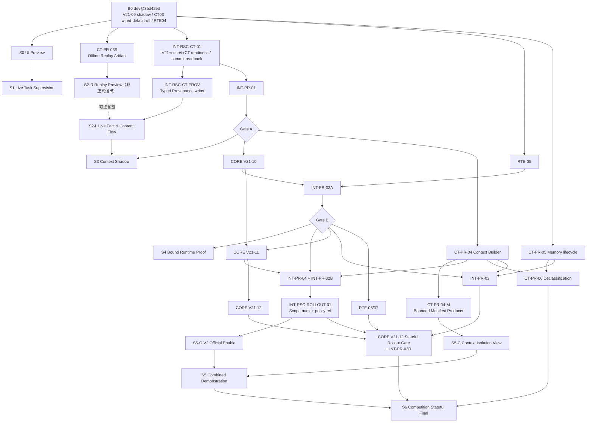
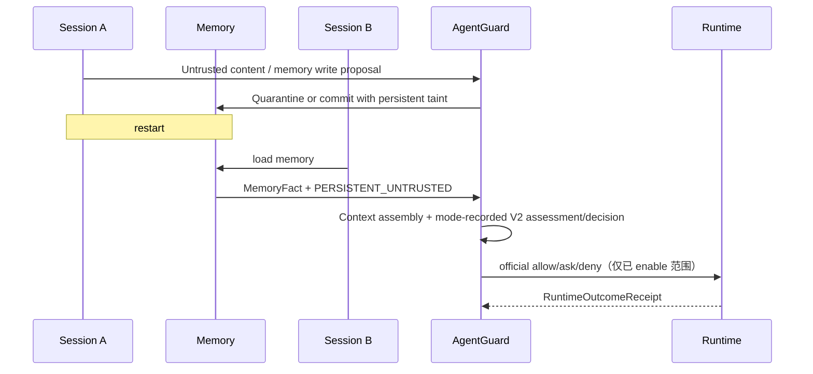

# 04 — 三线阶段实施、PR 拆分与验收

## 1. 计划原则

### 1.1 以可见监督能力为 Stage，以证据贡献为 PR

Stage 完成时必须新增一种肉眼可见、可复核的控制台能力；底层 PR 不强制每个都改 UI。

每个 PR 必须说明：

```text
它服务哪个 Stage
→ 提供哪项退出证据
→ 是否改变 production behavior
→ 影响哪个冻结合同
→ 失败如何回滚
```

### 1.2 当前能力、接线和启用三列分开

基线不得只写“做到 CT-PR-03/V21-09”，而应维护：

| 字段                     | 含义                         |
| ------------------------ | ---------------------------- |
| `implemented`            | 模型/纯函数/服务是否存在     |
| `production_wired`       | 是否在真实请求/提交路径执行  |
| `default_enabled`        | 默认配置是否激活该路径       |
| `persisted_or_projected` | 产物是否成为可重建记录或状态 |
| `decision_authority`     | `none/shadow/official`       |
| `runtime_enforced`       | 是否在 side effect 前落实    |
| `receipt_closed`         | 是否有绑定 receipt           |
| `verified_commit`        | 最近核对的 dev commit        |

这能避免“纯函数已完成”被误读成“系统已在线使用”。

## 2. 当前基线 B0

核对基线：`dev@3bd42ed`（PR #150 实现 CT-PR-03b，PR #151 登记 CT-PR-03 完成）。

| 轨道        | implemented                                     | production_wired / default_enabled | authority/enforcement                                                    | 当前缺口                               |
| ----------- | ----------------------------------------------- | ---------------------------------- | ------------------------------------------------------------------------ | -------------------------------------- |
| CORE V21-09 | assess/finalize、CAS/digest revalidation        | 已接线 / V21 shadow flag 默认关    | 启用后 V2 仍 `shadow`；legacy/current official                           | scoped shadow readiness、V21-10/11     |
| CT-PR-02/03 | 七事件 facts、delta、commit→project、rebuild    | 已接线 / CT flag 默认关            | V21 flag+secret+CT flag+plan 就绪时 commit/project；CT 无 final decision | 三门激活证据、Gate A、typed Provenance |
| RTE-01~04   | base gate、terminal outcome、conformance        | 已接线 / 当前基线启用              | 当前 official decision 可 pre-exec enforce；receipt 可闭合               | RTE-05 strong binding                  |
| Dashboard   | 三视图、执行步骤、ETag polling、真实 Trace 链路 | 已接线 / 当前基线启用              | 展示现有 Audit/Approval/Receipt                                          | CT 内容流、权威标签、动作微流程        |

CORE/CT 当前必须按三态描述：`production_wired=yes`、`V21/CT flags default=false`、
`persisted_or_projected=V21 flag + valid server secret + CT flag + CT plan 全部就绪时`。不能继续
写“无接线”，也不能因为代码存在就声称默认生产流量已经产生 CT state。

当前 Dashboard 已是可运行底座，S1 是增强，不是从零实现“实时图”。

## 3. 三轨做到哪一步，对应什么展示

### 3.1 CORE

| CORE 步骤 | 控制台效果                                                        | 可以说                           | 不能说                             |
| --------- | ----------------------------------------------------------------- | -------------------------------- | ---------------------------------- |
| V21-09    | official 与 V2 shadow 分栏；FastDisposition、coverage、divergence | “V2 在旁路评估并留下证据”        | “V2 已改变正式决定”                |
| V21-10    | pre-enable receipt/evaluation gate、eligible coverage、回滚条件   | “启用前证据门禁可被监督”         | “已 limited enable”                |
| V21-11    | 限定 hard cases 的 V2 official 标签                               | “冻结范围内 V2 正式生效”         | “所有场景都由 V2 接管”             |
| V21-12    | 攻击链现代化、真实状态上下文、实际 mode/rollout 可见              | “可按真实模式评估现代有状态链路” | 未有 rollout 记录就声称 official   |
| V21-13/14 | semantic shadow/upgrade 的独立支线                                | “语义模型是额外增强”             | 把 V21-13 当 evidence closure 前置 |

### 3.2 Context/Taint

| CT 步骤             | 控制台效果                                                        | 可以说                                                       | 不能说                                  |
| ------------------- | ----------------------------------------------------------------- | ------------------------------------------------------------ | --------------------------------------- |
| CT-PR-02b           | Preview/单元 Fixture 中显示七事件产生的 facts                     | “完整输入下 fact builder 映射确定”                           | “可从当前 bounded Audit 重跑历史 facts” |
| CT-PR-03a           | delta digest/projection identity 的 Replay 证据                   | “facts 可确定性映射为 delta”                                 | “默认 production state 已更新”          |
| CT-PR-03b（已合入） | 三门就绪时 Live `ct_transient_facts` commit、后台 project/rebuild | “该启用环境产生了真实 CT commit；state apply 由 Gate A 另证” | “所有默认环境都已启用/已证明 apply”     |
| INT-PR-01 / Gate A  | Snapshot→V2 shadow 链                                             | “上下文改变 V2 影子评估”                                     | “V2 已驱动 RTE”                         |
| CT-PR-04            | Context compartment、Builder、隔离/transform                      | “上下文构建和隔离规则已实现”                                 | “历史 Manifest 已持久化可查”            |
| CT-PR-04-M / INT    | bounded Context Manifest、审计写入、预算、存储 parity             | “纳入、隔离或排除有有界证据可见”                             | “完整 prompt 已返回前端”                |
| CT-PR-05/06         | Memory lifecycle、declassification proof                          | “taint 跨会话保持，合法降级有证据”                           | “允许写入等于可信”                      |
| INT-PR-03           | 跨会话攻击链                                                      | “Session A 的污染影响 Session B 并被控制”                    | 把两 Session 伪装为同一实时 Trace       |

### 3.3 Runtime Enforcement

| RTE 步骤           | 控制台效果                                                                 | 可以说                                   | 不能说                             |
| ------------------ | -------------------------------------------------------------------------- | ---------------------------------------- | ---------------------------------- |
| RTE-01~04          | Gate、approval wait/release、start、terminal receipt                       | “当前权威决定在执行前被落实，结果有回执” | “已 strong binding”                |
| RTE-05 Preparation | capability/gate 状态可见                                                   | “强绑定前置条件已核对”                   | “binding/lease 已运行”             |
| RTE-05 Integration | display-safe gate/binding/consume 证据、receipt link、TOCTOU/replay/expiry | “动作和单次授权被精确绑定”               | 暴露或由前端计算 fingerprint/token |
| RTE-06             | 结果隔离、持久化和 correlation 证据增强                                    | “结果是否进入上下文/持久化更可复核”      | 将未知显示为 passed through        |
| RTE-07             | 故障、重复、晚审批、重启恢复                                               | “控制链在失败场景有可验证行为”           | 声称通用 HA/Chaos 能力             |

## 4. 推荐依赖主线

当前 CT-PR-03a/03b 已完成，不再把 `03b/03c` 写成未来路线。本方案只增加两个不改变正式
CT 阶段编号的展示支撑子步骤：

- `INT-RSC-CT-01`：在指定 sandbox/competition profile 同时完成
  `AGENTGUARD_V21_SHADOW_ENABLED=true`、V21 server secret readiness（只记录 ready，不记录值）、
  `AGENTGUARD_CT_FACT_PROJECTION_ENABLED=true`、Phase-A materials、full
  `ct_transient_facts` Trace readback 和回滚；全局默认仍保持关闭；
- `CT-PR-03R`：只读离线 Replay Artifact Exporter，供 S2-R 使用；不新增 API、不代表 Live。

`INT-PR-02A/02B` 是对原 INT-PR-02 口径的必要澄清：

- `02A`：当前 official decision→RTE，服务 S4/Gate B；
- `02B`：V2 limited-enable official decision→RTE，并入 S5/INT-PR-04。

本方案还增加一个不改变 CORE 阶段编号的 integration evidence 子步骤：

- `INT-RSC-ROLLOUT-01`：随 V21-11/INT-PR-04 原子接入 02/03 章冻结的 strict
  `V21RolloutAuditRecord + RuntimeProfileAttestationAuditRecord + RolloutHead/RoutingCatalog CAS +
policy_evaluation.evidence.v21_rollout_ref`，并落实
  tightening-only、四类 path allowlist 和 rule-by-rule ownership transfer；V21-12 stateful
  rollout 复用同一 1.0 contract，由 `V21-12-R/INT-PR-03R` 扩展实际 case/cohort/runtime profile
  和回滚 Gate，不新建第二套 enable 事实。

该 integration 子步骤还必须重排 evaluation：在审批、memory change、critic review 等副作用之前
选择唯一 authoritative `GuardDecision`，并原子统一 API response、Audit 顶层、
`evidence.guard_decision`、Provenance、RTE 与 replay；只增加 rollout 展示字段不算完成。



S0 是窄范围安全预览壳，随后沿同一前端主线进入 S1；两者不并发修改相同热点文件。Fixture
编写、CT-PR-03R 和视觉评审可与 S1 Live mapper 准备并行。RTE-05 Preparation 可与
INT-RSC-CT-01/INT-PR-01 并行；共享 activation 和 production wiring 由 integration owner
串行收口。

图中的 S5 是**演示组合点，不是三轨实施前置**。CORE V21-11 同时等待 V21-10 和 Gate B；
CORE V21-12 从 V21-11、CT-PR-05 从 CT-PR-03、CT-PR-06 从 CT-PR-04+05、INT-PR-03 从
CT-PR-04+05+Gate B、RTE-06/07 从 Gate B 按冻结路线继续并行。CT-PR-06 只在 S6 退出时
join，不是 INT-PR-03 前置；CT-PR-04-M/UI 不阻塞 CORE V21-12、CT-PR-05 或 RTE-06/07。
Stateful Rollout Gate 可以提前开发，但通过必须复用并等待 INT-RSC-ROLLOUT-01 的 1.0
writer/ref。

## 5. Gate A / Gate B 边界

### 5.1 Gate A：CT → CORE Shadow

```text
Runtime Event
→ Verified Fact
→ committed SecurityStateDeltaV21
→ projected OnlineSecurityState
→ SecuritySnapshot
→ V2 Shadow Assessment
```

必须：

- SourceFact/FlowFact 真实生成；
- committed record 先于 projection；
- delta identity/digest 确定；
- projection failure 进入 dirty/degraded；
- replay/rebuild 后 state digest 一致；
- relevant Context Taint / FlowFact 已进入 SecuritySnapshot，且 coverage/degradation 可解释；
- `DecisionEvidenceV21.mode=shadow` 可查询；
- legacy/current official response 不变。

不要求：Memory Bridge、完整 declassification、V2 official、RTE strong binding。

### 5.2 Gate B：当前 Official Decision → RTE

```text
Official DENY
→ pre-execution Runtime Gate blocks
→ RuntimeOutcomeReceipt:not_invoked

Official ALLOW（C2+ eligible 时可带 binding）
→ verify eligible binding（若在场）
→ Runtime starts
→ terminal RuntimeOutcomeReceipt

Official ASK + human allow_once
→ exact EnforcementBinding
→ one-use ExecutionLease consume
→ Runtime starts
→ terminal RuntimeOutcomeReceipt

Official ASK + human deny / expiry / timeout
→ Runtime Gate blocks
→ RuntimeOutcomeReceipt:not_invoked
```

必须：

- 所有路径以 `action_id` 关联；DENY 不返回 `enforcement_binding`；
- 需要授权释放的路径 exact-bind `action_id + authorization_fingerprint + runtime_binding_id`；
- authorization fingerprint 在服务端/Runtime exact match，但原值不进入 UI/Audit；
- binding/lease 失败 fail closed；
- deny 的 confirmed `not_invoked` receipt 还需同一父 policy audit 下
  `event/action/decision/policy` 精确一致，并满足
  `metadata.outcome_kind=pre_execution_deny`、
  `evidence.execution.status=not_invoked`、
  `evidence.result.disposition=not_applicable`；
- allow_once 有 consume→start→terminal，且经 schema review 的非秘密
  `lease_id/consumption_id` 闭合关联；
- receipt 严格关联 event/action/decision/policy audit；
- mismatch/expiry/double-consume 有确定行为。

Gate B 不等于 V2 official。S4 可以先用当前 official decision 完成；V2 official 在 S5。

## 6. S0 — High-Fidelity UI Preview

### 6.1 目标与依赖

最快提供可评审的增强效果，不改变 production behavior。

- 依赖现有 `EvidenceDetailPage/ExecutionTrace/FlowGraph/Inspector`；
- 依赖 02 章 S0/S1 最小 ViewModel 和冻结 Fixture；
- 不依赖新 CORE/CT/RTE 步骤；

### 6.2 关键节点

```text
现有 Execution Step → Action Capsule
                    → Decision / Approval / Enforcement / Outcome 四层槽位
                    → Inspector / Provenance / Audit 跳转

可选 Mock Preview：Web Source → FlowFact → Context checkpoint（只在 Provenance 展示）
```

### 6.3 退出条件

- [ ] factory-owned source descriptor、authority、页级 Preview 水印先于任何 Preview 内容落地；
- [ ] 非 `live_api + following` 整页和审批深链只读；store mutation boundary 同样拒绝；
- [ ] production bundle 不含 Fixture/Replay importer/Hybrid provider；URL/payload 不能升级 capability；
- [ ] 现有图上的 action capsule、四层槽位和详情抽屉骨架可操作；
- [ ] Pure Mock 使用固定页级水印；Hybrid 才逐元素标来源；
- [ ] official/shadow、decision/approval/outcome 分层；
- [ ] CT 内容入口 Preview 只出现在 `MOCK PREVIEW` 数据源，切 Live 后缺字段显示 unavailable；
- [ ] 继续复用现有三泳道和审计顺序边，不增加内容/因果 overlay；
- [ ] Tab + Enter/Space、窄屏和 reduced-motion 回归通过。

允许口径：“这是按冻结契约制作的监督控制台交互预览。”

## 7. S1 — Live Task Supervision

### 7.1 目标与依赖

在当前真链上交付最早的正式增强效果，不等待 Gate A/RTE-05。

- 当前 Trace/Audit/Approval/Provenance；
- RTE-01~04；
- LangGraph/AttackBench 真实链；
- CORE V21-09 仅用于 shadow 标签，不作为 official；默认 flag 关闭时该 section 显示
  unavailable。比赛 sandbox 可只开启 V21 shadow flag + valid server secret，不要求同步开启 CT。

### 7.2 展示效果

- Task / Trace lifecycle Header；只有明确 lifecycle event 才显示 Header 终态；
- 语义检查点和动作复合节点；
- Decision/Approval/Start/Outcome 微流程；
- 约 2 秒 ETag 伪实时更新；
- 点击定位安全依据和原始审计；
- stale/backoff、partial/unknown 清晰可见；
- official 与 V2 shadow 分栏；没有 `decision_v21` 时 shadow 栏明确 unavailable，不伪造评估。

### 7.3 真链场景

| 场景         | 必须出现的事实                                                     |
| ------------ | ------------------------------------------------------------------ |
| Allow        | `allow → tool_call_started → executed`                             |
| Human review | `ask → pending → allow_once → tool_call_started → executed/failed` |
| Deny         | `deny → pre-execution gate → receipt not_invoked`                  |

### 7.4 退出条件

- [x] 同一 AuditEvent 重复返回不新增节点；
- [x] action 内所有记录保持原始关联 ID；
- [x] 只有 start observation 显示正在执行；
- [x] 未收到 outcome 保持等待回执/unknown；
- [x] deny 不直接推断未执行；
- [x] Deny 真链有稳定 `not_invoked` receipt；
- [x] 轮询更新不重排既有节点或抢焦点；
- [x] 明确终态后 final Trace/Provenance reconciliation；
- [x] Memory/PostgreSQL 的代表性 Trace 语义一致；
- [x] 图投影失败时审计视图仍可用；
- [x] Graph/List/Inspector 使用同一 `ExecutionTraceViewModel`，无第二套 decision 关联；
- [x] Task summary 留在 Header；`live + derivedForDisplay` 明确标派生且没有
      authority/mutation/receipt/执行步骤语义。

允许口径：“可以近实时监督 Agent 正在做什么、为何审批/阻断以及运行时最终结果。”

## 8. S2 — Live Fact & Content Flow

### 8.1 两个里程碑

S2 可以提前交付 Replay 里程碑，但正式退出必须是 Live：

| 里程碑                           | 依赖                                                                 | 价值                                             | 是否算 S2 正式完成 |
| -------------------------------- | -------------------------------------------------------------------- | ------------------------------------------------ | ------------------ |
| S2-R Committed Fact/Delta Replay | 已完成 CT-PR-03 + CT-PR-03R + full commit envelope/projection record | 重放已提交 Source/Flow bundle→delta 并重建控制台 | 否                 |
| S2-L Live Fact Flow              | CT-PR-03 + INT-RSC-CT-01 三门激活 + INT-RSC-CT-PROV                  | 真实事件→committed facts→真实 Provenance 深链    | 是                 |

Replay 必须显示 builder version、original event 和 `REPLAY`，不能声称当时参与判定；加载时间
只属于 UI session metadata，不参与 replay digest。

### 8.2 Live 关键链

```text
Web/Tool/Memory Event
→ Verified SourceFact / FlowFact
→ policy Audit.evidence.ct_transient_facts commit envelope
→ typed Source/Flow presentation
→ INT-RSC-CT-PROV typed writer
→ Provenance Content / Context nodes（真实 node/edge ID）

projection_id 只作“后续 Gate A 待复核”引用，不在 S2 证明 state apply
```

### 8.3 退出条件

- [ ] 七类当前 GuardEvent 均有确定映射或显式 degradation；
- [ ] 指定 sandbox/competition profile 的 V21 shadow flag、server secret readiness、CT flag、
      Phase-A materials 同时就绪；启动记录、runtime/profile 和回滚可查，secret 值永不落证据；
- [ ] 未指定环境仍保持默认关闭；开/关对照中，除开启侧允许新增的
      `ct_transient_facts` 键外，legacy/official 响应和既有 evidence 逐字 parity；
- [ ] 同输入/版本 Replay 输出和 digest 稳定；
- [ ] CT-PR-03R 仅从 full committed bundle、projection record、bounded Trace/Provenance 生成
      content-addressed artifact；不重跑 fact builder，synthetic 输入降为 Mock；
- [ ] S2 证明 full bundle commit 和真实 Provenance；projection identity 仅显示“待 Gate A 复核”，
      不从 `projection_id` 推断 apply；
- [ ] `ct_transient_facts` 1.0 full envelope 校验 bundle/source identity；当前
      `BudgetDroppedRef`（仅 `_budget_dropped/_envelope_sha256`）显示 partial，不读取 payload；
- [ ] Source/Flow 有 fact/evidence ref；
- [ ] INT-RSC-CT-PROV 产生真实、稳定 node/edge ID；content→context 只在 Provenance 按
      exact/strong/possible 呈现，不创建前端 synthetic 深链节点；
- [ ] missing refs 显示 coverage degradation；
- [ ] trust/taint/authority 全部来自服务端；
- [ ] Live 不读取 Mock fallback；
- [ ] Context Manifest 未接入时显示 unavailable，不空数组冒充“无内容”；
- [ ] 服务端脱敏、有界字段通过预算测试。

允许口径：“系统从真实请求提交了这些来源事实，并记录了可回证据的内容流。”

## 9. S3 — Context Shadow / Gate A

### 9.1 依赖

- CT-PR-03 完成；
- INT-RSC-CT-01 三门 readiness/commit readback；
- INT-PR-01；
- CORE V21-09；
- Gate A 通过。

### 9.2 关键节点

```text
Committed Record
→ StateDelta reference
→ Projected State
→ Snapshot + Coverage
→ V2 Shadow Assessment
→ Would-be Disposition
```

同时显示：

```text
Official Decision: legacy/current authoritative
V2 Assessment: shadow
```

### 9.3 退出条件

- [ ] production request 完整跑通 Gate A；
- [ ] projection/rebuild/digest 证据可定位；
- [ ] base rewind/bad materials 按真实 skip+counter/alert 证据展示；只有实际进入
      project/apply failure 的路径才显示 dirty/degradation，不把所有失败统一标 dirty；
- [ ] Audit 存在 `DecisionEvidenceV21.mode=shadow`；
- [ ] coverage/degradation 可解释；
- [ ] legacy response 不变；
- [ ] divergence 可查询；
- [ ] Shadow 节点没有“实际驱动 RTE”的 confirmed 边；
- [ ] 两个上下文对照任务可分别生成独立 Trace，作为 S3+ 展示增强；
- [ ] Trace Diff 未完成不阻塞 Gate A；启用 Diff 时无显式 comparison key 只做聚合摘要。

允许口径：“不同上下文导致 V2 影子评估不同。”

## 10. S4 — Bound Runtime Proof / Gate B

### 10.1 依赖

- CORE V21-10；
- Gate A；
- RTE-05 Preparation + Integration；
- RTE-05 Dashboard-safe evidence schema 与 RuntimeOutcomeLinks
  `lease_id/consumption_id` additive review；
- INT-PR-02A；
- Gate B。

Gate A 是本全局路线进入 CORE V21-10 和 S4 的硬依赖；但 S4 的 official decision 在
V21-11 前仍来自 legacy/current authoritative chain，而不是 V2 shadow。

### 10.2 展示效果

```text
DENY → Gate Block → not_invoked Receipt

ALLOW → eligible binding verification（若在场）→ Start → terminal Receipt

ASK + human allow_once
→ exact Binding → one-use Lease Consume → Start → terminal Receipt

ASK + human deny / expiry / timeout → Gate Block → not_invoked Receipt
```

### 10.3 退出条件

- [ ] `enforcement_binding` additive response 和 consume endpoint 完成；
- [ ] exact match 成功；修改 args/resource 返回冲突；
- [ ] expired/double consume 行为确定；
- [ ] LLM allow_once 不可消费；
- [ ] deny invocation count 为 0 且 receipt `not_invoked`；
- [ ] allow_once 有 consume、start、terminal；
- [ ] receipt 关联 event/action/decision/policy audit；
- [ ] allow_once 强证明通过非秘密 `lease_id/consumption_id` 关联 consume 与 receipt；
- [ ] contradiction path 显示 confirmed enforcement violation；
- [ ] receipt links 冲突显示 correlation conflict，而非 confirmed violation；
- [ ] Dashboard 不接收 fingerprint/token 原值；
- [ ] eligible receipt coverage 与 failure injection 达到 V21-10 门槛。

允许口径：“当前官方决定在执行前落实；需要授权释放的动作经过精确绑定，并由运行时收据
证明结果。”

## 11. S5 — 两条独立子线的组合展示

### 11.1 依赖

S5 在共同完成 CT-PR-04 后，拆成可独立交付的两个子 Gate：

| 子 Gate                     | 依赖                                                                    | 可独立展示                                                        |
| --------------------------- | ----------------------------------------------------------------------- | ----------------------------------------------------------------- |
| S5-C Context Isolation View | Gate A + CT-PR-04 + CT-PR-04-M/INT                                      | 即使仍是 shadow，也可展示 included/excluded/quarantined/transform |
| S5-O V2 Official Enable     | S4/Gate B + CT-PR-04 + CORE V21-11 + INT-PR-04/02B + INT-RSC-ROLLOUT-01 | 冻结 hard cases 中 V2 official→RTE→receipt                        |

CT-PR-04 是两条子线的共同功能依赖，并按上位冻结路线进入 INT-PR-04；独立的是
CT-PR-04-M/完整 Manifest UI 与 V21-11 activation 的后续交付。S5 组合展示要求 S5-C 和
S5-O 都通过。完整 Manifest UI 不能阻塞 CORE V21-11 本身，但缺少 CT-PR-04 时不得完成
INT-PR-04/S5-O；V21-11 也不能让缺少 Manifest producer 的 UI 假装已有 Context 证据。

### 11.2 S5-C 退出条件和口径

- [ ] CT-PR-04 Context Builder/compartment/quarantine 已 production wired；
- [ ] CT-PR-04-M schema、Audit writer、专用脱敏/预算、ETag 已完成；
- [ ] Memory/PostgreSQL parity 与 replay 可重建同一 Manifest；
- [ ] `returned=chunks.length`、include/exclude/quarantine 和截断不变量通过；
- [ ] summary/redact 不清 taint；
- [ ] UI 显示这条 Trace 的实际 V2 authority，允许仍为 shadow。

允许口径：“系统以有界证据展示本次 Context 中哪些内容被纳入、排除或隔离。”

禁止口径：“完成 S5-C 就表示 V2 已 official。”

### 11.3 S5-O 退出条件和口径

- [ ] CT-PR-04 功能依赖和 INT-PR-04/02B 接线完成；
- [ ] feature flag、limited cohort 和单步 rollback 可用；
- [ ] strict `V21RolloutAuditRecord` 和 `RuntimeProfileAttestationAuditRecord` 由 server-internal
      controller/registry writer 产生；pre-storage outer/links/metadata/evidence 均 `extra=forbid`；
      Memory/PostgreSQL readback 只允许 AuditEvent 中性默认字段 + strict integrity，nested 仍 strict；
      外部 Adapter 同名 config event 不能获得 rollout/attestation 语义；
- [ ] append-only config revision 与 per-rollout head 在 Memory/PostgreSQL 中原子 CAS；stale
      expected catalog/revision/digest 返回 409，不推进 head/catalog；
- [ ] 空 catalog genesis 固定 epoch 0 + `sha256(UTF8("[]"))`；首个 initialize 原子推进 epoch 1，
      PostgreSQL restart 不重置，Memory fresh/rebuild 语义一致；
- [ ] routing catalog 使用 evaluation shared / mutation exclusive 锁；即使旧 catalog 无候选，评估
      也在 shared lock 内完成候选解析和提交；scope expansion/enable 与 evaluation 有确定线性化顺序；
- [ ] official route 对同一 case/runtime/profile/policy 唯一；已知 cohort overlap 在 mutation 拒绝，
      运行时 0 个或多个匹配均保持 legacy official/V2 shadow；
- [ ] Memory/PostgreSQL 均执行 `catalog→rollout→evaluation/event→audit-chain→provenance→approval→…`
      唯一锁序；enable/update/rollback 与 evaluation 并发超时测试无死锁、无 nested transaction；
- [ ] rollout mutation 有稳定 mutation ID/command digest；丢响应 exact retry 返回原
      revision/config audit/effective_at，同 key 异 payload 冲突；command 是完整 `extra=forbid` schema，
      并发 fast-miss 后在 rollout lock 内二次 lookup；
- [ ] 每条 V2 official policy Audit 同事务携带 `v21_rollout_ref`，并与 case/cohort、runtime/
      profile、policy、snapshot eligibility、当次 DecisionEvidence snapshot、rollout revision/digest
      精确一致；
- [ ] evaluation commit 前在 rollout 并发边界复核 current head/effective_at；rollback 后不再提交
      commit 顺序更晚的旧 official ref；
- [ ] `rollout_v21/v21_rollout_ref` 走专用 typed sanitizer/budget，generic fallback 不接触；config
      超 24 KiB、attestation 超 4 KiB 或 ref 超 12 KiB 时不推进对应事务/不提交 V2 official；
- [ ] 顶层 decision、`guard_decision/policy/decision_v21/v21_rollout_ref` 与 server-reserved
      request/policy/final decision metadata 作为 policy evaluation critical set 先预留并 round-trip；
      request metadata collision/flooding 先拒绝或降级可选值，不能丢 replay/authority carrier 或触发
      legacy allow fallback；
- [ ] enabled path 只能取 CORE V21-11 四类冻结 allowlist，matched path/rule 已完成 rule-by-rule
      ownership transfer；每个 matched rule 有唯一 server-verified ownership ref，前端不重跑 registry；
- [ ] runtime/profile 由认证 adapter/runtime registry 的 strict attestation 注入；认证主体、registry
      revision/digest、EvidenceRef、有效期缺失/错配/不可解析时只能 shadow；
- [ ] cohort 使用不可变 id/revision/digest + strict membership EvidenceRef；roster 变化未追加新
      cohort/rollout revision 时不能扩大 official scope；
- [ ] rollout config 只绑定 snapshot eligibility contract，不固定某个瞬时 snapshot；当次
      snapshot ID/digest/state version 与 DecisionEvidence 精确一致且 eligibility passed；
- [ ] tightening-only 决策格成立：V21 final 不弱于 legacy，CLEAR_ALLOW 不放宽 legacy ASK/DENY；
- [ ] set-like arrays 排序唯一、EvidenceRef 顺序确定，重复项/越界 ID、非规范 UTC 时间和非法
      revision/state version 均拒绝；digest 只在 field-aware bound 后计算；
- [ ] rollout ref strict 校验、预算或持久化失败时没有无 ref 的 V2 official 记录，按冻结语义
      回退 shadow/fail closed 并有 degradation/config audit；
- [ ] authoritative selection 发生在 approval/memory/critic 之前；API response、Audit 顶层、
      `evidence.guard_decision`、links、DecisionEvidence final、Provenance、RTE/receipt 只有一个相同
      GuardDecision；任一无法原子切换则 legacy official/V2 shadow；
- [ ] deterministic hard-case parity、fixed regression、benign-hard、replay/property 通过；
- [ ] divergence diagnostics 在 limited enable 后仍可查询；
- [ ] official mode、scope 和 rollback 有明确审计记录；
- [ ] official decision→RTE→receipt 闭合；需要授权释放时 binding/consume IDs 闭合；
- [ ] 首次 Live、同 event replay 和 RTE/receipt 的 decision ID/decision payload exact parity；
- [ ] 回滚 `limited_enable→shadow` 不删除历史 facts/evidence/receipt；
- [ ] Context Manifest UI 可 unavailable，不据此阻断 S5-O。

允许口径：“在冻结 hard cases/cohort 内，V2 已成为 official 并通过 RTE 形成可复核结果。”

禁止口径：“完成 S5-O 就表示已有完整 Context Manifest，或所有场景都由 V2 接管。”

### 11.4 S5 Combined

S5-C 与 S5-O 均通过后，组合展示：

- V2 limited-enable official 与真实 Context Manifest 同屏分栏；
- included/excluded/quarantined/transform 可追溯；
- official V2 decision 通过 RTE 形成 receipt；
- Header 显示 limited scope、feature flag、policy/snapshot version 和回滚状态。

允许口径：“冻结范围内，CT/V2 已实际改变官方决定并驱动 Runtime enforcement。”

## 12. S6 — Competition Stateful Final

### 12.1 依赖

- CORE V21-12；
- CT-PR-05/06；
- INT-PR-03；
- RTE-06/07；
- S5 已通过；
- `CORE V21-12 Stateful Rollout Gate / INT-PR-03R` 已通过。

`V21-12-R/INT-PR-03R` 是本方案建议追加的 rollout 子步骤名，不冒充现有冻结 PR；正式实施前
由 CORE/Integration owner 在上位路线中批准或映射到等价既有步骤。

若最后一项未完成，控制台只能按真实记录显示 `shadow/limited_enable`，不得固定写 official，
也不得宣布该 stateful case 已由 V2 控制执行。V21-13 是语义增强支线，不是证据闭环前置；
但 **Full Master Roadmap Final** 仍须按总路线补齐 V21-14 等门槛，不能与本节的
**Competition Stateful Final** 混称。

### 12.2 最终故事



### 12.3 退出条件

- [ ] `ALLOW != TRUST` 在 UI 和测试中成立；
- [ ] taint 跨重启保持；
- [ ] Memory propose/quarantine/commit/rollback 可见；
- [ ] declassification 只接受 relevant authoritative proof；
- [ ] result persistence/context ingress 有 receipt/flow 证据；
- [ ] stateful rollout/enable、回滚和审计模式记录可查询；
- [ ] stateful 评估仍复用 `v21-rollout-audit/1.0`，每条 official policy Audit 的 scope ref 与实际
      case/cohort/runtime profile、policy、snapshot eligibility 和当次 snapshot 精确一致；
- [ ] 选定 stateful hard case/cohort 与适用 runtime/profile 已冻结；
- [ ] shadow divergence 已分类，fixed regression/benign-hard 无未处置回归；
- [ ] replay/property、跨重启和 required conformance 通过且无 confirmed enforcement violation；
- [ ] official decision 与同一 action/policy/RTE receipt 精确闭合；
- [ ] rollout rollback 已演练并保留历史 mode/evidence/receipt；
- [ ] CH-01 API unavailable；CH-02 duplicate receipt；CH-03 late approval；CH-04 restart+drain；
- [ ] 跨 Trace 用稳定引用定位，不自动合并两个 Session；
- [ ] Competition Final 的 CORE/CT/RTE 门槛均有可查询证据。

## 13. 前端 PR 拆分

| PR         | Scope                                                                                                                              | 依赖                                                               | 服务 Stage | 不做                                                                  |
| ---------- | ---------------------------------------------------------------------------------------------------------------------------------- | ------------------------------------------------------------------ | ---------- | --------------------------------------------------------------------- |
| FE-RSC-00  | deep-frozen data-source descriptor、Preview provider 无 mutation capability、水印、production bundle exclusion                     | 无                                                                 | S0         | 不改现有 Live resolve；路由/payload 不可升级 capability               |
| FE-RSC-01  | S0/S1 独立 presentation 类型、action lifecycle Fixture；尚不修改既有 step interface                                                | FE-RSC-00                                                          | S0         | `supervision` 此时不设 required                                       |
| FE-RSC-02  | 一次扩展 `buildExecutionTrace` 并把 required `step.supervision` 原子挂载；Graph/List/Inspector 共用                                | FE-RSC-01                                                          | S0/S1      | 不留半编译接口、不建第二 projector                                    |
| FE-RSC-03  | 现有三泳道 action capsule、详情骨架、来源/权威标签                                                                                 | FE-RSC-02                                                          | S0/S1      | 不增关系 overlay/路由                                                 |
| FE-RSC-04  | Approval DTO/official+basis 关联 mapper 与完整 Live store+UI mutation selector 原子合入                                            | FE-RSC-03                                                          | S1         | 不改服务端 resolve 语义、不保留绕过窗口                               |
| FE-RSC-05  | dev/test-only Replay Artifact importer、schema/digest 校验、historical 正交标签                                                    | FE-RSC-00/02 + CT-PR-03R                                           | S2-R       | production bundle 不含 importer                                       |
| FE-RSC-06  | `ct_transient_facts`/CT Provenance DTO、版本校验与 legacy compatibility mapper                                                     | CT-PR-03 + INT-RSC-CT-01 schema                                    | S2         | 不新增可视消费者、不推断 taint                                        |
| FE-RSC-07  | Source/Flow 摘要、certainty 样式和稳定 Provenance 深链，单向消费 FE-RSC-06                                                         | FE-RSC-06 + INT-RSC-CT-PROV                                        | S2/S3      | 不重读 raw events、不造 synthetic 深链                                |
| FE-RSC-08  | RTE display-safe gate/binding/consume 状态                                                                                         | RTE-05 schema                                                      | S4         | 不显示/推断 token/fingerprint                                         |
| FE-RSC-09  | 两 Trace 聚合差异；有冻结 key 后才动作配对                                                                                         | 独立 schema Gate                                                   | S3+ 可选   | 不阻塞 Gate A                                                         |
| FE-RSC-10A | Bounded Context Manifest UI                                                                                                        | CT-PR-04-M/INT                                                     | S5-C       | 不阻塞 V21-11                                                         |
| FE-RSC-10B | rollout strict mapper、scope/tightening/关联一致性校验、server-verified ownership/attestation 展示、父 V21 authority 原子派生与 UI | FE-RSC-08 + CT-PR-04 + V21-11 + INT-PR-04/02B + INT-RSC-ROLLOUT-01 | S5-O       | 不重跑后端 registry；不依赖完整 Manifest UI；无有效 ref 不标 official |

FE-RSC-00 对 Preview 的硬隔离靠“provider 根本不暴露 mutation method”；不提前替换现有 Live
审批链。FE-RSC-04 在 official/basis 最小关联材料可用时，才把完整 selector 和 mapper 原子接入
Live store。FE-RSC-01 只定义类型；`ExecutionStepViewModel.supervision` 从 FE-RSC-02 起才是
required，并与 builder 返回值在同一提交中出现。

### 13.1 推荐文件边界

```text
apps/dashboard/src/data/source/
  dashboard-data-source-factory.ts # 唯一产生 descriptor；prod 只注册 live_api
  replay-artifact-importer.ts      # dev/test-only lazy module

apps/dashboard/src/data/supervision/
  approval-mutation-gate.ts        # FE-RSC-04：store 私有 descriptor + UI 只读 selector
  step-details-projector.ts
  provenance-presentation.ts
  approval-basis-projector.ts
  context-manifest-projector.ts
  trace-diff-projector.ts

apps/dashboard/src/components/evidence/
  ExecutionTrace.vue              # 保留控制器
  ExecutionFlowGraph.vue          # 保留三泳道，增量支持 action capsule
  ExecutionStepInspector.vue      # 增量或薄壳过渡
  RuntimeSupervisionInspector.vue # 字段明显增大时再拆
```

`EvidenceDetailPage` 不直接 import Fixture/Replay provider；它只拿 factory 产出的 descriptor 和
provider。实际 approval store 在发 POST 前硬调用 `canMutateApproval`，页面按钮只做同一 selector
的呈现。

## 14. 后端/集成 PR 建议

| PR                         | Owner            | 核心产物                                                                                   | Stage     |
| -------------------------- | ---------------- | ------------------------------------------------------------------------------------------ | --------- |
| CT-PR-03（CURRENT）        | CT/Guard API     | facts、commit→delta→project/rebuild；flag 默认关                                           | B0        |
| CT-PR-03R                  | CT/Tooling       | 只读脱敏 content-addressed Replay Artifact Exporter                                        | S2-R      |
| INT-RSC-CT-01              | Integration      | V21+secret+CT readiness、commit Trace readback、回滚证据                                   | S2/S3     |
| INT-RSC-CT-PROV            | CT/Guard API     | additive typed Provenance node/edge writer + storage parity                                | S2        |
| INT-PR-01                  | Integration      | Snapshot→V2 shadow                                                                         | S3        |
| CORE V21-10                | CORE/API         | receipt/evaluation pre-enable gate                                                         | S4        |
| RTE-05                     | RTE/API          | binding response + consume endpoint + runtime integration                                  | S4        |
| INT-PR-02A                 | Integration      | current official decision→RTE                                                              | S4        |
| CT-PR-04                   | CT/Runtime       | Context Builder、compartment、quarantine                                                   | S5-C/S5-O |
| CT-PR-04-M/INT             | CT/Guard API     | bounded Manifest schema/writer/redaction/parity/replay                                     | S5-C      |
| CORE V21-11                | CORE/API         | limited enable                                                                             | S5-O      |
| INT-PR-04/02B              | Integration      | V2 official→RTE + rollback                                                                 | S5-O      |
| INT-RSC-ROLLOUT-01         | CORE/Guard API   | append-only rollout audit/head CAS、typed sanitizer、tightening/path ownership、policy ref | S5-O      |
| CT-PR-05                   | CT/Runtime       | Memory lifecycle（由 CT-PR-03 后继续）                                                     | S6        |
| CT-PR-06                   | CT               | CT-PR-04+05 后的 declassification proof                                                    | S6        |
| INT-PR-03                  | Integration      | CT-PR-04+05+Gate B 后的 cross-session E2E                                                  | S6        |
| RTE-06/07                  | RTE              | result evidence + reliability                                                              | S6        |
| CORE V21-12-R / INT-PR-03R | CORE/Integration | 复用 rollout 1.0 的 stateful case/cohort Gate、证据审计与回滚                              | S6        |

## 15. 串并行和共享热点

可并行：

- Fixture/视觉评审与 RTE-05 Preparation；
- CT-PR-03R 的纯新 tooling 与 FE Fixture；
- CORE V21-10 证据门禁与 RTE-05 Runtime profile（冻结接口后）；
- CT-PR-04 完成后，S5-C Manifest producer/UI 与 S5-O limited-enable activation 两条子线。

前端热点文件按以下单线串行：

```text
source/mutation gate
→ minimal VM + unique execution projector
→ Graph/List/Inspector
→ Live approval mapper
→ CT/RTE/Manifest 增量消费者
```

必须串行收口或指定 integration owner：

```text
apps/guard-api/guard_api/services/evaluation.py / v21 pipeline
apps/guard-api/guard_api/main.py / ApiContext wiring
Audit evidence merge/budget
Dashboard types/mappers/store
共享冻结 YAML / schema / generated artifacts
```

每个并行分支不得各自启用 production behavior；activation 只在 integration PR 完成。

## 16. Stage 晋级判定

一个 Stage 只有同时满足以下条件才可标“完成”：

1. 必需三线步骤已经实现并 production wired；
2. 所有必需事实的 `elementSourceMode=live`；允许
   `live + derivedForDisplay=true` 的无权威展示锚点；
3. authority/certainty/availability 无静默默认；
4. 契约、存储、前端和真实 E2E 证据齐全；
5. 禁止口径在演示脚本和 UI 文案中没有出现；
6. 回滚步骤实际演练；
7. 上一 Stage 的回归仍通过；
8. Stage owner 在 PR/决策记录中列出证据链接。

Mock、单元 Fixture、API route interception 或前端截图都不能单独满足正式 Stage 退出条件。

## 17. 回滚

| 层            | 回滚方式                                                                | 必须保留                                              |
| ------------- | ----------------------------------------------------------------------- | ----------------------------------------------------- |
| 前端图        | feature flag 关闭新 projector，回到现有 ExecutionTrace/List             | Audit/Provenance 深链                                 |
| CT 显示       | 隐藏有问题的 Manifest/typed metadata，显示 unavailable                  | 权威 facts、dirty state                               |
| CT projection | 停止新接线，按 projector/version 纪律 rebuild                           | committed record、失败证据                            |
| RTE-05        | 关闭 Strong Binding/lease activation，回退冻结 C1 语义                  | 既有 allow_once release、deny gate、receipt、错误审计 |
| V21-11        | 新 rollout revision：`limited_enable → shadow`，引用被回滚 config audit | 历史 rollout ref、Decision Evidence、facts、receipts  |
| Mock/Preview  | 关闭 Preview entry                                                      | Live 模式绝不回退 Mock                                |

回滚不得删除权威事实、清除 dirty state、改写历史 official/shadow、伪造 receipt 或让前端显示
比实际能力更强的状态。
