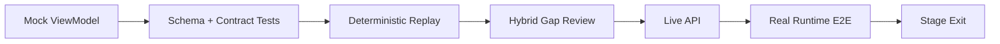

# 05 — Fixture、Mock、Replay 与演示运行手册

## 1. 目的

本章解决两个看似冲突的目标：

1. 尽早看到高质量前端效果；
2. 不让 Mock、Replay 或截图冒充真实运行时能力。

原则是“允许早预览，严格晚晋级”：所有模式共用同一 ViewModel 和组件，但每条数据都保留
来源，Live 失败绝不静默回退 Mock。

## 2. 四种模式

| 模式             | 事实来源                              | 页面标识                                       | 允许的验收                       | 禁止的验收                                  |
| ---------------- | ------------------------------------- | ---------------------------------------------- | -------------------------------- | ------------------------------------------- |
| `mock_preview`   | 固定 Fixture/手工样例                 | 顶部永久 `MOCK PREVIEW` 水印                   | 布局、交互、视觉、字段契约       | 真实识别、状态、判定、阻断、receipt         |
| `replay`         | 已提交 bundle/projection 的确定性重建 | 永久 `REPLAY`，显示原始/重放时间               | delta/projector 确定性、历史调查 | 原始 fact production、当时实际决策/实时执行 |
| `hybrid_preview` | Live + Replay/Mock 混合               | 整图 `HYBRID PREVIEW` + 逐节点来源             | 联调、缺口定位、产品评审         | 正式 Stage 退出、比赛真实链                 |
| `live_api`       | 当前 Runtime→Guard API→Store          | `LIVE` + `FOLLOWING/HISTORICAL` + 最近校准时间 | 对应 Stage 的真实功能验收        | 超出 authority/receipt 的推断               |

### 2.1 模式与权威是正交的

```text
Live shadow assessment = dataSourceMode live_api + decisionAuthority shadow
Replay official audit  = dataSourceMode replay + decisionAuthority official（重建历史事实）
Historical Live trace  = dataSourceMode live_api + temporalState historical
Mock official-looking  = dataSourceMode mock_preview；不得用 official 标签掩盖 Mock
```

## 3. 模式解析和隔离

当前 Dashboard 通过 `import.meta.env.MODE === "mock"` 全局切换数据源，但 UI 没有稳定来源
标识。本方案的最小修复：

- 根对象携带由唯一 data-source factory 创建的 immutable descriptor，以及独立的
  `temporalState`；页面、URL、响应和 Fixture 不能升级 descriptor；
- 展示元素设置 `elementSourceMode`；
- Header 由数据而非 URL 文案显示来源；
- `live_api` 请求失败时只进入 stale/backoff/unavailable；
- production factory 只注册 `live_api`；构建检查确保生产 bundle 不 import Fixture、local
  Replay importer 或 Hybrid provider；
- Hybrid 只能通过明确开发开关进入，不能由网络错误触发；
- 只有 descriptor 为 `live_api + approvalMutation`、`temporalState=following`、session/CSRF
  有效且四层关联一致时允许 resolve mutation；Historical、Mock、Replay、Hybrid 整页和审批
  深链只读；页面与 store 共用同一个 `canMutateApproval`，store 在 POST 前硬拒绝；
- `readonly=1` 只能关闭 mutation，不能把任何来源升级为 Live；
- 导出的截图/录屏保留顶部来源水印。

### 3.1 禁止的隐式降级

```text
× API 404 → 加载 Mock Context 节点
× receipt 缺失 → 注入 Fixture receipt
× V2 shadow 缺失 → 用预设 CLEAR_DENY
× Provenance 失败 → 画时间邻近因果边
× Trace 终态缺失 → 自动补 COMPLETED
```

## 4. Fixture 体系

### 4.1 继承当前共享 Fixture

现有 [runtime_safety_trace_v04.json](../../tests/fixtures/runtime_safety_trace_v04.json) 继续作为：

- AuditEvent `0.4` 源事实；
- Approval/Outcome/Provenance 关联；
- Memory 与 PostgreSQL parity；
- 当前 ExecutionStep 投影回归。

新监督详情 Fixture 从该 Fixture 派生期望投影，不复制或建立第二套动作生命周期事实。

### 4.2 建议新增 Fixture

```text
tests/fixtures/runtime_supervision/
  supervision_projection_v01.json
  context_ingress_preview_v01.json
  context_shadow_pair_v01.json
  rte_binding_outcomes_v01.json
  stateful_memory_pair_v01.json
```

| Fixture                       | 作用                                       | 是否可作 Live 证据 |
| ----------------------------- | ------------------------------------------ | ------------------ |
| `supervision_projection_v01`  | 四层状态/source/authority/unknown/冲突契约 | 否；仅契约         |
| `context_ingress_preview_v01` | S0 CT 高保真 Preview                       | 否                 |
| `context_shadow_pair_v01`     | 两 Trace 的 shadow diff projector          | 否；需真实运行替代 |
| `rte_binding_outcomes_v01`    | matched/mismatch/expired/double consume UI | 否；需 RTE E2E     |
| `stateful_memory_pair_v01`    | 两 Session 的跨 Trace 关联 UI              | 否；需 INT-PR-03   |

### 4.3 Fixture 元数据

每个根对象必须包含：

```json
{
  "fixture_schema_version": "runtime-supervision-fixture/0.1",
  "fixture_id": "rsc_context_ingress_preview_v01",
  "purpose": "ui_preview",
  "source_mode": "mock",
  "derived_from": ["tests/fixtures/runtime_safety_trace_v04.json"],
  "contract_versions": {
    "supervision": "runtime-supervision/0.1",
    "audit": "0.4"
  },
  "contains_synthetic_facts": true,
  "safe_for_demo_sandbox": true
}
```

Fixture 必须可一眼判断是否含 synthetic facts，不能只靠文件名。

### 4.4 Fixture 安全

- 只用 `.test` 域名、假 credential、sandbox 路径和固定工具；
- 不复制真实日志、Cookie、token、内部 URL 或个人数据；
- 固定时间/ID 以保证快照稳定；
- 所有“敏感”样例仍通过与生产相同的脱敏器；
- 不用真实外部邮件、网络写入、文件删除或 shell side effect；
- Mock action ID 与 Live 命名空间不同；
- Fixture schema 校验失败时 Preview fail fast，不宽松吞掉。

## 5. Replay 契约

Replay 不是 Mock：输入必须是已经提交的 CT fact bundle、projection record 和同一脱敏
Trace/Provenance；输出由版本化 delta builder/projector 确定性重建。当前持久化材料不足以
重跑原始 fact builder，因此不得宣称 fact production replay。

### 5.1 必需字段

```text
artifact_schema_version = ct-replay-artifact/1.0
canonicalization = jcs:rfc8785
artifact_digest
source_mode = replay
contains_synthetic_facts = false
original_trace_id
original_event_ids / original_audit_ids
delta_builder_version = ct-delta-1
projector_version
input_digest / output_digest
trace_projection_input（bounded Trace + Approval + Provenance）
stored_projection_record（identity/base/delta digest + payload）
replay_output（replayed delta/digest/comparison/degradations）
```

### 5.2 可证明与不可证明

Replay 可以证明：

- 同一已提交 bundle、base version 和 builder 产生同一 delta；
- 同一 bounded Trace/Provenance 输入经唯一 projector 产生同一监督视图；
- 当前 projector 能重建历史视图；
- schema/版本迁移是否改变投影；
- 缺失 refs 是否进入 degradation。

Replay 不能证明：

- 原始 GuardEvent 如何生成这些 facts，或 facts 当时是否已 apply 到 OnlineState；
- V2 assessment 当时实际参与 official decision；
- Runtime 当时真正阻断/执行；
- 当前线上配置、policy、secret 或 runtime capability 与历史一致。

### 5.3 Replay 与 Live 差异校验

接入 Live 后，对同一已记录输入运行自动差异检查：

```text
Live persisted projection
vs
Replay(builder/projector same version)
```

`replayed_at/exported_at/fetched_at` 只属于 UI session metadata，不写入 artifact。摘要固定为
JCS/RFC 8785：`input_digest` 覆盖 trace input + stored projection，`output_digest` 覆盖 replay
output，`artifact_digest` 覆盖除自身外的整个根对象。允许 UI 差异仅限 display-only 时间和
加载状态；身份、digest、committed facts、delta、边、authority 和 outcome 不得无解释漂移。

### 5.4 S2-R 的实际数据路径

1. 在可信后端环境运行 `CT-PR-03R` 离线只读 exporter；
2. exporter 通过内部 store interface 读取真实已提交 `ct_transient_facts` full envelope、
   projection record 和 bounded Trace/Provenance，复用服务端 allowlist/redaction 和预算；
   budget-dropped bundle 直接报告 unavailable，不重建 GuardEvent；
3. 操作者把 artifact 明确放入本地开发/测试输入，不上传到公共站点；
4. FE-RSC-05 的 dev/test-only importer 校验 schema、artifact/input/output/bundle/delta digest、
   builder version 和 `contains_synthetic_facts=false`，再把 trace input 交给唯一 projector；
5. 校验通过才显示 `REPLAY`；否则 fail closed。若输入来自 Fixture/synthetic facts，页面降为
   `MOCK PREVIEW`；
6. production bundle 不包含 importer，Replay 文件不能触发 approval mutation 或写回 Store。

这条路径不新增 Dashboard API，也不把“历史查询”改名为 Replay。读取已有真实 Trace 仍是
`live_api + historical`；只有实际运行版本化 builder/projector 才是 `replay`。

## 6. Preview→Live 晋级流程



| Gate            | 通过条件                                                                       |
| --------------- | ------------------------------------------------------------------------------ |
| Mock→Contract   | Fixture 合法、来源标记、mutation 禁用、视觉/无障碍通过                         |
| Contract→Replay | 同输入双跑同输出、版本/digest/降级清晰                                         |
| Replay→Hybrid   | Live/Replay 节点逐项识别，不存在隐式覆盖                                       |
| Hybrid→Live     | 所有 Stage 必需事实有真实 producer/persistence/query；安全 derived anchor 除外 |
| Live→E2E        | 实际 Runtime、Guard API、存储、Dashboard 同时参与                              |
| E2E→Stage       | 退出矩阵、回滚、禁止口径全部通过                                               |

Hybrid 不是“差不多完成”，只是显示还缺哪些真实生产者。

## 7. 推荐演示场景

### 7.1 场景 A：Allow + 执行回执

```text
用户任务
→ memory_read / 低风险工具
→ official allow
→ tool_call_started
→ execution.status=executed
```

展示重点：Decision 与 Outcome 两层；没有审批；点击 outcome 查看 receipt。

### 7.2 场景 B：ASK + 人工单次放行

```text
敏感动作提议
→ official ask
→ pending approval
→ 人工 allow_once
→ Runtime release/start
→ executed 或 failed receipt
```

展示重点：审批依据、有效期、授权范围；原始 ASK 保留；allow_once 不等于 executed。

### 7.3 场景 C：DENY + 确认未调用

```text
危险动作
→ official deny
→ pre-execution gate
→ RuntimeOutcomeReceipt.evidence.execution.status=not_invoked
```

展示重点：Policy 决定、Gate 和 Receipt 是三件事；没有 receipt 时现场不能说“未执行”。

### 7.4 场景 D：Web 内容进入上下文

```text
web call
→ web content [UNTRUSTED / EXTERNAL_INSTRUCTION]
→ SourceFact / FlowFact assembled_into
→ Context node
→ model input checkpoint
→ high-impact action proposal
```

S0 使用 Mock Preview；S2 使用 Live `ct_transient_facts`/Flow presentation（需要时再接 additive
typed Provenance writer）；CT-PR-04-M 后再展开完整 Context Manifest。内容关系在 Provenance
中展示，执行图只提供摘要和跳转。

### 7.5 场景 E：两次独立上下文运行

```text
Run A：干净/可信上下文 → trace_A
Run B：不可信 Web 内容 → trace_B
```

执行顺序：

1. 单独运行 A，记录 Trace ID；
2. 回到任务入口单独运行 B，记录 Trace ID；
3. 在 Investigations/Evaluation 选择 A/B；
4. 显示 Context、shadow/official、approval、outcome 的差异摘要；
5. 需要细节时分别打开两个 Trace。

主控制台不永久左右并排两张图。

### 7.6 场景 F：RTE-05 绑定失败

```text
allow_once
→ action args/resource 被修改
→ binding mismatch
→ Runtime fail closed
→ not_invoked receipt / binding failure evidence
```

只在 RTE-05 Live 完成后作为正式场景；Preview 中只能演示 UI 状态。

### 7.7 场景 G：跨会话 Memory Poisoning

```text
Session A：不可信内容 → memory write → quarantine/tainted commit
restart
Session B：load memory → Context → mode-recorded V2 assessment/decision → RTE receipt
```

两个 Session 使用不同 Trace；通过 Memory fact/evidence ref 关联，而不是拼成假连续时间线。
只有选定 stateful case 已有 rollout/enable 和审计模式记录时，第二条链才能标 official；否则
按真实模式显示 shadow/limited_enable。

## 8. 现场演示前检查

### 8.1 环境纪律

- 主演示使用隔离的 LangGraph/AttackBench sandbox；
- 工具命令固定或 allowlist；
- 不访问真实网络、生产数据、真实秘密或外部账户；
- 固定 PolicyBundle 版本和 digest，并显示演示 override；
- 使用专用本地 Memory/PostgreSQL 数据库；
- 每次运行前清理/初始化演示 sandbox，但不伪造 Trace 内 Agent 动作；
- OpenClaw 只有通过稳定 toolCallId、receipt、approval release 和恢复验收后才升级为等价主链。

### 8.2 Preflight 清单

- [ ] Guard API、Dashboard、目标 Runtime 健康；
- [ ] browser session/CSRF 可用，地址栏无 launch code；
- [ ] Adapter capability 与 runtime/agent identity 正确；
- [ ] 主演示 PolicyBundle/revision/digest 正确；
- [ ] Preview/Replay 开关关闭，Header 显示 Live；
- [ ] 代表性真实 Trace 可通过 API 和 Dashboard 读取；
- [ ] Trace/Provenance ETag 和 304 正常；
- [ ] Approval pending→resolve→Trace ETag 更新正常；
- [ ] deny 场景有真实 not_invoked receipt；
- [ ] 浏览器缩放、画布、Inspector 和投屏分辨率合适；
- [ ] 只读历史恢复 Trace 已准备并明确标 `LIVE API · HISTORICAL`，不标 Replay。

## 9. 现场运行步骤

### 9.1 实时任务

1. 从任务入口发起固定场景，记录 `trace_id`；
2. 打开 `/evidence/{trace_id}?view=execution`；
3. 指出 Header 的 `LIVE`、runtime、official/shadow；
4. 观察节点随约 2 秒轮询追加；
5. 选中风险动作，展开 Decision/Approval/Enforcement/Outcome；
6. ASK 场景跳到现有审批页处理，再返回 Trace；
7. 等待 start/outcome，不提前说已执行；
8. receipt 到达后定位 Audit 和 Provenance；
9. 展示结论置信和证据完整性。

### 9.2 内容流

1. 在执行步骤中点击“查看内容去向”；
2. 页面切换到 Provenance，并以真实 `node_id` 高亮 Web/Tool Result content；
3. 展示 source trust、taint 和 fact authority；
4. 指出 `assembled_into` 的 certainty/strength；
5. 选择 Context，展示 Manifest 或明确 unavailable；
6. 说明执行图只表示顺序，possible Provenance 边也只是可能影响而非已证明因果。

### 9.3 对照任务

1. 先完成 Run A；
2. 再独立完成 Run B；
3. 在调查页载入两个 Trace；
4. 先看聚合差异；只有 explicit comparison key 才看动作级 diff；
5. 分别跳回两个 Trace 复核原始证据。

## 10. 现场故障与恢复

| 故障               | 现场处理                                             | 可以说                      | 不可以说                    |
| ------------------ | ---------------------------------------------------- | --------------------------- | --------------------------- |
| Dashboard 断线     | 保留 stale 数据，显示 backoff，恢复后校准            | “这是上次已确认事实”        | 继续称实时                  |
| Trace 新事件暂未到 | 等待轮询/手动校准                                    | “回执尚未记录”              | 猜测已执行/已阻断           |
| Provenance 失败    | 继续展示执行/审计，说明依据图不可用                  | “原始审计仍可查”            | 用时间边冒充溯源            |
| Approval 409       | 刷新并展示服务端终态                                 | “审批已由其他操作完成”      | 重复自动提交                |
| CT 字段缺失        | 显示 unavailable                                     | “本 Trace 尚无 CT Manifest” | 切 Mock 补齐                |
| Live 场景失败      | 打开预先验证的历史 Trace，标 `LIVE API · HISTORICAL` | “下面复核已记录真实 Trace”  | 冒充当前仍在运行或称 Replay |
| RTE receipt 缺失   | 保持 unknown，转查 Audit                             | “尚不能确认执行结果”        | 用 deny 证明未调用          |

历史恢复 Trace 是可恢复性手段，不是伪实时替身；页面、讲解和录屏必须保留 Historical 标记。
Replay 只用于实际执行 replay builder 的确定性重建。

## 11. 对外口径

### 11.1 S0

允许：

> 这是按冻结字段和真实控制台结构制作的交互预览，用于尽早评审。

禁止：

> AgentGuard 已实时识别并阻断了这条 Mock 链路。

### 11.2 S1

允许：

> 控制台近实时读取真实 Trace，展示动作、审批、执行回执并可回到原始审计。

### 11.3 S2

允许：

> 系统记录了来源事实，以及与 context/model input 的 FlowFact/Provenance 关系。

### 11.4 S3

允许：

> 在可解释 coverage 下，不同上下文使 V2 产生不同影子评估，但官方决定尚未改变。

禁止：

> V2 已经改变了正式决定。（V21-11 前）

### 11.5 S4

允许：

> 当前官方决定在 side effect 前落实；需要授权释放的动作经过精确绑定，并有 runtime
> receipt。

### 11.6 S5-C

允许：

> 系统以有界证据展示本次 Context 中哪些内容被纳入、排除、隔离或转换；当前 Trace 的
> V2 authority 另行显示，可能仍为 shadow。

禁止：

> 完成 Context Manifest 就表示 V2 已成为官方决策。

### 11.7 S5-O

允许：

> 在冻结 hard cases/cohort 内，strict rollout audit 与当次 policy 的 `v21_rollout_ref` 已证明
> current head/scope 匹配，且本次 path 已启用、rule ownership 已移交、decision 只做单向收紧；
> V2 成为 official 并通过 RTE 形成可复核结果。Context Manifest 此时可仍为 unavailable。

### 11.8 S5 组合与 S6

允许（只有相应子 Gate/rollout Gate 均通过时）：

> 在冻结的 limited-enable 范围，Context 隔离证据和 V2 official→RTE 结果可共同复核；已完成
> rollout/enable 的有状态场景还能追踪跨会话 taint 和 declassification proof。

仍禁止：

> 对所有 Agent、所有攻击和所有运行时提供绝对安全保证。

## 12. 演示完成定义

- [ ] 所有讲解字段可点击回到事实证据；
- [ ] Mock/Replay/Hybrid/Live 来源始终可见；
- [ ] official/shadow 始终分开；
- [ ] V2 official 同时有可查询 rollout audit 和与当次 policy 精确匹配的 scope ref；
- [ ] Decision/Approval/Enforcement/Outcome 始终分开；
- [ ] 没有 receipt 不说未执行/已执行；
- [ ] 没有 FlowFact/Provenance 不说内容已进入上下文；
- [ ] 两次对照任务分别执行并保留独立 Trace；
- [ ] 演示策略 override 可见且不修改生产默认策略；
- [ ] 真实运行、历史恢复和 UI Preview 各有明确入口和口径；
- [ ] 失败时能诚实降级到审计或历史复核，不用 Mock 补生产事实。
