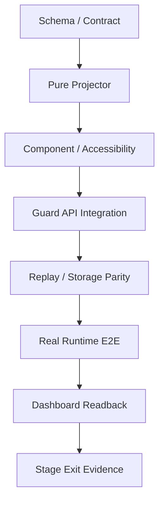

# 06 — 测试矩阵、风险与决策记录

## 1. 验证策略

本方案采用“同一事实，多层证明”，但不把低层测试冒充高层交付：



| 层                 | 证明内容                            | 不能证明                 |
| ------------------ | ----------------------------------- | ------------------------ |
| Schema             | 字段、枚举、预算、拒绝非法数据      | 真实 producer 已接线     |
| Projector          | 稳定聚合、身份、unknown、冲突       | API/存储/Runtime 行为    |
| Component          | 交互、视觉、可访问性                | 后端事实真实性           |
| API integration    | 鉴权、ETag、分页、mapper            | 外部 Runtime side effect |
| Replay/parity      | 重建确定性、Memory/PostgreSQL 一致  | 当时实际参与判定         |
| Real Runtime E2E   | 真实 evaluate/approval/gate/receipt | 浏览器展示正确性         |
| Dashboard readback | 同一真实 Trace 可视化和定位         | 未覆盖的攻击/运行时      |

## 2. 契约测试

### 2.1 唯一执行投影与监督装饰

| ID       | 用例                                      | 预期                                                          |
| -------- | ----------------------------------------- | ------------------------------------------------------------- |
| RSC-C001 | 相同输入双跑                              | 语义投影全等；UI fetch 时间不在语义 VM                        |
| RSC-C002 | 输入事件顺序打乱但 sequence 不变          | 输出按冻结顺序一致                                            |
| RSC-C003 | 重复 `audit_id` 同内容                    | 幂等合并                                                      |
| RSC-C004 | 重复 `audit_id` 不同内容                  | warning + conflicted/unknown，不覆盖                          |
| RSC-C005 | 同 action 多次 policy checks              | 一个 action node，保留全部 checks                             |
| RSC-C006 | outcome 指向唯一 policy audit             | 选择该 official decision                                      |
| RSC-C007 | outcome/approval links 冲突               | official/approval 为 unknown                                  |
| RSC-C008 | 无 action ID 的 checkpoint                | 用 event ID 建检查点，不冒充 action                           |
| RSC-C009 | 未知未来 event                            | 安全回退检查点或只进审计，不丢失                              |
| RSC-C010 | 窗口 `has_more=true`                      | completeness partial                                          |
| RSC-C011 | Shadow 与 official 不一致                 | 两者同时保留，不覆盖                                          |
| RSC-C012 | 无 lifecycle terminal                     | 不产生 terminal node                                          |
| RSC-C013 | Graph/List/Inspector 同一动作             | 三者引用同一执行步骤和主 policy audit                         |
| RSC-C014 | `live + derivedForDisplay` task summary   | 只进 Header；无 execution step/authority/mutation/receipt     |
| RSC-C015 | supervision detail 与步骤同时生成         | `buildExecutionTrace` 一次分组；消费者不重扫事件重新选 policy |
| RSC-C016 | V21 mode=limited_enable，rollout ref 缺失 | V21 availability 可 recorded，但 authority=none/unverified    |
| RSC-C017 | V21 rollout scope/link 冲突               | authority=none/conflicted，不降级为 shadow 或 official        |
| RSC-C018 | V21 evidence 整块缺失                     | 使用全空 unavailable placeholder；无伪造 rollout/default      |

### 2.2 状态语义

| ID       | 输入                                     | UI 状态                                           |
| -------- | ---------------------------------------- | ------------------------------------------------- |
| RSC-S001 | allow，无 start/outcome                  | 已评估，等待运行时回执                            |
| RSC-S002 | ask + pending                            | waiting approval                                  |
| RSC-S003 | ask + allow_once，无 start               | approval released，等待运行                       |
| RSC-S004 | start，无 outcome                        | running/waiting receipt                           |
| RSC-S005 | deny，无 receipt                         | denied；execution unknown                         |
| RSC-S006 | deny + strict-linked receipt not_invoked | denied + confirmed not invoked；blocked 另看 gate |
| RSC-S007 | receipt executed                         | executed                                          |
| RSC-S008 | receipt failed                           | failed，不算 blocked                              |
| RSC-S009 | deny + uniquely linked executed receipt  | confirmed enforcement violation                   |
| RSC-S010 | measured side effect count=0             | 可显示 0                                          |
| RSC-S011 | not_measured count=null                  | 显示未测量，不显示 0                              |

### 2.3 Execution sequence 与 Provenance certainty

| ID       | 证据                                                                | 预期                                               |
| -------- | ------------------------------------------------------------------- | -------------------------------------------------- |
| RSC-E001 | Audit sequence                                                      | 只在 Execution 显示 `observed_after`，明确非因果   |
| RSC-E002 | CT exact assembled_into                                             | confirmed + exact                                  |
| RSC-E003 | CT strong whitelist transform                                       | supported + strong                                 |
| RSC-E004 | CT possible/model influence                                         | possible + possible                                |
| RSC-E005 | 仅时间相邻                                                          | 不创建数据流/因果边                                |
| RSC-E006 | relation metadata 缺失                                              | unknown，不默认 causal                             |
| RSC-E007 | 边端点缺失                                                          | 拒绝/降级，不持久化悬空边                          |
| RSC-E008 | legacy `causal`                                                     | legacy + unknown，不冒充 CT confirmed              |
| RSC-E009 | 十种正式 CT relation                                                | wire value 无损保留并可回到原证据                  |
| RSC-E010 | 既有 `evaluated_by/targets/...`                                     | `wireRelation` 原样保留，`ctFlowRelation=null`     |
| RSC-E011 | CT node/edge discriminator 错配                                     | schema 拒绝或该元素 unknown，不混读字段            |
| RSC-E012 | edge endpoint ref 与顶层 source_node_id/target_node_id 对应节点不同 | correlation conflict，不画 confirmed 边            |
| RSC-E013 | partial + exact/strong                                              | certainty 最高 supported                           |
| RSC-E014 | stale/unknown/not_applicable                                        | unknown；不显示 CT confirmed 因果结论              |
| RSC-E015 | semantic_inferred（任意 strength）                                  | certainty 最高 possible                            |
| RSC-E016 | 两 Trace 使用相同 node_ref/flow_id                                  | trace-bound node/edge ID 不同，不串图/冲突         |
| RSC-E017 | top-level kind/ref_id/trace_id 与 metadata 不同                     | correlation conflict，不启用 CT 样式               |
| RSC-E018 | node_ref.ref_type 与 node_kind/top-level kind 不同                  | schema 拒绝或 correlation conflict，不启用 CT 样式 |

## 3. Context Manifest 测试

### 3.1 Schema 与语义

- [ ] carrier 为 `AuditEvent 0.4 runtime_observation/context_manifest_recorded`，payload 唯一路径
      `evidence.context_manifest`；
- [ ] 只有 server-internal Context Builder writer 可产 strict record；外部 `event:audit:write`
      同名事件 403/422，不能升级 trust/authority/taint；
- [ ] `audit_id` canonical identity、links/payload 一致、同 digest 幂等、异 digest 冲突；
- [ ] Manifest plan 字段逐项匹配 CT `ContextAssemblyPlan`；每个 chunk 完整承载 CT
      `ContextChunk` 的 schema/scope/context/compartment/authority/instruction/sensitive/sequence；
- [ ] 未知 `schema_version` fail-safe；
- [ ] `total >= returned`；
- [ ] `returned == chunks.length`；
- [ ] `included + excluded == total` 且 `quarantined <= excluded`；
- [ ] `sum(by_source_type.values) == total`；截断时 sensitive/untrusted/source-type 全局计数不从
      returned window 重算；
- [ ] truncated 时有 `omitted_digest` 或显式原因；
- [ ] `summarized/redacted` 不移除 taint；
- [ ] 只有合法 `declassification_id` 表达 removal；
- [ ] trust/authority 不能由 Adapter/前端任意升级；
- [ ] 多个 possible 不升级 strength；
- [ ] Manifest 缺失映射为 unavailable，不是空 context。
- [ ] 缺失 Manifest 的 `truncated=null`，不能显示“完整”；
- [ ] 专用 bound envelope 在通用数组预算前计算 total/returned/truncated，不静默截断。
- [ ] sanitizer 在 generic redaction 前摘出 typed key；round-trip 后 `sensitive` 仍为 boolean，
      sequence/EvidenceRef 完整，manifest JCS digest 一致；
- [ ] 全局预算不足只产生冻结 `ContextManifestBudgetDroppedRef`，UI 显示
      partial/unavailable。

### 3.2 脱敏和预算

| ID       | 输入                         | 预期                               |
| -------- | ---------------------------- | ---------------------------------- |
| RSC-M001 | credential/token/cookie      | 服务端 preview 不含明文            |
| RSC-M002 | system prompt/隐藏思维链字段 | 不进入响应                         |
| RSC-M003 | 超长 preview                 | 服务端按 Unicode 安全截断          |
| RSC-M004 | chunk 超过候选 20 条         | 明确 total/returned/truncated      |
| RSC-M005 | evidence 接近总预算          | preview 先降级，ID/digest/ref 保留 |
| RSC-M006 | 嵌套超深/数组超界            | schema/budget 拒绝或有界降级       |
| RSC-M007 | 前端二次掩码                 | 作为兜底，不改变 digest/authority  |

测试 Fixture 不使用真实 Secret；使用专用假 token 并断言它不出现在序列化响应、日志和截图。

## 4. Approval Basis 测试

- [ ] 当前 Approval `evidence` 不再被 mapper 丢弃；
- [ ] official decision 从唯一 policy audit 获取；
- [ ] V21-09 `decision_v21.mode=shadow` 只进入 shadow section；
- [ ] ASK 经过 allow_once 后 official 仍是 ASK；
- [ ] resolution source/by/reason/at 正确显示；
- [ ] 缺 event/policy link 时 completeness partial/unknown；
- [ ] 409 后读取服务端终态且不重发 mutation；
- [ ] 非 `live_api + following` 时整页及审批深链无 resolve 操作；
- [ ] Live mutation 前 approval/action/official decision/basis 唯一关联同一 Trace；
- [ ] 同一 Trace 内把 target Approval B 与 Approval/Basis/Action A 错配时 store 不发网络；
- [ ] target/approval/basis ID、action ID、decision ID、policy audit ID 任一不一致均 fail closed；
- [ ] store 提交前重新读取 pending Approval 和关联索引；页面不能传入 mutation context；
- [ ] data-source descriptor 只由 factory 构造；URL/payload/Fixture 不能升级 mode/capability；
- [ ] descriptor 与嵌套 capabilities 均 `Object.isFrozen=true`；替换/篡改尝试 fail closed，store
      不接受页面传入 descriptor；
- [ ] `readonly=1` 可降级但不可升级；移除 query 后仍由 store predicate 决定；
- [ ] session/CSRF 缺失、approval 非 pending 或任一 source 非 Live 时 store 不发网络；
- [ ] production bundle 无 Fixture、Replay importer、Hybrid provider import/chunk；
- [ ] fingerprint/token 原值不进入 DTO/ViewModel/DOM/日志；
- [ ] RTE-05 前 binding 显示 unavailable，而不是 not_required；
- [ ] LLM allow_once 不显示可消费 lease。

## 5. API 与刷新测试

### 5.1 条件请求

| ID       | 场景                          | 预期                                 |
| -------- | ----------------------------- | ------------------------------------ |
| RSC-A001 | 首次 GET Trace                | 200 + private/no-cache + Vary + ETag |
| RSC-A002 | 相同 `If-None-Match`          | 304，无 body                         |
| RSC-A003 | Approval 状态变化但无新 Audit | Trace ETag 改变                      |
| RSC-A004 | Provenance 不变、Trace 改变   | 两个 ETag 互不影响                   |
| RSC-A005 | 304 到达前端                  | 对象/布局/选择/播报均不变            |
| RSC-A006 | 网络失败序列                  | 2/4/8/16 秒退避并保留 stale 数据     |
| RSC-A007 | 页面 hidden/visible           | 暂停；恢复立即校准                   |
| RSC-A008 | 明确终态                      | 停循环，最终读取 Trace+Provenance    |

### 5.2 分页和快照

- [ ] Trace/Audit/Provenance `has_more` 映射完整；
- [ ] Trace/Audit 同 snapshot cursor 正确分页；
- [ ] Provenance 当前 `has_more=true` 直接标 partial，不伪造 continuation cursor；
- [ ] cursor scope mismatch 重开；
- [ ] cursor expired 不拼接旧页；
- [ ] partial 图不能输出“证据完整”；
- [ ] 多页重复 `audit_id` 幂等；
- [ ] 多页冲突进入受控错误。

### 5.3 鉴权

- [ ] Trace/Provenance browser session 与 bearer scope 分别验证；
- [ ] Approval pending 只接受 browser session；
- [ ] Resolve 必须 session + CSRF；
- [ ] Adapter wait 需要 `approval:wait` 和 runtime/agent identity；
- [ ] CSRF/session/control/adapter token 不进入持久化前端状态；
- [ ] 401/403 不回退 Mock 或 raw evidence；
- [ ] 跨 Trace/租户读取被拒绝。

### 5.4 Replay Artifact 边界

- [ ] CT-PR-03R 只读 store，不写回、不新增公开 API；
- [ ] artifact schema/input/output/artifact digest 逐项校验，同输入/版本双跑字节稳定；
- [ ] 输出经过服务端 allowlist/redaction/budget，secret/prompt/raw args 扫描为零；
- [ ] `contains_synthetic_facts=true` 或来源为 Fixture 时只能进入 `mock_preview`；
- [ ] FE-RSC-05 importer 只存在于 development/test；生产构建静态检查无 importer；
- [ ] importer 版本不支持、digest 冲突或缺原始 ID 时 fail closed，不降级为“近似 Replay”。

## 6. 前端组件与可访问性

### 6.1 组件测试

- Graph 和 List 对同一 ViewModel 给出等价状态；
- Action 展开/收起不改变稳定 ID；
- 点击 milestone 定位正确 audit/approval/receipt；
- Execution 无内容流 overlay；跳 Provenance 后能高亮真实 node ID；
- Filter/Search 不改变 authority/certainty；
- URL query 刷新后恢复 view/layout/action/node/event；
- 新数据到达不抢用户焦点；
- “查看最新”恢复自动跟随；
- Inspector partial/unavailable 文案可见；
- 投影异常时 Audit tab 可用。

### 6.2 可访问性

- [ ] 首期 Tab/Enter/Space 可操作节点；方向键 roving focus 留独立增强 PR；
- [ ] 图与列表信息等价；
- [ ] 每个节点有包含类型、名称、状态的 accessible name；
- [ ] 状态不只用颜色；
- [ ] `aria-live` 只播报待审批、拒绝、失败、违例等优先变化；
- [ ] reduced-motion 关闭脉冲、平滑跟随和不必要动画；
- [ ] 全屏可用 Escape 退出；
- [ ] 对比度达标；
- [ ] 窄屏下 Inspector 可读且无双滚动陷阱。

### 6.3 视觉回归

至少覆盖：

```text
empty / loading / live / stale / partial / error
allow / ask-pending / ask-released / deny-unknown / deny-not-invoked
executed / failed / enforcement-violation
official+shadow divergence
content exact / strong / possible / quarantined
mock / replay / hybrid / live banners
desktop / medium / narrow / reduced-motion / high-contrast
```

## 7. Real Runtime E2E

### 7.1 S1

使用实际 Uvicorn HTTP、LangGraph/AttackBench、Memory/PostgreSQL 和 Dashboard readback：

- Allow→start→executed；
- Ask→pending→allow_once→start→executed/failed；
- Deny→invocation count 0→not_invoked receipt；
- Trace/Provenance ETag；
- Dashboard 节点和 Audit/Provenance 定位。

### 7.2 S2/S3

- 七事件 fact producer；
- CT flag-off：无 `ct_transient_facts`/无 CT projection，legacy/official 与既有 evidence parity；
- 指定 profile flag-on：同一 policy audit 原子带 1.0 commit envelope，随后 project/readback；
- `ct_transient_facts` 先按 `FullCommitEnvelope | BudgetDroppedRef` 判别；budget-dropped 不读取
  `schema_version/payload`、不映射为空 facts；
- committed record→delta→project；
- base rewind/bad materials 的 skip+counter 与 project/apply failure 的 dirty/degradation 按真实
  failure class 验证，不把所有失败统一标 dirty；
- dirty/rebuild/replay parity；
- Source/Flow typed provenance；
- Snapshot→V2 shadow；
- legacy response 不变；
- 两 Trace context divergence 摘要属于 S3+ 可选展示，不阻塞 Gate A。

### 7.3 S4

- exact binding success；
- modified args/resource conflict；
- expired lease；
- double consume idempotency/防双花；
- LLM allow_once non-consumable；
- allow_once consume→start→terminal；
- receipt/display schema 只暴露非秘密 `lease_id/consumption_id` 并完成版本评审；
- deny→not_invoked；
- contradiction→enforcement violation；
- receipt event/action/decision/policy audit exact linkage；
- links 冲突显示 correlation conflict，不直接显示 enforcement violation。

### 7.4 S5/S6

- S5-C：Context include/exclude/quarantine/transform、Manifest storage parity；允许 V2 仍 shadow；
- S5-O：server-internal `V21RolloutAuditRecord` / `RuntimeProfileAttestationAuditRecord` 的
  pre-storage outer/links/metadata/evidence 全部 strict；Memory/PostgreSQL readback 只接受中性
  AuditEvent defaults + 有效 integrity，未知 outer extra、非中性 default 或 nested extra 拒绝；
  outer/payload identity、producer binding 或 EvidenceRef locator/digest 任一错配即拒绝；外部
  Adapter 同名 config event 403/422；config audit 顶层 `decision` 不进入动作 official mapper；
- S5-O：initialize/enable/update/promote/rollback transition table 穷举；revision/previous head 与
  links/payload 一致；rollback lineage 三向一致，非 rollback 不允许携 rollback link；
- S5-O：同 rollout ID/revision 同 digest 幂等、异 digest 冲突；
- S5-O：config mutation 响应丢失后以同 mutation ID/command digest exact retry，返回原
  revision/config audit/effective_at；同 mutation ID/异 command digest 409；
- S5-O：完整 `RolloutMutationCommandV1(extra=forbid)` canonical digest；未知/遗漏字段拒绝；两个
  同 key/同 digest 请求并发 fast-miss 后只追加一条 revision，另一个 lock 内二次 lookup 后幂等
  返回；同 key/异 digest 并发冲突；
- S5-O：两个 enable/update/rollback 命令并发时只有 expected head CAS 成功者追加 revision；stale
  command 409，Memory/PostgreSQL head/audit 原子 parity；
- S5-O：config audit、rollout head、routing catalog epoch/digest 原子更新；catalog digest 只覆盖排序
  routing descriptors、无 digest 循环；stale expected catalog/head 均不产生部分状态；
- S5-O：无 catalog row 的 genesis 固定 epoch 0/empty-array digest；首个 initialize 只生成 epoch 1；
  exact replay、Memory fresh store、PostgreSQL restart/readback 保持相同 epoch/digest；
- S5-O：Memory/PostgreSQL 按冻结锁序并发运行 enable/update/rollback 与 evaluation，在测试超时内
  全部结束；覆盖 catalog shared/exclusive、反向取锁、同事务 nested transaction、多 rollout
  canonical lock order；
- S5-O：旧 catalog 无候选的 evaluation 与 scope expansion/enable 并发，分别覆盖 evaluation-first
  和 mutation-first 两种线性化结果；commit 较晚的旧评估不得越过已先完成的 enable；
- S5-O：同一 case/runtime/profile/policy 的两个 official rollout 或重叠 cohort 在 mutation 拒绝；
  运行时 0 个/多个匹配时不选择任一 V2 official；
- S5-O：rollback 与 evaluation 并发时，rollback commit 后不出现 commit 顺序更晚的旧 official
  ref；历史已提交 ref 不被改写；未来 `effective_at` 在 v1 被拒；
- S5-O：`rollout_v21/v21_rollout_ref/runtime_profile_attestation` 在 generic sanitizer 前摘出并
  round-trip；digest 基于最终 bounded payload；24 KiB/12 KiB/4 KiB 或总预算失败时对应
  head/attestation/official transaction 不推进；
- S5-O：0/99/100/101+ 个 request metadata keys、reserved-key collision、接近/超过 64 KiB 的可选
  evidence 均不能挤掉顶层 decision、`guard_decision/policy/decision_v21/v21_rollout_ref` 或
  request/policy/final decision server metadata；Memory/PostgreSQL/replay round-trip 一致；
- S5-O：critical set 单独超预算/typed validation/storage failure 时事务整体 fail closed，无成功
  response、Approval/Memory/Critic 副作用或 RTE release；不得因请求体积回退为 legacy allow；
- S5-O：set-like arrays 的输入乱序映射为同一 canonical digest，重复值直接拒绝；EvidenceRef
  排序/重复 ref、ID/digest 长度、正 revision/非负 state version、RFC3339 UTC 边界均覆盖；
- S5-O：每条 official policy Audit 的 `v21_rollout_ref` 与 case/cohort membership、runtime/
  profile、policy、snapshot eligibility、当次 DecisionEvidence snapshot、rollout revision/digest
  精确一致；任一缺失/错配时 V21 authority unavailable/unknown；
- S5-O：cohort scope 必须匹配 immutable cohort id/revision/digest 和 strict membership
  EvidenceRef；原地改 roster、错 member/digest、引用不可解析时不扩大 official scope；新 roster
  必须新 cohort revision + 新 rollout revision；
- S5-O：同一 rollout/cohort 的不同 case 与后续 state version 可使用不同 snapshot；各自
  schema/projector/eligibility Gate 通过且 ref 与 DecisionEvidence snapshot 精确一致；复用 stale
  snapshot 或 ID/digest/state version 错配时不得 official；
- S5-O：仅四类冻结 enabled path 可进入 rollout；matched path 必须为其子集，matched rule 必须
  属于相同 ownership transfer revision/digest；每个 matched rule 恰有一个可解析 ownership ref；
  重复、漏项、错 rule/revision/digest 时只能 shadow；前端只显示 server-verified，不重跑 registry；
- S5-O：runtime profile 只能由认证 adapter/runtime registry 的 attestation 注入；request body
  自报、错认证主体、registry revision/digest 错配、`issued_at/expires_at` 非法或过期、不可解析
  EvidenceRef 均不能 official；最大 TTL 与 config_audit provenance link 通过；
- S5-O：policy Audit.timestamp 在锁内由服务端生成且不可由 GuardEvent/Adapter 覆盖；backend 与
  Dashboard 均用 `effective_at <= audit.timestamp < expires_at`，Memory/PostgreSQL round-trip 一致；
- S5-O：决策格 exhaustively 验证 allow→allow/ask/deny、ask→ask/deny、deny→deny，拒绝
  ask/deny→allow 和 deny→ask；V21 CLEAR_ALLOW 不放宽 legacy ASK/DENY；
- S5-O：rollout ref schema/budget/storage 注入失败时不产生无 ref 的 V21 official 记录，并有
  shadow/fail-closed degradation 证据；
- S5-O：authority selection 早于 approval/memory/critic；V21 official 时 API response、Audit 顶层、
  `evidence.guard_decision`、links、DecisionEvidence final、Approval/Memory/Critic/Provenance、RTE
  逐字段一致；在每个写入点 failure injection 都不得留下 partial official/副作用；
- S5-O：首次 Live→同 event replay→RTE binding→RuntimeOutcomeReceipt 保持相同 GuardDecision 和
  decision ID；legacy fallback 路径也保持 exact parity；
- S5-O：official `policy_revision` 为正整数，与 PolicySnapshotRecord、
  `evidence.policy.revision` 和 SecuritySnapshot 绑定值一致；`policy_digest` 与
  `evidence.policy.canonical_digest` 一致；unversioned、string、负数或 digest/revision 交叉配对均拒绝；
- S5-O：冻结 hard case/cohort/runtime profile，limited-enable official→RTE→receipt 精确闭合；
- S5-O：shadow divergence 分类、fixed regression/benign-hard、replay/property/conformance 通过；
- S5-O：rollback `limited_enable→shadow` 生成新 config revision，后续评估引用 shadow ref，历史
  facts/evidence/official ref/receipt 保留；
- S5-C unavailable 不伪造 Manifest，也不阻塞已独立通过的 S5-O；组合演示必须两者都通过；
- S6：stateful case/cohort/runtime profile rollout/enable 决策和审计模式记录；未 enable 不得标 official；
- S6：复用 `v21-rollout-audit/1.0`；不得另建与 S5-O 不兼容的 stateful enable 事实；
- cross-session memory taint；
- declassification proof；
- 跨重启 replay/property 和 required conformance 无未处置 confirmed enforcement violation；
- stateful official decision 与同一 action/policy/RTE receipt 精确闭合，rollback 演练保留历史记录；
- CH-01 API unavailable；
- CH-02 duplicate receipt；
- CH-03 late approval；
- CH-04 restart + drain。

## 8. 性能预算

以下是候选工程预算，正式数值在代表性 Trace 压测后冻结：

| 项目                                                                           | 候选预算                   | 超限行为                                |
| ------------------------------------------------------------------------------ | -------------------------- | --------------------------------------- |
| 唯一 execution projector + supervision decoration（1000 Audit、1000 Approval） | p95 ≤ 100 ms（桌面开发机） | worker/增量优化，不改变事实语义         |
| 普通 304 处理                                                                  | 不重建 projector           | 保留现有对象                            |
| 顶层语义节点                                                                   | 软上限 200                 | 风险/时间过滤并显示 partial，不静默丢弃 |
| Context chunks                                                                 | 默认返回 20                | total/returned/truncated                |
| 单 preview                                                                     | 候选 240 Unicode 字符      | metadata_only/redacted                  |
| 图首次可交互                                                                   | 不显著劣于现有 Evidence 页 | List 先可用，Graph 延迟加载             |
| 状态更新                                                                       | 既有节点不全量卸载         | stable key/局部更新                     |

性能优化不得：

- 丢弃高风险/unknown 节点而不提示；
- 用时间邻近替代关联 ID；
- 合并 official/shadow；
- 停止 receipt 完整性检查；
- 把截断窗口标完整。

## 9. 风险登记

| ID      | 风险                               | 级别 | 触发信号                                        | 缓解/回滚                                                           |
| ------- | ---------------------------------- | ---- | ----------------------------------------------- | ------------------------------------------------------------------- |
| RSC-R01 | 重复建设第二图事实源               | P0   | 新 execution-graph 表/端点                      | 复用 Trace/Provenance；ADR 才可例外                                 |
| RSC-R02 | Shadow 冒充 official               | P0   | 同一卡片无 mode/authority                       | 强制分栏与 contract tests                                           |
| RSC-R03 | deny 冒充未执行                    | P0   | 无 receipt 显示 blocked                         | RSC-S005/S006 回归；unknown                                         |
| RSC-R04 | 时间边冒充内容因果                 | P0   | context edge 无 fact/provenance ref             | certainty/edge gate；不画边                                         |
| RSC-R05 | Context 泄露 Prompt/Secret         | P0   | raw content 进入 response/DOM                   | server allowlist/redaction/budget；metadata-only                    |
| RSC-R06 | Mock 泄漏到 Live                   | P0   | API 失败出现完整 CT 图                          | 禁止 fallback；来源水印；生产关闭 hybrid                            |
| RSC-R07 | Graph 节点爆炸/跳动                | P1   | 每条 audit 顶层化、轮询重排                     | 语义聚合、稳定布局、List 回退                                       |
| RSC-R08 | Approval basis 关联错误            | P0   | 按时间最近选 policy                             | 只用稳定 links；冲突 unknown                                        |
| RSC-R09 | RTE secret 进入 UI                 | P0   | fingerprint/token 在 DTO/日志                   | 只返回冻结状态、reason code、非秘密 ID；泄露扫描                    |
| RSC-R10 | Context plan 事后不可重建          | P1   | 历史 Trace 只有 plan ID                         | CT-PR-04-M 组装时写专用有界 Manifest                                |
| RSC-R11 | 响应预算膨胀                       | P1   | Trace 超预算/慢查询                             | refs+provenance、preview 先降级、压测 Gate                          |
| RSC-R12 | Trace Diff 错配动作                | P1   | 按工具名/时间自动对齐                           | 仅 explicit comparison key；否则聚合                                |
| RSC-R13 | 旧 roadmap 基线误导                | P1   | 文档仍写 V21-09 进行中/CT02a                    | PR 更新结构化基线和 verified commit                                 |
| RSC-R14 | OpenClaw 现场不稳定                | P1   | toolCallId/receipt/recovery 不可靠              | LangGraph 主链；OpenClaw 过门禁再升级                               |
| RSC-R15 | Historical 冒充 Replay             | P1   | 旧 Live Trace 显示 REPLAY                       | source/temporal 两维正交测试                                        |
| RSC-R16 | Graph/List/Inspector 漂移          | P0   | 同动作显示不同 official/outcome                 | 唯一 buildExecutionTrace + 原子消费者回归                           |
| RSC-R17 | 路由/Fixture 伪造 Live 能力        | P0   | query/payload 能打开 resolve                    | factory-owned descriptor + store hard gate + bundle scan            |
| RSC-R18 | CT 已接线被误报为默认启用          | P1   | 未记录 profile/flag 就称 Live state             | 三态基线 + scoped activation/readback/rollback evidence             |
| RSC-R19 | Synthetic artifact 冒充 Replay     | P0   | Fixture 显示 REPLAY                             | backend exporter identity + digest + synthetic→Mock rule            |
| RSC-R20 | Rollout/evaluation 锁序死锁        | P0   | 并发 enable/rollback 卡住 Audit                 | 唯一锁序、禁止 nested transaction、双后端超时测试                   |
| RSC-R21 | Runtime profile 自报提升 authority | P0   | request profile 被当作 official                 | server attestation、strict carrier/ref、错配只允许 shadow           |
| RSC-R22 | V21 official 载体分裂              | P0   | API/Replay/RTE 仍用 legacy，UI 显示 V2 official | selection 前置、唯一 GuardDecision、原子事务与 exact parity         |
| RSC-R23 | Scope cutover 与 evaluation 竞争   | P0   | enable 已返回后旧评估仍提交 legacy/旧 ref       | routing catalog RW lock、epoch/digest、候选唯一与并发测试           |
| RSC-R24 | Metadata flooding 挤掉权威载体     | P0   | replay/rollout ref 被 generic fallback 替换     | reserved critical channel、预算预留、碰撞拒绝、失败整体 fail closed |

## 10. 决策记录

### ADR-RSC-01：不新增展示页

- 决策：增强现有 `/evidence/:trace_id`；
- 原因：符合控制台/监督端职责，复用鉴权、轮询、三视图和深链；
- 拒绝：独立比赛大屏、`/runtime` 一级页面。

### ADR-RSC-02：语义节点 + 动作复合节点

- 决策：不把每条 GuardEvent 顶层化；
- 原因：长 Trace 可读、日常监督可用，同时 Inspector 保留全部记录；
- 例外：审批等待、binding failure、enforcement violation 可提升显式节点。

### ADR-RSC-02A：执行投影单一真相源

- 决策：继续由 `buildExecutionTrace()` 唯一决定动作生命周期；Graph/List/Inspector 共享；
- 原因：防止 decision/approval/outcome 在两个 projector 中漂移；
- 边界：内容和因果关系留在 Provenance，执行图只保留审计顺序。

### ADR-RSC-03：首期 ETag polling，不上 SSE

- 决策：继续约 2 秒条件轮询；
- 原因：已经实施、恢复简单、完整快照可校准；
- 重审条件：真实负载证明 polling 成本不可接受；SSE 仍只作失效通知。

### ADR-RSC-04：Context Manifest 而非完整 Prompt

- 决策：显示服务端有界、脱敏结构和可选 safe preview；
- 原因：兼顾解释性、隐私、预算和安全；
- 禁止：前端拿完整 Prompt 后二次隐藏。

### ADR-RSC-05：不做永久左右对照

- 决策：两个任务分别执行并记录独立 Trace，在调查/评测页生成差异摘要；
- 原因：符合真实产品使用，避免主控制台变成展示专页；
- 动作配对只接受 explicit comparison key。

### ADR-RSC-06：Preview 可早，Live 口径严格

- 决策：允许 Mock/Replay/Hybrid 尽早评审，但由 data-source factory 独占 mode/capability；永久
  来源标识、store hard gate、production bundle exclusion、禁止自动 fallback；
- 原因：加快 UI 反馈且不牺牲可信度。

### ADR-RSC-07：S4 与 S5 分开

- 决策：S4 先证明当前 official decision→RTE；S5 才证明 V2 official→RTE；
- 原因：V21-09 是 shadow-only，不能让 RTE 进度强迫 V2 越级启用。

### ADR-RSC-08：S5-C 与 S5-O 工程解耦

- 决策：CT-PR-04 是两线共同功能依赖；其后 Manifest 可在 shadow 阶段交付，V21-11 不等待完整 UI；
- 原因：上位路线保留 `CT-PR-04 → INT-PR-04`，但 Manifest producer/UI 与 activation 是不同 Gate；
- 组合：只有比赛组合展示阶段才要求两个子 Gate 同时完成。

## 11. 评审证据模板

每个 Stage 的验收记录应包含：

```markdown
## Stage

- verified_commit:
- runtime/profile:
- storage:
- supervision_contract_version:
- policy_bundle/revision/digest:
- data_source_mode:
- temporal_state:
- decision_authority:

### Dependencies

- [ ] ...

### Automated evidence

- test / CI link / fixture digest

### Real E2E evidence

- trace_id
- relevant audit_id/action_id/decision_id/approval_id/receipt_audit_id

### Dashboard readback

- URL/query
- expected steps/four-layer status/authority/completeness

### Failure injection / rollback

- case and result

### Known unavailable fields

- ...

### Allowed / forbidden external wording

- ...
```

禁止只附截图或录屏而不提供 Trace/审计/receipt 引用。

### 11.1 S1 — Live Task Supervision 验收记录

- verified_commit: `ab3b5779e0476468b5c02c045f912485ff8d4e4f`
  （实现与测试提交；本验收记录为其后的纯文档提交）；
- runtime/profile: 实际 Uvicorn HTTP + LangGraph/AttackBench S1 live harness；
- storage: Memory / PostgreSQL 16；
- supervision_contract_version: `runtime-supervision/0.1`；Approval Basis
  `approval-basis/0.1`；
- policy_bundle/revision/digest: `demo-runtime-safety@1` / `unavailable`
  （测试 profile 直接注入 bundle，未持久化 snapshot revision） /
  `sha256:232a0ed52f38caf4458657fcb760ad352366f1e96a4bc0410dda8836e1c07a80`；
- data_source_mode: `live_api`；
- temporal_state: pending/active 阶段 `following`；显式 `trace_completed` 后进入
  `historical`，并完成最终 Trace/Provenance readback；
- decision_authority: 当前 official；V2 shadow 在本次 profile 中 `unavailable`，不作
  V2 权威声明。

#### Dependencies

- 当前 Trace/Audit/Approval/Provenance、RTE-01~04、实际 Runtime、
  Memory/PostgreSQL 和 Dashboard readback 均纳入同一验收链。

#### Automated evidence

- verified commit 的 [GitHub Actions CI run](https://github.com/JToday666/agent-guard/actions/runs/31943486387)
  全部通过；release check run `31943486397` 同步通过；
- `Python 3.12 / PostgreSQL 16`、`Node 24 / pnpm 11`、
  `Dashboard E2E / Chromium`、
  [`Dashboard S1 live E2E / memory`](https://github.com/JToday666/agent-guard/actions/runs/31943486387/job/95155938924)、
  [`Dashboard S1 live E2E / postgres`](https://github.com/JToday666/agent-guard/actions/runs/31943486387/job/95155938942)
  均为 green；
- 成功 live job 日志中的 `AGENTGUARD_S1_EVIDENCE` JSON 是下表 ID 的权威来源；
  成功场景没有伪称存在 failure-only artifact。

#### Real E2E evidence

| Storage | Case | Trace / action / event | Decision / approval / policy audit | Start / terminal receipt |
| --- | --- | --- | --- | --- |
| Memory | `BN-001` | `trace_4603432df78b4e1da16af8a9dad03f5a` / `call_dd54edbe8ac34e8a84d2208aa68753d0` / `evt_tool_c2ec8da68a9046eba8ce362203e2b6ce` | `dec_3aa15500d05a473f80ed0296f458cddf` / `—` / `audit_58d16c6ba5b6408791fb5b9d050ec63f` | `audit_observation_started_evt_tool_c2ec8da68a9046eba8ce362203e2b6ce` / `audit_outcome_evt_tool_c2ec8da68a9046eba8ce362203e2b6ce_execution_completed` |
| Memory | `RUNTIME-SAFETY-001` | `trace_cf4e07f5eaf4412087337c1609d95fdd` / `call_54bb0c66bab04b4ba7a157692a859307` / `evt_tool_fcbaa1836b1c4c959550f66fea767021` | `dec_96200a6fd2444d8faa5c1f4e238067a4` / `app_0a0776f9d7a943a984e620f1fea0e35e` / `audit_0d69269898e6479db3d6c73acada2a63` | `audit_observation_started_evt_tool_fcbaa1836b1c4c959550f66fea767021` / `audit_outcome_evt_tool_fcbaa1836b1c4c959550f66fea767021_execution_completed` |
| Memory | `JB-003` | `trace_81ebcb44ded54225b36cd60552e92a14` / `call_6b248c7fcef64c8ca563fec947f35617` / `evt_tool_1bf1f5c449304826be0ca6654f0bb548` | `dec_5855fc57de1b443987b521744fd6e423` / `—` / `audit_ef78e902385e43a2bdfde595d0dd2596` | `—` / `audit_outcome_evt_tool_1bf1f5c449304826be0ca6654f0bb548_pre_execution_deny` |
| PostgreSQL | `BN-001` | `trace_8b24195d4bc34ed1bf4a78b27e0de6d9` / `call_e176090318264fa8916b6367dae59dad` / `evt_tool_1892b7a468934e32878512c29d49aab9` | `dec_430b9e1a65094fc4b0f1d293478b56ee` / `—` / `audit_68b173c94dd34f0995e1e1eca990c728` | `audit_observation_started_evt_tool_1892b7a468934e32878512c29d49aab9` / `audit_outcome_evt_tool_1892b7a468934e32878512c29d49aab9_execution_completed` |
| PostgreSQL | `RUNTIME-SAFETY-001` | `trace_60b49c1d473941c2818a1905c120c663` / `call_baa958ea201f49d0a94f91b258a8fb58` / `evt_tool_2ce21450ca0f436aa0aa9b87e0b39c71` | `dec_a3671199c7e749ac8686370ea3c01be6` / `app_7822b48432064bd8af5e20b1b3f4fc1d` / `audit_b002e759897440ea8c9156e9b6d2377e` | `audit_observation_started_evt_tool_2ce21450ca0f436aa0aa9b87e0b39c71` / `audit_outcome_evt_tool_2ce21450ca0f436aa0aa9b87e0b39c71_execution_completed` |
| PostgreSQL | `JB-003` | `trace_de0df787e17748878cdb19cf4e195d48` / `call_3f35311239f24155bbfde177f2e23bd7` / `evt_tool_0c908cac34084c65b46067335273b3a3` | `dec_94ee0007620e4bae81d68de19db08f2c` / `—` / `audit_c2e3a54d666c4be293f6ddbb7110bce2` | `—` / `audit_outcome_evt_tool_0c908cac34084c65b46067335273b3a3_pre_execution_deny` |

- `BN-001`: `allow → tool_call_started → executed`；
- `RUNTIME-SAFETY-001`:
  `ask → pending → allow_once → tool_call_started → executed`，official 仍为 ASK；
- `JB-003`: invocation count 0；
  `pre_execution_deny / not_invoked / not_applicable`；
- 六条 Trace 的 Trace/Provenance 条件读取均返回 `304`；
- Memory/PostgreSQL 去除随机 ID/时间后的语义投影一致。

#### Dashboard readback

- CI 内相对路由：`/evidence/{trace_id}?view=execution&execution_layout=list`；
- `BN-001` 四层：允许 / 无需审批 / 强绑定证据不可用 / 已执行；
- `RUNTIME-SAFETY-001` 四层：需审批 / 单次放行 / 强绑定证据不可用 / 已执行；
  Approval Basis 为已记录，且按同一 `policy_audit_id` 和 `action_id` 回到原始审计及
  Provenance；
- `JB-003` 四层：拒绝 / 无需审批 / 强绑定证据不可用 / 未调用；
- Trace、Approval、Provenance window 均为完整窗口；V2 shadow 明确显示不可用；
- Graph/List/Inspector 共用同一 `ExecutionTraceViewModel`。

#### Failure injection / rollback

- `VITE_RUNTIME_SUPERVISION_S1_ENABLED=false` 时，S0 Trace/Audit/Provenance 仍可读，
  Approval Basis 显示不可用；审批按钮禁用，即使强制触发 DOM click 也没有审批 POST；
- Provenance window 截断或缺失时，准备阶段和 POST 前二次 gate 均 fail closed，零 POST；
- 200/409 均只 readback、不重发 mutation；终态校准要求 Trace 与 Provenance 均成功，
  失败按 2/4/8/16 秒退避并保留最后成功缓存。

#### Known unavailable fields

- RTE-05 strong-binding enforcement evidence 尚不可用；
- 本次 profile 的 V2 shadow、CT facts/Context Manifest 均关闭或不可用；
- semantic judgment 没有正式 producer，保持 `unavailable/null`；
- 不据此声明 V2 official、CT provenance 或强绑定门控。

#### Allowed / forbidden external wording

- 允许：“控制台近实时读取真实 Trace，展示动作、审批、执行回执并可回到原始审计。”
- 禁止把 V2、CT 或 RTE-05 描述为已启用/已证明，也不把 CI 临时地址描述为持续可访问环境。

## 12. 最终质量 Gate

- [ ] 02 章所有不变量有自动测试；
- [ ] 当前 Trace/Provenance/Approval API 无破坏性变化；
- [ ] Context/CT additive fields 有 schema、budget、redaction、storage parity；
- [ ] official/shadow/Mock/Replay 在 DOM 和辅助技术中可识别；
- [ ] Decision/Approval/Enforcement/Execution 四层语义正确；
- [ ] Graph/List/Audit 在投影故障时可恢复；
- [ ] Memory/PostgreSQL + 实际 Runtime + Dashboard readback 通过；
- [ ] RTE-05 后 secret exclusion 扫描通过；
- [ ] Stage 回滚演练不删除权威事实；
- [ ] 文档、Fixture、实现和演示口径一致；
- [ ] 未通过的能力明确 unavailable/deferred，而不是“即将完成”式模糊文案。
