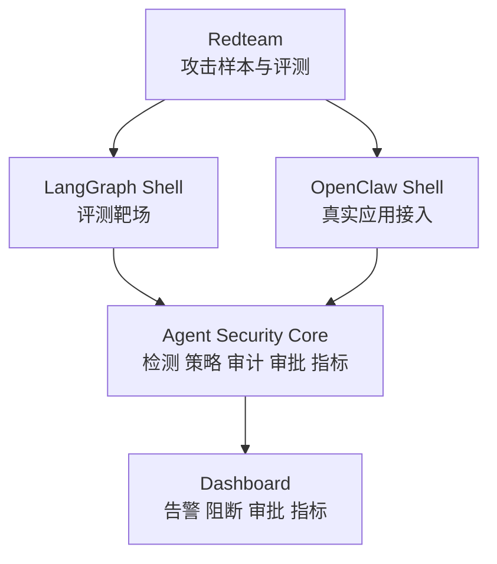

# 系统总体架构

## 1. 架构概述

AgentGuard 采用一核两壳架构：

```text
Agent Security Core
├── LangGraph + LangChain Core + Mock Tools
└── OpenClaw + Security Plugin
```

## 2. 总体框架图



## 3. 核心链路

```text
输入 / 外部内容
→ 上下文拼接审计
→ 模型输入输出审计
→ 工具调用前拦截
→ 文件/API/代码/消息/记忆审计
→ 策略决策
→ allow / deny / ask
→ 审计日志
→ Dashboard 展示
→ Metrics 评测
```

## 4. 模块职责

| 模块 | 职责 |
|---|---|
| Agent Security Core | 风险判断、策略、审批、审计、指标 |
| LangGraph Shell | 可控评测、Mock Tools、批量攻击样本 |
| OpenClaw Shell | 真实应用插件接入、Hook、配置审计 |
| Dashboard | 可视化、审批、攻击链路、指标 |
| Redteam | 攻击样本、攻击脚本、成功条件 |

## 5. 亮点

- 一核两壳；
- 运行时工具调用拦截；
- 上下文拼接审计；
- 工具结果回流审计；
- Memory Guard；
- Provenance Graph；
- OpenClaw Config Audit；
- Tamper-Evident Audit；
- Continuous Red Team Loop。
