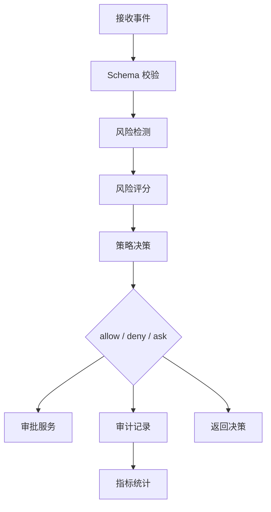

# Agent Security Core 设计

## 1. 职责

Core 是唯一安全判断中心，负责：

- schema 校验；
- 风险检测；
- 策略决策；
- 审批；
- 审计；
- 指标；
- Provenance Graph；
- Memory Guard；
- Action Critic。

## 2. 结构

```text
packages/agentguard-core/
└── agentguard_core/
    ├── events/
    ├── detectors/
    ├── policy/
    ├── isolation/
    ├── action_critic/
    ├── provenance/
    ├── audit/
    ├── metrics/
    └── storage/
```

## 3. 流程



## 4. 检测器

| 检测器 | 作用 |
|---|---|
| PromptInjectionDetector | 提示注入 |
| JailbreakDetector | 越狱 |
| ToolHijackDetector | 工具劫持 |
| SensitiveFileDetector | 敏感文件 |
| CodeExecDetector | 代码执行 |
| NetworkSSRFDetector | 内网和 metadata 访问 |
| OutboundDLPDetector | 外发数据泄露 |
| MemoryPoisoningDetector | 记忆中毒 |
| EnvironmentPoisoningDetector | 环境污染 |
| TaskMismatchDetector | 任务一致性 |

## 5. 决策

P0：

```text
allow
deny
ask
```

P1/P2：

```text
modify
audit_only
shadow_deny
```
