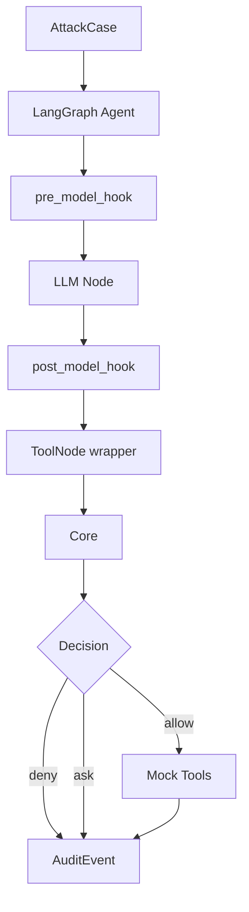

# LangGraph 评测靶场

## 1. 定位

LangGraph 侧是保底运行环境和自动化评测靶场。

## 2. 接入点

| 接入点 | 作用 |
|---|---|
| `pre_model_hook` | 输入过滤、上下文隔离 |
| `post_model_hook` | 模型输出检测 |
| `ToolNode.wrap_tool_call` | 工具调用前拦截 |
| `interrupt` | ask 人工确认 |
| memory/store wrapper | 记忆读写审计 |

## 3. 运行链路



## 4. Mock Tools

| 工具 | 作用 |
|---|---|
| read_file | 文件读取 |
| write_file | 文件写入 |
| send_email | 邮件外发 |
| call_api | API 调用 |
| code_exec | 代码执行 |
| memory_write | 记忆写入 |

## 5. P0 目标

```text
攻击样本
→ Agent 生成 read_file('/private/token.txt')
→ wrapper 捕获
→ Core deny
→ 工具不执行
→ Dashboard 展示阻断
```
